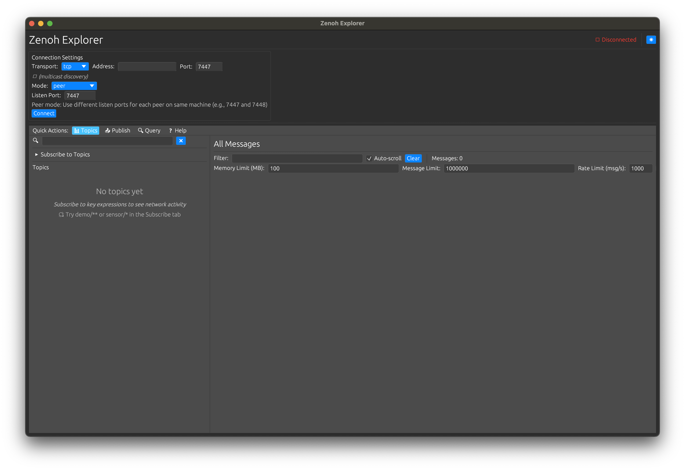

# Zenoh Explorer
A GUI application for exploring, debugging, and monitoring Zenoh networks.


```
          ╭━━━━━━━━━━━━━━━━━━━━━━━━━━━━━━━━━━━━━━━━━━━━━━━━━━━━━━━━━━━━━━━━━━━━━━━━╮
          │                                                                        │
          │         ███████╗███████╗███╗   ██╗ ██████╗ ██╗  ██╗                    │
          │         ╚══███╔╝██╔════╝████╗  ██║██╔═══██╗██║  ██║                    │
          │           ███╔╝ █████╗  ██╔██╗ ██║██║   ██║███████║                    │
          │          ███╔╝  ██╔══╝  ██║╚██╗██║██║   ██║██╔══██║                    │
          │         ███████╗███████╗██║ ╚████║╚██████╔╝██║  ██║                    │
          │         ╚══════╝╚══════╝╚═╝  ╚═══╝ ╚═════╝ ╚═╝  ╚═╝                    │
          │    ███████╗██╗  ██╗██████╗ ██╗      ██████╗ ██████╗ ███████╗██████╗    │
          │    ██╔════╝╚██╗██╔╝██╔══██╗██║     ██╔═══██╗██╔══██╗██╔════╝██╔══██╗   │
          │    █████╗   ╚███╔╝ ██████╔╝██║     ██║   ██║██████╔╝█████╗  ██████╔╝   │
          │    ██╔══╝   ██╔██╗ ██╔═══╝ ██║     ██║   ██║██╔══██╗██╔══╝  ██╔══██╗   │
          │    ███████╗██╔╝ ██╗██║     ███████╗╚██████╔╝██║  ██║███████╗██║  ██║   │
          │    ╚══════╝╚═╝  ╚═╝╚═╝     ╚══════╝ ╚═════╝ ╚═╝  ╚═╝╚══════╝╚═╝  ╚═╝   │
          │                                                                        │
          ╰━━━━━━━━━━━━━━━━━━━━━━━━━━━━━━━━━━━━━━━━━━━━━━━━━━━━━━━━━━━━━━━━━━━━━━━━╯
```
## Features
- **Real-time Network Monitoring**: View all messages flowing through the Zenoh network
- **Interactive Subscriptions**: Subscribe to key expressions with wildcards and patterns
- **Data Publishing**: Send test data to any key in the network
  - Support for different encodings
  - **File import support**: Import and publish binary files directly with 5GB+ file support
- **Query Interface**: Request data from the network with configurable timeouts
  - Configurable timeout (default: 5 seconds)
  - **Built-in queryable service**: Enable a queryable to respond to queries using locally published data
  - Test request/response patterns without external services
- **Topic Browser**: Explore the hierarchical structure of keys and data
  - Tree-based visualization
  - Shows last received payload and message count
  - Auto-expanding navigation

### Connection Options
- **Client Mode**: Connect as a Zenoh client to existing routers
- **Peer Mode**: Participate as a peer in the mesh network
- **Flexible Locators**: Support for TCP, UDP, and other transport protocols

## Installation

### Building from Source

### Prerequisites
- Rust 1.70 or later

```bash
git clone <repository-url>
cd zenoh-explorer
cargo build --release
```

## Common Usage
- Start with `demo/**` to test basic connectivity
- Use the publish tab to send test messages
- Monitor the messages tab to verify data flow
- Check the Topics tab to understand network structure
- Use Subscribe for continuous data monitoring, Query for on-demand data requests

### Key Expression Examples

- `demo/**` - Match all keys under the demo namespace
- `sensor/*/temperature` - Match temperature readings from any sensor
- `device/1/status` - Match the exact status key for device 1
- `telemetry/**/cpu` - Match CPU metrics at any depth under telemetry

## Troubleshooting

### Peer Mode Configuration
- **For multicast discovery**: Leave locators empty in peer mode
- **For specific endpoints**: Provide tcp/ip:port format
- Peer mode enables automatic discovery of other peers via multicast
- **Connection Retry Behavior**: When you specify a TCP locator in peer mode (e.g., `tcp/localhost:7447`), Zenoh will continuously attempt to connect to that endpoint with exponential backoff. This is normal behavior - Zenoh peers persistently try to establish connections to configured endpoints, even if they're unreachable. The retry period starts at 1 second and increases (1s, 2s, 4s, 4s...) up to a maximum period. This ensures peers can automatically reconnect when endpoints become available.
- If peer mode shows "Worker Unresponsive", check logs with RUST_LOG=zenoh_explorer=info

### Query Functionality
- Queries require queryable services to be running on the network
- If you receive "No queryables available" alerts, it means no services are responding to your query
- **Enable the built-in queryable**: In the Query tab, enable the queryable toggle to make this instance respond to queries using locally stored data (from previous publishes)

### Performance Tips
- Use specific key expressions instead of broad wildcards when possible
- Clear message history periodically for long-running sessions
- Enable debug logging sparingly: `RUST_LOG=zenoh_explorer=debug`

## Contributing

This is a standalone Zenoh network explorer designed to be a generic debugging and monitoring tool. Contributions are welcome for:

- Anything
- Proactive peer / router topic tree browsing
- Improved network / peer and router UX
- Testing
- Additional transport protocol support

## License

Apache-2.0

## Related Projects

- [Zenoh](https://zenoh.io/): The core Zenoh protocol and implementations
- [Zenoh Python](https://github.com/eclipse-zenoh/zenoh-python): Python bindings for Zenoh
- [Zenoh C](https://github.com/eclipse-zenoh/zenoh-c): C/C++ bindings for Zenoh


