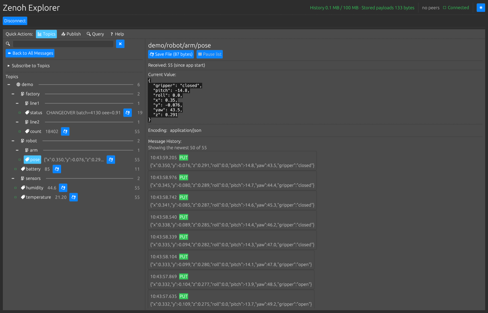

# Zenoh Explorer
A GUI application for exploring, debugging, and monitoring Zenoh networks.


```
          ╭━━━━━━━━━━━━━━━━━━━━━━━━━━━━━━━━━━━━━━━━━━━━━━━━━━━━━━━━━━━━━━━━━━━━━━━━╮
          │                                                                        │
          │         ███████╗███████╗███╗   ██╗ ██████╗ ██╗  ██╗                    │
          │         ╚══███╔╝██╔════╝████╗  ██║██╔═══██╗██║  ██║                    │
          │           ███╔╝ █████╗  ██╔██╗ ██║██║   ██║███████║                    │
          │          ███╔╝  ██╔══╝  ██║╚██╗██║██║   ██║██╔══██║                    │
          │         ███████╗███████╗██║ ╚████║╚██████╔╝██║  ██║                    │
          │         ╚══════╝╚══════╝╚═╝  ╚═══╝ ╚═════╝ ╚═╝  ╚═╝                    │
          │    ███████╗██╗  ██╗██████╗ ██╗      ██████╗ ██████╗ ███████╗██████╗    │
          │    ██╔════╝╚██╗██╔╝██╔══██╗██║     ██╔═══██╗██╔══██╗██╔════╝██╔══██╗   │
          │    █████╗   ╚███╔╝ ██████╔╝██║     ██║   ██║██████╔╝█████╗  ██████╔╝   │
          │    ██╔══╝   ██╔██╗ ██╔═══╝ ██║     ██║   ██║██╔══██╗██╔══╝  ██╔══██╗   │
          │    ███████╗██╔╝ ██╗██║     ███████╗╚██████╔╝██║  ██║███████╗██║  ██║   │
          │    ╚══════╝╚═╝  ╚═╝╚═╝     ╚══════╝ ╚═════╝ ╚═╝  ╚═╝╚══════╝╚═╝  ╚═╝   │
          │                                                                        │
          ╰━━━━━━━━━━━━━━━━━━━━━━━━━━━━━━━━━━━━━━━━━━━━━━━━━━━━━━━━━━━━━━━━━━━━━━━━╯
```
## Features
- **Background monitor**: once connected, a `**` subscription adds every key this app receives to the topic tree (not `@` admin keys). If the monitor cannot start, the header says "monitor off" and only your own subscriptions fill the tree
- **Subscriptions**: subscribe to key expressions with `*` and `**` wildcards; unsubscribe from the Active list. Subscriptions are re-declared after a reconnect
- **Topic tree**: keys arranged by level
  - Leaf rows show the start of the last value and the number of messages received; branch rows show how many leaf topics are below them
  - Selecting a topic shows its current value (JSON pretty-printed when the value is 1,024 bytes or less, or up to 10 KiB after expanding it), encoding, source time, a DELETE marker, and a history of its newest 50 listed messages (found among the newest 20,000 list rows)
  - Selecting a branch shows a summary: topics below, messages received, age of the last message
  - Filter box: case-insensitive match on the key path, with the match highlighted, "n of m topics" beside the box, and matching branches expanded while the filter is set
  - Topics whose latest value was published from this app are marked
- **All Messages**: recent messages received or published by this app, including query replies, with a text filter (key and first 4 KiB of the payload), Auto-scroll and Clear
  - Pause list per topic: stops listing a topic's new messages while its value and count keep updating
  - Memory Limit for the message list (default 100 MB), Message Limit (default 50,000) and Rate Limit (default 1,000 msg/s) fields; messages over the rate limit are not listed but still reach the tree and Save File
  - Dedup (on by default): the same key, payload and kind arriving from a second source within 250 ms is counted once
- **Save File**: write a topic's full received payload to disk. Chunked transfers from another copy of this app are reassembled, with progress shown until every chunk has arrived
- **Publish**: send typed text, or import a file, to any key
  - Encoding field (default `text/plain`; set to `application/octet-stream` when a file is imported)
  - **File import**: the whole file is read into memory; payloads above 64 MiB are sent in 64 MiB chunks
  - **Built-in queryable** (Publish tab): answers queries with the last value this app published on each key (typed text only, up to 10 MiB; not imported files)
- **Query**: send a selector with an optional value and a timeout (default 10,000 ms). Results list each reply (the newest 50), replies of 500 bytes or less JSON pretty-printed, with replies from the built-in queryable marked
  - Test request/response against the built-in queryable without external services
- **Header**: connection status, peer and router counts, memory in use, and counters for messages trimmed or not listed
- **Interface**
  - Dark theme by default, with a light/dark toggle in the header
  - Success alerts clear after 6 s and warnings after 10 s; errors stay until dismissed
  - A disabled button has its reason written beside it; invalid input is named under its field
  - "More in Help" links open the matching Help section

### Connection Options
- **Peer Mode** (default): finds other peers on the local network by multicast (UDP 7446) and listens on a Listen Port; optionally dials one address
- **Client Mode**: connects to a router at a given address and port (default port 7447)
- **Transports**: the Transport menu offers tcp, udp, quic, ws and tls. Only tcp and multicast discovery are tested. The app has no fields for TLS or QUIC certificates

## Installation

### Download a release

Each [GitHub release](https://github.com/dad-io/zenoh-explorer/releases) has these assets:

| Platform | Asset |
|---|---|
| macOS, Apple silicon | `zenoh-explorer-aarch64-apple-darwin.zip` (contains `Zenoh Explorer.app`) |
| macOS, Intel | `zenoh-explorer-x86_64-apple-darwin.zip` (contains `Zenoh Explorer.app`) |
| Windows x64 | `zenoh-explorer-x86_64-pc-windows-msvc.zip` |
| Linux x64 | `zenoh-explorer-x86_64-unknown-linux-gnu.tar.gz` |
| Linux arm64 | `zenoh-explorer-aarch64-unknown-linux-gnu.tar.gz` |

`checksums-sha256.txt` lists the SHA-256 of every asset. The `*-debug-symbols.*` assets are only needed to symbolize crash backtraces.

**Verify the checksum** (macOS/Linux) before running a download:

```bash
grep ' zenoh-explorer-x86_64-unknown-linux-gnu.tar.gz$' checksums-sha256.txt | shasum -a 256 -c -
```

On Windows (PowerShell), compare the output with the line in `checksums-sha256.txt`:

```powershell
(Get-FileHash .\zenoh-explorer-x86_64-pc-windows-msvc.zip -Algorithm SHA256).Hash.ToLower()
```

**Verify the build provenance** (optional, needs the [GitHub CLI](https://cli.github.com/); attestations exist only for releases built from a public repository):

```bash
gh attestation verify zenoh-explorer-x86_64-unknown-linux-gnu.tar.gz --repo dad-io/zenoh-explorer
```

**Unsigned builds.** Releases are code-signed only when the maintainers' signing credentials are configured. For an unsigned build:
- macOS: Gatekeeper blocks the first launch. Right-click `Zenoh Explorer.app` → Open, or run `xattr -d com.apple.quarantine "Zenoh Explorer.app"`.
- Windows: SmartScreen shows "Windows protected your PC". Choose More info → Run anyway.

### Building from source

Prerequisites: Rust 1.88 or later.

```bash
git clone https://github.com/dad-io/zenoh-explorer.git
cd zenoh-explorer
cargo build --release --locked
```

On macOS, `scripts/bundle-macos.sh` wraps the built binary into `target/Zenoh Explorer.app`.

## Common Usage
- Start with `demo/**` to test basic connectivity
- Use the publish tab to send test messages
- Watch All Messages (the Topics view with no topic selected) to verify data flow
- Check the Topics tab to understand network structure
- Use Subscribe for continuous data monitoring, Query for on-demand data requests

### Key Expression Examples

- `demo/**` - Match all keys under the demo namespace
- `sensor/*/temperature` - Match temperature readings from any sensor
- `device/1/status` - Match the exact status key for device 1
- `telemetry/**/cpu` - Match CPU metrics at any depth under telemetry

## Troubleshooting

### Connecting
- **Peer mode** (the default) finds other peers on the local network by multicast (UDP 7446). Leave the address empty for multicast discovery, or enter an Address and Port; the connection panel shows the endpoint it will dial (for example `tcp/localhost:7447`). Use a different Listen Port for each copy of the app on one machine.
- **Client mode** connects to a router and needs its address (for example `localhost`, port 7447).
- **Unreachable address in peer mode**: when you give an address in peer mode, Connect fails with an error if that endpoint cannot be reached within 10 seconds.
- **Connection error**: the red message in the connection panel, above the Connect button, names the cause; the header shows its first words.
- **Connected but the tree stays empty**: check the peer count in the header ("no peers" means no Zenoh peer or router is linked to this app; clients that dial this app are not counted). If the header says "monitor off", subscribe to a key expression such as `demo/**`.
- For more detail, run the app with `RUST_LOG=zenoh_explorer=info`.

### Query Functionality
- Queries need a queryable on the network whose key expression matches.
- A query that says "No replies" matched no queryable, or the ones that matched had nothing to return. A timeout with no replies is shown as an error.
- **Built-in queryable**: in the Publish tab, turn on Enable Queryable. This app then answers queries with the last value it published on each key (typed text only, up to 10 MiB; not imported files).

### Performance Tips
- Use specific key expressions instead of broad wildcards when possible
- Clear message history periodically for long-running sessions
- Enable debug logging sparingly: `RUST_LOG=zenoh_explorer=debug`

## Contributing

This is a standalone Zenoh network explorer designed to be a generic debugging and monitoring tool. Contributions are welcome for:

- Anything
- Proactive peer / router topic tree browsing
- Improved network / peer and router UX
- Testing
- Additional transport protocol support

## License

Apache-2.0

## Related Projects

- [Zenoh](https://zenoh.io/): The core Zenoh protocol and implementations
- [Zenoh Python](https://github.com/eclipse-zenoh/zenoh-python): Python bindings for Zenoh
- [Zenoh C](https://github.com/eclipse-zenoh/zenoh-c): C/C++ bindings for Zenoh


