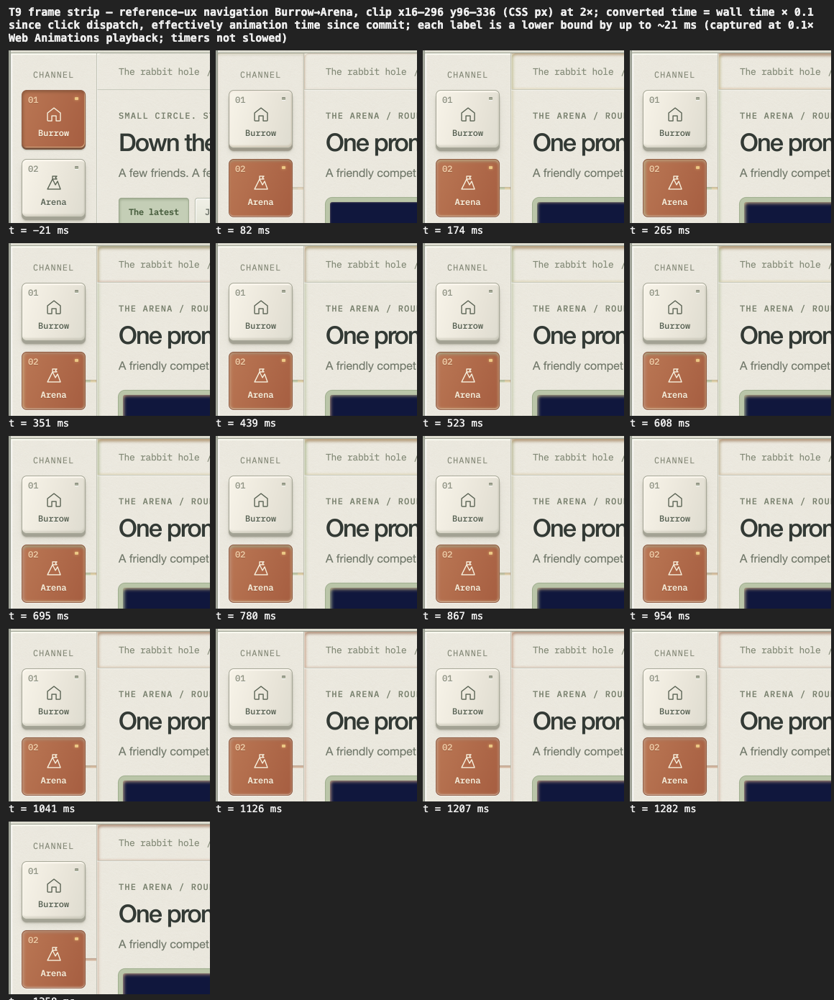
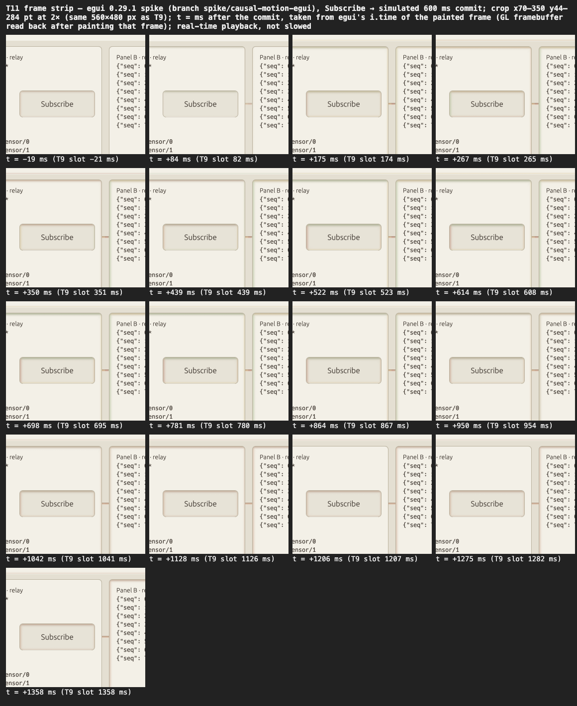
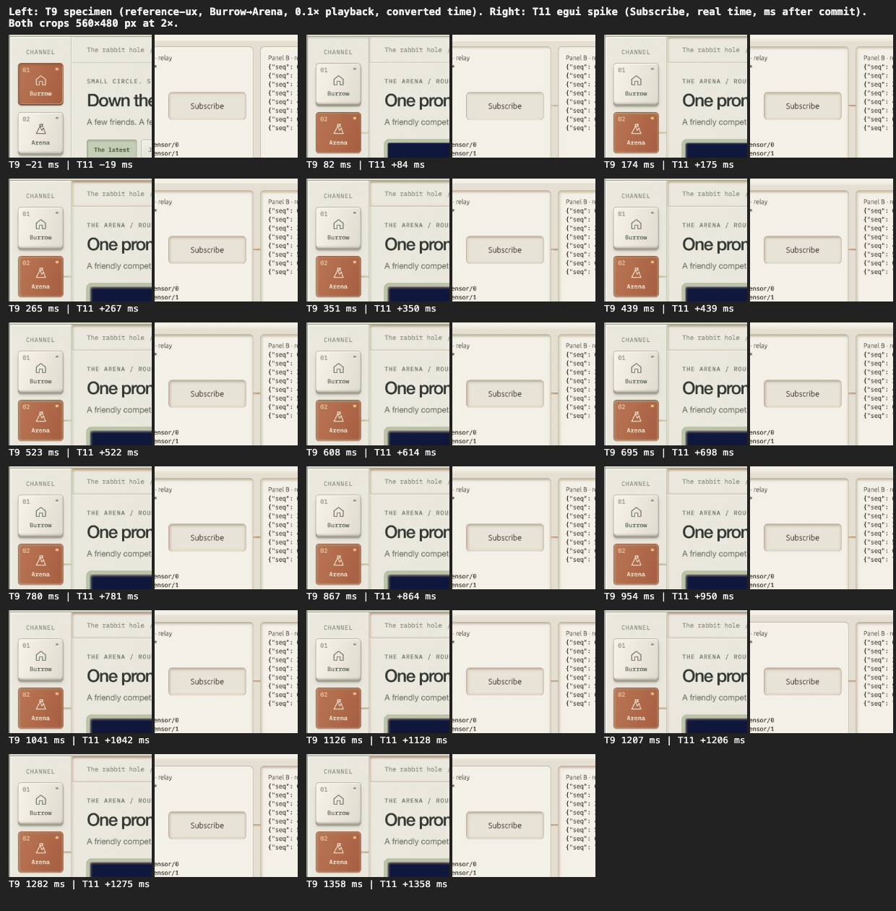

# UI/UX Code Review — Snow White Workbench Lens

Plan: `docs/superpowers/plans/2026-09-24-ui-ux-snow-white-review.md`
Evidence: `docs/superpowers/reviews/assets/2026-09-24/`

All task sections, T1–T21, are written; the board records each task's completion. T2 comes before T1 because it was completed first.

## Process findings

These findings are about the review's tooling and workflow, not about Zenoh Explorer's UI.
They use `P-*` ids so that T21's ranked table can reference every `F-*` id exactly once
without these getting mixed in.

### P-1 — Native task tools unavailable in this Claude Code client

- **Observed (2026-09-25, session `a9138eb1-9e31-461f-9fd8-2d2df87ff870`):** Bear Hug's
  SessionStart/UserPromptSubmit hooks send exact `TaskCreate` payloads for T1 and T2 and ask
  for them to be pushed to the native task list. This client has no `TaskCreate`,
  `TaskUpdate` or `TaskList` tool. A `ToolSearch` for `select:TaskCreate,TaskUpdate,TaskList`
  returned "No matching deferred tools found". The only task tool present is `TaskStop`,
  which stops background tasks.
- **Note:** `.claude/settings.json` already sets `CLAUDE_CODE_ENABLE_TASKS=1`, yet the task
  tools are still missing in this session. Setting that variable in project settings does
  not guarantee the tools are present.
- **Effect:** the native task list is not synchronized. The hooks keep reporting
  "Native task list: pending" on every turn.
- **Ruling (user, in chat):** this is a supported case. Native tools must not be simulated.
  `docs/superpowers/plans/BOARD.md` and `WORK.json` serve as the task list. Task state
  changes only through `scripts/bin/bearhug-work start|complete|block <id>
  --session <session-id> --provider claude`, and the board is kept current as work changes.
  If the Stop hook blocks on task durability, a real board update through that helper
  satisfies it. Creating tasks does not.
- **Suggested Bear Hug change:** when the provider's native task tools are absent, the hooks
  should fall back to the board and stop repeating the native payload each turn. A plain
  "native tools unavailable; board is authoritative" line would be enough.

### P-2 — Campaign turn destroyed by built-in plugin paths

- **Observed (2026-09-25, first campaign run on T2):** the Claude worker's turn finished
  normally (exit 0, empty stderr). Bear Hug then failed the episode with "operational
  evidence could not be built: extension source path must be absolute". The failure receipt
  is under `~/.local/state/bearhug/.../20260925T042625Z-claude-c6b112060348-00bdo7pw/`.
- **Cause (verified):** Claude Code 2.1.282 lists built-in plugins in its `system/init` event
  with the literal path `"builtin"`, for example `agents-md@builtin` and
  `telemetry@builtin`. `_extension_sources` in
  `.bearhug/lib/bearhug/providers/claude_operational_evidence.py` sends every plugin entry
  to `_plugin_tree_record`. That function raises the base `ClaudeOperationalEvidenceError`
  for any path that isn't absolute (line 527). The base class is not in the quiet
  environmental class, so a completed turn becomes a failure receipt instead of an
  ineligible one. The only real plugin, `superpowers`, had an absolute path.
- **Effect:** every Claude campaign turn on this client version fails the same way, no
  matter what the task was. T2 never completed in the campaign; it was run interactively (P-3)
  and recorded complete in `2f5a80d`.
- **Suggested fix:** record entries whose `source` ends in `@builtin` (or whose path is
  `"builtin"`) without walking a tree, as skills and agents already are. At minimum, raise
  `ClaudeOperationalEvidenceEnvironmentalError` there so the turn survives.
- **Direction (user, 2026-09-25):** fix it upstream in Bear Hug and install it by re-running
  setup from `work/bear-hug-zenoh`. No local patch to `.bearhug/lib`: setup would overwrite
  it, and it would weaken the evidence check.

### P-3 — Capsule workers can't reach the reference sources or a browser

- **Observed:** the same T2 worker ran in an isolated capsule worktree with six tools (Bash,
  Edit, Glob, Grep, Read, Write), and its shell was limited to `cargo` plus `git add/commit`.
  Reads of `~/Documents/github/rabbits-social/snow-white-workbench` were denied ("Path is
  outside allowed working directories"). No browser, `screencapture` or local HTTP server
  could run. The worker correctly refused to invent observations. It committed a blocker
  note as `67ce509` in its capsule worktree, which is not merged here. That note uses the id
  "P-2" for this finding, so rename it if it is ever merged.
- **Effect:** T2 cannot be done in a capsule even after P-2 is fixed. The same holds for
  every capture-dependent task: T1, T9, T11 and any other task that needs screenshots,
  screen recordings or the running app.
- **Options (from the worker, endorsed):** (a) grant the capsule read access to the two
  paradigm trees plus browser and `screencapture`; (b) run the capture tasks in an
  interactive session; or (c) revise the plan so the operator supplies screenshots and a
  `tokens.json` snapshot under `docs/superpowers/reviews/assets/2026-09-24/reference/`.
  Option (c) changes the plan and needs re-acceptance.
- **Related:** the capsule's tool list had no TaskCreate/TaskUpdate either (see P-1).
- **Direction (user, 2026-09-25):** hybrid. Capture tasks (T1, T2, T9, T11 and any other
  task needing a browser, screenshots, recordings or the running app) run interactively in
  a terminal `claude` session. The text-and-code audits (T3–T8, T10) stay with the campaign
  once the P-2 fix lands. The worker sandbox is not widened: no committed reference sites
  and no `node`, `python3` or `screencapture` in its allowed programs. That boundary is what
  makes the receipts trustworthy.
- **Superseded (2026-09-25):** the campaign was then retired and the project opted out on the
  user's instruction (`2f5a80d`, board row 2), so no task after T2 ran in the campaign.

### P-4 — Controller ran a different task from the one requested

- **Observed:** `bearhug-work start T1 …` returned successfully, and `bearhug-campaign status`
  reported `task_id: T1`. The board then showed T2 `in_progress` while T1 stayed `pending`,
  and the capsule that ran was T2's (`capsule.task.0f617ba98e6a`). Both tasks were ready, so
  no dependency was broken. Still, `start <id>` does not currently mean "run this task".

### P-5 — Captures that show the developer's home directory

- **Privacy (redact before the branch goes public):** these captures were not edited and still
  show the real home directory path (found by OCR with macOS Vision over every PNG under
  `assets/2026-09-24/`, then checked by eye). Crop or blur the path in each:
  - T1: the four `assets/2026-09-24/app/*-04-alert-banner.png` captures (dark and light, 1000
    and 1400), whose banner reads "Saved to ~/Desktop/demo_sensors_temp1.bin" with the full
    home path in place of `~`.
  - Crops and pairs made from those captures: `t3/pair-1000-banner.png`,
    `t3/pair-1400-banner.png`, `t4/crop-dark-banner-and-tabs.png`,
    `t6/crop-header-banner-light-1400-04.png` and `t7/crop-banner-success.png`.
  - T12: `t12/t12-D-save-banner.png` (the same banner).
  - T17: the 11 PNGs listed in T17's Privacy note, where the path is in the red error line.
- **Text evidence:** the logs, measurements and review text cited here have been redacted to
  `~`. The helper scripts in `t11/scripts/` (tracked since `3175cd6` and cited by T11) take
  their paths from `W`, `S`, their own directory or `git rev-parse`. A byte scan of every file
  under `docs/superpowers/reviews/` in the working tree finds no home path.
- **Git history still holds the home path** in text, not only in the PNGs above:
  - the review doc and `app/cargo-clippy.txt` from `cb3d3b9`, `app/README.md` from `878bf90`,
    and `t15/keyexpr-validation-run.txt` and `t16/selector-validation.txt` from `5dbcad1`, in
    every commit up to `6a17883`, which redacted them. The unmerged spike branch
    (`267dd50`) still carries the unredacted review doc, `app/README.md` and
    `app/cargo-clippy.txt`;
  - `t11/scripts/__pycache__/analyze.cpython-314.pyc`, a Python bytecode cache committed in
    `3175cd6` and since removed (`__pycache__/` is now ignored).

  Redacting the PNGs in the tree leaves their old versions in history too. Before the branch
  goes public, rewrite its history (for example squash it, or run `git filter-repo` with
  `--replace-text` and the redacted PNGs), and rewrite or delete the spike branch too.
  Outside this review, `main`'s history also names the home directory, in
  `docs/superpowers/plans/2026-06-09-pipeline-integrity-and-tree-search.md` (still in the
  tree) and in `fable-internal-agent-command-example` (14 commits, since removed).

## T2 — Reference study

**How this was run:** in the interactive session on 2026-09-25, per P-3.
- Both references were served locally with `python3 -m http.server`:
  - the specimen `snow-white-workbench/assets/reference-ux` on `:8761`
  - the arcade `rabbit-hole/games-landing` on `:8762`
- They were driven with headless Chrome 153 over the DevTools protocol: real mouse and key events, 1440×900 and 820×900 viewports.
- The driver and the exact step script are committed next to the captures: `assets/2026-09-24/reference/cdp.mjs` and `cap.json`. Rerun them with `node cdp.mjs cap.json`.
- Timed frames are taken at fixed delays after the click. They are samples, not a frame-accurate timeline; T9 owns the motion timeline.

**Limitation:** the arcade's game tiles link to separately deployed games (`/pong/`, `/pool/`, …) that are not in `games-landing`. Locally, entering a game returns 404, so that capture was discarded. The arcade's change of task is recorded only up to the entry affordance: focus, the local toggle, and the link target.

### Reference observations

These are observations only; they are not recommendations for Zenoh Explorer. The "Lens" line on each entry names the Snow White principle it evidences.

- **O-1 · Place — the working surface dominates, the chassis is thin.**
  - [R01](assets/2026-09-24/reference/R01-specimen-burrow-1440.png): at 1440×900 the chassis header (about 80 px) and channel rail (about 120 px) frame a content column plus a right rail that take roughly 85 % of the window.
  - The breadcrumb "The rabbit hole / Live feed" names the current place.
  - The vivid colour (indigo/orange pixel art) is inside the content display. The enclosure stays ivory, olive and graphite, with one amber/rust accent: the selected key.
  - *Lens: broad workbench; colour belongs to content.*
- **O-2 · Act → result — global navigation changes place without moving landmarks.**
  - Clicking **02 Arena**, from [R01](assets/2026-09-24/reference/R01-specimen-burrow-1440.png) to [R02a (≈300 ms)](assets/2026-09-24/reference/R02a-specimen-nav-arena-300ms.png) and [R02c (settled)](assets/2026-09-24/reference/R02c-specimen-nav-arena-settled.png), does the following:
    - It commits at once: `aria-current="page"` moves to Arena, and the breadcrumb reads "The arena".
    - Burrow returns to a raised ivory key, and Arena becomes the latched orange key.
    - The page content is replaced.
  - The header, rail, key positions and right-rail frame stay pixel-stable.
  - A short orange **connection** runs in the gutter from the Arena key's right rim to the content panel's left rim. It is visible at about 300 ms and still present when settled.
  - The header's lower edge carries a faint warm tint during the response. The ≈650 ms frame [R02b](assets/2026-09-24/reference/R02b-specimen-nav-arena-650ms.png) shows the same.
  - *Lens: causal edges plus connection in the existing gutter; a selected key stays inset orange.*
- **O-3 · Return — going back restores the place exactly.**
  - Clicking **01 Burrow** ([R03](assets/2026-09-24/reference/R03-specimen-return-burrow.png), about 1.8 s after the click) restores the Burrow feed. The "The latest" segment is selected, the page is back at the top, and Burrow's key is latched again.
  - The Arena connection is gone.
  - A **new** connection now runs from Burrow's right rim into the gutter.
  - A faint warm edge still lines the header's lower edge and the right-rail card frame at this moment. Whether it is the tail of the release or a resting state belongs to T9's timeline; one still frame can't tell.
  - *Lens: a place to act and return to; supersede, and a selected source keeps its connection.*
- **O-4 · Local control addresses its own module.**
  - The segmented **Jump in & play** control ([R04a ≈250 ms](assets/2026-09-24/reference/R04a-specimen-local-segment-250ms.png), [R04b settled](assets/2026-09-24/reference/R04b-specimen-local-segment-settled.png)) latches with a sage inset.
  - Its connection is a short vertical orange stub from the segment's lower rim down into the gap above the feed card, not across the page. It is still present when settled.
  - Global chrome (the channel keys, the header) is untouched.
  - The visible feed content is unchanged in this viewport. Whatever the segment filters is not visible above the fold, so this capture shows only the act side of act → result.
  - *Lens: scope by control ownership.*
- **O-5 · Asynchronous result — pending and committed are visibly distinct, and the key's words change with its function.**
  - Pressing **Play a round** ([R05a ≈200 ms](assets/2026-09-24/reference/R05a-specimen-play-pending-200ms.png), [R05b ≈1.1 s](assets/2026-09-24/reference/R05b-specimen-play-1100ms.png), [R05c settled](assets/2026-09-24/reference/R05c-specimen-play-settled.png)) turns the content display itself into the game: "YOU'RE UP · 0 / 5 jumps", a timing bar and a restart glyph.
  - The key's words and symbol become **→ Jump [SPACE]**. It carries a keyboard legend, so all three layers (geometry, symbol, word) change together.
  - A connection runs from the Jump key's right rim into the card gutter.
  - Between frames the timing marker moves (a real, live state) while the frame around it is static.
  - *Lens: three coordinated layers; an existing symbol changing is still a result.*
- **O-6 · Focus is obvious and differs from selection.**
  - Keyboard Tab onto the selected Burrow key ([R06](assets/2026-09-24/reference/R06-specimen-keyboard-focus.png); focused element reported as "01 Burrow") draws a separate rust outer ring (`focus #ae5339`) around the already-orange latched key.
  - Focus and selection can both be read at once, and not by colour alone: the ring is a distinct shape outside the key's rim.
  - *Lens: controls feel physical and work normally.*
- **O-7 · Narrow width reflows rather than shrinks.**
  - At 820×900 ([R07](assets/2026-09-24/reference/R07-specimen-narrow-820.png)) the right rail and the "Personal arcade system" legend drop out, and the header keeps only the essentials.
  - Body text, keys and the content display stay the same size.
  - The main action ("Play a round") stays in reach.
  - *Lens: shorten the bank, stack modules, keep content readable.*
- **O-8 · Arcade: places are live previews with immediate entry.**
  - The arcade landing ([R08](assets/2026-09-24/reference/R08-arcade-landing-1440.png)) is a different, dark aesthetic. Its "places" are five tiles, each a looping live preview of the game ("looping previews · click to play").
  - The whole tile is the link. A single `↗` symbol and "GET LOST ↗" / "LET'S PLAY ↗" words signal entry.
  - Tab focus ([R09](assets/2026-09-24/reference/R09-arcade-tile-focus.png)) draws a lime ring around the entire tile. The focused element's accessible text includes the title and description.
  - *Lens: let playable worlds lead; immediate entry.*
- **O-9 · Arcade: a local toggle changes symbol, word and state together.**
  - **Ⅱ pause previews** becomes **▷ play previews**, with `aria-pressed="true"` ([R10](assets/2026-09-24/reference/R10-arcade-previews-paused.png)).
  - The previews freeze in place. The layout does not move, and there is no connection or edge effect: the arcade does not use the causal-edge system.
  - *Lens: three layers; words state the consequence.*
- **O-10 · Arcade narrow width keeps the lead place first.**
  - At 820×900 ([R12](assets/2026-09-24/reference/R12-arcade-narrow-820.png)) the tiles stack. The featured world ("Les Mondes Imaginaires") keeps full width, and the title scales down while body text stays readable.
  - "sam's other stuff" drops out; "pause previews" and "surprise me" stay.

### Token map

The source is `snow-white-workbench/references/tokens.json`. Every egui field below was checked against the egui/epaint/eframe **0.29.1** sources in `~/.cargo/registry` (`egui/src/style.rs`; `epaint/src/text/text_layout_types.rs:267`; `eframe/src/epi.rs:193`). "No egui equivalent" means there is no `Visuals`/`Style` field; the value would need per-call-site code or custom painting (T10 owns the painting design).

| Snow White token | Value | egui 0.29.1 `Visuals` / `Style` field |
|---|---|---|
| colors.environment | `#b8bab0` | `eframe::App::clear_color` (outside the chassis frame); no `Visuals` field |
| colors.chassis | `#e9e6dc` | `Visuals::panel_fill` |
| colors.panel | `#f3f0e7` | `Visuals::faint_bg_color` (group/stripe fill); `Visuals::window_fill` for windows |
| colors.textPrimary | `#333a35` | `Visuals::widgets.noninteractive.fg_stroke.color` (or `override_text_color`) |
| colors.textSecondary | `#626b5a` | No egui equivalent (weak text is derived; set per `RichText::color`) |
| colors.seam | `#bbbdb1` | `Visuals::widgets.noninteractive.bg_stroke.color` (separators, frame strokes) |
| colors.olive | `#495e4e` | `Visuals::widgets.inactive.weak_bg_fill` (button fill) |
| colors.oliveKeyLight | `#64735b` | `Visuals::widgets.hovered.weak_bg_fill` |
| colors.oliveKeyDark | `#4e5c46` | `Visuals::widgets.active.weak_bg_fill` |
| colors.selectedKeyLight | `#ba7754` | `Visuals::selection.bg_fill` |
| colors.selectedKeyDark | `#a65e41` | `Visuals::selection.stroke.color` |
| colors.playKeyLight / playKeyDark | `#c18757` / `#af6f43` | No egui equivalent (per-button `Button::fill`) |
| colors.keyTextLight | `#fff4df` | No egui equivalent for "text on dark keys" alone (`widgets.inactive.fg_stroke` is shared by all buttons; set per `RichText::color`) |
| colors.focus | `#ae5339` | No egui equivalent (0.29 has no dedicated focus-ring field; keyboard focus reuses hovered/selection styling) |
| colors.statusGlass / statusText | `#172b24` / `#cee2b4` | No egui equivalent (per-module `Frame::fill` + `RichText::color`) |
| colors.contentGlass | `#090f38` | `Visuals::extreme_bg_color` (text-edit and scroll backgrounds) is the closest; content displays need `Frame::fill` |
| colors.contentText / contentSecondary | `#fff1da` / `#bfc2e9` | No egui equivalent (inside content frames, per `RichText::color`) |
| colors.vgaAccents | `#445dcc #7b53ad #ee9b99 #92d48d #ffd07f` | No egui equivalent (content colours) |
| colors.headerSpectrum | `#8eaa6f #d8ba6b #c4874a #a7563e` | No egui equivalent (causal edge/connection painting) |
| colors.responseOrange / responseEdgeBase | `#ba7754` / `#d6d1c2` | No egui equivalent (causal edge painting) |
| — (hyperlink) | not in tokens | `Visuals::hyperlink_color` (Snow White has none; would map to `focus` or `olive`) |
| type.body | 16–18 | `Style::text_styles[TextStyle::Body]` → `FontId::proportional(16..18)` |
| type.regularLabel | 14 | `Style::text_styles[TextStyle::Button]` → `FontId::proportional(14)` |
| type.metadata | 12 | `Style::text_styles[TextStyle::Small]` → `FontId::proportional(12)` |
| type.title | 30–44 | `Style::text_styles[TextStyle::Heading]` → `FontId::proportional(30..44)` |
| type.legendFamily | technical mono (IBM Plex Mono optional) | `Style::text_styles[TextStyle::Monospace]` + `egui::FontDefinitions` to load the font |
| type.readingFamily | platform neutral sans | `egui::FontDefinitions` `FontFamily::Proportional` list |
| type.bodyLineHeight | 1.5–1.8 | No `Style` field; per-layout `TextFormat::line_height` (epaint `text_layout_types.rs:267`) |
| geometry.spacingBase / groupSpacing | 4 / 8, 12, 16, 24, 32 | `Style::spacing.item_spacing`, `spacing.button_padding`, `spacing.indent` |
| geometry.outerRadius | 11–16 | `Visuals::window_rounding` |
| geometry.panelRadius | 5–9 | `Visuals::menu_rounding`; `widgets.noninteractive.rounding` for frames |
| geometry.keyRadius | 4–7 | `Visuals::widgets.{inactive,hovered,active}.rounding` |
| geometry.touchTarget | 44–48 | `Style::spacing.interact_size` (minimum widget size) |
| geometry.keyElevation | 2–4 | No egui equivalent (widgets have no per-widget shadow; `widgets.*.expansion` grows the rect and is not elevation) |
| geometry.displayLip | 2–6 | No egui equivalent (inset lip requires painting) |
| geometry.responseInsetBevel | 2–4 | No egui equivalent (`Shadow` is outer-only; see T10) |
| geometry.responseConnectionWidth | 3–4 | No egui equivalent (painted in the gutter; see T10) |
| motion.controlTransitionMs | 100–150 | `Style::animation_time` (seconds; the app currently forces `0.001`) |
| motion.reducedMotion | "remove decorative movement" | No egui equivalent (egui/eframe 0.29 expose no OS reduced-motion preference) |
| motion.causalEdges.* (stagger 28 ms, 820 ms base, +250 ms hold, …) | see tokens.json | No egui equivalent (T9 extracts the spec, T10 maps it) |
| materials.lightDirection | upper-left | `Visuals::window_shadow` / `popup_shadow` `offset` (outer drop shadow only) |
| materials.* (plastic, glass, colorBudget) | prose | No egui equivalent (art direction) |

## T1 — Baseline build and rendered capture

**Baseline:** commit `2f5a80d`, `rustc 1.94.0 (4a4ef493e 2026-03-02)`, macOS. Output files are in [`assets/2026-09-24/app/`](assets/2026-09-24/app/README.md).

`cargo test` (tail, verbatim):

```
test result: ok. 30 passed; 0 failed; 0 ignored; 0 measured; 0 filtered out; finished in 0.08s
exit=0
```

`cargo clippy -- -D warnings` (full, verbatim; the re-check was forced with `touch src/main.rs`):

```
    Checking zenoh-explorer v0.9.1 (~/Documents/github/harnassis/work/zenoh-explorer-test)
    Finished `dev` profile [unoptimized + debuginfo] target(s) in 1.55s
exit=0
```

**How the connected state was obtained:**
- The explorer ran in peer mode with multicast discovery (empty address, listen port 7447). Header: "(1P) Connected".
- Traffic came from a throwaway zenoh peer (`zpub-traffic-generator.rs`, built outside the repo) that publishes five `demo/**` topics every 500 ms, plus three of five chunk keys for an in-progress `demo/files/report` transfer.
- `zenohd` is not installed, so no router was used.
- **Sequence:**
  1. The generator was started.
  2. The explorer connected.
  3. With the generator publishing (log ticks around 30–60), the tree still showed "No topics yet" for about 30 s.
  4. I clicked Subscribe `demo/**`, and topics appeared at once.
  5. The generator's first run had sent its three chunk keys (ticks 0–2) before the subscription existed, so I **restarted the generator** once, after subscribing. Its ticks 0–2 then delivered the chunk keys that make up the in-progress `report` transfer.
- Because of that restart, the captured message lists mix ticks from both runs; for example, `dark-1400-02` begins at tick 67 of the first run.
- **The automatic `**` monitor session delivered nothing.** No tree nodes appeared before the explicit subscription, although `record_chunk`/`insert_path` would have created them for any sample the monitor received. There is no capture of the pre-subscribe "No topics yet" state; this rests on direct observation during the run.
- None of the deep-review findings R1–R19 covers this directly. The nearest is R10 (monitor failures are only logged). T20 should record it as a new observation: in peer mode the monitor session has multicast/gossip off and no connect endpoints, so it has no route to other peers.

**Captures:** 32 window-only PNGs, 8 views × {light, dark} × {1400×900, 1000×600}, indexed in [README.md](assets/2026-09-24/app/README.md):
- disconnected connection panel
- Topics with All Messages
- topic details for a selected leaf
- alert banner
- active transfer
- Publish
- Query
- Help

**Things the captures show, for later tasks.** These are observations; T3–T8 turn them into findings:
- **Dedup hides live data (T20; deep-review R15).**
  - `demo/sensors/temp1` history jumps from 13:20:05 to 13:21:03 ([dark-1400-03](assets/2026-09-24/app/dark-1400-03-topic-details-leaf.png)).
  - Once a topic's values have been seen within the 60 s window, All Messages shows mostly `demo/logs/app`, the one topic whose payload never repeats. The other topics come back in bursts whenever their window expires.
  - Compare [dark-1400-02](assets/2026-09-24/app/dark-1400-02-topics-all-messages.png) (13:20:00, just after subscribing: all five topics) with [dark-1400-01](assets/2026-09-24/app/dark-1400-01-disconnected-panel.png) (13:53, `demo/logs/app` only).
- **Transfer progress reports claimed bytes, not received bytes (T20; related to R8, which covers export trusting the claimed `total_size`).** "report 3/5 · 192.00 MB of 256.00 MB" while 48 bytes had arrived ([dark-1400-05](assets/2026-09-24/app/dark-1400-05-transfer-details.png)).
- **Save File is disabled for an incomplete transfer, with no reason given (T7).** Same capture.
- **Landmarks move (T3):**
  - The alert banner pushes the toolbar and workspace down by about 22 pt ([dark-1400-04](assets/2026-09-24/app/dark-1400-04-alert-banner.png)).
  - The disconnected connection form pushes them down by about 134 pt ([light-1000-01](assets/2026-09-24/app/light-1000-01-disconnected-panel.png)).
- **Missing glyphs (T6):** the banner's leading `✓` and the header status `●` render as empty boxes in the default proportional font. See every `*-04-alert-banner` capture and any header.
- **Light-theme contrast (T5/T7):** the selected tree row ("temp1") and the transfer progress bar are pale cyan on white and barely visible ([light-1400-04](assets/2026-09-24/app/light-1400-04-alert-banner.png)). "Connected" and memory text are light green on white.
- **1000×600 overflow (T19):** "Rate Limit (msg/s)" is clipped off the right edge of the All Messages toolbar ([light-1000-02](assets/2026-09-24/app/light-1000-02-topics-all-messages.png)).
- **All Messages lags (T8/T20):** with Auto-scroll on, the visible list stayed about 3 minutes behind the newest messages (timestamps 13:52 while the clock read 13:55). The top of [light-1400-02](assets/2026-09-24/app/light-1400-02-topics-all-messages.png) is 13:52:12, while [light-1400-03](assets/2026-09-24/app/light-1400-03-topic-details-leaf.png), taken moments earlier, already has 13:55:18. This could be scroll position rather than lag; T8 should confirm which.
- **Disconnect keeps state (T17):** tree, counts and messages remain after Disconnect ([dark-1400-01](assets/2026-09-24/app/dark-1400-01-disconnected-panel.png)).

**Process note:** a full-screen `screencapture`, used once to locate the native save dialog, triggered macOS's "bypass the system private window picker" prompt for Visual Studio Code. It was resolved outside this session. All committed captures are window-only.

## T3 — Workbench layout audit (chrome vs work, landmark stability, control proximity)

**Scope checked:** `src/app.rs:302-717` (`update`, the frame layout). The plan cites `319-716`, and the current tree agrees: the outer `CentralPanel` opens at `app.rs:319` and the repaint request sits at `app.rs:716`. Also read: `topic_tree.rs:159-307` (tree panel and detail dispatch), `messages.rs:16-66` (All Messages toolbar) and `main.rs:49-50` (1400×900 default, 1000×600 minimum).

**Method (real pixel measurement):**
- Python 3.14 with Pillow 12.3 and numpy 2.5, run through `uv run --with pillow --with numpy`, on the 32 T1 PNGs. Scripts and raw output are in [`assets/2026-09-24/t3/`](assets/2026-09-24/t3/).
- `measure.py` classifies every row by its fraction of outer-background pixels versus panel-fill pixels. Dark theme: bg `#2d2d2d` / panel `#4b4b4b`. Light theme: bg `#f8f8f8` / panel `#ffffff`.
- It then finds full-width separator lines (≥97 % uniform rows) and the tree/detail splitter (a column that is ≥97 % uniform down the work area). Raw per-file output: `measurements.txt`.
- `ink.py` lists text/control extents along rows or columns. `blue.py` finds the primary-button rectangles.
- Captures are 2× Retina, so **pt = px / 2**. The 28 pt macOS title bar (px 0–55) is OS chrome and is **excluded**. All y values below are content y, meaning the egui viewport with 0 at the top.
- The band edges came out **identical in light and dark and at both sizes**: each state's 8 captures share the same edges, within 1 px of antialiasing on the toolbar line in the 06/07/08 captures. One capture per state therefore stands for its whole state.

**Definitions:**
- **Work** is the rectangle holding the tree `SidePanel` (`app.rs:701-707`) and the detail `CentralPanel` (`app.rs:710-712`). It runs from x = 8 to W − 8 pt, and from the line under the toolbar down to the bottom inner margin. The 1.5 pt splitter counts as work. It is egui's 1 pt separator stroke centred on a pixel centre, so at 2× its 2 px of ink spread over 3 px (x 813–815 px, at half, full and half strength; `t12/measurements.txt:34-36` dark, `:75-77` light).
- **Chrome** is everything else in the viewport:
  - the 8 pt outer margins (`app.rs:323`)
  - the header row (`app.rs:326-463`)
  - separators (`app.rs:465`, `630`)
  - the connection group or the Disconnect row (`app.rs:468-628`)
  - the alert banner (`app.rs:633-655`)
  - the Quick Actions toolbar and its bottom line (`app.rs:658-698`)
- A second, stricter figure, the **data surface**, also removes the controls *inside* the work panels. On the tree side that is the filter row, the Back button and the Subscribe group (`topic_tree.rs:162-222`), so it starts at the "Topics" label. On the detail side it is the All Messages heading (`ui.heading("All Messages")`, `topic_tree.rs:598`) plus the two control rows of `show_messages_tab` (`messages.rs:18-66`), so it starts at the first message.

**Measured vertical bands (connected, identical at both sizes):**

| Band | px (2×, window) | content pt | Height pt |
|---|---|---|---|
| Header row (incl. 8 pt top margin) | 56–138 | 0–41.5 | 41.5 |
| Separator | 139–141 | 41.5–43 | 1.5 |
| Disconnect row | 142–198 | 43–71.5 | 28.5 |
| Separator + spacing | 199–211 | 71.5–78 | 6.5 |
| Toolbar (Quick Actions) + line | 212–255 | 78–100 | 22 |
| **Work** (tree + detail) | 256–1839 (1400) / 256–1239 (1000) | 100–892 / 100–592 | 792 / 492 |
| Bottom margin | 1840–1855 / 1240–1255 | 892–900 / 592–600 | 8 |

Other states:
- **Banner:** the banner panel occupies px 212–255 (22 pt). The toolbar moves to 256–299, and work starts at 300 px (122 pt).
- **Disconnected:** the connection group's stroke spans px 150–457 (content 47–200.5 pt). The separator is at 467–469, the toolbar at 480–523, and work starts at 524 px (234 pt).
- **Splitter:** px 813–815 in all 32 captures, so the tree panel is 398.5 pt wide at both sizes.

### Chrome-vs-work area ratio (from `assets/2026-09-24/t3/ratios.py` → `ratios.md`)

| State (capture) | Viewport pt² | Work rect pt | Work pt² | Chrome pt² | **Work %** | **Chrome %** | Chrome : work | Data surface % |
|---|---|---|---|---|---|---|---|---|
| 1400×900 connected ([02](assets/2026-09-24/app/dark-1400-02-topics-all-messages.png)) | 1400×900 = 1,260,000 | 1384 × (892−100) = 1384×792 | 1,096,128 | 163,872 | **87.0 %** | **13.0 %** | 0.150 | 75.8 % (398.5×644.5 + 984×709.5 = 954,981) |
| 1400×900 connected + banner ([04](assets/2026-09-24/app/dark-1400-04-alert-banner.png)) | 1,260,000 | 1384 × (892−122) = 1384×770 | 1,065,680 | 194,320 | **84.6 %** | **15.4 %** | 0.182 | — |
| 1400×900 disconnected ([01](assets/2026-09-24/app/dark-1400-01-disconnected-panel.png)) | 1,260,000 | 1384 × (892−234) = 1384×658 | 910,672 | 349,328 | **72.3 %** | **27.7 %** | 0.384 | 63.7 % (398.5×592.5 + 984×575.5 = 802,403)¹ |
| 1000×600 connected ([02](assets/2026-09-24/app/light-1000-02-topics-all-messages.png)) | 1000×600 = 600,000 | 984 × (592−100) = 984×492 | 484,128 | 115,872 | **80.7 %** | **19.3 %** | 0.239 | 62.7 % (398.5×344.5 + 584×409.5 = 376,431) |
| 1000×600 connected + banner ([04](assets/2026-09-24/app/light-1000-04-alert-banner.png)) | 600,000 | 984 × (592−122) = 984×470 | 462,480 | 137,520 | **77.1 %** | **22.9 %** | 0.297 | — |
| 1000×600 disconnected ([01](assets/2026-09-24/app/light-1000-01-disconnected-panel.png)) | 600,000 | 984 × (592−234) = 984×358 | 352,272 | 247,728 | **58.7 %** | **41.3 %** | 0.703 | 46.2 % (398.5×292.5 + 584×275.5 = 277,453)¹ |

¹ In the disconnected captures the "Subscribe to Topics" group is collapsed, while the connected captures have it open. The tree-side data surface is therefore not like-for-like: it favours the disconnected state by 52 pt of tree height.

Where the chrome goes:
- **Connected, 1400×900 (163,872 pt²):**
  - header 1400×41.5 = 58,100
  - Disconnect row + separators + gap 1400×36.5 = 51,100
  - toolbar 1400×22 = 30,800
  - bottom margin 1400×8 = 11,200
  - side margins 2×8×792 = 12,672
  - Sum: 163,872.
- **Disconnected, 1400×900:** the connection group is 534.5 pt wide: its stroke runs from x px 14 to 1083 in [light-1000-01](assets/2026-09-24/app/light-1000-01-disconnected-panel.png), and it is set by its widest child, the peer-mode hint label (`app.rs:566-570`), not by the window. The 153.5 pt height and the 134 pt shift hold for the captured case: peer mode, no error. Client mode drops the Listen Port row (`app.rs:555-563`), and an `Error` state adds a line (`app.rs:581-583`), so both figures vary with mode and error state. To its right, (1384 − 534.5) × 153.5 = **130,398 pt² is empty** (10.3 % of the viewport). At 1000×600 the same gap is 449.5 × 153.5 = 68,998 pt² (11.5 %).

**Against Snow White O-1:** the specimen's chassis leaves about 85 % of a 1440×900 window to content (O-1, [R01](assets/2026-09-24/reference/R01-specimen-burrow-1440.png)). The connected state matches that at 1400 (87.0 %). The layout loses it at the 1000×600 minimum (80.7 %), with a banner (77.1 % at 1000), and above all while disconnected (72.3 % / 58.7 %). The stricter data-surface figure is 62.7 % in the most common small-window state.

### Landmarks that shift between states

Evidence strips: each one puts the "before" capture on the left and the "after" capture on the right, with measured guide lines.
- [pair-1400-connect-disconnect.png](assets/2026-09-24/t3/pair-1400-connect-disconnect.png)
- [pair-1000-connect-disconnect.png](assets/2026-09-24/t3/pair-1000-connect-disconnect.png)
- [pair-1400-banner.png](assets/2026-09-24/t3/pair-1400-banner.png)
- [pair-1000-banner.png](assets/2026-09-24/t3/pair-1000-banner.png)

Positions are content pt (px/2 − 28 for y). The same shifts were measured in light and dark and at both sizes.

| Landmark | Code | Connected → Disconnected (before [02](assets/2026-09-24/app/dark-1400-02-topics-all-messages.png) / [light-1000-02](assets/2026-09-24/app/light-1000-02-topics-all-messages.png), after [01](assets/2026-09-24/app/dark-1400-01-disconnected-panel.png) / [light-1000-01](assets/2026-09-24/app/light-1000-01-disconnected-panel.png)) | No banner → banner (before [03](assets/2026-09-24/app/dark-1400-03-topic-details-leaf.png) / [light-1000-03](assets/2026-09-24/app/light-1000-03-topic-details-leaf.png), after [04](assets/2026-09-24/app/dark-1400-04-alert-banner.png) / [light-1000-04](assets/2026-09-24/app/light-1000-04-alert-banner.png)) |
|---|---|---|---|
| Connect/Disconnect button (top-left) | `app.rs:585`, `620` | y 48 → 176 (**+128**), x 8 → 14 (+6) | stable |
| Quick Actions toolbar top | `app.rs:658` | y 78 → 212 (**+134**) | y 78 → 100 (**+22**) |
| Work top / tree filter row | `app.rs:701`, `topic_tree.rs:162` | y 100 → 234 (**+134**) | y 100 → 122 (**+22**) |
| Detail title ("All Messages" / topic heading) | `topic_tree.rs:598` ("All Messages"), `topic_tree.rs:312` (topic heading) | ink top y 110.5 → 244.5 (**+134**) | y 110.5 → 132.5 (**+22**) |
| Tree row "demo" | `topic_tree.rs:277-278` | y 266 → 318 (+52; confounded, see ¹) | y 287 → 309 (**+22**) |
| Header "Memory: …" label, left edge | `app.rs:440` | x 1083.5 → 1099.5 (**+16**) at 1400; 683 → 699 (**+16**) at 1000 | stable |
| Header status "● Connected/Disconnected", left edge | `app.rs:373-376` | x 1274.5 → 1259 (**−15.5**) at 1400; 874.5 → 859 (**−15.5**) at 1000 | stable |
| Tree/detail splitter | `app.rs:701-704` | stable (x 398.5 pt in all 32 captures) | stable |
| Theme toggle, app title | `app.rs:327`, `335` | stable | stable |

A tab switch does not move any landmark. The 02/06/07/08 captures differ by ≤1 px (antialiasing) at the toolbar line.

### Findings

#### F-T3-1 — Disconnecting inserts a 154 pt form above the workspace and pushes every workspace landmark down 134 pt
- **Severity:** S2
- **Location:** `src/app.rs:468-617` (connection `ui.group` placed in the outer vertical flow, between the separators at `app.rs:465` and `app.rs:630`)
- **Observation:**
  - The same widgets occupy different places depending on connection state. The toolbar, the tree filter, the detail title and the tree all move down 134 pt when the session drops. That is the measured peer-mode, no-error case: client mode drops the Listen Port row (`app.rs:555-563`) and an error adds a line (`app.rs:581-583`), so the shift varies with state and never goes away ([pair-1400-connect-disconnect](assets/2026-09-24/t3/pair-1400-connect-disconnect.png), [pair-1000-connect-disconnect](assets/2026-09-24/t3/pair-1000-connect-disconnect.png)).
  - Chrome rises from 13.0 % to 27.7 % of the viewport at 1400×900, and from 19.3 % to **41.3 %** at 1000×600.
  - The group is 534.5 pt wide at both sizes; its width comes from the peer-mode hint label (`app.rs:566-570`). The rest of its 153.5 pt band is empty: 130,398 pt² (10.3 %) at 1400 and 68,998 pt² (11.5 %) at 1000.
  - After a Disconnect, the retained tree and messages (T1; T17's topic) are still being read, but now in a smaller, displaced workspace.
- **Principle:**
  - Snow White "a place to act and return to": *keep landmarks … stable as the task changes* (`SKILL.md:26`).
  - *A broad workbench … thin outer chassis* (`SKILL.md:24`).
  - Contrast O-2, where the header, rail and keys stay pixel-stable across a place change ([R02c](assets/2026-09-24/reference/R02c-specimen-nav-arena-settled.png)).
  - Usability: spatial memory and layout stability.
- **Recommendation:**
  - Give connection settings a fixed place that does not reflow the workspace. Options:
    - (a) render them in the detail `CentralPanel` as a "Connection" view while disconnected, using the existing `DetailView` dispatch at `topic_tree.rs:300-307`;
    - (b) open them in an `egui::Window`/`egui::popup_below_widget` anchored to the header status label;
    - (c) keep an always-present, constant-height connection strip, laid out horizontally with `ui.allocate_ui_with_layout` at a fixed height, whose contents swap between the form summary and the Disconnect button.
  - Whichever is chosen, the toolbar's y must stay the same in both states.

#### F-T3-2 — The alert banner pushes the toolbar and workspace down 22 pt, and appears far from the action that raised it
- **Severity:** S2
- **Location:** `src/app.rs:633-655` (`TopBottomPanel::top("alert_banner")` shown before the toolbar panel at `app.rs:658`)
- **Observation:**
  - Every completed Save (and every export error) inserts a 22 pt banner. A cancelled save dialog sets no banner (`topic_tree.rs:823`, `Ok(None) => {}`). The banner sits above the toolbar. The toolbar, tree and detail title all move +22 pt ([pair-1400-banner](assets/2026-09-24/t3/pair-1400-banner.png), [pair-1000-banner](assets/2026-09-24/t3/pair-1000-banner.png)).
  - They move back when the user dismisses the banner with the `✖` (`app.rs:650-652`). `ui_alert` is cleared only there (grep `ui_alert` in `src/`: set at `topic_tree.rs:821/824/827`, cleared only at `app.rs:651`). There is no timeout, so the workspace stays shifted until that click.
  - Work falls to 84.6 % (1400) and 77.1 % (1000).
  - The Save File button that caused it is in the detail panel at content x 416–540, y 154–172 pt (measured px x832–1080, y364–400 in [dark-1400-04](assets/2026-09-24/app/dark-1400-04-alert-banner.png)). All three save entry points (`topic_tree.rs:359`, `451`, `718`) report through `save_topic_to_file` → `ui_alert` (`topic_tree.rs:809-828`). The result appears in a full-width strip above the toolbar, across the tree panel.
  - One of those entry points is the tree-row save icon (`topic_tree.rs:718`). When the banner appears or is dismissed, that row and every other tree row move 22 pt under the pointer.
- **Principle:**
  - Snow White: *put controls close to the display or object they affect* and *make local changes local* (`references/spatial-interaction.md:13`).
  - Stable landmarks (`SKILL.md:26`, O-2).
  - Usability: content shifting under the pointer causes mis-clicks.
- **Recommendation:**
  - Show the result without reflow. Options:
    - a permanently reserved, constant-height status strip (`TopBottomPanel::bottom("status").exact_height(..)`, always shown, empty when idle)
    - the header's right cluster
    - an inline confirmation next to the Save button in the detail panel, where the action lives
  - Keep dismissal, and add an expiry.
  - T7 owns the `starts_with('✓')` classification; T8 owns the causal trace.

#### F-T3-3 — The Connect/Disconnect control jumps 128 pt, the Disconnect row spends a full-width band on one button, and neither sits beside the status it changes
- **Severity:** S3
- **Location:** `src/app.rs:585` (Connect, at the bottom of the group), `src/app.rs:619-627` (Disconnect in its own `ui.horizontal` row), `src/app.rs:373-376` (status label, header right)
- **Observation:**
  - The session control is at content (8, 48) pt when connected and at (14, 176) pt when disconnected, a 128 pt vertical jump. Button rects measured by `blue.py`: px x16–156, y152–188 versus x28–136, y408–444.
  - The Disconnect row is 1384 × 28.5 pt, 39,444 pt² (3.1 % of the viewport at 1400, 4.7 % at 1000), holding one 70 pt button.
  - The status it changes ("● Connected") sits at the far right of the header: x ≈ 1259–1275 pt at 1400, about 1180 pt to the right of the button's right edge (x 78 pt).
- **Principle:**
  - Controls close to what they affect (`references/spatial-interaction.md:13`).
  - One control identity at one stable position (`SKILL.md:44`, "preserve persistent chrome and action identity").
- **Recommendation:**
  - Move Connect/Disconnect into the header's `right_to_left` cluster (`app.rs:333`), next to the status label.
  - Use one `Button` whose text changes with state (the three-layer change noted in O-5).
  - **Note for T21:** this single stateful button must be reconciled with T4's F-T4-12, which asks for different styling on Connect (accent) and Disconnect (destructive). A single button can still switch its fill with its state.
  - Delete the Disconnect row. That returns 28.5 pt of height to the workspace: work would be 1384 × 820.5 = 1,135,572 pt², 90.1 %, at 1400 and 984 × 520.5 = 512,172 pt², 85.4 %, at 1000.

#### F-T3-4 — The header's right cluster shifts sideways when the status text or peer count changes
- **Severity:** S3
- **Location:** `src/app.rs:333-461` (`Layout::right_to_left` with variable-width labels: status `app.rs:373`, peer count `app.rs:379-394`, memory `app.rs:440`, drops `app.rs:446-460`)
- **Observation:**
  - Anchored at the right edge, each label's x depends on the widths of the labels to its right.
  - Between connected and disconnected, the status label's left edge moves −15.5 pt and the "Memory: …" label moves +16 pt, at both sizes: dark-1400 px 2549→2518 and 2167→2199; light-1000 px 1749→1718 and 1366→1398.
  - The "(1P)" count disappears when disconnected ([02](assets/2026-09-24/app/dark-1400-02-topics-all-messages.png) vs [01](assets/2026-09-24/app/dark-1400-01-disconnected-panel.png)).
  - The drop counter and "Worker Unresponsive" (`app.rs:345-363`) would shift everything to their left in the same way. Neither was captured.
- **Principle:** stable landmarks (`SKILL.md:26`). The eye re-finds a readout in the same place.
- **Recommendation:** give each readout a fixed-width slot, via `ui.add_sized([w, h], Label::new(..))` or `ui.allocate_ui_with_layout` per slot. Order the slots so the most stable one (status) is outermost and variable counters sit innermost.

#### F-T3-5 — Session-wide limits live inside the All Messages view, far from the memory readout they govern, and the Dedup toggle is off-screen even at 1400
- **Severity:** S2
- **Location:** `src/ui/messages.rs:34-66` (Memory Limit, Message Limit, Rate Limit, Dedup), `src/app.rs:396-461` (memory/drop readout in the header), `src/types.rs:461` (`Deduper` `enabled: true` by default)
- **Observation:**
  - The limits that set the header's "Memory: x/100MB" and "(n dropped, n rate limited)" readouts can only be edited in the All Messages view of the detail panel. That view is shown only while no topic is selected (`topic_tree.rs:172`, `310-311`).
  - They sit in a different panel from the readout: the limits row starts at content x ≈ 416 pt, y 162.5–181.5 pt (px x832, y381–419 in dark-1400-02), while the readout sits in the header row (y 0–41.5 pt) at x ≈ 1084 pt.
  - The second toolbar row overflows at 1400×900: the row ends at the Rate Limit field at the panel edge, and the **Dedup** checkbox (`messages.rs:60`) is not rendered in the visible area ([crop-1400-limits-row-right-edge.png](assets/2026-09-24/t3/crop-1400-limits-row-right-edge.png), from [dark-1400-02](assets/2026-09-24/app/dark-1400-02-topics-all-messages.png)).
  - Dedup is on by default, and T1 showed it hiding repeated values. The switch that explains that behaviour is invisible at the default window size.
  - T19 owns the 1000×600 overflow ("Rate Limit" clipped).
- **Principle:**
  - Controls close to the display they affect; make local changes local (`references/spatial-interaction.md:13`).
  - Usability: a control that is not visible is not available.
- **Recommendation:**
  - Move session limits and Dedup next to the header memory/drop readout, for example in a popover opened from the memory label (`Response::clicked` → `egui::popup_below_widget`).
  - Or wrap the row with `ui.horizontal_wrapped` so nothing overflows.
  - Leave only list-local controls (Filter, Auto-scroll, Clear) in the All Messages toolbar.

#### F-T3-6 — The view switcher spans both panels but drives only the detail panel
- **Severity:** S3
- **Location:** `src/app.rs:658-698` (toolbar `TopBottomPanel` shown in the outer `ui` before the `SidePanel`), `src/ui/topic_tree.rs:300-307` (`detail_view` switches only the right panel)
- **Observation:**
  - "Quick Actions: 📊 Topics / 📤 Publish / 🔍 Query / ❓ Help" is a full-width strip above both the tree and the detail panel.
  - Selecting a tab replaces only the detail panel; the tree is identical in 02/06/07/08.
  - Its labels start at x ≈ 16 pt, above the tree panel ([dark-1400-06](assets/2026-09-24/app/dark-1400-06-publish.png)), and its label calls these views "Quick Actions" (T4 owns the wording).
  - Visually, the control belongs to the tree it does not affect.
- **Principle:**
  - Scope by control ownership: *global navigation addresses the shared workspace…; a local control addresses its own module* (`SKILL.md:44`; O-4).
  - Controls close to what they affect (`references/spatial-interaction.md:13`).
- **Recommendation:**
  - Render the tab row inside the detail `CentralPanel`, as a `TopBottomPanel::top("detail_tabs").show_inside(..)` within `app.rs:710-712`, so it sits directly over its receiving panel.
  - This also returns 22 pt of height to the tree panel. It gives T12 a real source→receiver pair with the tree/detail splitter as the shared gutter.

#### F-T3-7 — Adopt a fixed landmark skeleton: a thin, constant chassis around a workspace whose top edge never moves
- **Severity:** D
- **Location:** `src/app.rs:319-713`
- **Observation:**
  - Connected at 1400×900 the chassis is already thin: 13.0 % chrome, comparable to O-1's roughly 15 %.
  - But the chassis is state-dependent. Work's top edge sits at 100, 122 or 234 pt depending on connection and alert state, and at 1000×600 chrome reaches 19.3–41.3 %.
  - Inside the work panels, controls take a further 147.5 pt of tree height (filter, Back, open Subscribe group: `topic_tree.rs:162-222`) and 82.5 pt of detail height (heading plus two control rows). That leaves a data surface of 75.8 % (1400) and 62.7 % (1000) of the viewport.
- **Principle:**
  - O-1 (thin chassis; the working surface dominates) and O-2 (landmarks pixel-stable through a place change).
  - `SKILL.md:24` and `SKILL.md:26`.
  - *More compact: remove redundant copy and ornament before reducing reading sizes* (`references/design-system.md:68`).
- **Recommendation:** a skeleton with exactly three constant-height bands:
  1. A header carrying the title, the connection control and status (F-T3-3), and fixed readout slots (F-T3-4).
  2. The workspace: tree `SidePanel` plus detail `CentralPanel`, with the tab row inside the detail panel (F-T3-6).
  3. An always-present status strip for alerts (F-T3-2).

  The connection form becomes a place, not an insertion (F-T3-1). Collapse the tree's Subscribe group by default once a subscription exists, to reclaim tree height. Using the arithmetic above:
  - header 41.5 + separator 1.5 + a 22 pt status strip moved to the bottom gives work of 1384 × (892 − 43 − 22) = 1,144,568 pt², **90.8 %** at 1400;
  - 984 × (592 − 65) = 518,568 pt², **86.4 %** at 1000;
  - in every connection and alert state.

**Severity count:** S1: 0 · S2: 3 (F-T3-1, F-T3-2, F-T3-5) · S3: 3 (F-T3-3, F-T3-4, F-T3-6) · D: 1 (F-T3-7). Total 7.

### Done-when self-check

- **Measured chrome-vs-work area ratio at both sizes from the captures: met.** The table above covers 1400×900 and 1000×600 in the connected, banner and disconnected states. The pixel method and arithmetic are shown, and the scripts plus raw output are in `assets/2026-09-24/t3/` (`measure.py`, `measurements.txt`, `ratios.py`, `ratios.md`).
- **Each landmark that shifts between states is listed with before/after screenshots: met.** The landmark table covers 7 shifting landmarks and 3 stable ones. The connect/disconnect and banner pairs cite their T1 captures, and the annotated strips `pair-{1400,1000}-{connect-disconnect,banner}.png` show them. Tab switches were checked and produce no shift.

## T4 — Three-layer control inventory

**Scope:** every interactive control in `src/app.rs` and `src/ui/{help,messages,mod,publish,query,topic_tree}.rs` at HEAD (`878bf90`), read in full. Each control is classified by the Snow White "Three coordinated layers" rule (SKILL.md): **physical** = the geometry that tells you it acts; **symbol** = the glyph that names the function or state; **word** = the text that states the intent or consequence. Rendering was checked against the T1 captures; crops are in [`assets/2026-09-24/t4/`](assets/2026-09-24/t4/).

**Rendered geometry, common to all controls (from the captures):**
- `apply_theme` (`app.rs:189-191`, `221-223`) sets `widgets.*.weak_bg_fill` to iOS blue. Every `Button`, `small_button` and `ComboBox` therefore renders as the same flat, borderless blue rectangle. This covers primary, destructive and utility actions and dropdowns alike ([crop-light-connection-panel](assets/2026-09-24/t4/crop-light-connection-panel.png), [crop-dark-tree-panel-controls](assets/2026-09-24/t4/crop-dark-tree-panel-controls.png)).
- An unselected `selectable_label` has no frame; it reads as plain text. When selected it gets a fill: cyan in dark, a pale fill plus outline in light ([crop-light-tabs-publish-selected](assets/2026-09-24/t4/crop-light-tabs-publish-selected.png)).
- A `TextEdit` is a flat field. In light mode the field is `extreme_bg_color` #FAFAFA on white #FFFFFF, with almost no edge.
- Nothing is raised, and nothing has a press bevel. None of the controls has a physical layer in the Snow White sense; "Physical" below therefore records the egui geometry that does render.

### Grep and reconciliation

The command is committed as [`t4/grep-controls.sh`](assets/2026-09-24/t4/grep-controls.sh). Its output is in [`t4/grep-output.txt`](assets/2026-09-24/t4/grep-output.txt). Run it from the repo root: `bash docs/superpowers/reviews/assets/2026-09-24/t4/grep-controls.sh`. It runs `grep -nE <pattern>` over the 7 files.

| Pattern | Hits | Counted as controls |
|---|---|---|
| `\.button\(` | 12 | 12 |
| `Button::new` | 4 | 4 (all 4 wrapped in `add_enabled`) |
| `small_button` | 4 | 4 |
| `selectable_label` | 6 | 6 |
| `selectable_value` | 7 | 7 (dropdown options inside the 2 ComboBoxes) |
| `ComboBox` | 2 | 2 |
| `checkbox\(` / `Checkbox` | 3 / 0 | 3 |
| `text_edit_singleline` | 12 | 12 |
| `text_edit_multiline` | 0 | 0 |
| `TextEdit::` | 4 | 4 (3 singleline in `app.rs`, 1 multiline in `publish.rs`) |
| `\.collapsing\(` | 1 | 1 |
| `CollapsingState` / `show_toggle_button` | 1 / 1 | 1 (one control: `topic_tree.rs:735` loads the state and `:755` draws its toggle, so it is counted once, at `:755`) |
| `SidePanel::` (with `\.resizable\(` = 1) | 1 | 1 (drag handle of the resizable tree panel, `app.rs:701-704`) |
| `Sense::` | 1 | 0 (`topic_tree.rs:34` is `Sense::hover()` on the leader-line spacer and is not clickable) |
| `Sense::click`, `ui\.interact`, `DragValue`, `Slider`, `radio`, `toggle_value`, `hyperlink`, `menu_button`, `CollapsingHeader` | 0 each | 0 |
| **Total distinct controls** | | **57** = inventory rows below |

The union of constructor lines in the script's second block is 58. Subtracting the `Sense::hover` line leaves 57, which matches the table.

**Hits that are not separate controls:**
- `\.clicked\(\)` (26 hits): each belongs to a control already listed.
  - 337 is the theme toggle.
  - 666, 675, 684 and 693 are the 4 tabs.
  - `publish.rs:216` is the Publish button, `query.rs:81` the Query button and `topic_tree.rs:191` the Subscribe button.
  - `topic_tree.rs:357` is Save File, `:378` Pause/Resume, and `:682` and `:784` are the tree rows.
  - The remaining hits are inline on the listed button's own line.
  - No clickable custom `Response` exists: no `ui.interact` and no `Sense::click`.
- `\.changed\(\)` (4 hits): `messages.rs:37/45/53` are listed TextEdits, and `publish.rs:197` is the payload multiline (`:188`).
- `add_enabled` (4 hits): these wrap the 4 `Button::new`.
- `on_hover_text` (7 hits): they sit on listed controls (`topic_tree.rs:165`, `:353`, `:373`, `:717`), or on the non-interactive `●` labels (`topic_tree.rs:668`, `:777`, `query.rs:151`). `on_disabled_hover_text` (`topic_tree.rs:355`) is not matched by the pattern and belongs to Save File.

**Deliberately out of scope:**
- `ScrollArea` scrollbars, which egui provides.
- egui's default text-selectable `Label`s: these are selection surfaces, not controls.
- `help.rs`, which has 0 controls.
- `mod.rs`, which has 0 controls.

### Inventory

Column key:
- **Phys.** is the rendered geometry: *blue-rect* (flat blue button), *small blue-rect* (`small_button`, less padding), *flat-text* (unselected `selectable_label`), *field* (TextEdit), *box* (checkbox), *disclosure* (triangle plus text row).
- **Sym.** is the glyph in the label, or "—".
- **Word** is the visible text, or "—" (with any tooltip in parentheses).
- **Layers** counts how many layers carry meaning.

The rendering notes come from the T1 captures; "not captured" means the state is absent from all 32 PNGs.

| # | Location | Control (egui) | Function | Phys. | Sym. | Word | Layers | Finding |
|---|---|---|---|---|---|---|---|---|
| 1 | app.rs:335-340 | `button` | Toggle theme | small blue square, ≈20×18 pt | `☀` (dark) / `🌙` (light). Both render: `☀` as a sun, `🌙` as a crescent. The glyph shows the **target** theme, not the current one | — (no tooltip) | 1 | F-T4-1, F-T4-10 |
| 2 | app.rs:476 | `ComboBox` | Choose transport | blue-rect + `▼` | `▼` (dropdown) | — (preceded by label "Transport:") | 2 | F-T4-6 |
| 3–7 | app.rs:480, 485, 490, 495, 500 | `selectable_value` ×5 | Options tcp/udp/quic/ws/tls | popup rows (not captured open) | — | "tcp" … "tls" | 1 | — |
| 8 | app.rs:509 | `TextEdit::singleline` | Address | field, 120 pt | — | label "Address:" | 2 | — |
| 9 | app.rs:515 | `TextEdit::singleline` | Port | field, 50 pt; free text for a number | — | label "Port:" | 2 | F-T4-9 |
| 10 | app.rs:539 | `ComboBox` | Client/peer mode | blue-rect + `▼` | `▼` | shows the raw value "peer"/"client" (lower case), while its options read "Client"/"Peer" | 2 | F-T4-6 |
| 11–12 | app.rs:542, 547 | `selectable_value` ×2 | Options Client/Peer | popup rows (not captured open) | — | "Client", "Peer" | 1 | — |
| 13 | app.rs:559 | `TextEdit::singleline` | Listen port (peer only) | field, 60 pt; free text for a number | — | label "Listen Port:" | 2 | F-T4-9 |
| 14 | app.rs:585 | `button` | Connect | blue-rect | — | "Connect" | 2 | F-T4-6 |
| 15 | app.rs:620 | `button` | Disconnect (also clears subscriptions, see T17) | blue-rect, same as Connect | — | "Disconnect" | 2 | F-T4-6 |
| 16 | app.rs:650 | `small_button` | Dismiss alert banner | small blue-rect | `✖` renders as a white `✕` | — (no tooltip) | 1 | F-T4-2, F-T4-10 |
| 17 | app.rs:662 | `selectable_label` | Tab: Topics view | flat-text; filled when selected | `📊` renders as a bar chart | "Topics" | 2 (1 when unselected) | F-T4-4 |
| 18 | app.rs:671 | `selectable_label` | Tab: Publish view | same | `📤` renders as a tray/hand glyph | "Publish" | 2 / 1 | F-T4-4 |
| 19 | app.rs:680 | `selectable_label` | Tab: Query view | same | `🔍` renders as a magnifier, the same glyph as the tree filter's `🔍` label (`topic_tree.rs:163`, beside #22) | "Query" | 2 / 1 | F-T4-4, F-T4-8 |
| 20 | app.rs:689 | `selectable_label` | Tab: Help view | same | `❓` renders as a plain `?` | "Help" | 2 / 1 | F-T4-4 |
| 21 | app.rs:701-704 | `SidePanel` resize | Resize the tree panel | 1 px separator line; cursor changes on hover only | — | — | 0 until hover | — (T3 owns the layout) |
| 22 | topic_tree.rs:164 | `text_edit_singleline` | Filter the tree | field | glyph label `🔍` (`:163`) | — (tooltip "Filter topics"; no hint text) | 1–2 | F-T4-8 |
| 23 | topic_tree.rs:166 | `button` | Clear the filter | blue-rect, always shown, even when the filter is empty | `✖` renders as `✕` | — (no tooltip) | 1 | F-T4-2, F-T4-10 |
| 24 | topic_tree.rs:172 | `button` | Back to All Messages (only while a topic is selected) | blue-rect | `⬅` renders as an arrow | "Back to All Messages" | 3 (as far as this app goes) | — |
| 25 | topic_tree.rs:179 | `collapsing` | Show/hide the Subscribe form | disclosure | `▶`/`▼` from egui | "Subscribe to Topics" | 3 | — |
| 26 | topic_tree.rs:182 | `text_edit_singleline` | Subscribe key | field | — | "Key:" | 2 | — |
| 27 | topic_tree.rs:184 | `Button::new` + `add_enabled` | Subscribe | blue-rect | — | "Subscribe" | 2 | F-T4-6 |
| 28 | topic_tree.rs:210 | `small_button` | **Unsubscribe** (destructive) | small blue-rect | `✖` renders as `✕` | — (no tooltip; the neighbouring key text is the only context) | 1 | F-T4-2, F-T4-10 |
| 29 | topic_tree.rs:345-351 | `Button::new` + `.fill` + `add_enabled` | Save payload to file | blue-rect; its explicit fill equals the default | `💾` | "Save File (size)" (tooltip; the disabled-reason tooltip is at `:355`) | 3 | F-T4-6, F-T4-7 |
| 30 | topic_tree.rs:371-379 | `button` | Pause/Resume topic display | blue-rect; the label is `text_secondary` or WARNING text on blue | `⏸` / `▶` | "Pause" / "Resume" (tooltip states the consequence) | 3 | F-T4-7 (contrast: T5/T7) |
| 31 | topic_tree.rs:449 | `small_button` | Save a completed chunked transfer | small blue-rect | `💾` | "Save" | 2 | F-T4-7 |
| 32 | topic_tree.rs:479-483 | `button` | Expand/collapse a large payload | blue-rect (not captured) | `▶` renders; `▼` (U+25BC) has no glyph in the Proportional stack and is predicted to render as a box (T6 glyph-coverage row for U+25BC) | "Expand (+N bytes)" / "Collapse" | 3 when collapsed; 2 when expanded (symbol lost) | F-T4-3, F-T4-7 |
| 33 | topic_tree.rs:680 | `selectable_label` | Select a leaf topic | flat-text; the hit area is the icon and name only | leaf icon `🏷`/`💾`/`🛠`/`📥` | node key | 2 | F-T4-7 (hit area: T13) |
| 34 | topic_tree.rs:717 | `small_button` | Quick-save the leaf payload | small blue-rect, ≈22×15 pt | `💾` | — (tooltip "Save file") | 1 | F-T4-7, F-T4-10 |
| 35 | topic_tree.rs:755 | `CollapsingState::show_toggle_button` (`plus_minus_icon`) | Expand/collapse a branch | painted `+`/`−` pipes, no frame (**protected**) | `+`/`−` | — (branch name is adjacent) | 1 | — (protected boundary; no change proposed) |
| 36 | topic_tree.rs:782 | `selectable_label` | Select a branch topic | flat-text | `🌐` (depth 0), `📡` (renders as a crooked satellite-dish glyph) | node key | 2 | — (T13) |
| 37 | messages.rs:20 | `text_edit_singleline` | Filter messages | field | — | "Filter:" | 2 | — |
| 38 | messages.rs:21 | `checkbox` | Auto-scroll | box with tick | tick | "Auto-scroll" | 3 | — |
| 39 | messages.rs:22 | `button` | Clear all messages and counters (destructive) | blue-rect | — | "Clear" | 2 | F-T4-6 |
| 40 | messages.rs:37 | `text_edit_singleline` on a per-frame temp `String` | Memory limit | field | — | "Memory Limit (MB):" | 2 | F-T4-9 |
| 41 | messages.rs:45 | same | Message limit | field | — | "Message Limit:" | 2 | F-T4-9 |
| 42 | messages.rs:53 | same | Rate limit | field. It is the last visible item of the row at 1400×900 ([t3/crop-1400-limits-row-right-edge](assets/2026-09-24/t3/crop-1400-limits-row-right-edge.png)). At 1000×600 both label and field are absent: the row ends at Message Limit ([light-1000-01](assets/2026-09-24/app/light-1000-01-disconnected-panel.png); T19) | — | "Rate Limit (msg/s):" | 2 where visible; 0 at 1000×600 | F-T4-9 |
| 43 | messages.rs:60 | `checkbox` | Deduplicate messages | box. **Off-screen in every capture**: the row ends at the Rate Limit field at 1400×900 and at Message Limit at 1000×600, so the control cannot be seen at either size without widening the window. It is still a Tab stop, as a 2 pt sliver at the window edge (T19) | tick | "Dedup" | 3 in code; 0 as rendered | F-T4-11 |
| 44 | publish.rs:31 | `text_edit_singleline` | Publish key | field | — | "Key:" | 2 | — |
| 45 | publish.rs:37 | `button` | Import file as payload | blue-rect | — | "Import File" | 2 | — |
| 46 | publish.rs:94 | `button` | Clear the imported file | blue-rect (not captured) | `✖` | "Clear" | 3 | — |
| 47 | publish.rs:122-126 | `button` | Expand/collapse the import preview | blue-rect (not captured) | `▶` renders; `▼` predicted box, as #32 | "Expand" / "Collapse" | 3 when collapsed; 2 when expanded (symbol lost) | F-T4-3, F-T4-7 |
| 48 | publish.rs:188 | `TextEdit::multiline` (monospace; `.interactive(false)` after an import) | Payload | field | — | "Payload:" | 2 | — (read-only state: T7) |
| 49 | publish.rs:205 | `text_edit_singleline` | Encoding (free text) | field | — | "Encoding:" | 2 | — (T15) |
| 50 | publish.rs:209 | `Button::new` + `add_enabled` | Publish | blue-rect | — | "Publish" | 2 | F-T4-6 |
| 51 | publish.rs:270 | `text_edit_singleline` | Queryable key pattern | field | — | "Key Pattern:" | 2 | — |
| 52 | publish.rs:275 | `checkbox` | Enable Queryable | box, nearly invisible on white in light mode ([light-1400-06](assets/2026-09-24/app/light-1400-06-publish.png)) | tick | "Enable Queryable" plus a status word "Active"/"Inactive" | 3 | — (contrast: T5/T7) |
| 53 | query.rs:50 | `button` | Dismiss query alert | blue-rect | — | "Dismiss" | 2 | — |
| 54 | query.rs:63 | `text_edit_singleline` | Selector | field | — | "Selector:" | 2 | — |
| 55 | query.rs:67 | `text_edit_singleline` | Query value | field | — | "Value (optional):" | 2 | — |
| 56 | query.rs:71 | `text_edit_singleline` | Timeout | field; free text for a number (`parse().unwrap_or(10000)`, `query.rs:84`) | — | "Timeout (ms):" | 2 | F-T4-9 |
| 57 | query.rs:74 | `Button::new` + `add_enabled` | Query | blue-rect | — | "Query" | 2 | F-T4-6 |

**Totals:**
- 57 controls.
- 6 are glyph-only with no visible word: #1, 16, 23, 28, 34 and 35. #35 is protected.
- 18 carry a symbol glyph (emoji or Unicode arrow/shape): #1, 16, 17–20, 23, 24 (`⬅`), 28, 29, 30 (`⏸`/`▶`), 31, 32 (`▶`/`▼`), 33, 34, 36, 46 and 47 (`▶`/`▼`). The ComboBox `▼` (#2, #10) and the collapsing-header triangle (#25) are painted by egui, not text glyphs, and are excluded.
- None has a raised or pressed geometry layer.

### Non-interactive items checked for "looks pressable"

| Location | Item | Looks pressable? | Note |
|---|---|---|---|
| messages.rs:88-93, topic_tree.rs:571-576 | `SUB`/`PUT`/`REPLY` badges (`GET` is never emitted, `types.rs:347`): `RichText::background_color(message_type.color())` with white text | **Mostly yes.** Square corners, unlike the slightly rounded buttons, but `SUB` uses `ExplorerColors::PRIMARY` (`types.rs:356`), the exact fill of every light-mode button (`app.rs:221`) | F-T4-5 |
| app.rs:660 | "Quick Actions:" label | It names the tabs as actions, although they are view selectors | F-T4-4 |
| app.rs:374 | `● Connected` header status | No, but `●` renders as an empty box ([crop-dark-header-right](assets/2026-09-24/t4/crop-dark-header-right.png)) | F-T4-3 |
| app.rs:531 | `→ (multicast discovery)` locator preview | No; `→` renders as an empty box ([crop-light-connection-panel](assets/2026-09-24/t4/crop-light-connection-panel.png)) | F-T4-3 |
| app.rs:649, topic_tree.rs:115, :446 | Leading `✓` in the banner and success labels | No; the banner `✓` renders as a box ([crop-dark-banner-and-tabs](assets/2026-09-24/t4/crop-dark-banner-and-tabs.png)) | F-T4-3 (font fix: T6) |
| topic_tree.rs:667, :776 | `●` local-publish indicator (8 pt; tooltip "Published from this app") | No; glyph-only state. Not captured: the T1 traffic came from another peer. Same glyph and font as the header `●`, which renders as a box | F-T4-3 |
| query.rs:144 | `●` local-queryable indicator on query replies (8 pt; tooltip "From local queryable", `query.rs:151`) | No; glyph-only state, same box glyph. Not captured | F-T4-3 |
| topic_tree.rs:163 | `🔍` label before the filter field | Reads as a search button but is not clickable | F-T4-8 |
| topic_tree.rs:108-112 | `ProgressBar` "3/5" pill | Marginal: a rounded filled pill beside rows. No action is implied | — (honesty of the value: T20) |
| topic_tree.rs:389-393 | "⏸ Paused" label next to the Pause/Resume button | No (plain warning text), but it reuses the button's `⏸` symbol | — |
| app.rs:354-358, 440-459 | "Worker Unresponsive", memory and drop counters | No | — (T7/T20) |

### Findings

**F-T4-1 — The theme toggle is glyph-only and shows the destination, not the state**
- **Severity:** S2
- **Location:** `app.rs:335-340`
- **Observation:**
  - The only content is `☀` in dark mode and `🌙` in light mode.
  - There is no word and no tooltip ([crop-dark-header-right](assets/2026-09-24/t4/crop-dark-header-right.png), [crop-light-header-right-disconnected](assets/2026-09-24/t4/crop-light-header-right-disconnected.png)).
  - The symbol names the theme you would switch *to*. It is the reverse of the state convention the app uses elsewhere: `selectable_label` shows the current selection.
  - It is the rightmost header item, rendered as the same blue rect as every action. It measures about 20×18 pt.
- **Principle:** Snow White three layers: words communicate intent and consequence. WCAG 1.1.1 (a non-text control needs a text alternative) and 4.1.2 (Name, Role, Value: the control has no name and does not expose its current state).
- **Recommendation:** Use a two-state mode selector: `ui.selectable_value(&mut self.dark_mode, false, "☀ Light")` and `ui.selectable_value(&mut self.dark_mode, true, "🌙 Dark")`. At minimum, add `.on_hover_text("Switch to light theme")`. The word then names the state and the latched geometry shows which state is current.

**F-T4-2 — `✖` means four different things, and three of them are glyph-only**
- **Severity:** S2
- **Location:** `topic_tree.rs:166` (clear filter), `topic_tree.rs:210` (unsubscribe), `app.rs:650` (dismiss banner); `publish.rs:94` has a word ("✖ Clear")
- **Observation:**
  - The same blue `✕` square is used to clear a text field, to dismiss a message, and to **end a live subscription**.
  - Only proximity distinguishes them ([crop-dark-tree-panel-controls](assets/2026-09-24/t4/crop-dark-tree-panel-controls.png)).
  - None of the three has a tooltip.
  - The unsubscribe `✖` is the only way to stop a subscription. It sends `ZenohCommand::Unsubscribe` at once.
- **Principle:** Snow White: symbols communicate *functions*, so one symbol should mean one function. Words must carry consequences. WCAG 1.1.1.
- **Recommendation:**
  - Give each its own word: "Clear" (filter), "Unsubscribe" (with the key in the tooltip) and "Dismiss" (banner). Keep `✖` only where the word is also present, as `publish.rs:94` already does.
  - Replace the filter-clear button with `TextEdit::hint_text` and show it only when the filter is non-empty.

**F-T4-3 — Four symbols render as empty boxes, and `●` is the only state symbol**
- **Severity:** S2
- **Location:** `app.rs:374` (`●` header status), `app.rs:531` (`→` locator preview), `app.rs:636/649` (`✓` banner), `topic_tree.rs:479` and `publish.rs:122` (`▼` in "▼ Collapse"); `topic_tree.rs:667`, `:776` and `query.rs:144` use the same `●`
- **Observation:**
  - Four glyphs used in controls or status have no glyph anywhere in the Proportional font stack: `●` U+25CF, `→` U+2192, `✓` U+2713 and `▼` U+25BC (T6 [glyph-coverage.md](assets/2026-09-24/t6/glyph-coverage.md): "NONE (tofu box)").
  - `●` and `→` are captured as hollow boxes ([crop-dark-header-right](assets/2026-09-24/t4/crop-dark-header-right.png), [crop-light-connection-panel](assets/2026-09-24/t4/crop-light-connection-panel.png)), and so is `✓` (T1). `▼` is predicted, not captured: no large payload or import was expanded in T1. When expanded, the Collapse buttons (#32, #47) lose their symbol layer.
  - The header's symbol layer is therefore lost. The connection state keeps only its word and colour.
  - The local-publish `●` has no word at all, only colour and a hover tooltip. With the same glyph and font it would render as the same box. This is inferred from the header, since no local topic was captured.
  - Meanwhile the pictographic emoji in tabs and tree rows render. They come from egui's NotoEmoji and emoji-icon fonts, which lack these four code points; only Hack (monospace) has three of them, and none has `✓`.
- **Principle:** Snow White: symbols communicate states. WCAG 1.4.1 (colour alone must not carry meaning; T7 owns the colour side).
- **Recommendation:**
  - The font fix belongs to T6 (F-T6-1): add a font covering U+25CF, U+2192, U+2713 and U+25BC to the Proportional family in `FontDefinitions`, or switch to glyphs the bundled fonts already cover, for example `⏷` U+23F7 for Collapse (resolves to emoji-icon-font; checked with `t6/glyph_coverage.py`).
  - In this inventory's terms, give the local indicator a word or legend, for example a mono "LOCAL" tag, or put "Published from this app" in the detail view. Draw the connection dot with `painter.circle_filled` instead of a text glyph.

**F-T4-4 — The view tabs have emoji symbols, a misleading label word, and no geometry when unselected**
- **Severity:** S2
- **Location:** `app.rs:660-696`
- **Observation:**
  - The four `selectable_label`s "📊 Topics", "📤 Publish", "🔍 Query" and "❓ Help" follow the plain label "Quick Actions:".
  - They switch the detail view, a change of place, and perform no action.
  - Unselected, they are frameless text. Only the selected tab has geometry: a cyan fill in dark, a pale fill plus outline in light ([crop-dark-banner-and-tabs](assets/2026-09-24/t4/crop-dark-banner-and-tabs.png), [crop-light-tabs-publish-selected](assets/2026-09-24/t4/crop-light-tabs-publish-selected.png)).
  - The emoji render, but their meaning is loose. `📤` renders as a hand/tray glyph. `🔍` is also the tree filter's glyph (F-T4-8). `❓` renders as a bare `?`.
  - Tree rows carry more symbols than the navigation does.
- **Principle:** Snow White: "Navigation, primary actions, mode selectors … are good physical controls". Its reference places are latched keys ([R01/R02c](assets/2026-09-24/reference/R02c-specimen-nav-arena-settled.png), T2 O-2). Words must state intent.
- **Recommendation:**
  - Drop or rename "Quick Actions:" to a place word such as "View".
  - Render the four tabs as a segmented key bank: `egui::Button::new(..).selected(self.detail_view == X)` with equal `min_size`, so unselected keys still have a frame.
  - Keep one symbol per place from a set that renders reliably (T6). Resolve the 🔍 collision.

**F-T4-5 — Message-type badges look like buttons**
- **Severity:** S2
- **Location:** `messages.rs:88-93`; `topic_tree.rs:571-576`; colours from `types.rs:354-360`
- **Observation:**
  - `SUB` badges are white text on `ExplorerColors::PRIMARY` (0,122,255). That is the exact `weak_bg_fill` of every light-mode button (`app.rs:221`) and within 10/255 of the dark-mode one (`DARK_PRIMARY`, `app.rs:189`).
  - In the detail history, a column of `SUB` chips sits just below the real "Save File" and "Pause" buttons with the same fill and white text ([crop-light-buttons-vs-sub-badges](assets/2026-09-24/t4/crop-light-buttons-vs-sub-badges.png), [dark-1400-03](assets/2026-09-24/app/dark-1400-03-topic-details-leaf.png)). The chips have square corners and no padding, while buttons are slightly rounded, so they can be told apart on close inspection. At a glance the fill reads as "button".
  - The `PUT`/`REPLY` badges reuse the SUCCESS/ERROR state colours for message kinds. `GET` (WARNING) is never shown: `MessageType::Query` is marked dead code (`types.rs:347`).
- **Principle:** Snow White: "Do not … make every badge look pressable"; decorative indicators are non-interactive and must look it.
- **Recommendation:**
  - Render the kind as a quiet mono legend (`RichText::monospace()`, `text_secondary` colour) with a 1 px outline painted via `painter.rect_stroke`, or as a coloured text legend with no fill.
  - Never use the button fill for non-controls.
  - Colour mapping belongs to T5.

**F-T4-6 — Every action has identical geometry, whatever its role or risk**
- **Severity:** S3
- **Location:** `app.rs:189-191`, `221-223` (global `weak_bg_fill`); `topic_tree.rs:345-350` (Save File's explicit `.fill` equals that default)
- **Observation:**
  - Connect, Disconnect, Subscribe, Publish, Query, messages Clear (which wipes all messages and counters), Import File and both ComboBoxes render as the same flat blue rect ([crop-light-connection-panel](assets/2026-09-24/t4/crop-light-connection-panel.png)).
  - The ComboBoxes differ only by `▼`.
  - Nothing separates primary from secondary, destructive from safe, or dropdown from button.
  - The one deliberate emphasis in the code, Save File's `.fill(PRIMARY)`, is invisible because every button already has that fill.
- **Principle:** Snow White: "Physical geometry communicates actions and grouping"; controls feel physical.
- **Recommendation:**
  - Give the default button a neutral key fill: set `widgets.inactive.weak_bg_fill` to an enclosure tone (T5 token map), with a stroke.
  - Reserve the accent fill for the one primary action per module (Connect, Subscribe, Publish, Query) via `Button::fill`.
  - Give destructive actions (Disconnect, Clear, Unsubscribe) a word that states the consequence. Their confirmation is T17's concern.
  - Style ComboBoxes as fields, for example with `widgets.inactive.bg_fill` behind `ComboBox`, rather than as keys.

**F-T4-7 — Symbols collide across functions**
- **Severity:** S3
- **Location:** `topic_tree.rs:836-858` (`leaf_icon` returns `💾` for binary/unknown leaves) versus `topic_tree.rs:342`, `:449` and `:717` (`💾` = save); `topic_tree.rs:364` (`▶ Resume`) versus `:481` and `publish.rs:124` (`▶ Expand`)
- **Observation:**
  - A binary leaf row draws `💾 name`, and when a payload is stored it also draws a `💾` quick-save button. The same symbol appears twice in one row, once as a type icon and once as an action.
  - This follows from the code; the captured `bin` branch was collapsed.
  - `▶` means both "resume live updates" and "expand text".
- **Principle:** Snow White: symbols communicate functions and states, so each symbol needs one meaning.
- **Recommendation:**
  - Keep `💾` for the save action only, and give binary content a different type glyph. With the current fonts, `■` U+25A0 renders (emoji-icon-font). `▦` U+25A6 would need Hack added to Proportional (F-T6-1).
  - Use `⏵`/`⏷` (U+23F5/U+23F7, both resolve to emoji-icon-font under the current fonts; checked with `t6/glyph_coverage.py`) for Expand/Collapse, and keep `▶`/`⏸` for Resume/Pause. `▸`/`▾` read better as disclosure triangles but are tofu today; they depend on F-T6-1.

**F-T4-8 — The tree filter is labelled only by a non-interactive `🔍`, which is also the Query tab's symbol**
- **Severity:** S3
- **Location:** `topic_tree.rs:163-165`; `app.rs:682`
- **Observation:**
  - The filter field has no visible word. "Filter topics" exists only as a hover tooltip.
  - The `🔍` beside it looks like a search button but is a label.
  - The same glyph labels the Query tab, a different function: a network request, not a local filter ([crop-dark-tree-panel-controls](assets/2026-09-24/t4/crop-dark-tree-panel-controls.png)).
- **Principle:** three layers: words for intent. WCAG 3.3.2 (Labels or Instructions).
- **Recommendation:** Use `egui::TextEdit::singleline(&mut self.tree_filter).hint_text("Filter topics")` (egui 0.29.1 `text_edit/builder.rs:199`), or a visible "Filter:" label as `messages.rs:19` already uses. Drop the `🔍` or change the Query tab's symbol.

**F-T4-9 — Numeric settings are free-text fields, and three of them fight the user while typing**
- **Severity:** S2
- **Location:** `messages.rs:36-58` (memory, message and rate limits); `app.rs:515`, `:559`; `query.rs:71`, `:84`
- **Observation:**
  - Each limit field edits a temporary `String` that is rebuilt from the stored number every frame. When an edit parses, it is clamped at once: `clamp(10, 1000)`, `clamp(100, 50000)`, `clamp(10, 10000)`.
  - As a result, emptying the field is impossible: an empty string fails to parse, so the old value returns next frame.
  - Typing a value digit by digit gets clamped midway. Selecting "100" and typing "5" gives 10; typing "0" then gives "100".
  - The Message Limit field shows the default 1000000, which the field's own clamp would never accept (max 50000).
  - Port, Listen Port and Timeout are also free text. An unparsable timeout silently becomes 10000 (`query.rs:84`).
  - The mid-typing clamp follows from the code (`messages.rs:36-40`); it was not exercised in the running app.
- **Principle:** Snow White: "Keep familiar hit targets and input semantics". WCAG 3.3.1 (Error Identification).
- **Recommendation:**
  - Use `egui::DragValue::new(&mut self.max_memory_mb).range(10..=1000).suffix(" MB")` (egui 0.29.1 `drag_value.rs:108`, `:174`) for the three limits and the timeout. DragValue edits as text and applies on commit, and its geometry and suffix carry the unit.
  - Validate ports on Connect. Error wording belongs to T17.

**F-T4-10 — Glyph-only controls have the smallest hit targets**
- **Severity:** S3
- **Location:** `app.rs:335`, `:650`; `topic_tree.rs:166`, `:210`, `:717`
- **Observation:** Measured from the 2× captures:
  - Theme toggle ≈20×18 pt.
  - Filter `✖` ≈22×16 pt.
  - Unsubscribe `✖` ≈22×15 pt.
  - Quick-save `💾` ≈22×15 pt ([crop-dark-tree-panel-controls](assets/2026-09-24/t4/crop-dark-tree-panel-controls.png), [crop-dark-header-right](assets/2026-09-24/t4/crop-dark-header-right.png)).
  - egui's default `interact_size` is 40×18 (`style.rs:1246`), and `small_button` removes vertical padding.
  - The controls with the least meaning carry the least target.
- **Principle:** Snow White `geometry.touchTarget` 44–48 (T2 token map). WCAG 2.5.8 (Target Size, minimum 24×24).
- **Recommendation:** Apply `Button::min_size(egui::vec2(24.0, 24.0))` to these controls. Raising `style.spacing.interact_size` globally would also do it, but it changes tree row height: `leader_line_with_count` allocates `interact_size.y` per row (`topic_tree.rs:33`), which is T13's lane. Adding words (F-T4-1, F-T4-2) enlarges the controls anyway. Tree-row hit areas belong to T13.

**F-T4-11 — The "Dedup" checkbox is off-screen, and its word states neither what it does nor what it hides**
- **Severity:** S2 (raised from S3: the control cannot be seen at either captured size)
- **Location:** `messages.rs:60-67`
- **Observation:**
  - The checkbox is off-screen in every T1 capture. At 1400×900 the limits row ends at the Rate Limit field ([t3/crop-1400-limits-row-right-edge](assets/2026-09-24/t3/crop-1400-limits-row-right-edge.png)); at 1000×600 it ends at Message Limit ([light-1000-01](assets/2026-09-24/app/light-1000-01-disconnected-panel.png)). The user cannot see the control at either size, so dedup stays at its default without the user knowing it exists. T19's live Tab pass shows it *is* a Tab stop, but focus lands on it as a 2 pt sliver at the window edge and does not scroll it into view ([disconnected-tab-log](assets/2026-09-24/t19/keyboard/disconnected-tab-log.txt), stop 22; F-T7-14). F-T7-14's `scroll_to_me` would not help here: the limits row is a `ui.horizontal` placed directly on the CentralPanel with no `ScrollArea` (`messages.rs:34-68`), so there is nothing to scroll. At 150% zoom Rate Limit is lost too, the Message Limit field is cut and "Messages: N" is cut to "Mess" ([allmsgs-150](assets/2026-09-24/t19/zoom150/allmsgs-150.png)); T19's former F-T19-2 is folded in here.
  - In code, the checkbox word is an abbreviation with no tooltip.
  - When on (the default), repeated payloads within the `Deduper` window (60 s, `app.rs:160`) are dropped from the lists. T1 recorded that this hides live data.
  - The only feedback is "(N deduped)", shown after the fact.
- **Principle:** Snow White: words communicate intent and *consequences*.
- **Recommendation:** Move the checkbox onto the first controls row beside "Auto-scroll", or wrap the limits row with `ui.horizontal_wrapped`, so it is visible. Use the word "Hide repeats (60 s)" with `.on_hover_text` explaining that repeated payloads are not listed. Whether dedup should default on belongs to T20.

**F-T4-12 — Mapping the three layers onto Zenoh Explorer's controls (design direction)**
- **Severity:** D
- **Location:** all rows above
- **Observation:**
  - The app has one geometry (the flat blue rect) for every control, and it mixes emoji and words ad hoc.
  - Snow White asks that navigation, primary actions and mode selectors be physical keys, and that content stay quiet.
- **Recommendation:** proposed role assignment. Its visual treatment depends on T5/T10.

| Role | Controls (#) | Physical | Symbol | Word |
|---|---|---|---|---|
| Place (latched key bank) | 17–20 tabs | raised key, inset and latched when selected | one reliable glyph per place | "Topics", "Publish", "Query", "Help" |
| Primary action (accent key) | 14 Connect, 27 Subscribe, 50 Publish, 57 Query | raised accent key | optional | verb |
| Destructive action (neutral key, consequence word) | 15 Disconnect, 28 Unsubscribe, 39 Clear | raised neutral key | `✖` only alongside the word | "Disconnect (ends N subscriptions)", "Unsubscribe", "Clear messages" |
| Mode selector (latching) | 1 theme, 10 mode, 38/43/52 checkboxes | two-position selector or latching key | state glyph | state word |
| Utility (small neutral key) | 16, 23, 24, 29–32, 34, 45–47, 53 | small neutral key ≥24 pt | symbol plus word | short verb |
| Field (quiet, inset) | 8, 9, 13, 22, 26, 37, 40–42, 44, 48, 49, 51, 54–56 | inset field | — | visible label or hint text |
| Content, not a control | badges, counts, `●`, progress | flat, no fill shared with keys | legend | mono legend |

`plus_minus_icon` (#35) stays as is (protected boundary).

**Severity count:**
- S1: 0
- S2: 7 (F-T4-1, 2, 3, 4, 5, 9, 11)
- S3: 4 (F-T4-6, 7, 8, 10)
- D: 1 (F-T4-12)

## T5 — Theme and material audit

**Scope, read in full at HEAD `878bf90`:** `src/colors.rs` (42 lines), `src/app.rs` (718), `src/types.rs` (687), `src/main.rs` (69), and every `src/ui/*.rs` (`help`, `messages`, `mod`, `publish`, `query`, `topic_tree`). Theme behaviour was checked against the egui 0.29.1 sources in `~/.cargo/registry` and against pixel samples from the T1 captures.

**Plan range check:** the plan cites `apply_theme` as `app.rs:183-255`. The function actually spans `183-253`. Lines `255-262` are the `#[allow(dead_code)]` `card_background_color` helper.

**Evidence** is in [`assets/2026-09-24/t5/`](assets/2026-09-24/t5/):
- [`grep.txt`](assets/2026-09-24/t5/grep.txt): the grep commands and their counts.
- [`contrast.py`](assets/2026-09-24/t5/contrast.py): the WCAG calculator. It needs no dependencies. Its output is [`contrast-output.md`](assets/2026-09-24/t5/contrast-output.md).
- [`sample_pixels.py`](assets/2026-09-24/t5/sample_pixels.py) → [`pixels.txt`](assets/2026-09-24/t5/pixels.txt): rendered RGB values from the captures.
- [`chroma_share.py`](assets/2026-09-24/t5/chroma_share.py) → [`chroma_share.txt`](assets/2026-09-24/t5/chroma_share.txt).

### How the theme reaches the screen (observations)

**Which surface gets which fill:**

| Surface | Fill source | Light | Dark |
|---|---|---|---|
| Enclosure: the outer `CentralPanel` frame behind the header row, connection group and Disconnect row | `background_color()` (`app.rs:174-180`, `322`) | `BACKGROUND` #f8f8f8 | `DARK_BACKGROUND` #2d2d2d |
| Content: the alert banner, toolbar, tree and detail panels (every `show_inside` panel) | `visuals.panel_fill` (`app.rs:194`, `226`) | `CARD_BACKGROUND` #ffffff | `DARK_CARD_BACKGROUND` #4b4b4b |
| Groups (`ui.group`) | stroke only, no fill | — | — |
| Text edits, progress-bar track | `extreme_bg_color` | `SURFACE` #fafafa | `DARK_SURFACE` #3c3c3c |
| Payload `RichText::code()` | `code_bg_color` | `from_gray(240)` | `from_gray(30)` |

**Pixel samples** from `light-1400-03` and `dark-1400-03` ([`pixels.txt`](assets/2026-09-24/t5/pixels.txt)) match the fills in the table exactly: 248/255/250/240 in light and 45/75/60/30 in dark.

**`apply_theme` edits only one of egui's two styles.** It runs `ctx.style_mut` every frame (`app.rs:186`). In egui 0.29.1, `style_mut` changes only the style of the *currently active* `Theme` (`egui/src/context.rs:1790`). That theme comes from the OS appearance, with dark as the fallback (`memory/mod.rs:311-342`). The app never calls `set_theme` or `set_visuals`. Every field that `apply_theme` does not write therefore keeps egui's `Visuals::dark()` or `Visuals::light()` default, whichever the OS picked. This holds whatever the ☀/🌙 toggle says.
- The captures show this. Separators and group frames in **light** mode render `(60,60,60)`, which is egui's *dark* `noninteractive.bg_stroke` (`style.rs:1414`). The light default is `gray(190)` (`style.rs:1459`). The history boxes and separators in [light-1400-03](assets/2026-09-24/app/light-1400-03-topic-details-leaf.png) are drawn in that heavy near-black line.
- T1 did not record the OS appearance. The `(60,60,60)` strokes show that the *dark* style was active. That happens when the OS reports dark, and also when eframe reports no system theme at all, because `ThemePreference::System` then falls back to `Theme::Dark` (`memory/mod.rs:312`, `342`). The captures cannot tell these two apart. No capture exists with a light OS theme reported.

**Premultiplied-alpha constants.** egui_glow 0.29.1 blends with `ONE, ONE_MINUS_SRC_ALPHA` and turns `FRAMEBUFFER_SRGB` off (`egui_glow/src/painter.rs:319-333`). The fragment shader outputs the vertex colour in gamma space (`egui_glow/src/shader/fragment.glsl:60-68`). Blending therefore happens on gamma-encoded values in an 8-bit target that clamps, so `from_rgba_premultiplied(r,g,b,a)` over `dst` gives `min(255, src + dst·(1 − a/255))`.
- `from_rgba_unmultiplied` is different. It first premultiplies in **linear** light: `p = gamma_u8_from_linear_f32(linear_f32_from_gamma_u8(c) · a/255)` (`ecolor/src/color32.rs:102-126`, `lib.rs:63-101`). That `p` is then blended like any premultiplied colour.
- `SELECTED_BACKGROUND (0,122,255,25)` and `DARK_SELECTED_BACKGROUND (10,132,255,40)` have rgb > a. They are not valid premultiplied colours, so they *add* light and clip.
- Predicted results:
  - light selection: #e6ffff
  - dark selection: #49c3ff
  - light progress fill: #e1ffff
  - dark progress fill: #3db7ff
- Measured in the captures: `(230,255,255)`, `(73,195,255)`, `(225/226,255,255)` and `(61,183,255)`. All four match.
- The unused `DARK_SEPARATOR (255,255,255,30)` would composite to pure #ffffff over `DARK_CARD_BACKGROUND`.
- `SEPARATOR (0,0,0,26)` is valid premultiplied and would give #e5e5e5.

**Colour budget.** Chromatic pixels (HSV S ≥ 0.35, V ≥ 0.25) cover only 0.5–1.4 % of the window, and **72–96 % of them are the iOS-blue family** (hue 200–225°). They come from buttons, badges and selection, which is chrome ([`chroma_share.txt`](assets/2026-09-24/t5/chroma_share.txt), five views per theme at 1400×900). Payload text, code blocks and message lists carry no chroma at all.

**Where the palette comes from.** The palette uses Apple iOS system colours:
- `systemBlue` #007AFF / #0A84FF
- `systemGreen` #34C759 / #30D158
- `systemOrange` #FF9500 / #FF9F0A
- `systemRed` #FF3B30 / #FF453A
- `secondaryLabel`'s base rgb (60,60,67), used here **opaque**. iOS applies it at 60 % alpha.

### Hard-coded `Color32` outside `colors.rs`

**Counting rule:** a site counts when it names or builds a colour value through `Color32::` in code outside `src/colors.rs`. That covers `Color32::from_*` constructors, including `from_gray` and `from_rgba_unmultiplied`, and named constants such as `Color32::WHITE`. Two kinds of site do not count:
- `Color32` used as a type (imports, signatures)
- `ExplorerColors::*` references (they go through the palette)

`Color32::BLACK`, `TRANSPARENT` and `PLACEHOLDER` appear nowhere.

| grep (run at repo root) | Count |
|---|---|
| `grep -rn "Color32::from_" src \| grep -v "^src/colors.rs"` | **10** |
| `grep -rnE "Color32::[A-Z][A-Z_]*" src \| grep -v "^src/colors.rs"` | **6** (all `WHITE`) |
| `grep -rn "Color32::" src \| grep -v "^src/colors.rs" \| wc -l` | **16** = 10 + 6, so no other `Color32::` use exists |
| `grep -c "Color32::from_" src/colors.rs` (for reference) | 28 = the 28 palette constants |

| # | Location | Expression | Role | Theme | Note |
|---|---|---|---|---|---|
| 1 | app.rs:199 | `from_gray(70)` | `widgets.hovered.bg_fill` | dark | Theme value bypassing the palette. Buttons use `weak_bg_fill`, so this paints checkbox/radio faces only |
| 2 | app.rs:202 | `from_gray(100)` | `widgets.inactive.bg_stroke.color` | dark | **Dead write**: the stroke width is 0 in both egui defaults (`style.rs:1422`, `1467`) |
| 3 | app.rs:214 | `from_gray(30)` | `code_bg_color` | dark | Payload/code background |
| 4 | app.rs:230 | `Color32::WHITE` | `widgets.inactive.bg_fill` | light | Checkbox face: white on the white panel with no stroke (T4 row 52) |
| 5 | app.rs:231 | `from_gray(250)` | `widgets.hovered.bg_fill` | light | |
| 6 | app.rs:232 | `Color32::WHITE` | `widgets.active.bg_fill` | light | |
| 7 | app.rs:234 | `from_gray(200)` | `widgets.inactive.bg_stroke.color` | light | **Dead write**, as in row 2 |
| 8 | app.rs:245 | `from_gray(240)` | `code_bg_color` | light | |
| 9 | app.rs:248 | `Color32::WHITE` | `selection.stroke.color` | light | Does not affect selectable-label text, because `override_text_color` wins (`widget_text.rs:408-417`; F-T5-3). It **does** draw the focused `TextEdit` frame (`text_edit/builder.rs:426-431`): white on white, 1.00:1 (F-T5-11) |
| 10 | app.rs:348 | `from_rgba_unmultiplied(ERROR.rgb, 255·pulse)` | "Worker Unresponsive" text | both | Alpha is `(255·pulse) as u8`, pulsing from 178 to 255 (`app.rs:294-297`). Premultiplied in linear light, the trough composites to #ff7c72 on the light header and #e83f35 on the dark one |
| 11 | messages.rs:91 | `Color32::WHITE` | message-type badge text | both | Assumes a dark badge fill |
| 12 | topic_tree.rs:41 | `from_rgba_unmultiplied(text.rgb, 64\|100)` | tree leader line | both | Alpha is derived from tertiary text. Non-text, decorative. At a=64 it composites to #f1f1f2 on white (1.13:1) and #979797 on #4b4b4b (2.99:1) |
| 13 | topic_tree.rs:345 | `Color32::WHITE` | Save File label | both | Fill is `PRIMARY`/`DARK_PRIMARY` (`:346-350`) |
| 14 | topic_tree.rs:574 | `Color32::WHITE` | history badge text | both | Same as row 11 |
| 15 | topic_tree.rs:661 | `from_rgba_unmultiplied(SUCCESS.rgb, 255·fade)` | local-leaf `●` | both | `animate_fade_in` uses a 0.001 s duration (`app.rs:290`), so alpha reaches 255 almost at once. At a = 255, `from_rgba_unmultiplied` returns `from_rgb` unchanged (`color32.rs:109`) |
| 16 | topic_tree.rs:770 | `from_rgba_unmultiplied(SUCCESS.rgb, 255·fade)` | local-branch `●` | both | Same as row 15 |

There are 16 sites in total:
- **9** are theme values that bypass `ExplorerColors` (rows 1–9, all inside `apply_theme`). Two of them are dead writes (rows 2 and 7).
- **3** are white label literals tied to a fill chosen elsewhere (rows 11, 13 and 14).
- **4** add alpha to a palette colour (rows 10, 12, 15 and 16).

### Contrast method

The calculation follows WCAG 2.x:
- Relative luminance: `L = 0.2126·R + 0.7152·G + 0.0722·B`, where each channel is `c/12.92` if `c ≤ 0.04045` and `((c+0.055)/1.055)^2.4` otherwise. The spec text says 0.03928; no 8-bit value falls between the two thresholds.
- Contrast ratio: `(L_light + 0.05) / (L_dark + 0.05)`.
- Premultiplied constants are composited with the clamped formula above.
- Unmultiplied alpha uses egui's linear-light premultiply, then the gamma-space blend (both above). The worker pulse is measured at its trough, `a = (255.0·0.70) as u8 = 178`.
- Thresholds: 4.5:1 for text and 3:1 for non-text UI (1.4.11).
- egui sizes are logical px. WCAG's large-text threshold is 24 px regular or ≈18.7 px bold.
  - The only large text is the 24 px title (`HEADING_LARGE_SIZE`, `types.rs:22`). It passes AAA in both themes.
  - Every other measured pair is 12–18 px regular, so it must reach 4.5:1: egui's default `Body`/`Button` are 12.5 px and `Monospace` is 12 px (`style.rs:1204-1207`), `TEXT_SMALL_SIZE` is 13 px, `app.rs:532` is 12 px and `HEADING_MEDIUM_SIZE` is 18 px.

### Findings

**F-T5-1 — Semantic status colours fail text contrast, in the header in light mode and inline in dark mode**
- **Severity:** S2
- **Location:**
  - `types.rs:422-430` (`ConnectionStatus::color`, not theme-aware)
  - `app.rs:347-356` (worker pulse), `416-422` and `442` (memory), `457` (drops), `582`, `640-649` (banner)
  - `publish.rs:21-23`, `query.rs:20-22` and `query.rs:46`
  - `topic_tree.rs:366`, `391`, `435`, `447` and `460`
- **Observation:** the iOS system hues are used as text on near-white and grey.
  - Light: "Connected" and the memory readout in `SUCCESS` on the header reach **2.09:1**. `WARNING` reaches 2.07:1 and `ERROR` 3.34:1. The pulsing "Worker Unresponsive" drops to **2.36:1** at its trough (#ff7c72, a = 178); in dark mode the trough is 3.41:1.
  - Light, on the panel: success banner 2.22:1, warning banner 2.20:1, "⚠ Not connected" 3.55:1.
  - Dark: the light `ERROR` constant on `DARK_CARD_BACKGROUND` reaches **2.46:1** ("Not connected", `colored_label` errors). `WARNING` reaches 3.97:1 and `SUCCESS` 3.93:1 on the same panel.
  - Captures: [light-1400-03](assets/2026-09-24/app/light-1400-03-topic-details-leaf.png) header, and every `*-04-alert-banner`.
- **Principle:** WCAG 1.4.3 Contrast (Minimum). Snow White "Status instrument: small high-contrast readout; truthful state only" (design-system.md, Visual hierarchy).
- **Recommendation:**
  - Render the header's connection and memory state as a status readout: a `Frame` filled with `statusGlass` #172b24, with text in `statusText` #cee2b4 (10.77:1), `vgaAccents[4]` #ffd07f (10.36:1) or `vgaAccents[2]` #ee9b99 (6.95:1). tokens.json gives the `vgaAccents` entries no names, so they are cited by index.
  - Use darker ink tokens for inline semantics on panels. These are derived values, not from tokens.json: light `okInk`/`warnInk`/`errInk` reach 5.52, 5.63 and 5.92:1. Dark uses `vgaAccents[3]`/`[4]`/`[2]` (#92d48d/#ffd07f/#ee9b99) on the graphite panel: 6.69, 8.11 and 5.44:1.
  - The colour-only aspect of `●` and the status words belongs to T7.

**F-T5-2 — Button labels on the iOS-blue key fill fall below 4.5:1, and label colour differs by theme**
- **Severity:** S2
- **Location:** `app.rs:189-191`, `206-208`, `221-223` and `238-240`; `topic_tree.rs:345-350` and `364-372`.
- **Observation:** every egui button paints `weak_bg_fill`, which is set to iOS blue.
  - Light labels use the `override_text_color` dark ink `TEXT_PRIMARY`: **4.24:1** on `PRIMARY`, and 3.16:1 when hovered on `PRIMARY_HOVER`. The captures confirm `(28,28,30)` on `(0,122,255)` for "Disconnect".
  - Dark labels are white: **3.65:1**, and 2.83:1 when hovered.
  - So the same key shows dark text in light mode and white text in dark mode.
  - Save File forces white on blue: 4.02:1 light, 3.65:1 dark.
  - The Pause label (`text_secondary`) on blue reaches **2.72:1** light and 2.18:1 dark. The Resume label (`WARNING` orange on blue) reaches **1.83:1** and 1.66:1. Captures: [light-1400-03](assets/2026-09-24/app/light-1400-03-topic-details-leaf.png) and [dark-1400-03](assets/2026-09-24/app/dark-1400-03-topic-details-leaf.png), "Pause" at about (548,162) pt from the window's top-left, title bar included.
  - T4 (F-T4-6) covers every button sharing one blue face. This finding covers only the label contrast.
- **Principle:** WCAG 1.4.3. Snow White "olive ties functional controls together; rust marks a selected key or intentional primary action" (design-system.md, Color roles).
- **Recommendation:**
  - Set `widgets.{inactive,hovered,active}.weak_bg_fill` to `olive`/`oliveKeyLight`/`oliveKeyDark`, and `fg_stroke` plus an explicit label colour to `keyTextLight` #fff4df. That gives 6.43, 4.65 and 6.54:1.
  - Give the one intentional primary action (Save File) `Button::fill(actionRust #94532f)` with `keyTextLight`, at 5.44:1. `actionRust` is derived: the `playKey*` tokens only reach 2.80 and 3.72:1.
  - Show Pause/Resume state with the symbol and word (T4) instead of coloured label text.

**F-T5-3 — Selection colours are invalid premultiplied values: the light selection is almost invisible and the dark selected text is unreadable**
- **Severity:** S2
- **Location:** `colors.rs:22` and `38-39`; `app.rs:216-217` and `247-248`; affects `topic_tree.rs:680`, `782`, `108-112` and `app.rs:661-695`.
- **Observation:**
  - Light: the composited selection #e6ffff sits on the white panel at **1.04:1**. The selected tree row and the selected toolbar tab are marked only by that tint. The rounded outline around "temp1" in [light-1400-03](assets/2026-09-24/app/light-1400-03-topic-details-leaf.png) is the *hover* stroke; it is painted only while hovered or focused (`selected_label.rs:68-76`), so it disappears when the pointer leaves. The progress fill #e1ffff sits on its #fafafa track at **1.01:1**, which confirms T1's "pale cyan on white" ([light-1400-04](assets/2026-09-24/app/light-1400-04-alert-banner.png)).
  - Dark: the selection composites to a bright #49c3ff. Selectable-label text keeps `override_text_color` white (`app.rs:219`), because `RichText` resolves `override_text_color` before the widget's `selection.stroke` (`egui widget_text.rs:408-417`). That gives **1.99:1** on "temp1" and the "Topics" tab ([dark-1400-03](assets/2026-09-24/app/dark-1400-03-topic-details-leaf.png)).
  - The `selection.stroke.color` writes (`app.rs:217`, `248`) therefore have no effect on those labels. They do drive the focused `TextEdit` frame (F-T5-11).
- **Principle:** WCAG 1.4.3 and 1.4.11 Non-text Contrast. Snow White "Selected or latched controls retain an inset edge with another visible cue" (SKILL.md, Controls feel physical).
- **Recommendation:**
  - Replace both constants with an opaque `selectedInk` #9c5539. It is derived from `selectedKeyDark`, which alone reaches only 4.48:1.
  - Draw selected labels in `keyTextLight` (5.11:1; the fill is 4.89:1 against the panel). Either set `override_text_color = None` and drive text through `widgets.*.fg_stroke`, or pass an explicit colour for selected rows.
  - In dark mode, add a `responseEdgeBase` #d6d1c2 rim (7.65:1), because the rust fill alone is 2.10:1 on graphite.
  - Build colours with `from_rgba_unmultiplied` or as opaque values. Never pass rgb > a to `from_rgba_premultiplied`.
  - The inset-bevel treatment belongs to T10.

**F-T5-4 — `apply_theme` patches whichever egui style the OS selected, so un-set fields leak and two stroke writes are dead**
- **Severity:** S2
- **Location:** `app.rs:186` (`ctx.style_mut`), `202` and `234` (stroke colour on zero-width strokes); egui `context.rs:1790`, `memory/mod.rs:338-358`, `style.rs:1414`, `1422`, `1459` and `1467`.
- **Observation:**
  - 22 fields are written per branch (`app.rs:189-219` and `221-250`). Everything else comes from egui's OS-selected default: separators, group frames, `window_stroke`, `widgets.open`, `noninteractive.weak_bg_fill`, shadows, `hyperlink_color`, `warn_fg_color` and `error_fg_color`.
  - In the captures, light mode draws `(60,60,60)` separators and group boxes, egui's **dark** default. With the OS in light appearance the same app would draw `gray(190)` instead. The theme is not reproducible from the app's own state.
  - `inactive.bg_stroke` has width 0 in both defaults, so the colours at `:202` and `:234` never render. Light-mode fields and checkboxes are borderless: #fafafa field on #ffffff panel is 1.04:1, and the white checkbox sits on white (T4 row 52).
  - The whole style is rewritten every frame, alongside a 66 ms repaint request (`app.rs:184`).
- **Principle:** WCAG 1.4.11 (input boundaries). Snow White "fine seams" and a consistent material (SKILL.md, Premium manufacture).
- **Recommendation:**
  - Build two complete `Visuals`, from `Visuals::light()` and `Visuals::dark()`, each patched from one palette.
  - Install them once with `ctx.set_visuals_of(Theme::Light, …)` and `set_visuals_of(Theme::Dark, …)`, and have the toggle call `ctx.set_theme(Theme::Light | Theme::Dark)`.
  - Give `widgets.inactive.bg_stroke` a width of 1.0 in `seam` #bbbdb1 (light) or #bbbdb1 on graphite (6.13:1 dark).
  - `seam` on `panel` is only 1.67:1. That suffices for decorative separators but not for input boundaries in light mode. There, fields need the `field` fill plus a `textSecondaryAA` 1 px rim (5.51:1), or T10's inset lip.

**F-T5-5 — `#[allow(dead_code)]` hides an incomplete dark palette; dark mode mixes light and dark semantics**
- **Severity:** S3
- **Location:** `colors.rs:8`; `colors.rs:21`, `33-34` and `37`; `app.rs:255-262`; mixed use at `types.rs:356-359` and `424-428`, `app.rs:417-421`, `457` and `647`, `topic_tree.rs:366`, `391`, `435`, `447` and `460`, `publish.rs:22`, `query.rs:21` and `46`.
- **Observation:**
  - The blanket `#[allow(dead_code)]` on the `impl` hides four constants that are never referenced: `SEPARATOR`, `DARK_SEPARATOR`, `DARK_WARNING` and `DARK_ERROR`. Counts are in [`grep.txt`](assets/2026-09-24/t5/grep.txt). `card_background_color` (`app.rs:255-262`) is also dead.
  - Dark mode therefore uses the light `WARNING`/`ERROR` everywhere. `SUCCESS` versus `DARK_SUCCESS` is chosen per site: 6 sites switch on `dark_mode`, while the connection status, memory readout, chunk labels and `PUT` badge always use the light constant (11 `SUCCESS` references in total).
  - `MessageType::color` and `ConnectionStatus::color` take no theme.
  - `DARK_SEPARATOR` would composite to pure white if anyone used it (see above).
  - The comments at `colors.rs:20` and `23` ("was 99,99,102", "swapped with secondary") record a swap between the secondary and tertiary constants.
- **Principle:** maintainability of the colour system. Snow White "Use separate error, success, and warning semantics" (design-system.md, Color roles).
- **Recommendation:**
  - Replace `ExplorerColors` with a `Palette` struct holding semantic fields (`chassis`, `panel`, `text`, `text_secondary`, `key`, `key_text`, `selected`, `ok`, `warn`, `err`, `status_glass`, …). Create two `const` instances (light and graphite) and pick one per frame.
  - Pass `&Palette` to `MessageType::color` and `ConnectionStatus::color`.
  - Remove the `allow` so that unused tokens surface.

**F-T5-6 — Sixteen `Color32` literals outside `colors.rs`; nine are theme values that bypass the palette**
- **Severity:** S3
- **Location:** the 16 rows in the table above.
- **Observation:**
  - Rows 1–9 put fills, strokes and code backgrounds directly in `apply_theme`. Two of them are dead (F-T5-4).
  - Rows 11, 13 and 14 hard-code white text that is only correct for as long as the fill stays dark and saturated. With the current fills it already fails: white on `SUCCESS` is 2.22:1 (F-T5-7).
  - Rows 10, 12, 15 and 16 derive alpha from palette colours. They are acceptable as mechanisms, but the fade at rows 15–16 runs for 0.001 s, so it has no visible effect.
- **Principle:** single source of truth for tokens (Snow White tokens.json is "portable starting values").
- **Recommendation:**
  - Move rows 1–9 into the palette: `field`, `key_hover`, `seam` and `content_glass` (see the token table).
  - Replace the `WHITE` label literals with a `key_text` token that belongs to the fill it sits on.
  - Keep the alpha helpers, but take the base colour from the palette.

**F-T5-7 — Message-type badges fail text contrast and reuse status hues for non-status meaning**
- **Severity:** S2
- **Location:** `types.rs:354-361`; `messages.rs:88-93`; `topic_tree.rs:571-576`.
- **Observation:**
  - Badges are white 13 px text on the iOS hues in both themes: `SUB` 4.02:1, `PUT` **2.22:1**, `REPLY` 3.55:1. `GET` would be 2.20:1, but the `Query` variant is never constructed (`types.rs:347`).
  - `REPLY` uses the `ERROR` red, so every successful query reply reads as an error.
  - `SUB` is the same blue as every button. T4's F-T4-5 covers badges looking pressable.
  - Capture: [light-1400-02](assets/2026-09-24/app/light-1400-02-topics-all-messages.png) (`SUB`/`PUT` list).
- **Principle:** WCAG 1.4.3. Snow White "the decorative amber palette must not make every action look hazardous" and "Use separate error, success, and warning semantics" (design-system.md, Color roles).
- **Recommendation:**
  - Give the badges category colours, not semantic ones, all with `keyTextLight` text:
    - `SUB` on `olive`: 6.43:1
    - `PUT` on `actionRust`: 5.44:1
    - `GET` on `vgaAccents[0]` #445dcc: 5.23:1
    - `REPLY` on `vgaAccents[1]` #7b53ad: 5.23:1
  - Colours stay supplementary to the word labels, which already exist.

**F-T5-8 — Dark tertiary text falls just under AA on the content panel**
- **Severity:** S3
- **Location:** `colors.rs:40`; applied through `text_tertiary_color()` (`app.rs:280-286`) at `app.rs:391` and `534`, `topic_tree.rs:258`, `272`, `549`, `722` and `741`, `publish.rs:116`, `291` and `315`, and `query.rs:123`.
- **Observation:** `DARK_TEXT_TERTIARY` #b4b4b4 on #4b4b4b reaches **4.21:1**. It is used for tree counts, empty states, "(N bytes)" and "Inactive" at 12–18 px. On the dark header (`app.rs:391`, `534`, on #2d2d2d) the same colour passes at 6.64:1. The other text tiers pass: light tertiary 5.99:1, dark secondary 5.21:1.
- **Principle:** WCAG 1.4.3.
- **Recommendation:** merge the tertiary tier into secondary. Proposed: light `textSecondaryAA` #5a6353 (5.51:1 on panel, 5.03:1 on chassis); dark `seam` #bbbdb1 (6.13:1 on graphite).

**F-T5-9 — The colour budget is spent on the enclosure; content carries none**
- **Severity:** D
- **Location:** `colors.rs:11-24` and `27-41`; `app.rs:189-196` and `221-228`; `topic_tree.rs:506` and `516`; `query.rs:178-183`.
- **Observation:**
  - The enclosure and content are cool neutral grey or white. Light enclosure against content is #f8f8f8 vs #ffffff, **1.06:1**; dark is #2d2d2d vs #4b4b4b, 1.58:1. The content panel is *lighter* than the enclosure in both themes.
  - All saturated colour is iOS-blue chrome: 72–96 % of chromatic pixels ([`chroma_share.txt`](assets/2026-09-24/t5/chroma_share.txt)).
  - The real content has no display treatment of its own: payload values, JSON, message lists and transfer progress. Payload code blocks are plain `gray(240)`/`gray(30)`.
  - For comparison, Snow White's own chassis and panel differ by only 1.10:1 (#e9e6dc vs #f3f0e7). The distinction comes from warm hue, seams and material, not from luminance.
- **Principle:** Snow White "Color belongs to the content. Keep the enclosure mainly ivory, graphite, olive, and a little amber/rust" (SKILL.md). Also the Visual-hierarchy "Display: thin dark bezel, rich imagery" row (design-system.md). Reference O-1.
- **Recommendation:**
  - Adopt the token table below. The enclosure takes `chassis`/`panel`/`seam`/`olive`, and `selectedInk`/`focus` (`focus` covers both the text-field focus frame and the `widgets.active` rim) are the only warm accents.
  - Render payload and JSON values (`topic_tree.rs:501-519`, `query.rs:177-183`) as a content display: a `Frame` with `contentGlass` #090f38 fill, text in `contentText` #fff1da (16.57:1) and `contentSecondary` #bfc2e9 (10.65:1).
  - This proposal changes no data or layout. The bezel and lip painting belong to T10.

**F-T5-10 — Dark is the default; Snow White defines one ivory enclosure and no dark tokens**
- **Severity:** D
- **Location:** `app.rs:146` (`dark_mode: true`) and `app.rs:335-340` (toggle).
- **Observation:**
  - The app starts in its dark theme.
  - `tokens.json` defines a single light enclosure (`chassis`, `panel`, `textPrimary` …) and dark *displays* (`statusGlass`, `contentGlass`). It has no dark-enclosure set.
  - Any dark variant is therefore a derivation. In the proposal below, every dark enclosure value is marked **[derived]** and reuses tokens where possible: graphite `gPanel` = `textPrimary` #333a35, text = `panel` #f3f0e7, secondary = `seam`.
- **Principle:** Snow White "Premium manufacture. Warm ivory ABS…" (SKILL.md). Also O-1: ivory, olive and graphite enclosure.
- **Recommendation:**
  - Make the ivory theme the default: `dark_mode: false`, or follow the OS through `ThemePreference::System` once F-T5-4 is fixed.
  - Keep the graphite variant as an opt-in.
  - Keep `contentGlass`/`statusGlass` identical in both themes, so content and status displays look the same in either theme.

**F-T5-11 — Keyboard focus is invisible on light-mode text fields and weak on buttons in both themes**
- **Severity:** S2
- **Location:** `app.rs:248` (light) and `217` (dark) set `selection.stroke`; `app.rs:191`, `204`, `223` and `236` set `widgets.active`; egui `text_edit/builder.rs:426-431` and `style.rs:1074-1085`.
- **Observation:**
  - A focused `TextEdit` draws its frame in `ui.visuals().selection.stroke` (`builder.rs:426-431`). Light mode sets that to `Color32::WHITE`, so the ring is white against the white panel (**1.00:1**) and the #fafafa field (1.04:1). The field that has keyboard focus is indistinguishable from the others. This affects every text field in light mode: filter, subscribe key, publish key/payload/encoding, query selector/value/timeout, limits and connection settings.
  - Dark mode sets `selection.stroke` to white, which passes (8.72:1 on the panel).
  - Buttons have no separate focus visual in egui 0.29.1: a focused widget paints `widgets.active` (`style.rs:1077-1079`).
    - Focused face vs unfocused face: `PRIMARY_HOVER` against `PRIMARY` is **1.34:1** in light and 1.29:1 in dark.
    - Rim: `active.bg_stroke` is `PRIMARY` (4.02:1 against the white panel in light) but `DARK_PRIMARY` on #4b4b4b is **2.39:1** in dark.
  - Focus was not captured by T1, so this is a code-and-calculation finding. The keyboard-focus behaviour itself belongs to T7.
- **Principle:** WCAG 2.4.7 Focus Visible and 1.4.11 Non-text Contrast. Snow White: "Keyboard focus must remain obvious", and focus differs from selection (O-6: a separate rust ring).
- **Recommendation:**
  - Set `selection.stroke` to the `focus` token #ae5339 in light (4.50:1 on panel, 4.87:1 on field, 4.11:1 on chassis). In the graphite theme use `playKeyLight` #c18757 (3.82, 5.16 and 4.71:1), because `focus` is only 2.28:1 on graphite. Mapping it to `keyTextLight` would repeat the defect: 1.04:1 on the ivory panel.
  - Set `widgets.active.bg_stroke` to the same colour at 1.5 px, so keyboard-focused keys get a rim. Keep `active.weak_bg_fill` as `oliveKeyDark` for the press.
  - Because egui 0.29.1 shares `widgets.active` between focus and press, pressed keys will show the rim too. A focus-only ring needs custom painting when `response.has_focus()` (T10).

**Severity count:** S1: 0 · S2: 6 (F-T5-1, F-T5-2, F-T5-3, F-T5-4, F-T5-7, F-T5-11) · S3: 3 (F-T5-5, F-T5-6, F-T5-8) · D: 2 (F-T5-9, F-T5-10). Total 11.

### Token proposal (before → after)

Every constant in `colors.rs` is listed, light and dark counterpart on one row, together with the hard-coded theme values from `apply_theme`. "Role" is the Snow White role from `tokens.json`. **[derived]** marks a value that is not in `tokens.json`; each was picked so its pairs meet AA. egui fields follow the T2 token map.

| Current constant(s) (light / dark) | Current value | Applied as | Snow White role | Proposed light | Proposed dark |
|---|---|---|---|---|---|
| `BACKGROUND` / `DARK_BACKGROUND` | #f8f8f8 / #2d2d2d | outer `CentralPanel` frame fill (`app.rs:322`), `window_fill` | `chassis` | #e9e6dc | #262b28 [derived] |
| `CARD_BACKGROUND` / `DARK_CARD_BACKGROUND` | #ffffff / #4b4b4b | `panel_fill`, `noninteractive.bg_fill` | `panel` | #f3f0e7 | #333a35 (`textPrimary` as graphite) |
| `SIDEBAR` / `DARK_SIDEBAR` | #f2f2f7 / #373737 | `faint_bg_color` | `chassis` (faint stripe) | #e9e6dc | #262b28 [derived] |
| `SURFACE` / `DARK_SURFACE` | #fafafa / #3c3c3c | `extreme_bg_color` (fields, progress track); dark also `bg_fill` | field recess | #fbf9f3 [derived] + 1 px `textSecondaryAA` rim | #1f2421 [derived] + `seam` rim |
| `PRIMARY` / `DARK_PRIMARY` | #007aff / #0a84ff | `inactive.weak_bg_fill` (all keys), Save fill, `SUB` badge (its `bg_stroke` use is the `focus` row below) | `olive` key | #495e4e | #495e4e + `seam` rim |
| `PRIMARY_HOVER` / `DARK_PRIMARY_HOVER` | #0066d9 / #409cff | `hovered`/`active.weak_bg_fill` | `oliveKeyLight` (hover) / `oliveKeyDark` (pressed) | #64735b / #4e5c46 | #64735b / #4e5c46 |
| (none; Save File uses `PRIMARY`) | — | intentional primary action | `playKey*` → `actionRust` | #94532f [derived] | #94532f [derived] |
| `SUCCESS` / `DARK_SUCCESS` | #34c759 / #30d158 | status text, banner, chunk labels, local `●`, `PUT` badge | status readout `statusText`; inline ok ink | readout #cee2b4 on #172b24; inline #3f6a3c [derived] | readout same; inline `vgaAccents[3]` #92d48d |
| `WARNING` / `DARK_WARNING` (unused) | #ff9500 / #ff9f0a | connecting, memory, drops, Paused, banner, query alert | readout warning; inline warn ink | readout `vgaAccents[4]` #ffd07f on #172b24; inline #855412 [derived] | `vgaAccents[4]` #ffd07f |
| `ERROR` / `DARK_ERROR` (unused) | #ff3b30 / #ff453a | disconnected, errors, worker pulse, `REPLY` badge | readout error; inline err ink | readout `vgaAccents[2]` #ee9b99 on #172b24; inline #9e3b2b [derived] | `vgaAccents[2]` #ee9b99 |
| `TEXT_PRIMARY` / `DARK_TEXT_PRIMARY` | #1c1c1e / #ffffff | `override_text_color`, `fg_stroke` | `textPrimary` | #333a35 | #f3f0e7 (`panel` ivory) |
| `TEXT_SECONDARY` / `DARK_TEXT_SECONDARY` | #3c3c43 / #c8c8c8 | `text_secondary_color()` | `textSecondary` | #626b5a on panel; #5a6353 [derived] on chassis | #bbbdb1 (`seam`) |
| `TEXT_TERTIARY` / `DARK_TEXT_TERTIARY` | #636366 / #b4b4b4 | `text_tertiary_color()` | merged into secondary (F-T5-8) | #5a6353 [derived] | #bbbdb1 |
| `SEPARATOR` / `DARK_SEPARATOR` (both unused) | (0,0,0,26)p / (255,255,255,30)p | — (egui default strokes render instead) | `seam` → `noninteractive.bg_stroke` | #bbbdb1 | #4b534d [derived; decorative] |
| `SELECTED_BACKGROUND` / `DARK_SELECTED_BACKGROUND` | (0,122,255,25)p → #e6ffff / (10,132,255,40)p → #49c3ff | `selection.bg_fill` (selected rows/tabs, progress fill, text selection) | `selectedKey*` → `selectedInk` | #9c5539 [derived] + `keyTextLight` text | #9c5539 + `responseEdgeBase` #d6d1c2 rim |
| hard-coded `from_gray(30/240)` (`app.rs:214`, `245`) | #1e1e1e / #f0f0f0 | `code_bg_color` (payloads) | `contentGlass` display | #090f38, text #fff1da | #090f38, text #fff1da |
| hard-coded `from_gray(70/250)`, `WHITE` (`app.rs:199`, `230-232`) | — | `widgets.*.bg_fill` (checkbox faces) | field recess | #fbf9f3 [derived] | #1f2421 [derived] |
| hard-coded `from_gray(100/200)` (`app.rs:202`, `234`) | dead (width 0) | `inactive.bg_stroke` | `seam` / rim, width 1 | #5a6353 on inputs, #bbbdb1 decorative | #bbbdb1 |
| hard-coded `WHITE` (`app.rs:248`) / `DARK_TEXT_PRIMARY` (`app.rs:217`) | #ffffff / #ffffff | `selection.stroke` = focused `TextEdit` frame | `focus` (F-T5-11) | #ae5339 | #c18757 (`playKeyLight`) |
| hard-coded `WHITE` label text (`messages.rs:91`, `topic_tree.rs:345`, `574`) | #ffffff | text on key/badge fills | `keyTextLight` | #fff4df | #fff4df |
| `MessageType::color` (`types.rs:356-359`) | the four iOS hues | badge fills | category colours | `SUB` olive · `PUT` #94532f · `GET` `vgaAccents[0]` #445dcc · `REPLY` `vgaAccents[1]` #7b53ad | same |
| `PRIMARY` / `DARK_PRIMARY` as `hovered`/`active.bg_stroke` (`app.rs:203-204`, `235-236`) | #007aff / #0a84ff | hover rim; `active` rim = keyboard focus **and** press (`style.rs:1077-1079`) | hover: `seam`; active: `focus` | hover #5a6353; active #ae5339, width 1.5 | hover #bbbdb1; active #c18757, width 1.5 |

`p` = `from_rgba_premultiplied`. `tokens.json` `environment` #b8bab0 has no target, because the app is a single window with no area outside the chassis.

### Contrast: current (HEAD)

Pairs actually rendered, both themes. The source is [`contrast-output.md`](assets/2026-09-24/t5/contrast-output.md), produced by `contrast.py`.

| Theme | Pair | fg | bg | Ratio | WCAG 2.x |
|---|---|---|---|---|---|
| light | Title / body text: TEXT_PRIMARY on BACKGROUND (header row) | `#1c1c1e` | `#f8f8f8` | 16.02:1 | AAA |
| light | Body text: TEXT_PRIMARY on CARD_BACKGROUND (tree, detail, toolbar) | `#1c1c1e` | `#ffffff` | 17.01:1 | AAA |
| light | TEXT_SECONDARY on CARD_BACKGROUND | `#3c3c43` | `#ffffff` | 10.94:1 | AAA |
| light | TEXT_TERTIARY on CARD_BACKGROUND (counts, empty states) | `#636366` | `#ffffff` | 5.99:1 | AA |
| light | TEXT_TERTIARY on BACKGROUND (peer count "(1P)") | `#636366` | `#f8f8f8` | 5.64:1 | AA |
| light | Button label: TEXT_PRIMARY (override) on PRIMARY fill | `#1c1c1e` | `#007aff` | 4.24:1 | AA-large only |
| light | Button label hovered: TEXT_PRIMARY on PRIMARY_HOVER | `#1c1c1e` | `#0066d9` | 3.16:1 | AA-large only |
| light | Save File: WHITE on PRIMARY (topic_tree.rs:345) | `#ffffff` | `#007aff` | 4.02:1 | AA-large only |
| light | Pause label: TEXT_SECONDARY on PRIMARY | `#3c3c43` | `#007aff` | 2.72:1 | FAIL |
| light | Resume label: WARNING on PRIMARY | `#ff9500` | `#007aff` | 1.83:1 | FAIL |
| light | Status: SUCCESS on BACKGROUND ("Connected", memory <70%) | `#34c759` | `#f8f8f8` | 2.09:1 | FAIL |
| light | Status: WARNING on BACKGROUND (connecting, memory 70-90%, drops) | `#ff9500` | `#f8f8f8` | 2.07:1 | FAIL |
| light | Status: ERROR on BACKGROUND (disconnected, memory >90%) | `#ff3b30` | `#f8f8f8` | 3.34:1 | AA-large only |
| light | Worker Unresponsive: ERROR a=178 (pulse trough) on BACKGROUND | `#ff7c72` | `#f8f8f8` | 2.36:1 | FAIL |
| light | Banner/inline: SUCCESS on CARD_BACKGROUND | `#34c759` | `#ffffff` | 2.22:1 | FAIL |
| light | Banner/inline: WARNING on CARD_BACKGROUND | `#ff9500` | `#ffffff` | 2.20:1 | FAIL |
| light | Inline: ERROR on CARD_BACKGROUND ("Not connected") | `#ff3b30` | `#ffffff` | 3.55:1 | AA-large only |
| light | Badge SUB: WHITE on PRIMARY | `#ffffff` | `#007aff` | 4.02:1 | AA-large only |
| light | Badge PUT: WHITE on SUCCESS | `#ffffff` | `#34c759` | 2.22:1 | FAIL |
| light | Badge GET: WHITE on WARNING (variant never constructed) | `#ffffff` | `#ff9500` | 2.20:1 | FAIL |
| light | Badge REPLY: WHITE on ERROR | `#ffffff` | `#ff3b30` | 3.55:1 | AA-large only |
| light | Code/payload: TEXT_PRIMARY on code_bg gray(240) | `#1c1c1e` | `#f0f0f0` | 14.93:1 | AAA |
| light | Text edit: TEXT_PRIMARY on SURFACE | `#1c1c1e` | `#fafafa` | 16.30:1 | AAA |
| light | Selected row text: TEXT_PRIMARY on composited selection | `#1c1c1e` | `#e6ffff` | 16.30:1 | AAA |
| light | Selected row fill vs CARD_BACKGROUND (non-text, 1.4.11) | `#e6ffff` | `#ffffff` | 1.04:1 | FAIL 3:1 |
| light | Progress fill vs track SURFACE (non-text, 1.4.11) | `#e1ffff` | `#fafafa` | 1.01:1 | FAIL 3:1 |
| light | TextEdit focus ring: selection.stroke WHITE vs CARD_BACKGROUND (non-text) | `#ffffff` | `#ffffff` | 1.00:1 | FAIL 3:1 |
| light | TextEdit focus ring: selection.stroke WHITE vs field SURFACE (non-text) | `#ffffff` | `#fafafa` | 1.04:1 | FAIL 3:1 |
| light | Button focus (widgets.active): bg_stroke PRIMARY vs CARD_BACKGROUND (non-text) | `#007aff` | `#ffffff` | 4.02:1 | pass 3:1 |
| light | Button focus (widgets.active): face PRIMARY_HOVER vs unfocused PRIMARY (non-text) | `#0066d9` | `#007aff` | 1.34:1 | FAIL 3:1 |
| light | Leader line a=64 vs CARD_BACKGROUND (non-text, decorative) | `#f1f1f2` | `#ffffff` | 1.13:1 | FAIL 3:1 |
| dark | Title / body text: DARK_TEXT_PRIMARY on DARK_BACKGROUND | `#ffffff` | `#2d2d2d` | 13.77:1 | AAA |
| dark | Body text: DARK_TEXT_PRIMARY on DARK_CARD_BACKGROUND | `#ffffff` | `#4b4b4b` | 8.72:1 | AAA |
| dark | DARK_TEXT_SECONDARY on DARK_CARD_BACKGROUND | `#c8c8c8` | `#4b4b4b` | 5.21:1 | AA |
| dark | DARK_TEXT_TERTIARY on DARK_CARD_BACKGROUND | `#b4b4b4` | `#4b4b4b` | 4.21:1 | AA-large only |
| dark | DARK_TEXT_TERTIARY on DARK_BACKGROUND ("(1P)") | `#b4b4b4` | `#2d2d2d` | 6.64:1 | AA |
| dark | Button label: DARK_TEXT_PRIMARY on DARK_PRIMARY | `#ffffff` | `#0a84ff` | 3.65:1 | AA-large only |
| dark | Button label hovered: DARK_TEXT_PRIMARY on DARK_PRIMARY_HOVER | `#ffffff` | `#409cff` | 2.83:1 | FAIL |
| dark | Save File: WHITE on DARK_PRIMARY | `#ffffff` | `#0a84ff` | 3.65:1 | AA-large only |
| dark | Pause label: DARK_TEXT_SECONDARY on DARK_PRIMARY | `#c8c8c8` | `#0a84ff` | 2.18:1 | FAIL |
| dark | Resume label: WARNING on DARK_PRIMARY | `#ff9500` | `#0a84ff` | 1.66:1 | FAIL |
| dark | Status: SUCCESS (light const) on DARK_BACKGROUND | `#34c759` | `#2d2d2d` | 6.20:1 | AA |
| dark | Status: WARNING (light const) on DARK_BACKGROUND | `#ff9500` | `#2d2d2d` | 6.26:1 | AA |
| dark | Status: ERROR (light const) on DARK_BACKGROUND | `#ff3b30` | `#2d2d2d` | 3.88:1 | AA-large only |
| dark | Worker Unresponsive: ERROR a=178 (pulse trough) on DARK_BACKGROUND | `#e83f35` | `#2d2d2d` | 3.41:1 | AA-large only |
| dark | Banner success: DARK_SUCCESS on DARK_CARD_BACKGROUND | `#30d158` | `#4b4b4b` | 4.31:1 | AA-large only |
| dark | Banner/inline: WARNING (light const) on DARK_CARD_BACKGROUND | `#ff9500` | `#4b4b4b` | 3.97:1 | AA-large only |
| dark | Inline: ERROR (light const) on DARK_CARD_BACKGROUND | `#ff3b30` | `#4b4b4b` | 2.46:1 | FAIL |
| dark | Inline: SUCCESS (light const) on DARK_CARD_BACKGROUND (chunk labels) | `#34c759` | `#4b4b4b` | 3.93:1 | AA-large only |
| dark | Badge SUB: WHITE on PRIMARY (not theme-aware) | `#ffffff` | `#007aff` | 4.02:1 | AA-large only |
| dark | Badge PUT: WHITE on SUCCESS | `#ffffff` | `#34c759` | 2.22:1 | FAIL |
| dark | Badge REPLY: WHITE on ERROR | `#ffffff` | `#ff3b30` | 3.55:1 | AA-large only |
| dark | Code/payload: DARK_TEXT_PRIMARY on code_bg gray(30) | `#ffffff` | `#1e1e1e` | 16.67:1 | AAA |
| dark | Text edit: DARK_TEXT_PRIMARY on DARK_SURFACE | `#ffffff` | `#3c3c3c` | 11.03:1 | AAA |
| dark | Selected row text: DARK_TEXT_PRIMARY on composited selection | `#ffffff` | `#49c3ff` | 1.99:1 | FAIL |
| dark | Selected row fill vs DARK_CARD_BACKGROUND (non-text) | `#49c3ff` | `#4b4b4b` | 4.38:1 | pass 3:1 |
| dark | Progress fill vs track DARK_SURFACE (non-text) | `#3db7ff` | `#3c3c3c` | 4.95:1 | pass 3:1 |
| dark | TextEdit focus ring: selection.stroke DARK_TEXT_PRIMARY vs DARK_CARD_BACKGROUND (non-text) | `#ffffff` | `#4b4b4b` | 8.72:1 | pass 3:1 |
| dark | TextEdit focus ring: selection.stroke DARK_TEXT_PRIMARY vs field DARK_SURFACE (non-text) | `#ffffff` | `#3c3c3c` | 11.03:1 | pass 3:1 |
| dark | Button focus (widgets.active): bg_stroke DARK_PRIMARY vs DARK_CARD_BACKGROUND (non-text) | `#0a84ff` | `#4b4b4b` | 2.39:1 | FAIL 3:1 |
| dark | Button focus (widgets.active): face DARK_PRIMARY_HOVER vs unfocused DARK_PRIMARY (non-text) | `#409cff` | `#0a84ff` | 1.29:1 | FAIL 3:1 |
| dark | Leader line a=64 vs DARK_CARD_BACKGROUND (non-text, decorative) | `#979797` | `#4b4b4b` | 2.99:1 | FAIL 3:1 |

"AA-large only" is a failure here: every text pair in the table is 12–18 px regular, below the large-text threshold (see Contrast method).

### Contrast: proposed (Snow White)

"(rejected)" rows show why a token was replaced by a derived value.

| Theme | Pair | fg | bg | Ratio | WCAG 2.x |
|---|---|---|---|---|---|
| light | Title/body: textPrimary on chassis (header row) | `#333a35` | `#e9e6dc` | 9.36:1 | AAA |
| light | Body: textPrimary on panel | `#333a35` | `#f3f0e7` | 10.25:1 | AAA |
| light | Secondary: textSecondary on panel | `#626b5a` | `#f3f0e7` | 4.89:1 | AA |
| light |   (rejected) textSecondary token on chassis | `#626b5a` | `#e9e6dc` | 4.46:1 | AA-large only |
| light | Secondary/tertiary: textSecondaryAA on chassis [derived] | `#5a6353` | `#e9e6dc` | 5.03:1 | AA |
| light | Secondary/tertiary: textSecondaryAA on panel [derived] | `#5a6353` | `#f3f0e7` | 5.51:1 | AA |
| light | Key label: keyTextLight on olive | `#fff4df` | `#495e4e` | 6.43:1 | AA |
| light | Key label hovered: keyTextLight on oliveKeyLight | `#fff4df` | `#64735b` | 4.65:1 | AA |
| light | Key label pressed: keyTextLight on oliveKeyDark | `#fff4df` | `#4e5c46` | 6.54:1 | AA |
| light | Primary action (Save File): keyTextLight on actionRust [derived] | `#fff4df` | `#94532f` | 5.44:1 | AA |
| light |   (rejected) keyTextLight on playKeyDark | `#fff4df` | `#af6f43` | 3.72:1 | AA-large only |
| light |   (rejected) keyTextLight on playKeyLight | `#fff4df` | `#c18757` | 2.80:1 | FAIL |
| light | Selected row: keyTextLight on selectedInk [derived] | `#fff4df` | `#9c5539` | 5.11:1 | AA |
| light |   (rejected) keyTextLight on selectedKeyDark | `#fff4df` | `#a65e41` | 4.48:1 | AA-large only |
| light |   (rejected) keyTextLight on selectedKeyLight | `#fff4df` | `#ba7754` | 3.29:1 | AA-large only |
| light |   (rejected) textPrimary on selectedKeyLight | `#333a35` | `#ba7754` | 3.26:1 | AA-large only |
| light | Selected fill selectedInk vs panel (non-text) | `#9c5539` | `#f3f0e7` | 4.89:1 | pass 3:1 |
| light | Focus ring (selection.stroke + widgets.active.bg_stroke): focus vs panel (non-text) | `#ae5339` | `#f3f0e7` | 4.50:1 | pass 3:1 |
| light | Focus ring: focus vs field [derived] (non-text) | `#ae5339` | `#fbf9f3` | 4.87:1 | pass 3:1 |
| light | Focus ring: focus vs chassis (non-text; header-row controls) | `#ae5339` | `#e9e6dc` | 4.11:1 | pass 3:1 |
| light |   (rejected) selection.stroke = keyTextLight vs panel (non-text) | `#fff4df` | `#f3f0e7` | 1.04:1 | FAIL 3:1 |
| light | Status readout: statusText on statusGlass (Connected / OK) | `#cee2b4` | `#172b24` | 10.77:1 | AAA |
| light | Status readout: vgaAccents[4] on statusGlass (warning) | `#ffd07f` | `#172b24` | 10.36:1 | AAA |
| light | Status readout: vgaAccents[2] on statusGlass (error) | `#ee9b99` | `#172b24` | 6.95:1 | AA |
| light | Inline success: okInk on panel [derived] | `#3f6a3c` | `#f3f0e7` | 5.52:1 | AA |
| light | Inline warning: warnInk on panel [derived] | `#855412` | `#f3f0e7` | 5.63:1 | AA |
| light | Inline error: errInk on panel [derived] | `#9e3b2b` | `#f3f0e7` | 5.92:1 | AA |
| light | Badge SUB: keyTextLight on olive | `#fff4df` | `#495e4e` | 6.43:1 | AA |
| light | Badge PUT: keyTextLight on actionRust [derived] | `#fff4df` | `#94532f` | 5.44:1 | AA |
| light | Badge GET: keyTextLight on vgaAccents[0] | `#fff4df` | `#445dcc` | 5.23:1 | AA |
| light | Badge REPLY: keyTextLight on vgaAccents[1] | `#fff4df` | `#7b53ad` | 5.23:1 | AA |
| light | Payload display: contentText on contentGlass | `#fff1da` | `#090f38` | 16.57:1 | AAA |
| light | Payload secondary: contentSecondary on contentGlass | `#bfc2e9` | `#090f38` | 10.65:1 | AAA |
| light | Text edit: textPrimary on field [derived] | `#333a35` | `#fbf9f3` | 11.10:1 | AAA |
| light | Seam vs panel (separator, non-text; decorative) | `#bbbdb1` | `#f3f0e7` | 1.67:1 | FAIL 3:1 |
| dark | Title/body: panel-ivory on gChassis [derived] | `#f3f0e7` | `#262b28` | 12.63:1 | AAA |
| dark | Body: panel-ivory on gPanel (= textPrimary graphite) | `#f3f0e7` | `#333a35` | 10.25:1 | AAA |
| dark | Secondary: seam on gPanel | `#bbbdb1` | `#333a35` | 6.13:1 | AA |
| dark | Secondary: seam on gChassis | `#bbbdb1` | `#262b28` | 7.56:1 | AAA |
| dark | Key label: keyTextLight on olive | `#fff4df` | `#495e4e` | 6.43:1 | AA |
| dark | Key label hovered: keyTextLight on oliveKeyLight | `#fff4df` | `#64735b` | 4.65:1 | AA |
| dark |   (rejected alone) olive key face vs gPanel (non-text) | `#495e4e` | `#333a35` | 1.67:1 | FAIL 3:1 |
| dark | Key rim: seam stroke vs gPanel (non-text) | `#bbbdb1` | `#333a35` | 6.13:1 | pass 3:1 |
| dark | Primary action: keyTextLight on actionRust [derived] | `#fff4df` | `#94532f` | 5.44:1 | AA |
| dark | Selected row: keyTextLight on selectedInk [derived] | `#fff4df` | `#9c5539` | 5.11:1 | AA |
| dark |   (rejected alone) selectedInk fill vs gPanel (non-text) | `#9c5539` | `#333a35` | 2.10:1 | FAIL 3:1 |
| dark | Selected rim edgeBase vs gPanel (non-text) | `#d6d1c2` | `#333a35` | 7.65:1 | pass 3:1 |
| dark |   (rejected) focus token vs gPanel (non-text) | `#ae5339` | `#333a35` | 2.28:1 | FAIL 3:1 |
| dark | Focus ring: playKeyLight vs gPanel (non-text) | `#c18757` | `#333a35` | 3.82:1 | pass 3:1 |
| dark | Focus ring: playKeyLight vs gField [derived] (non-text) | `#c18757` | `#1f2421` | 5.16:1 | pass 3:1 |
| dark | Focus ring: playKeyLight vs gChassis [derived] (non-text) | `#c18757` | `#262b28` | 4.71:1 | pass 3:1 |
| dark | Separator: gSeam #4b534d vs gPanel [derived] (non-text, decorative) | `#4b534d` | `#333a35` | 1.47:1 | FAIL 3:1 |
| dark | Status readout: statusText on statusGlass | `#cee2b4` | `#172b24` | 10.77:1 | AAA |
| dark | Status readout: vgaAccents[4] on statusGlass | `#ffd07f` | `#172b24` | 10.36:1 | AAA |
| dark | Status readout: vgaAccents[2] on statusGlass | `#ee9b99` | `#172b24` | 6.95:1 | AA |
| dark | Inline success: vgaAccents[3] on gPanel | `#92d48d` | `#333a35` | 6.69:1 | AA |
| dark | Inline warning: vgaAccents[4] on gPanel | `#ffd07f` | `#333a35` | 8.11:1 | AAA |
| dark | Inline error: vgaAccents[2] on gPanel | `#ee9b99` | `#333a35` | 5.44:1 | AA |
| dark | Badge SUB: keyTextLight on olive | `#fff4df` | `#495e4e` | 6.43:1 | AA |
| dark | Badge PUT: keyTextLight on actionRust [derived] | `#fff4df` | `#94532f` | 5.44:1 | AA |
| dark | Badge GET: keyTextLight on vgaAccents[0] | `#fff4df` | `#445dcc` | 5.23:1 | AA |
| dark | Badge REPLY: keyTextLight on vgaAccents[1] | `#fff4df` | `#7b53ad` | 5.23:1 | AA |
| dark | Payload display: contentText on contentGlass | `#fff1da` | `#090f38` | 16.57:1 | AAA |
| dark | Text edit: panel-ivory on gField [derived] | `#f3f0e7` | `#1f2421` | 13.83:1 | AAA |

**What the proposal assumes, and what it leaves open:**
- Every proposed *text* pair reaches AA. The failing non-text rows are either decorative (the light `seam` and dark #4b534d separators) or superseded by a rim (the dark olive face and dark `selectedInk` fill).
- The proposal assumes F-T5-4's fix. Without it, the OS-dependent egui defaults would still draw strokes and other fields.
- It was verified numerically only. Nothing was rendered, because this plan does not touch `src/`.
- Whether the rust `selectedInk` fill or a Snow White inset orange *edge* with an unchanged face should carry selection is a T10/T7 decision. The rim values above give both options a passing contrast.

## T6 — Typography audit

**Scope:** every text size, family and style in `src/app.rs` and `src/ui/*.rs`, the size constants in `src/types.rs:21-26`, and the egui 0.29.1 defaults that unsized text falls back to. The benchmark is Snow White's `type` tokens (`tokens.json`): body 16–18, regular label 14, metadata 12, title 30–44, a neutral sans for reading and a "restrained technical mono for short legends, measurements, IDs, and mode labels" (`SKILL.md:34`). All line numbers are from HEAD `878bf90`. Evidence is in [`assets/2026-09-24/t6/`](assets/2026-09-24/t6/).

**What the app configures:** no fonts and no text styles. `grep -rn "set_fonts\|FontDefinitions\|text_styles\|pixels_per_point\|zoom_factor" src` returns 0 lines. `apply_theme` (`app.rs:183-253`) only sets colours and `animation_time`. So the app runs on egui 0.29.1's defaults:

- **Font stacks** (`epaint-0.29.1/src/text/fonts.rs:298-314`): Proportional is Ubuntu-Light → NotoEmoji-Regular → emoji-icon-font. Monospace is Hack → Ubuntu-Light → NotoEmoji-Regular → emoji-icon-font.
- **Default fonts are compiled in:** `cargo tree -e features -i egui` shows `egui feature "default_fonts"`. `Cargo.toml:19` uses `egui = "0.29"` with default features. The `default-features = false` on `eframe` does not remove them.
- **Default sizes** (`egui-0.29.1/src/style.rs:1199-1210`): Small 9.0, Body 12.5, Button 12.5, Heading 18.0 (all proportional), and Monospace 12.0.
- **How widgets pick a style:**
  - `Label` uses `FontSelection::Default`, which resolves to Body (`style.rs:146-151`).
  - `Button`, `SelectableLabel`, `Checkbox`, `CollapsingHeader`, `ComboBox` and the `ProgressBar` text use Button.
  - `Button::small()` switches to Body (`button.rs:124`).
  - `TextEdit` defaults to Body.
  - `RichText::code()` and `.monospace()` use Monospace. `.size()` overrides only the size and keeps the family (`widget_text.rs:355-367`).

### Size inventory

**Reconciled against grep:**

- `grep -n "\.size(" src/app.rs src/ui/*.rs` returns **42** lines. One of them, `topic_tree.rs:31`, is `galley.size()` and not a text size, which leaves **41** explicit `RichText::size` calls.
- There is **1** `FontId::proportional(TEXT_SMALL_SIZE)` at `topic_tree.rs:27`.
- There is **1** `.font(TextStyle::Monospace)` at `publish.rs:191`.
- Sized sites total 41 + 1 + 1 = **43**.
- Full output: [`t6/grep-output.txt`](assets/2026-09-24/t6/grep-output.txt).
- Every unsized call site and the style it resolves to: [`t6/call-site-styles.txt`](assets/2026-09-24/t6/call-site-styles.txt) (133 sites plus 6 multi-line calls added by hand).

| Size (pt) | Source | Family | Call sites | Role |
|---|---|---|---|---|
| 24 | `HEADING_LARGE_SIZE` (`types.rs:22`) | sans | `app.rs:329` | App title "Zenoh Explorer" (1 site) |
| 18 | `HEADING_MEDIUM_SIZE` (`types.rs:23`) | sans | `help.rs:19` (also `.strong()`) | Help page title |
| 18 | `HEADING_MEDIUM_SIZE` | sans | `topic_tree.rs:257`, `topic_tree.rs:548`, `query.rs:122` | Empty-state headlines: "No topics yet", "No messages yet", "No query results yet" |
| 18 | egui `TextStyle::Heading` default | sans | `topic_tree.rs:312` (`ui.heading(topic)`), `topic_tree.rs:598` ("All Messages") | Detail-pane heading. At `:312` this is the selected **key expression** |
| 13 | `TEXT_SMALL_SIZE` (`types.rs:24`) | sans | `app.rs:357`, `app.rs:392`, `app.rs:443`, `app.rs:458` | Header metadata: "Worker Unresponsive", `(nR nP)` peer count, memory, dropped/rate-limited counts |
| 13 | `TEXT_SMALL_SIZE` | sans | `app.rs:568`, `app.rs:576`, `query.rs:33`, `query.rs:38`, `publish.rs:264`, `publish.rs:314` (italic) | Guidance and help sentences |
| 13 | `TEXT_SMALL_SIZE` | sans | `topic_tree.rs:271`, `topic_tree.rs:555` (italic), `query.rs:129` (italic) | Empty-state sub-lines |
| 13 | `TEXT_SMALL_SIZE` | sans | `messages.rs:99`, `topic_tree.rs:569`, `query.rs:160` | **Timestamps** `%H:%M:%S%.3f` |
| 13 | `TEXT_SMALL_SIZE` | sans | `messages.rs:92`, `topic_tree.rs:575` | Message-type badges SUB/PUT/REPLY (mode labels) |
| 13 | `TEXT_SMALL_SIZE` | sans | `messages.rs:117`, `topic_tree.rs:589`, `query.rs:188` | Payload previews: All Messages, topic history, and non-JSON query reply |
| 13 | `TEXT_SMALL_SIZE` | sans | `topic_tree.rs:27` (`FontId::proportional`, used for layout), `topic_tree.rs:62` | Tree **counts** (message and leaf counts) |
| 13 | `TEXT_SMALL_SIZE` | sans | `topic_tree.rs:116`, `topic_tree.rs:135` | Transfer **sizes** "✓ n MB" / "⬇ x of y" |
| 13 | `TEXT_SMALL_SIZE` | sans | `topic_tree.rs:392`, `publish.rs:286`, `publish.rs:292`, `messages.rs:65` | Status words: "⏸ Paused", "Active"/"Inactive", "(n deduped)" |
| 13 | `TEXT_SMALL_SIZE` + `.code()` | **mono** | `query.rs:182` (the `.code()` call is at `query.rs:180`) | JSON query-reply payload |
| 13 | `SUBSCRIPTION_TEXT_SIZE` (`types.rs:26`) | sans | `topic_tree.rs:204`, `topic_tree.rs:208` | "Active:" label and the active subscription **key expression** |
| 13 | `TOPIC_PREVIEW_TEXT_SIZE` (`types.rs:25`) | sans | `topic_tree.rs:705` | Last-value preview on a tree row |
| 12.5 | egui `TextStyle::Body` default | sans | All unsized `ui.label`/`colored_label`/`RichText` labels, every `TextEdit`, `small_button` text and tooltip. Listed per site in `call-site-styles.txt`, e.g. `app.rs:373` (status), `app.rs:649` (alert banner), `messages.rs:103` and `query.rs:164` (message **key**), `topic_tree.rs:418` (message count), `:438` (chunk counts and size), `:525` (**encoding**), `publish.rs:31` (key entry), `query.rs:63` (selector entry), `query.rs:71` (timeout), `help.rs:24-55` (all help prose) | Body text, field labels, values, entries, tooltips |
| 12.5 | egui `TextStyle::Button` default | sans | `app.rs:336` (☀/🌙), `app.rs:478`/`540` (combo text), `app.rs:480-547` (combo items), `app.rs:585`, `620`, `662`, `671`, `680`, `689` (tabs), `topic_tree.rs:109` (progress "3/5"), `:166`, `:172`, `:179`, `:184`, `:345`, `:372`, `:483`, `:680`/`:782` (tree row = key **segment**), `messages.rs:21`, `22`, `60`, `publish.rs:37`, `94`, `126`, `209`, `275`, `query.rs:50`, `74` | Buttons, tabs, tree rows, checkboxes, combo boxes |
| 12 | `TEXT_SMALL_SIZE - 1.0` | sans, italic | `app.rs:532` | Locator preview `→ tcp/addr:port` / "(multicast discovery)": the connection target |
| 12 | egui `TextStyle::Monospace` default | **mono** | `topic_tree.rs:506`, `topic_tree.rs:515` (`.code()`), `publish.rs:191` (payload `TextEdit`) | "Current Value" payload (JSON and text); Publish payload editor |
| 9 | egui `TextStyle::Small` default | — | none (`.small()` / `ui.small()` not used) | Unused |
| 8 | literal `8.0` | sans (glyph renders as a box, see F-T6-1) | `topic_tree.rs:667`, `topic_tree.rs:776`, `query.rs:144` | "Published locally" `●` dot on tree rows and query replies |

**Distinct sizes in use:** 24, 18, 13, 12.5, 12 and 8. Body 12.5 and the "small" 13 look almost the same size on screen: compare "Messages: 360" (Body) with the history timestamps (13 pt) in [`t6/crop-details-light-1400-03.png`](assets/2026-09-24/t6/crop-details-light-1400-03.png).

### Key-expression, ID and measurement displays: family

Only **four** call sites render in monospace: `topic_tree.rs:506`, `topic_tree.rs:515`, `query.rs:180` (`.code()`, sized at `:182`) and `publish.rs:191`. All four are payloads. Every key-expression, ID and measurement display below is **proportional (Ubuntu-Light)**:

| Kind | Display | Location | Size |
|---|---|---|---|
| Key expression | Selected topic heading | `topic_tree.rs:312` | 18 |
| Key expression | Tree row key segment | `topic_tree.rs:680`, `:782` | 12.5 |
| Key expression | Active subscription | `topic_tree.rs:208` | 13 |
| Key expression | Message key, All Messages | `messages.rs:103` | 12.5 |
| Key expression | Query-reply key | `query.rs:164` | 12.5 |
| Key expression | Subscribe key entry | `topic_tree.rs:182` | 12.5 |
| Key expression | Publish key entry | `publish.rs:31` | 12.5 |
| Key expression | Queryable pattern entry | `publish.rs:270` | 12.5 |
| Key expression | Query selector entry | `query.rs:63` | 12.5 |
| Key expression | Query-sent echo `'…'` | `query.rs:48` (text built at `:92`) | 12.5 |
| Key expression | Help examples `**`, `demo/**`, … | `help.rs:31`, `:46-49` | 12.5 |
| Key expression | Empty-state hint "Try demo/** or sensor/*" | `topic_tree.rs:270` | 13 |
| ID / locator | Locator preview `tcp/addr:port` | `app.rs:531` | 12 italic |
| ID / locator | Address, port and listen-port entries | `app.rs:509`, `:515`, `:559` | 12.5 |
| ID / locator | Saved file path in the alert banner | `app.rs:649` (text built at `topic_tree.rs:821`) | 12.5 |
| ID / locator | Imported filename | `publish.rs:112` | 12.5 |
| ID / locator | Encoding (MIME) value and entry | `topic_tree.rs:525`, `publish.rs:205` | 12.5 |
| ID / locator | Message-type badge SUB/PUT/REPLY | `messages.rs:89`, `topic_tree.rs:572` | 13 |
| ID / locator | Discovered `(nR nP)` | `app.rs:390` | 13 |
| ID / locator | Transport value | `app.rs:478` | 12.5 |
| Measurement | Timestamps | `messages.rs:97`, `topic_tree.rs:566`, `query.rs:157` | 13 |
| Measurement | Memory and drop counts | `app.rs:441`, `:456` | 13 |
| Measurement | "(n deduped)" | `messages.rs:63` | 13 |
| Measurement | "Messages: n" | `messages.rs:30`, `topic_tree.rs:418` | 12.5 |
| Measurement | Tree counts | `topic_tree.rs:60` | 13 |
| Measurement | Transfer progress "3/5" | `topic_tree.rs:111` | 12.5 |
| Measurement | Transfer bytes | `topic_tree.rs:115`, `:125` | 13 |
| Measurement | Chunk summary | `topic_tree.rs:438` | 12.5 |
| Measurement | "Waiting for n more chunks" | `topic_tree.rs:457` | 12.5 |
| Measurement | Save-button size | `topic_tree.rs:342` | 12.5 |
| Measurement | "Expand (+n bytes)" | `topic_tree.rs:481` | 12.5 |
| Measurement | "(n bytes)" | `publish.rs:115` | 12.5 |
| Measurement | Memory, message and rate limit entries | `messages.rs:37`, `:45`, `:53` | 12.5 |
| Measurement | Timeout entry | `query.rs:71` | 12.5 |
| Measurement | Tree last-value preview | `topic_tree.rs:703` | 13 |
| Measurement | History, message and non-JSON reply payloads | `topic_tree.rs:586`, `messages.rs:114`, `query.rs:185` | 13 |

**Mitigating fact (verified):** Ubuntu-Light's digits are tabular. Every digit 0–9 has an advance of 564 units (read from the font's `hmtx`), so proportional timestamps and counts do not jitter from row to row. The monospace gap is a question of role and legibility, not of column alignment.

### Glyph coverage

[`t6/glyph_coverage.py`](assets/2026-09-24/t6/glyph_coverage.py) reads the `cmap` of each bundled font in `epaint_default_fonts-0.29.1/fonts/`. It walks each family's fallback order and lists every non-ASCII character in a string or char literal of `app.rs`, `ui/*.rs`, `types.rs`, `transfer.rs` and `events.rs`. The full table (27 characters) is in [`t6/glyph-coverage.md`](assets/2026-09-24/t6/glyph-coverage.md). These characters have **no glyph in the Proportional stack**:

| Char | Covered by | Proportional result | Sites | Capture |
|---|---|---|---|---|
| `✓` U+2713 | **no bundled font** (NotoEmoji and emoji-icon only have `✔` U+2714) | box | `app.rs:636` (success test), `topic_tree.rs:115`, `:446`, `:821` | Banner "☐ Saved to …" in every `*-04-alert-banner`; crop [`t6/crop-header-banner-light-1400-04.png`](assets/2026-09-24/t6/crop-header-banner-light-1400-04.png) |
| `●` U+25CF | Hack (monospace only) | box | `app.rs:374` (status), `topic_tree.rs:667`, `:776`, `query.rs:144` | Header "☐ Connected" in every capture; crops `crop-header-banner-light-1400-04.png` and [`t6/crop-header-dark-1400-04.png`](assets/2026-09-24/t6/crop-header-dark-1400-04.png) |
| `→` U+2192 | Hack only | box (sheared by `.italics()`) | `app.rs:531` | [`t6/crop-locator-light-1400-01.png`](assets/2026-09-24/t6/crop-locator-light-1400-01.png) ("☐ (multicast discovery)") |
| `▼` U+25BC | Hack only | box (predicted from `cmap`, not captured) | `publish.rs:122`, `topic_tree.rs:479` ("▼ Collapse") | none. This label appears only after expanding a payload over 1024 bytes (`topic_tree.rs`) or 256 bytes (`publish.rs`) |

**Correction to the T1 handoff and to the brief:** `☀` U+2600 and `✖` U+2716 **are covered** by NotoEmoji-Regular and render correctly. See `☀` in `crop-header-dark-1400-04.png` and `✖` on the banner, filter and subscription buttons in `crop-header-banner-light-1400-04.png` and [`t6/crop-transfer-light-1400-05.png`](assets/2026-09-24/t6/crop-transfer-light-1400-05.png). All other emoji used (`⚠ ⏳ ⏸ ▶ ⬅ ⬇ 🌐 🌙 🏷 💡 💾 📊 📡 📤 📥 📦 🔍 🛠`) resolve to NotoEmoji or emoji-icon-font. Whether they are *good* symbols is T4's inventory.

### Findings

#### F-T6-1 — Four symbols render as empty boxes, including the status dot and the success check
- **Severity:** S2
- **Location:** `app.rs:374`, `app.rs:531`, `app.rs:636`/`649`, `topic_tree.rs:115`, `:446`, `:479`, `:667`, `:776`, `:821`, `publish.rs:122`, `query.rs:144`
- **Observation:**
  - `✓`, `●`, `→` and `▼` are not in the Proportional stack (see "Glyph coverage"), so they draw as empty rectangles.
  - The header status reads "☐ Connected" and the save banner "☐ Saved to …". The locator preview reads "☐ (multicast discovery)" (captures above).
  - The in-app "local" dot (`●` at 8 pt) would be a tiny box. The "▼ Collapse" labels are predicted boxes.
  - `✓` is also the success sentinel that `app.rs:636` tests with `starts_with('✓')`. That logic belongs to T7; this finding covers only its rendering.
- **Principle:**
  - Symbols need "a stable, recognizable meaning" (`design-system.md:50`).
  - A box glyph carries none, and it reads as an unchecked checkbox, which is the opposite of "saved".
  - Do not "rasterize essential text" or lose it (`SKILL.md:34`).
- **Recommendation:**
  - **Preferred: fix the font, keep the character.** Add `"Hack"` to the end of `FontDefinitions::default().families[&FontFamily::Proportional]` and call `ctx.set_fonts(...)` once at startup (for example in the `run_native` creator closure, `main.rs:64`). That fixes `●`, `→` and `▼`. For `✓`, load an extra fallback font that has U+2713. Nothing in the text changes, so the banner's success test keeps working.
  - **Do not swap `✓` → `✔` on its own.** `✓` is also a sentinel: `topic_tree.rs:821` writes `"✓ Saved to …"`, and `app.rs:636` classifies the banner with `alert_text.starts_with('✓')`. If only the glyph at `:821` changes, every successful save falls through to the warning branch (`app.rs:647`) and shows as "⚠ ✔ Saved …" in the warning colour. If the glyph is swapped, the sentinel at `app.rs:636` must change in the same edit. Better still, replace the string sentinel with a typed alert, e.g. `enum UiAlert { Success(String), Warning(String) }`, so the glyph is presentation only. T7 owns the sentinel logic.
  - Either way, add a unit test that checks every UI symbol string with `has_glyphs` (`epaint-0.29.1/src/text/fonts.rs:467`), so a new unsupported glyph fails CI. A fresh `Context` has no fonts until its first pass: `ctx.fonts` panics with "No fonts available until first call to Context::run()" (`egui-0.29.1/src/context.rs:1011`). The test must run one pass first:
    ```rust
    let ctx = egui::Context::default();
    // ctx.set_fonts(app_fonts());  // the same FontDefinitions the app installs
    let _ = ctx.run(Default::default(), |_| {});
    for s in ["✓", "●", "→", "▼" /* , every UI symbol */] {
        assert!(ctx.fonts(|f| f.has_glyphs(&egui::FontId::proportional(13.0), s)), "{s}");
    }
    ```

#### F-T6-2 — "Small" text is larger than body text; 13 pt is used for twelve unrelated roles
- **Severity:** S3
- **Location:** `types.rs:24-26`; call sites in the size inventory
- **Observation:**
  - The app never sets `text_styles`, so body, labels, entries, buttons and tabs are 12.5 pt (egui default).
  - The constants meant for *secondary* text (`TEXT_SMALL_SIZE`, `TOPIC_PREVIEW_TEXT_SIZE`, `SUBSCRIPTION_TEXT_SIZE`) are all 13 pt. Secondary information is therefore 0.5 pt *larger* than primary information. For example:
    - The tree's last-value preview (13) is larger than the row's key (12.5).
    - The history payload (13) is larger than "Current Value:" (12.5).
  - The three constants are aliases with no separate role. `TEXT_SMALL_SIZE - 1.0` (`app.rs:532`) derives a fifth size ad hoc.
  - `HEADING_MEDIUM_SIZE` 18 is used for empty-state messages (`topic_tree.rs:257`, `:548`, `query.rs:122`). Those messages outrank the real section labels ("Message History:", 12.5).
  - The selected topic heading (`topic_tree.rs:312`, egui Heading 18) is the same size as "No messages yet" beneath it ([`t6/crop-transfer-light-1400-05.png`](assets/2026-09-24/t6/crop-transfer-light-1400-05.png) shows the empty state; `crop-details-light-1400-03.png` shows the heading edge).
- **Principle:** size must encode role consistently. Snow White gives body > label > metadata (16–18 / 14 / 12). A 0.5 pt step is below any perceptible hierarchy.
- **Recommendation:**
  - Define the scale once in `apply_theme` through `style.text_styles`: `Body`, `Button`, `Small`, `Heading`, `Monospace`, plus `TextStyle::Name("Meta")` / `Name("Legend")` if needed.
  - Replace the five constants and the literal `8.0` with `.text_style(...)`.
  - Empty-state headlines should use the body or label style, not the heading size.

#### F-T6-3 — The type scale sits below the Snow White floor
- **Severity:** D
- **Location:** `app.rs:183-253` (no `text_styles`); `types.rs:22-26`
- **Observation:**

  | Role | Snow White | Current | Meets? |
  |---|---|---|---|
  | Body | 16–18 | 12.5 | no |
  | Regular label (Button) | 14 | 12.5 | no |
  | Metadata | 12 | 13, and 12 at `app.rs:532` | yes |
  | Title | 30–44 | 24 (app title) and 18 (headings) | no |
  | Local-marker dot | — | 8 pt, a symbol (and a box, F-T6-1) | — |

  - There is one weight (Ubuntu-**Light**). The app sets no line height: no `RichText::line_height` or `TextFormat::line_height` anywhere in `src`. So rows use the font's natural row height, and nothing targets Snow White's 1.5–1.8.
- **Principle:** Snow White `type` tokens; `SKILL.md:34` ("Start body text around 16–18 … Do not shrink the whole UX").
- **Recommendation:**
  - If Snow White is adopted: Body 16, Button 14, Small/Meta 12, Monospace 13–14 and Heading ≥ 22 in `style.text_styles`.
  - For paragraph text, pass `line_height` through `RichText::line_height` or `TextFormat::line_height` (the token map in T2 gives the egui fields).
  - Consider a regular-weight sans in place of Ubuntu-Light.
  - Re-check the 1000×600 minimum afterwards: T19 already records clipping at the current sizes.

#### F-T6-4 — `.strong()` does nothing: section labels look like their values
- **Severity:** S3
- **Location:** 15 sites: `topic_tree.rs:225`, `:417`, `:434`, `:468`, `:524`, `:533`, `messages.rs:103`, `query.rs:104`, `:164`, `publish.rs:261`, `help.rs:20`, `:27`, `:40`, `:45`, `:52`. Grep count is in `grep-output.txt`.
- **Observation:**
  - In egui 0.29.1, `strong` is a colour and not a weight: it resolves to `visuals.strong_text_color()`, which is `widgets.active.fg_stroke.color` (`widget_text.rs` `get_text_color`; `style.rs:995-997`, `:1120-1122`).
  - `apply_theme` sets `widgets.active.fg_stroke.color` and `override_text_color` to the same `TEXT_PRIMARY` / `DARK_TEXT_PRIMARY` (`app.rs:208`/`219`, `:240`/`250`). Strong text is therefore pixel-identical to plain text in both themes.
  - The default fonts have no bold face.
  - In the captures, "Messages:" / "360", "Encoding:" / "text/plain" and "Message History:" cannot be told apart by style ([`t6/crop-details-light-1400-03.png`](assets/2026-09-24/t6/crop-details-light-1400-03.png)). The message key in All Messages (`messages.rs:103`) has the same weight as its payload line.
- **Principle:** label and value must be distinguishable. Snow White: "Main reading text should not inherit" the legend style, which implies label and value styles are distinct (`design-system.md:48`).
- **Recommendation:**
  - Register a bold or medium face under `FontFamily::Name("strong")` via `FontDefinitions` and use it for labels.
  - Or give labels the secondary colour at label size, with values at primary colour and body size.
  - Do not rely on `strong_text_color` while `override_text_color` equals it.

#### F-T6-5 — The connection target is the least legible text on the connection panel
- **Severity:** S3
- **Location:** `app.rs:530-535`
- **Observation:**
  - The locator preview is the only on-screen statement of what Connect will dial.
  - It renders at the smallest size in the app (12 pt, from `TEXT_SMALL_SIZE - 1.0`), in synthetic italics and in the tertiary colour, prefixed by a box glyph (F-T6-1).
  - The peer/client guidance sentence below it is 13 pt secondary, larger than the value it explains ([`t6/crop-locator-light-1400-01.png`](assets/2026-09-24/t6/crop-locator-light-1400-01.png)).
- **Principle:**
  - Snow White puts IDs and locators in a mono legend (`SKILL.md:34`).
  - Contrast and size should follow importance ("Do not copy those choices [very small, lightly colored legends] into essential information", `design-system.md:34`).
- **Recommendation:** show the locator in `TextStyle::Monospace` at label size, upright, in the secondary colour, with a covered arrow glyph. T17 covers the locator's content and validation.

#### F-T6-6 — Italics are a synthetic shear on a light face, used on low-contrast secondary text
- **Severity:** S3
- **Location:** 6 sites: `app.rs:533`, `topic_tree.rs:265`, `:289`, `:554`, `query.rs:128`, `publish.rs:316`
- **Observation:**
  - None of the bundled fonts has an italic face. egui fakes italics by shifting each glyph quad's top edge by `0.25 × height` (`epaint-0.29.1/src/text/text_layout.rs:812-818`).
  - All six uses are secondary or tertiary colour at 12–13 pt (except `:265` and `:289` at 12.5). They are empty-state and help lines, where the shear thins Ubuntu-Light's already light strokes.
  - See "Waiting for messages on this topic…" in `crop-transfer-light-1400-05.png` and "(multicast discovery)" in `crop-locator-light-1400-01.png`.
- **Principle:** keep essential text readable (`SKILL.md:34`); emphasis should come from role (size, colour, family), not from distortion.
- **Recommendation:** drop `.italics()`. Express "hint/empty state" with the secondary colour at body size, or load a true italic face if emphasis is wanted.

#### F-T6-7 — The same payload appears in two families and two sizes depending on where it is shown
- **Severity:** S3
- **Location:** `topic_tree.rs:506`, `:515` (mono 12) versus `topic_tree.rs:589`, `:705`, `messages.rs:117` (sans 13); `query.rs:180-182` (mono 13, JSON) versus `query.rs:188` (sans 13, non-JSON)
- **Observation:**
  - For `demo/sensors/temp1`, "Current Value" shows `21.6` in Hack 12 on a code background. Directly below, the history shows the same `21.6` in Ubuntu-Light 13 ([`t6/crop-details-light-1400-03.png`](assets/2026-09-24/t6/crop-details-light-1400-03.png)).
  - Query replies switch family depending on whether the payload parses as JSON.
  - Binary payload previews (`[binary n bytes] ff 00 …`) are hex dumps and are shown in the sans at every site except "Current Value".
- **Principle:** content displays should render content one way. A family change implies a change of kind that is not there. This is the "content display" region in Snow White terms. T14 owns payload rendering; this finding covers only the typography.
- **Recommendation:** render every payload body (tree preview, history, All Messages, query replies, Current Value) in one content style, `TextStyle::Monospace` at the chosen body-mono size, and keep sans for the surrounding labels.

#### F-T6-8 — Key expressions, IDs, locators and measurements are all set in the reading sans
- **Severity:** D
- **Location:** every row of the "Key-expression, ID and measurement displays" table above (for example `topic_tree.rs:312`, `messages.rs:97`, `messages.rs:103`, `app.rs:441`, `topic_tree.rs:60`, `topic_tree.rs:525`)
- **Observation:**
  - Only payloads use monospace (4 sites). Key expressions, including the selected-topic heading and every key-entry field, are in Ubuntu-Light. So are the timestamps, the counts, memory and byte sizes, the MIME encodings, the SUB/PUT/REPLY badges and the `(nR nP)` peer shorthand.
  - Ubuntu-Light's tabular digits (see "Mitigating fact") keep numeric columns aligned. The gap is therefore a role distinction and not an alignment bug.
- **Principle:** Snow White: "Use a restrained technical mono for short legends, measurements, IDs, and mode labels" (`SKILL.md:34`; token `type.legendFamily`).
- **Recommendation:**
  - Introduce a `TextStyle::Name("Legend")` mapped to `FontFamily::Monospace`. Hack is already bundled; IBM Plex Mono is optional through `FontDefinitions`.
  - Apply it to key expressions in lists and headings, key and selector entry fields (`TextEdit::font(TextStyle::Monospace)`), timestamps, counts, sizes, encodings and the message-type badges.
  - Keep sentences, button words and help prose in the sans.

**Findings by severity:** S1 0 · S2 1 (F-T6-1) · S3 5 (F-T6-2, F-T6-4, F-T6-5, F-T6-6, F-T6-7) · D 2 (F-T6-3, F-T6-8).

**Cross-references:**
- T4 owns the three-layer judgment of the emoji and glyph controls; T6 records only their coverage.
- T7 owns the `starts_with('✓')` logic and the colour-only status `●`.
- T14 owns payload rendering beyond typography.
- T19 owns 1000×600 clipping and zoom.

**Evidence files** (`assets/2026-09-24/t6/`):
- `grep-output.txt`: size, style and font greps with counts.
- `call-site-styles.txt`: per-site resolved `TextStyle`.
- `glyph_coverage.py` and `glyph-coverage.md`: cmap coverage for all 27 non-ASCII UI characters.
- Crops from the T1 captures:
  - `crop-header-banner-light-1400-04.png`
  - `crop-header-dark-1400-04.png`
  - `crop-locator-light-1400-01.png`
  - `crop-transfer-light-1400-05.png`
  - `crop-details-light-1400-03.png`

## T7 — State legibility audit

**Scope:** I read these files in full at HEAD (`6a52865`): `src/app.rs`, `src/colors.rs`, and every `src/ui/*.rs` file (`help`, `messages`, `mod`, `publish`, `query`, `topic_tree`). I also read the parts of `src/events.rs` and `src/types.rs` that set or colour a state: `events.rs:90-165` and `:215-226`, and `types.rs:354-361` and `:420-440`. The widget-state rendering was checked against the egui 0.29.1 sources in `~/.cargo/registry/src/index.crates.io-*/egui-0.29.1/`. All egui citations below are relative to that crate's `src/` folder.

The control list is T4's 57-row inventory. Its row numbers (#) are reused here, as are T4, T5, T6, T13 and T14 finding IDs, whenever an issue is already recorded. Only new issues get an F-T7 ID.

**Method.** A state counts as "distinct without colour" when a person who sees only luminance can still tell it apart from its neighbouring state. The cue can be a word, a symbol that renders, a shape, a position or motion. A luminance difference below 3:1 does not count, because it is still "colour" in the 1.4.1 sense.
- Every capture crop in [`assets/2026-09-24/t7/`](assets/2026-09-24/t7/) stacks the colour crop above a greyscale copy (BT.601 luma). The greyscale half is the test. The crops are made by [`crops.py`](assets/2026-09-24/t7/crops.py) from the T1 captures.
- Colour maths and pixel samples come from [`state_colors.py`](assets/2026-09-24/t7/state_colors.py), with output in [`state_colors.txt`](assets/2026-09-24/t7/state_colors.txt). The script uses the same WCAG formula as T5.
- T1 captured none of these states: memory above 70 %, drops, worker unresponsive, connecting, connection error, a disabled Subscribe/Publish/Query button, an open ComboBox, an imported payload, a paused topic, a query in flight, or keyboard focus. Rows for these states are marked **code** and are predicted from the source.

### How egui 0.29.1 draws widget states (the base the app inherits)

| Mechanism | Source | Consequence here |
|---|---|---|
| State selection | `Widgets::style` (`style.rs:1074-1085`): `noninteractive` when the widget cannot sense; otherwise **`active` when pointer-down, focused or clicked**; `hovered` when hovered; else `inactive` | Keyboard focus, press and click share one visual. Hover differs from it only in the fields the app leaves at egui defaults |
| Selection | `interact_selectable` (`style.rs:310-318`) replaces `weak_bg_fill`/`bg_fill` with `selection.bg_fill`, sets `fg_stroke = selection.stroke` (`style.rs:316`) and keeps the state's `bg_stroke` | A selected label that is also focused or hovered keeps the selection fill and gains a 1 px rim. The widget's `fg_stroke` is `selection.stroke`, but label text keeps `override_text_color` (F-T5-3) |
| `selectable_label` frame | `selected_label.rs:69-76` paints a frame only when selected, hovered, highlighted **or focused** | Unselected tabs and tree rows have no frame at rest; focus or hover paints one |
| Disabled (`add_enabled`) | `ui.rs:1639-1649` → `Ui::disable` (`ui.rs:503-509`) sets `fade_to_color = fade_out_to_color()` = `noninteractive.weak_bg_fill` (`style.rs:1013-1015`); the painter tints every shape halfway toward it (`painter.rs:221-228`, `ecolor lib.rs:140-161`) | The app never sets `noninteractive.weak_bg_fill`. The egui style the OS selected therefore decides the fade target (F-T5-4). In the captures that is dark `gray(27)` (`style.rs:1412`), so disabled keys go **darker** in both app themes. Predicted (13,74,140) face and (140,140,140) label; measured the same ([`state_colors.txt`](assets/2026-09-24/t7/state_colors.txt) §7) |
| Widget geometry per state (dark defaults, which the captures use) | `style.rs:1408-1450`: `inactive` has a 0-width stroke and 0 expansion; `hovered` and `active` both have a 1 px stroke and **1.0 expansion**; `open` has a grey fill | The only colour-independent cue for hover, focus or press on a key is a 1 pt growth. The app overwrites only the stroke *colours* and the blue fills (`app.rs:189-208`, `221-240`) |
| Text-field focus | `text_edit/builder.rs:425-433`: frame stroke = `visuals.selection.stroke` when focused | Light: white on white (F-T5-11) |
| Text caret | `TextCursorStyle` is never set by the app. The dark default is (192,222,255) (`style.rs:848-856`); the light default (0,83,125) applies only when the OS gives egui its light style (`style.rs:1370-1373`) | Light-theme caret 1.33:1 on the field (F-T5-11; the caret evidence was recorded under F-T7-11, now merged there) |
| Tab traversal | Tab and Shift+Tab (`memory/mod.rs:573-579`) move focus in *pass order* among widgets that call `interested_in_focus` (`memory/mod.rs:627-676`). This covers every `Sense` with `focusable: true`: click, drag and click_and_drag (`sense.rs:62-97`). Labels opt out (`label.rs:149`). Space and Enter click the focused widget (`context.rs:1245-1251`). Esc clears focus (`memory/mod.rs:580-583`). With nothing focused, Tab gives focus to the first interested widget (`memory/mod.rs:655-661`) and Shift+Tab to the last one, `last_interested` (`:662-668`). Arrow keys move focus spatially (`memory/mod.rs:568-571`, applied by `find_widget_in_direction` at `:605-610`) | Pass order puts the header's right-to-left layout first, so the theme toggle at the far right is the **first** Tab stop |
| Disabled and Tab | `context.rs:1148-1156`: a disabled widget still registers interest in focus (`:1148-1149`) and then surrenders it (`:1153-1155`), before its `Response` is built (`get_response`, `:1163`) | Focus is never visible on the disabled key. Forward Tab wraps to the top; Shift+Tab still reaches later widgets. The forward wrap was confirmed live in the dark theme (F-T7-12) |
| Scroll-to-focus | `Response::scroll_to_me` (`response.rs:922`) is only called explicitly. egui 0.29.1 has no automatic scroll-to-focus for buttons or labels | Predicted off-screen focus (F-T7-14) |

### State matrix: distinct without colour?

"Capture" links a T7 crop (colour on top, greyscale below). **code** means the state was not captured.

| # | Indicator / control (T4 #) | State pair | Code | Capture | Distinct without colour? | Evidence | Finding |
|---|---|---|---|---|---|---|---|
| 1 | Header connection `●` + word | Connected / Disconnected / Error | `app.rs:373-376`; `types.rs:422-439` | [header](assets/2026-09-24/t7/crop-header-status-memory.png) | **The dot alone: no.** It varies only by hue, and it renders as a box (F-T6-1). **The dot and word together: yes**, because "Connected", "Disconnected" and "Error" are words. In greyscale "☐ Connected" and "☐ Disconnected" differ only slightly: BT.601 luma 143 vs 116, a 1.60:1 contrast, below 3:1 | The dot carries no information beyond colour | F-T4-3, F-T6-1; semantic colour: **F-T7-2** |
| 2 | Header connection | Connecting (both phases) vs the rest | `app.rs:366-372` (spinner), `types.rs:435-436` | code | **Yes**: a spinner (motion and shape) plus the words "Connecting (publishing)..." / "(monitor)..." | — | — |
| 3 | Header connection | Error vs Disconnected | `types.rs:428`, `:437-438`; `app.rs:581-583` | code | **Yes** by word. The header says only "Error", and the message appears only inside the connection group. Both states use the same red, and so does the *idle* start state | — | **F-T7-2** |
| 4 | Header memory readout | OK (≤70 %) / high (70–90 %) / critical (>90 %) | `app.rs:405-444` | [header](assets/2026-09-24/t7/crop-header-status-memory.png) (OK state only) | **No.** The text "Memory: 1.2MB/100MB" is identical in all three states; only green, orange or red changes. OK and high differ by BT.601 luma 143 vs 164, a contrast of **1.01:1**. OK and critical differ by luma 143 vs 116 (1.60:1). Both pairs are below 3:1 | [`state_colors.txt`](assets/2026-09-24/t7/state_colors.txt) §3 | **F-T7-1** |
| 5 | Header drop counters | none vs dropped / rate-limited | `app.rs:446-460` | code (no drops in T1) | **Yes.** The label exists only when a count is above 0, and it says "(N dropped, M rate limited)". The orange is redundant; its contrast is F-T5-1 | — | F-T5-1 (contrast) |
| 6 | Header worker health | healthy vs "Worker Unresponsive" | `app.rs:345-363`; `events.rs:144-163` | code | **Yes**: a word plus a pulsing alpha. The pulse trough contrast is F-T5-1 | — | F-T5-1 |
| 7 | Alert banner (#16 area) | success vs failure | `app.rs:633-655`; producers `topic_tree.rs:821`, `:824`, `:827` | [banner](assets/2026-09-24/t7/crop-banner-success.png) | **Yes by word** ("Saved to …" vs "⚠ Save failed: …"). **No by symbol**: success shows `✓` as a box that reads like an *unchecked* checkbox. Error vs warning: **no**, because a failed save is shown as a warning | `starts_with('✓')` at `app.rs:636` | F-T6-1 (glyph); **F-T7-4** |
| 8 | Query alert group | pending vs empty result vs memory warning | `query.rs:43-57`; producers `query.rs:92-95`, `events.rs:137-140`, `app.rs:409-411` | code | **No for the category.** All three carry the same orange heading "Query Alert". Only the body text differs, and the pending state has no spinner | — | F-T8-5 (F-T7-5 merged into it) |
| 9 | Save File (#29) | enabled vs disabled | `topic_tree.rs:345-356` | [save](assets/2026-09-24/t7/crop-save-disabled-vs-enabled.png) | **No.** Same shape, same word ("💾 Save File"), only a darker tint: the disabled face is **2.20:1** against the enabled face. In light greyscale the *disabled* Save looks like the *enabled* Pause beside it: both are a grey label on a mid-grey key. The reason ("Waiting for 2 more chunks") appears only on hover | §1–2, §7 | **F-T7-3** |
| 10 | Subscribe (#27), Publish (#50), Query (#57) | enabled vs disabled | `topic_tree.rs:184-191`; `publish.rs:209-216`; `query.rs:74-81` | code | **No**: same as #9. The light label fades to (27,27,28) on (13,74,140), **1.95:1**. The reason is stated only for "not connected", and only on Publish and Query (`publish.rs:20-26`, `query.rs:19-25`). An empty key and the Subscribe button give no reason at all | §1 | **F-T7-3** |
| 11 | View tabs (#17–20) | selected vs unselected | `app.rs:661-696` | [tabs](assets/2026-09-24/t7/crop-tabs-selected.png) | **Light: no.** The fill #e6ffff is 1.04:1 against the panel, and "Topics" is indistinguishable in greyscale. **Dark: yes.** A filled pill (4.38:1 against the panel) appears, although its text is 1.99:1. The detail panel's content is a secondary cue in both themes | T5 pixels | F-T5-3, F-T4-4 (existing) |
| 12 | Tree row (#33, #36) | selected vs unselected | `topic_tree.rs:645`, `:680`, `:782` | [tree](assets/2026-09-24/t7/crop-tree-selected-row-progress.png) (row 3 is light `temp1` at rest) | **Light: no** at rest. The outline around `report` in row 1 is the hover rim, not selection. **Dark: yes** (a fill appears). In both themes the detail heading repeats the path, which is a word cue in another panel | — | F-T13-11, F-T5-3 (existing) |
| 13 | Transfer progress | in progress vs complete | `topic_tree.rs:101-139`; `:429-462` | [tree](assets/2026-09-24/t7/crop-tree-selected-row-progress.png), [chunks](assets/2026-09-24/t7/crop-chunk-labels.png) | **Yes.** The bar text reads "3/5", then "5/5". The row label changes from "⬇ x of y" to "✓ size", whose `✓` renders as a box. The detail panel says "⏳ Waiting for N more chunks..." vs "✓ All chunks received — ready to save". The light bar fill is invisible (F-T13-8), and "📦 Chunked Payload:" is green even while incomplete (F-T14-4) | — | F-T13-8, F-T14-4, F-T6-1 |
| 14 | Local-origin `●` (tree rows, query replies) | local vs remote | `topic_tree.rs:653-669`, `:759-778`; `query.rs:143-152` | code | **Yes by presence**: a glyph appears or not. It renders as a box. Its meaning ("Published from this app") exists only as a tooltip, and it reuses the SUCCESS hue for a non-status meaning | — | F-T4-3, F-T6-1 |
| 15 | Message-type badge | SUB / PUT / REPLY | `messages.rs:88-93`; `topic_tree.rs:571-576` | T5 capture | **Yes**: the word labels differ. The hue is redundant, and REPLY uses the error red | — | F-T5-7, F-T4-5 (existing) |
| 16 | Pause/Resume (#30) + "⏸ Paused" | playing vs paused | `topic_tree.rs:362-394` | [save](assets/2026-09-24/t7/crop-save-disabled-vs-enabled.png) (playing) | **Yes in the detail view**: the word flips between "⏸ Pause" and "▶ Resume", and a "⏸ Paused" label appears. **No elsewhere**: a paused topic looks the same as the others in the tree and in All Messages | — | **F-T7-7**; truth of "paused": F-T14-5 |
| 17 | Expand/Collapse (#32, #47) | collapsed vs expanded | `topic_tree.rs:476-490`; `publish.rs:119-130` | code | **Yes** by word ("Expand (+N bytes)" / "Collapse"). The `▼` glyph is predicted to render as a box | — | F-T6-1, F-T4-3 |
| 18 | Tree branch expander (#35, protected) | open vs closed | `topic_tree.rs:71-96`, `:755`, `:795` | [tree](assets/2026-09-24/t7/crop-tree-selected-row-progress.png) | **Yes**: the shapes differ (＋ vs −), and the leader line is dashed when collapsed and solid when expanded | — | — |
| 19 | "Subscribe to Topics" header (#25) | open vs closed | `topic_tree.rs:179` | T1 `*-01` (closed) vs `*-05` (open) | **Yes**: the egui triangle rotates, and the body appears | — | — |
| 20 | Checkboxes: Auto-scroll (#38), Enable Queryable (#52), Dedup (#43) | checked vs unchecked | `messages.rs:21`, `:60`; `publish.rs:275` | [auto-scroll](assets/2026-09-24/t7/crop-checkbox-autoscroll.png), [queryable](assets/2026-09-24/t7/crop-checkbox-queryable.png) | **Yes**: a tick appears. Queryable also says "Active"/"Inactive". The unchecked light box is almost edgeless, a boundary problem rather than a colour one. Dedup is off-screen (F-T4-11) | — | F-T5-4, F-T4-11 (existing) |
| 21 | ComboBox (#2, #10) | closed vs open; option selected | `app.rs:476-552`; egui `combo_box.rs:447-451` | code | **Yes**: the face shows the chosen word, and the popup appears when open. The selected option in the popup uses the same 1.04:1 light selection as #11 | — | F-T5-3 |
| 22 | Payload field (#48) | editable vs read-only (after Import File) | `publish.rs:184-192`; egui `builder.rs:425-441`, `:542-550`, `style.rs:1414` | code | **No.** Light theme: the cue is inverted. The read-only field is `Sense::hover`, so it draws the `noninteractive` 1 px `gray(60)` frame, while editable fields have a 0-width stroke; the field the user *cannot* edit looks more like an input. Dark theme: that frame is `gray(60)` on a `DARK_SURFACE` (60,60,60) fill, so it vanishes, and the two states look identical. No word says "read-only" in either theme | — | **F-T7-8** |
| 23 | Numeric fields (#9, 13, 40–42, 56) | valid vs invalid entry | `messages.rs:36-58`; `app.rs:515`, `:559`; `query.rs:84` | code | **No error state exists** in any form: invalid input is silently clamped or replaced by a default | — | F-T4-9 (existing) |
| 24 | Busy/pending: Subscribe, Publish, Import File, Save File, Query | idle vs in flight | `topic_tree.rs:193-199`; `publish.rs:37-93`, `:218-253`; `topic_tree.rs:809-829`; `query.rs:83-96` | code | **No busy state is drawn** for anything except Connect. Import File reads the whole file on the UI thread (`publish.rs:39`), which freezes the window with no indication | — | F-T8-2 (Subscribe), F-T8-4 (Publish), F-T8-5 (Query), F-T8-6 (Import, Save). F-T7-6 is merged into these |
| 25 | Keyboard focus | focused vs not, per control type | see "Focus visibility" below | code | Mostly **no**. See the next table | — | F-T5-11, **F-T7-9, F-T7-10, F-T7-12, F-T7-13, F-T7-14** |

**Summary:** 25 state/control rows. 12 are "yes": #2, 3, 5, 6, 13, 14, 15, 17, 18, 19, 20 and 21. Row 1 is a split verdict: the dot alone fails and the dot with its word passes, so it is not counted as a clean "yes". Every "no", including the "no" halves of the split rows (1, 7, 11, 12 and 16), is covered by an existing ID (including F-T8-2/4/5/6) or by an active F-T7 finding: F-T7-1, 2, 3, 4, 7 or 8. Keyboard focus (row 25) is broken out below.

### Focus visibility (from code and egui 0.29.1)

The captured configuration has the dark egui style active in both app themes (T5, F-T5-4). "Rest" means the inactive visuals. Contrast values are in [`state_colors.txt`](assets/2026-09-24/t7/state_colors.txt).

**Rule for "visible" in this section:** focus counts as visible only if the focused widget differs from its resting state by a cue other than colour and larger than egui's 1 pt growth (a frame, a ring, a caret), or by an indicator with at least 3:1 contrast against what it replaces or against the panel. A pixel diff that finds *some* change proves only that a change is present, not that it is visible under this rule.

This table gives the predictions. The live dark-theme run (next section) confirmed them:
- the tab and row pill looks like selection (F-T7-9);
- the tree expander changes nothing and the collapsing header almost nothing (F-T7-10);
- keys, ComboBoxes and checkboxes change, but below 3:1 (F-T5-11);
- text fields show a visible white frame in dark.

In the light theme, the disconnected-view Tab pass (V1-L) confirmed the same pattern: fields show no frame and only a faint 1.33:1 caret, keys and combos change by 1.34:1, and a focused tab looks more selected than the selected one (F-T5-11, F-T7-9).

| Control type | T4 # | egui path | Predicted focused look | Same as hover? | Visible without colour? | Finding |
|---|---|---|---|---|---|---|
| `button` / `small_button` / `Button::new` | 1, 14–16, 23, 24, 27–32, 34, 39, 45–47, 50, 53, 57 | `style.rs:1077-1079` → `active` | The face turns `PRIMARY_HOVER` (1.34:1 light, 1.29:1 dark against rest). A 1 px blue rim appears on a blue face, and the key grows 1 pt | **Yes, identical** (`app.rs:190-191`, `203-204`, `222-223`, `235-236`) | **No** (a 1 pt growth only) | F-T5-11 |
| `selectable_label`, unselected (tabs, tree rows) | 17–20, 33, 36 | `selected_label.rs:69-76` | A solid blue pill appears: `PRIMARY_HOVER`, 5.38:1 against the light panel and 3.08:1 against the dark one | Yes | Yes (a shape appears), **but it looks like selection** | **F-T7-9** |
| `selectable_label`, selected | same | `interact_selectable` `style.rs:310-318` | The selection fill stays; a 1 px rim appears and the label grows 1 pt | Yes | No (a 1 px rim) | **F-T7-9** |
| `selectable_value` in the ComboBox popup | 3–7, 11, 12 | as above | as above | Yes | as above | **F-T7-9** |
| `TextEdit` (singleline, multiline) | 8, 9, 13, 22, 26, 37, 40–42, 44, 48, 49, 51, 54–56 | `builder.rs:425-433`; caret `style.rs:848-856` | Light: the frame is white on white (1.00:1) and the caret is (192,222,255) on #fafafa (**1.33:1**). Dark: a white frame (8.72:1) and the caret at 7.95:1 | No (hover does not draw the focus frame) | **Light: no** (observed live). Dark: yes (a frame and a blinking caret) | F-T5-11 (caret addendum from the merged F-T7-11) |
| `checkbox` | 38, 43, 52 | `checkbox.rs:103-109` | A 1 px rim appears around the box, which grows 1 pt; the tick stroke goes from 1 to 2 px. The rim is `PRIMARY` in light (4.02:1 on the panel) and `DARK_PRIMARY` in dark (2.39:1) | Yes | **No** in dark: the rim is 2.39:1 against the panel, below 3:1. Light: the rim is 4.02:1 (predicted) | F-T5-11 |
| `ComboBox` button | 2, 10 | `combo_box.rs:444-451` | Same as a button. When open it uses egui's default `open` grey (`style.rs:1443-1449`) | Yes | No | F-T5-11 |
| `collapsing` header | 25 | `collapsing_header.rs:560-584`, `paint_default_icon` `:330-344` | The triangle grows 1 pt and its stroke goes from 1 to 2 px. The text does not change, and no frame is drawn (`selectable` is false) | Yes | **No** | **F-T7-10** |
| `CollapsingState::show_toggle_button` (`plus_minus_icon`, **protected**) | 35 | `show_toggle_button` `collapsing_header.rs:259-265` → `show_button_indented` `:104-125`; `topic_tree.rs:75-76` fixes the width at 1.5 and the colour is the same in every state | **Nothing changes** | Yes | **No** | **F-T7-10** |
| `SidePanel` resize handle | 21 | `panel.rs:310` (`Sense::drag`, focusable); its line changes only on hover or drag (`panel.rs:334-343`) | **Nothing changes**. It is an invisible Tab stop | — | **No** | **F-T7-13** |
| `ScrollArea` content-drag area and scroll bars (egui-provided, outside T4's scope) | — | `scroll_area.rs:614-622` (`Sense::drag`), `:1078-1083` (`click_and_drag`) | Nothing, or at most the bar hover styling | — | **No** | **F-T7-13** |
| Read-only payload `TextEdit` | 48 after import | `builder.rs:542-550` (`Sense::hover`) | Not focusable; Tab skips it | — | n/a | — |
| Any disabled widget | 27, 29, 50, 57 when disabled | `context.rs:1148-1156` | Is handed focus and surrenders it in the same `create_widget` call, before its `Response` exists, so focus is never drawn on it. Nothing is focused afterwards | — | n/a | **F-T7-12** |

### Focus traversal (live)

**Status:** the coordinator ran the live check on 2026-09-25. The main passes used the dark app theme. The follow-up runs below added V3, V7, and a light-theme pass of the disconnected view. The run was on macOS in Dark appearance ([`t19/os-appearance.txt`](assets/2026-09-24/t19/os-appearance.txt)), so the dark egui base style was active. The window was 1400×900 at zoom 1.0, with the `target/debug` build at HEAD.

**Method:**
- Keys were sent as CGEvents: Tab 48, Space 49, Enter 36, Esc 53.
- After each key press, the window was pixel-diffed against an unfocused baseline to find the region that changed ([`pdiff.swift`](assets/2026-09-24/t19/keyboard/pdiff.swift), [`kbpass.sh`](assets/2026-09-24/t19/keyboard/kbpass.sh)).
- Each tab log line reads `x y w h changed-pixels` in capture pixels (2× Retina). `none` means no pixel in the window changed.
- A diff box shows only that some pixels changed. It is not a contrast measure: visibility is judged by the rule in the previous section.
- A box can also include unrelated repaints. For example, help-log stop 30 reports a 2236×212 box, which is not a single focus ring.

**Follow-up runs (2026-09-25):**
- **V3b, dark theme:** Tab past a disabled control, recorded in the V3b row.
- **V3 and V7, dark theme:** recorded in their rows.
- **Light theme:** entered by pressing Space on the theme toggle ([light-base](assets/2026-09-24/t19/keyboard/light-base.png)).
  - First, text-field focus was checked on the tree filter.
  - Then a full Tab pass of the disconnected view was run, recorded in row **V1-L** ([log](assets/2026-09-24/t19/keyboard/light-disconnected-tab-log.txt), [crops](assets/2026-09-24/t19/keyboard/light-disconnected-focus-crops.png)).
  - No light pass was run for the connected Publish, Query and Help views: streaming repaints swamp the pixel-diff method. The dark passes cover those views, and the light pass covers the chrome and form controls.
- **Arrow keys and ComboBox Enter**, recorded in the all-views row: [arrow-keys-tree](assets/2026-09-24/t19/keyboard/arrow-keys-tree.png), [combobox-enter-selects](assets/2026-09-24/t19/keyboard/combobox-enter-selects.png).

**Not tested live:**
- Light-theme Tab passes of the connected Publish, Query and Help views (see above).
- Shift+Tab with nothing focused, the route to widgets after a disabled key (from code, F-T7-12). Shift+Tab from a focused tree row was run live (V2, [tree-shift-tab-sequence](assets/2026-09-24/t19/keyboard/tree-shift-tab-sequence.png)).
- The 1000×600 window size. It was not re-tested for focus; layout at that size is T19's "Minimum size (1000×600)" section.

The "Predicted …" columns are the pre-run predictions and are kept unchanged. The **Result** column holds what was observed.

| View / state | Predicted Tab order (pass order) | Predicted visibility | Predicted hazards to check | Result (live, dark, 1400×900) |
|---|---|---|---|---|
| **V1** Disconnected, Topics / All Messages (T1 `*-01`: Subscribe collapsed) | 1 theme toggle (far right: order and position disagree) → 2 Transport ComboBox → 3 Address → 4 Port → 5 Mode ComboBox → 6 Listen Port → 7 Connect → 8–11 tabs → 12 tree filter → 13 filter `✖` → 14 "Subscribe to Topics" header → tree: per branch, toggle then label; per leaf, label then `💾` if stored → [tree ScrollArea stops if it overflows] → resize handle → Filter → Auto-scroll → Clear → Memory Limit → Message Limit → Rate Limit → **Dedup (off-screen)** → [messages ScrollArea drag area, then scroll bar] | Keys: 1 pt growth only. Fields: light invisible, dark white frame. Tabs and rows: a blue pill that looks selected. Toggles and header: nothing | Dedup is reachable by Tab while off-screen, and Space toggles it unseen (F-T4-11, F-T7-14). Invisible stops at the resize handle and scroll areas (F-T7-13). If Subscribe is expanded, its **disabled** Subscribe button ends traversal (F-T7-12) | **22 stops; the log ends at stop 22.** Order as predicted. The tree was empty at launch, so it had no row stops, and the message list did not overflow, so there were no scroll-area stops ([log](assets/2026-09-24/t19/keyboard/disconnected-tab-log.txt), [crops](assets/2026-09-24/t19/keyboard/disconnected-focus-crops.png)).<br>**Focus visible under the rule:** stops 3, 4 and 6 (Address, Port, Listen Port), 12 (tree filter), 16 (All Messages filter) and 19–20 (Memory Limit, Message Limit): a white frame at 8.72:1. Stop 21 (Rate Limit) also shows the frame, but the field is clipped at the window edge.<br>**Focus change present, contrast 1.29:1 (below 3:1), so not visible under the rule:** stops 1 (theme toggle), 2 and 5 (both combos), 7 (Connect), 13 (`✖`) and 18 (Clear). F-T5-11.<br>**Tabs 8–11:** the focused tab gets a blue fill identical to the selected tab (**F-T7-9 confirmed**).<br>**Stop 14, the Subscribe header:** only a 16×16 px region at the triangle changes (84 px), nearly invisible (**F-T7-10 confirmed**).<br>**Stop 15:** no pixel changes. It is an invisible stop between the tree panel and the detail panel, positioned like the resize handle; the widget is not identified (F-T7-13).<br>**Stop 17, Auto-scroll:** only the 18×18 box changes; rim 2.39:1, **not visible under the rule**.<br>**Stop 22, Dedup:** a 4 px (2 pt) sliver at the window's right edge (x ≈ 1390 pt). Focus lands on the off-screen control and the view does not scroll (**F-T7-14 confirmed**; placement F-T4-11) |
| **V1-L** Light theme, disconnected, a topic selected (⬅ Back present), Subscribe expanded | as V1, plus ⬅ Back, Key and a **disabled** Subscribe after the header | Light: fields invisible (white frame, 1.00:1); keys 1 pt growth; tabs a solid pill that looks selected | The disabled Subscribe (disconnected) should wrap forward Tab (F-T7-12) | **16 stops with a change, then stop 17 `none`, then a wrap to the theme toggle** ([log](assets/2026-09-24/t19/keyboard/light-disconnected-tab-log.txt), [crops](assets/2026-09-24/t19/keyboard/light-disconnected-focus-crops.png)).<br>Order: toggle, Transport, Address, Port, Mode, Listen Port, Connect, the four view tabs, tree filter, `✖`, ⬅ Back, Subscribe header (16×16), Key field. This is the same order as dark V1.<br>**Text fields (3, 4, 6, 12, 16):** the only change is the caret, 182–622 px, visible in crops 03, 04 and 06 as a faint light-blue bar. The frame is white on white (1.00:1) and the caret (192,222,255) is 1.33:1 on the #fafafa field, so these are **not visible under the rule** (F-T5-11).<br>**Keys (1, 7, 13, 14) and combos (2, 5):** the face changes `PRIMARY` → `PRIMARY_HOVER`, 1.34:1, plus a 1 pt growth: **not visible under the rule** (F-T5-11).<br>**Tabs 9–11:** a solid `PRIMARY_HOVER` pill, 5.38:1 against the panel, much stronger than the real selection on "Topics" (#e6ffff, 1.04:1, crop 08). Focus is visible, but the focused tab looks *more* selected than the selected one (**F-T7-9 confirmed in light**). Stop 8 (the selected Topics tab) shows only its rim.<br>**Stop 15, Subscribe header:** a 16×16 change at the triangle (F-T7-10).<br>**Stop 17 and the wrap:** the next widget in pass order after Key is the disabled Subscribe button (the connection is down; crop 16 shows it faded). No tree or detail stop ever appears, so the likely reading is F-T7-12's forward wrap at the disabled key. That is **inferred** from pass order; the diff cannot name the widget |
| **V2** Connected, Topics / All Messages | 1 theme toggle → 2 Disconnect → 3–6 tabs → tree panel as V1 (plus Key, Subscribe and each unsubscribe `✖` when expanded) → resize handle → messages toolbar as V1 | as V1 | Subscribe is disabled when Key is empty (F-T7-12). Tabbing through a long tree does not scroll (F-T7-14) | **Order as predicted:** theme toggle, Disconnect, 4 tabs, filter, `✖`, Subscribe header (16×16 px change), then the same invisible stop ([log](assets/2026-09-24/t19/keyboard/connected-tab-log.txt)).<br>**With Subscribe expanded:** Key field, Subscribe button, then the Active `✖` (unsubscribe). The keys change below 3:1 (F-T5-11).<br>**Tree, Tab:** a *branch* is two stops, its `+`/`−` expander (`topic_tree.rs:755`) and its row (`:782`). A *leaf* is one stop, its row (`:680`), plus a `💾` stop when the payload is exportable (`:716-717`). The expander stop shows **invisible** focus (`none` in the log). The row stop shows a blue pill that looks identical to the selected row ([Shift+Tab sequence](assets/2026-09-24/t19/keyboard/tree-shift-tab-sequence.png)). Space on an expander expands it ([expand by Space](assets/2026-09-24/t19/keyboard/tree-expand-by-space.png)); Space on a row selects it and opens Topic details.<br>**Tree, arrow keys** ([arrow-keys-tree](assets/2026-09-24/t19/keyboard/arrow-keys-tree.png)): Down moves from row to row, one press per row, skipping the expanders. Right moves focus out of the tree (where it lands was not captured). Right does not expand or collapse; Left was not tried (T19).<br>**Keyboard actions:** Tab ×7 then Space on Connect connects ([connect](assets/2026-09-24/t19/keyboard/connect-by-space.png)). Space on the focused Subscribe button subscribes ([subscribe](assets/2026-09-24/t19/keyboard/subscribe-by-space.png)). **Enter in the Key field does not subscribe.** It drops focus, and the next Tab restarts at the theme toggle ([enter](assets/2026-09-24/t19/keyboard/enter-in-key-field-no-submit.png); T8/T19) |
| **V3** Topic details, leaf with stored payload (T1 `*-03`) | … tabs → filter → `✖` → **⬅ Back** → Subscribe header → [Key, Subscribe, `✖`] → tree → resize handle → Save File → Pause → [Expand] → [payload ScrollArea stops] → [history ScrollArea stops] | as V1 | Selecting a row by keyboard (Space) inserts "⬅ Back" above the tree and shifts the rows (F-T13-12) | **Traversed (dark).** The run used leaf `demo/sensors/temp1`, connected, with Subscribe expanded (one subscription) and ⬅ Back present. **Save File is stop 29 and Pause stop 30**, matching T19's stop formula (12 + S + sel + tree (14) + 1).<br>**Save File (29):** a 256×84 px change. The button has an explicit `.fill(DARK_PRIMARY)` (`topic_tree.rs:346-350`), which overrides every state's fill (`button.rs:300-301`), and its focus rim is `DARK_PRIMARY` too (`app.rs:204`). The only change is therefore the 1 pt growth, 1.00:1: **change present, not visible under the rule**.<br>**Pause (30):** a 247×84 px change, face `DARK_PRIMARY_HOVER` vs `DARK_PRIMARY`, 1.29:1, plus a 1 pt growth: **change present, not visible under the rule** (F-T5-11).<br>**Activation:** Space on Pause toggled it to "▶ Resume" with "⏸ Paused" ([keyboard](assets/2026-09-24/t19/keyboard/topic-details-save-pause-keyboard.png)). Space on Save File opened the native save panel |
| **V3b** Topic details with Save File disabled: no payload is stored for the selected key (`topic_tree.rs:337`). That covers every branch selection and every transfer in progress. The run used the branch `demo/files`. The prediction was written for T1 `*-05`, `report` | … tree → resize handle → **Save File (disabled)** → Pause | as V1 | Focus should drop at the disabled Save File; the next Tab restarts at the theme toggle; **Pause is unreachable by Tab** (F-T7-12). Shift+Tab from nothing focused starts at the last widget | **Forward-Tab wrap confirmed (dark).** `demo/files`, a *branch*, was selected. Save File is disabled whenever no payload is stored for the selected key (`topic_tree.rs:337`), not only during transfers. Its header shows the disabled "Save File" followed by the enabled "Pause" ([view](assets/2026-09-24/t19/keyboard/disabled-savefile-view.png)).<br>A full pass from the top ([log](assets/2026-09-24/t19/keyboard/disabled-savefile-tab-log.txt)) ran stops 1–26: header, tabs, filter, `✖`, ⬅ Back, Subscribe header, Key, Subscribe, unsubscribe `✖`, then the tree expander/row pairs. Stops 27 and 28 were both `none`, and stop 29 wrapped to the theme toggle. **Forward Tab never reached Pause.**<br>By pass order, 27 is probably the resize-handle stop seen in every view (F-T7-13) and 28 the disabled Save File, which takes and surrenders focus in the same call. Which of the two is Save File is **inferred**.<br>Not tested live: Shift+Tab. From code, it reaches Pause via `last_interested` (`memory/mod.rs:662-668`), so this is a focus-order problem, not a wall (F-T7-12) |
| **V4** Publish (connected) | … tree → resize handle → Key → Import File → Payload (multiline; Tab leaves it, `builder.rs:305-315`) → Encoding → Publish → Queryable Key Pattern → Enable Queryable | as V1; the checkbox gets a rim | With Key empty, or disconnected, Publish is disabled and the Queryable controls become unreachable (F-T7-12). After an import the payload is skipped (read-only) | **30 stops. Order as predicted.** Header and tabs (1–6), filter, `✖`, Subscribe header (9), Key, Subscribe, unsubscribe `✖` (10–12). Then five tree *branches* at 2 stops each, 13–22, with the expander stops 13/15/17/19/21 showing `none`. Stop 23 is `none`, the same between-panel stop as V1. Then the Publish panel, 24–30: Key, Import File, Payload, Encoding, Publish, Key Pattern, Enable Queryable ([log](assets/2026-09-24/t19/keyboard/publish-tab-log.txt), [crops](assets/2026-09-24/t19/keyboard/publish-focus-crops.png)).<br>**Visible under the rule:** Key, Payload, Encoding and Key Pattern (white frame, 8.72:1). **Change present, below 3:1:** Import File and Publish (1.29:1) and Enable Queryable (rim 2.39:1). F-T5-11.<br>Tab leaves the multiline payload instead of inserting a tab character.<br>**Stop 4, the selected "Publish" tab:** changes only 1,264 px, against about 5,000 px for an unselected focused tab: only the thin rim (F-T7-9).<br>The disabled-Publish case was not tested |
| **V5** Query (connected) | … tree → resize handle → [Dismiss, if an alert shows] → Selector → Value → Timeout → Query → [results ScrollArea stops] | as V1 | Disconnected or with an empty Selector: Query is disabled and ends traversal | **Order as predicted:** after the same tree and between-panel stops as V4, the order runs Selector, Value, Timeout, Query (24–27), then wraps to the theme toggle ([log](assets/2026-09-24/t19/keyboard/query-tab-log.txt)).<br>**Visible under the rule:** the three fields (white frame). **Change present, 1.29:1:** the Query key (F-T5-11).<br>No results scroll-area stops appeared (no results to overflow). No alert was showing, so there was no Dismiss stop.<br>**Stop 5, the selected "Query" tab:** changes only 1,166 px, again only the rim.<br>The disabled-Query case was not tested |
| **V6** Help | … tree → resize handle → (no stops in the detail panel: labels are not focusable, `label.rs:149`) → wraps to the theme toggle | as V1 | none specific | **As predicted:** after the tree and the between-panel stop (23), the order wraps to the theme toggle ([log](assets/2026-09-24/t19/keyboard/help-tab-log.txt)). The Help panel has no stops.<br>The Help text is also rendered **without any `ScrollArea`**: `help.rs:16-56`, the dispatch at `topic_tree.rs:299-306`, and the bare `CentralPanel` at `app.rs:710-712`. So it cannot be scrolled by keyboard *or by pointer*; the missing Tab stops are not the cause. At 150 % zoom it is cut off ([help-150](assets/2026-09-24/t19/zoom150/help-150.png); T19) |
| **V7** Alert banner shown (T1 `*-04`) | theme toggle → Disconnect → **banner `✖`** → tabs → … | `✖`: 1 pt growth only | none specific | **Traversed (dark).** A keyboard-driven Save raised the banner "Saved to …".<br>Its dismiss `✖` is **stop 3**, after the theme toggle and Disconnect, as predicted. The focus change is 50×38 px ([focused](assets/2026-09-24/t19/keyboard/banner-dismiss-focus-crop.png) vs [unfocused](assets/2026-09-24/t19/keyboard/banner-unfocused-crop.png)): the face goes `DARK_PRIMARY` → `DARK_PRIMARY_HOVER` (1.29:1), and a `DARK_PRIMARY` rim appears at 2.39:1 against the #4b4b4b banner panel. The change is perceptible in the crop pair, but it is **not visible under the rule** (F-T5-11).<br>Space dismissed the banner ([dismissed](assets/2026-09-24/t19/keyboard/banner-dismissed-by-space.png)).<br>The banner's success mark renders as □ (tofu, F-T6-1), and its text is green (F-T5-1; matrix row 7) |
| **All views** | Space or Enter activates the focused key, tab or checkbox (`context.rs:1245-1252`); Space opens a ComboBox | — | Whether a focused ring is visible at 1000×600 in both themes; whether any stop is invisible | **Space works as predicted** on keys, tabs, rows, expanders and checkboxes. Enter is treated like Space for clickable widgets (`context.rs:1245-1251`).<br>**ComboBox** ([combobox](assets/2026-09-24/t19/keyboard/combobox-keyboard.png), [enter selects](assets/2026-09-24/t19/keyboard/combobox-enter-selects.png)): Space opens it and Down moves focus into the list. Either Enter or Space on the focused item selects it (tcp → udp).<br>**Arrow keys** move focus spatially ([arrow-keys-tree](assets/2026-09-24/t19/keyboard/arrow-keys-tree.png)); see V2.<br>**Light theme (text field only):** the tree filter was focused by Tab and "de" was typed. Neither capture shows a focus frame ([focused, empty](assets/2026-09-24/t19/keyboard/light-filter-crop.png); [after typing](assets/2026-09-24/t19/keyboard/light-filter-typed-crop.png)): the white-on-white frame is invisible. No caret is visible in either of the two captures (F-T5-11). In [light-base](assets/2026-09-24/t19/keyboard/light-base.png) the selected `files` row is barely distinguishable from the others (F-T13-11).<br>Not tested: a full light-theme pass, 1000×600 |

### Findings

**F-T7-1 — Memory state (OK, high, critical) is carried by hue alone**
- **Severity:** S2
- **Location:** `app.rs:405-444` (colour thresholds at `:416-422`, text at `:424-438`); `app.rs:409-414` (alert thresholds)
- **Observation:**
  - The readout text "Memory: 1.2MB/100MB" has the same shape in all three states. Only the colour changes: SUCCESS up to 70 %, WARNING above 70 % and ERROR above 90 %.
  - In greyscale (BT.601), OK and high differ by luma 143 vs 164, a WCAG contrast of **1.01:1**. OK and critical differ by luma 143 vs 116, **1.60:1**. Both pairs are below 3:1, so the verdict is "no" ([crop](assets/2026-09-24/t7/crop-header-status-memory.png), [`state_colors.txt`](assets/2026-09-24/t7/state_colors.txt) §3). No percentage is shown, so the user must divide.
  - Where the >80 % warning is shown (only in the Query view's shared alert slot) is F-T8-5's finding and is not repeated here.
  - The thresholds disagree: colour changes at 70/90 %, the alert fires at 80 % and re-arms below 70 %.
  - The readout always uses the light constants (F-T5-5), and its light contrast fails (F-T5-1).
  - Only the OK state is captured. The warning and critical states are predicted from code.
- **Principle:** WCAG 1.4.1 Use of Color. Snow White: "Status instrument: small high-contrast readout; truthful state only".
- **Recommendation:**
  - Put the state in words and numbers: "Memory 85 % (high)" / "Memory 95 % (critical: dropping)". Optionally add a small segmented meter with a tick at each threshold.
  - Show the high-memory warning in its own field next to the header memory readout, as F-T8-5 recommends (see also F-T3-5). The worded readout above is that field's resting state.
  - Use one threshold set for colour and alert.

**F-T7-2 — The normal "Disconnected" start state wears the error colour, the same as a real connection error**
- **Severity:** S3
- **Location:** `types.rs:422-430` (`Disconnected | Error(_) => ERROR`); `app.rs:117` (initial `Disconnected`); `publish.rs:20-24` and `query.rs:19-23` ("⚠ Not connected" in `ERROR`)
- **Observation:**
  - At launch, before the user has done anything, the header shows "☐ Disconnected" in the error red. The Publish and Query views show "⚠ Not connected. Please connect first." in the same red, with the *warning* glyph ([header crop](assets/2026-09-24/t7/crop-header-status-memory.png), rows 1 and 3).
  - A failed connection shows the same red with the word "Error". The detail appears only inside the connection group (`app.rs:581-583`), which is not near the header.
  - Red therefore means "idle" and "failed" at once. The colour-blind user (the word is fine) and the colour-reliant user (red means broken) both get a weaker signal.
- **Principle:** Snow White: "Use separate error, success, and warning semantics"; truthful state only.
- **Recommendation:**
  - Draw Disconnected in neutral text (`text_secondary`), with an outline dot painted via `painter.circle_stroke`.
  - Reserve the error ink and a filled mark for `Error(_)`, and show a shortened error message next to the header word ("Error: connection refused").
  - Use a neutral "Not connected" line with an inline "Connect…" hint in Publish and Query.

**F-T7-3 — Disabled keys differ from enabled keys only by a darker tint, and most do not say why they are disabled**
- **Severity:** S2
- **Location:** `topic_tree.rs:184-191` (Subscribe), `:345-356` (Save File); `publish.rs:209-216` (Publish); `query.rs:74-81` (Query); egui `ui.rs:503-509`, `:1639-1649`, `style.rs:1013-1015`, `ecolor lib.rs:140-161`
- **Observation:**
  - `add_enabled(false, …)` keeps the shape and the word and tints every colour halfway toward `noninteractive.weak_bg_fill`. The app never sets that field, so it is egui's OS-selected `gray(27)`.
  - Measured in the captures: the disabled Save File face is (13,74,140) with a (140,140,140) label, exactly as predicted ([`state_colors.txt`](assets/2026-09-24/t7/state_colors.txt) §1, §7). Disabled against enabled face is **2.20:1** light and 2.28:1 dark, so the difference is luminance only, below 3:1.
  - In light greyscale the disabled Save File (grey label on a dark key) and the *enabled* Pause beside it (dark-grey label on a mid-grey key, 2.72:1, F-T5-2) read as the same kind of key ([crop](assets/2026-09-24/t7/crop-save-disabled-vs-enabled.png), rows 1 and 5).
  - Because the fade target comes from egui's dark style, the light theme greys keys *darker*, the opposite of the usual "washed out" convention. It would change if the OS appearance changed (F-T5-4).
  - Reasons:
    - Save File has one, but only as a hover tooltip (`:355`).
    - Publish and Query show "⚠ Not connected" when disconnected, but nothing when the key or selector is empty.
    - Subscribe gives no reason in either case.
  - A disabled key also breaks forward Tab order: Tab wraps to the top at it (F-T7-12).
- **Principle:** WCAG 1.4.1. (Disabled controls are exempt from 1.4.3, so the faded label contrast is not itself a failure.) Snow White three layers: words state consequence. A disabled key should look unavailable in its geometry, not only in its tint.
- **Recommendation:**
  - Give disabled keys a distinct *shape* treatment instead of relying on the tint. For example, set `Visuals::widgets.noninteractive.weak_bg_fill` explicitly, and draw disabled keys as outline-only (no fill, 1 px `seam` rim) with secondary text.
  - Show the reason as visible text next to the key: "Connect first", "Enter a key", "Waiting for 2 more chunks". Keep `on_disabled_hover_text` as a supplement.
  - Once F-T5-4 installs full `Visuals`, set `noninteractive.weak_bg_fill` per theme so the fade is deterministic.

**F-T7-4 — The alert banner classifies by a string prefix and has no error level**
- **Severity:** S3
- **Location:** `app.rs:633-655` (`starts_with('✓')` at `:636`); producers `topic_tree.rs:821` (`"✓ Saved to …"`), `:824` and `:827` (`"Save failed: …"`)
- **Observation:**
  - The banner decides success or warning by testing whether the text starts with `✓`. Anything else gets "⚠ " prepended and is drawn in WARNING orange.
  - Today there are three producers, and the rule sorts them correctly. It is fragile in three ways:
    - Any new success message must remember the sentinel.
    - The sentinel glyph renders as a box (F-T6-1), and swapping only the glyph breaks the classification, as F-T6-1 records.
    - A *failure* ("Save failed: …", an error) is shown with the *warning* glyph and colour, because the banner has no error level.
  - Without colour, success and failure remain distinguishable by their words. Success's symbol reads as an unchecked box ([crop](assets/2026-09-24/t7/crop-banner-success.png)).
  - The success banner stays until dismissed and is replaced silently by the next alert (feedback timing: T8).
- **Principle:** Snow White: "separate error, success, and warning semantics"; symbols communicate states.
- **Recommendation:**
  - Replace `ui_alert: Option<String>` with `Option<UiAlert>`, where `enum UiAlert { Success(String), Warning(String), Error(String) }`. Set it at `topic_tree.rs:821-827`, and match on the variant at `app.rs:636`.
  - Give each level a leading word ("Saved", "Warning", "Error") and a glyph from covered fonts (F-T6-1), with colour as a supplement. The ✓ glyph then becomes presentation only.

**F-T7-5 — Merged into F-T8-5 (not counted)**
- F-T8-5 already records the shared `query_alert` slot, the pending message cleared by the first reply, and the memory warning that overwrites it.
- The T7 observation is state-matrix row 8: all three states carry the same orange "Query Alert" heading, so their category is not distinct without colour. It is recorded there as evidence for F-T8-5.
- F-T8-5's per-query header ("collecting… / complete") is the fix. For the pending key, see the note under F-T7-12's recommendation.

**F-T7-6 — Merged into F-T8-2, F-T8-4, F-T8-5 and F-T8-6 (not counted)**
- The missing busy states are already recorded in T8, with their fixes:
  - Subscribe: no pending state, T8 action table; failures F-T8-2.
  - Publish: the draft is cleared at send, F-T8-4.
  - Query: F-T8-5.
  - Import and Save: UI-thread I/O with no pending state, F-T8-6.
- The only T7 point, state-matrix row 24, adds no new defect. Connect's header spinner plus word (`app.rs:366-372`) is the one busy pattern the app already has, and it passes "distinct without colour". The T8 fixes should reuse that spinner-plus-word pattern at each source control.
- **Pending keys:** when an action is pending, keep its key **enabled**, show a pending word on it ("Publishing…"), and ignore repeat presses while pending. Do not disable it, which would trigger F-T7-12's Tab wrap. If a pending key is disabled anyway, pair that with F-T7-12's fix.

**F-T7-7 — A paused topic is marked only inside its own detail view**
- **Severity:** S3
- **Location:** `topic_tree.rs:362-394` (the only paused indicator); `events.rs:219-222` (`display = false` for paused keys); tree rows `topic_tree.rs:647-723`, `:750-797`
- **Observation:**
  - In the detail view, pausing flips the key word to "▶ Resume" and adds an orange "⏸ Paused" label. Both are word cues, so that view passes.
  - Once the user selects another topic or returns to All Messages, nothing shows which topics are paused. The tree row looks the same, and All Messages silently omits the paused topic's messages with no count or note. Several topics can be paused at once with no overview.
  - What "paused" actually freezes is F-T14-5.
- **Principle:** truthful state only; a hidden filter must be visible where its effect is seen.
- **Recommendation:**
  - Add a "⏸" legend (a covered glyph) plus the word "paused" on tree rows whose key is in `paused_keys`.
  - Add a line above All Messages: "N topics paused — not listed here" with a "Resume all" key.

**F-T7-8 — The read-only payload field looks more editable than the editable ones (light), or identical to them (dark)**
- **Severity:** S3
- **Location:** `publish.rs:184-192` (`.interactive(self.publish_payload_bytes.is_none())`); egui `text_edit/builder.rs:542-550` (non-interactive → `Sense::hover`) and `:425-441` (frame uses `interact(&response).bg_stroke`); `style.rs:1414` (`noninteractive.bg_stroke` 1 px `gray(60)`) and `:1422` (`inactive.bg_stroke` width 0)
- **Observation:**
  - After Import File, the payload field becomes non-interactive. egui then draws it with the `noninteractive` visuals, which have a 1 px `gray(60)` frame. Every editable field uses `inactive`, whose stroke width is 0, so it has no frame (F-T5-4).
  - **Light theme:** the one field the user cannot type into is therefore the only one with a visible input border.
  - **Dark theme:** the same `gray(60)` stroke sits on a `DARK_SURFACE` (60,60,60) field fill (`app.rs:195`), so the frame vanishes. Read-only and editable fields look identical; the cue is absent rather than inverted.
  - No word says "read-only" or "preview". The only cues are the filename label and "(N bytes)" above it.
  - This is predicted from code; T1 did not import a file.
- **Principle:** WCAG 1.3.1/4.1.2 (the state must be perceivable); Snow White "keep familiar input semantics".
- **Recommendation:**
  - Label the state: "Preview of report.pdf (read-only, 4 KB of 256 MB shown)".
  - Render the preview as a content display (T5 F-T5-9 `contentGlass`) rather than as a disabled `TextEdit`.
  - Give editable fields a real boundary (F-T5-4) so the two states are drawn deliberately.

**F-T7-9 — Keyboard focus on a tab or tree row looks like selection**
- **Severity:** S2
- **Location:** `app.rs:661-696` (tabs), `topic_tree.rs:680`, `:782` (rows); `app.rs:190-191`, `222-223` (`hovered`/`active.weak_bg_fill`); egui `selected_label.rs:69-76`, `style.rs:310-318`, `:1077-1079`
- **Observation:**
  - A focused, unselected `selectable_label` paints a solid pill in `active.weak_bg_fill`, which is `PRIMARY_HOVER`.
  - Light: the focused pill is 5.38:1 against the panel, while the real selection is **1.04:1** (F-T5-3). When the user tabs onto "Publish", the Publish tab looks selected and the actually selected "Topics" tab looks unselected.
  - Dark: the focused pill (64,156,255) and the selection (73,195,255) differ by **1.42:1**, so both tabs look selected.
  - Tree rows behave the same, and so do ComboBox options.
  - Hover paints the same pill, so pointer movement produces the same false "selected" look.
  - A focused *selected* label changes only by a 1 px rim.
  - **Confirmed live (dark theme, 2026-09-25).**
    - Tabs 8–11: the focused tab gets a blue fill identical to the selected tab ([disconnected crops](assets/2026-09-24/t19/keyboard/disconnected-focus-crops.png)).
    - Tree rows: a focused row looks identical to a selected row ([Shift+Tab sequence](assets/2026-09-24/t19/keyboard/tree-shift-tab-sequence.png)).
    - On a tab that is already selected, focus changes only about 1,100–1,300 px (the rim), against about 5,000 px for an unselected tab. Focus there is weak ([publish log](assets/2026-09-24/t19/keyboard/publish-tab-log.txt) stop 4; [query log](assets/2026-09-24/t19/keyboard/query-tab-log.txt) stop 5).
    - **Also confirmed in light** (row V1-L): the focused Publish, Query and Help tabs show a solid 5.38:1 pill, while the selected Topics tab has only its 1.04:1 tint. The focused tab looks more selected than the selected one ([crops](assets/2026-09-24/t19/keyboard/light-disconnected-focus-crops.png), 08–11). The light follow-up also showed the weak resting selection: the selected `files` row in [light-base](assets/2026-09-24/t19/keyboard/light-base.png) is barely distinguishable (F-T13-11).
- **Principle:** WCAG 2.4.7 Focus Visible, and focus must be distinguishable from selection. Snow White O-6: focus is a separate rust ring, not a latch.
- **Recommendation:**
  - Make selection a latch with shape (F-T13-11: an accent bar or inset; F-T4-4: a segmented key bank).
  - Make focus a ring that is never a fill: after each `selectable_label`, `if response.has_focus() { ui.painter().rect_stroke(response.rect.expand(2.0), 3.0, Stroke::new(1.5, focus)) }`, using T5's `focus` token.
  - Set `hovered`/`active.weak_bg_fill` for selectable labels to a quiet tint that cannot be confused with the latch. egui 0.29.1 shares `active` between focus and press (F-T5-11), so custom painting is the only way to get a focus-only ring.

**F-T7-10 — Focus is invisible on the tree expander and on the "Subscribe to Topics" header**
- **Severity:** S2
- **Location:** `topic_tree.rs:755` (`show_toggle_button(ui, plus_minus_icon)`), `:75-76` (fixed width and a state-independent colour); `topic_tree.rs:179` (`ui.collapsing`); egui `collapsing_header.rs:259-265` (`show_toggle_button`) → `:104-125` (`show_button_indented`), `:560-584`, `:330-344`
- **Observation:**
  - The branch toggle (#35) is a Tab stop (`Sense::click`), but `plus_minus_icon` takes `fg_stroke` from `interact(response)` and fixes its width at 1.5. `fg_stroke.color` is the same text colour in every state (`app.rs:206-208`, `238-240`), so **nothing** changes when it is focused.
  - The Subscribe header (#25) changes only by a 1 pt growth of its triangle and a 1 → 2 px outline. Its text is unchanged, and no frame is drawn because `selectable` is false.
  - A keyboard user tabbing through the tree meets two stops per *branch*, the expander (`topic_tree.rs:755`) and the row (`:782`), and one of the two is invisible. A leaf is one stop, its row (`:680`), plus `💾` when exportable (`:716-717`).
  - **Confirmed live (dark theme).**
    - Every tree `+`/`−` expander stop changed no pixel at all: the logs record `none` at the expander stops 13, 15, 17, 19 and 21 in [publish-tab-log](assets/2026-09-24/t19/keyboard/publish-tab-log.txt). Space on an expander still expands the node ([expand by Space](assets/2026-09-24/t19/keyboard/tree-expand-by-space.png)), so it is a working control with no visible focus.
    - The Subscribe header changed only a 16×16 px region (84 px) at the triangle, which is nearly invisible (stop 14 in [disconnected-tab-log](assets/2026-09-24/t19/keyboard/disconnected-tab-log.txt)).
    - Arrow Down moves from row to row, one press per row, and skips the expanders. Right does not expand or collapse, and Left was not tried ([arrow-keys-tree](assets/2026-09-24/t19/keyboard/arrow-keys-tree.png)). Arrow keys therefore never land on the invisible stop, but they cannot operate it either. That is T19's keyboard-only concern.
- **Principle:** WCAG 2.4.7 Focus Visible.
- **Recommendation:**
  - **Respect the protected boundary: do not change `plus_minus_icon` or its motion.** In the caller, keep the `Response` returned by `state.show_toggle_button(…)` and, `if resp.has_focus()`, paint a 1.5 px focus-token ring around `resp.rect`. That is a separate shape outside the icon.
  - For the header, do the same with `CollapsingResponse::header_response`. `CollapsingHeader::show_background(true)` would also frame it, but only as a fill.

**F-T7-11 — Merged into F-T5-11 (not counted)**
- The principle (WCAG 2.4.7, 1.4.11) and the fix site (`apply_theme`, or the per-theme `Visuals` of F-T5-4) are F-T5-11's.
- T7 adds caret evidence, recorded here as an addendum to F-T5-11:
  - The app never sets `visuals.text_cursor`. With the dark egui base style active, the caret is (192,222,255) (`style.rs:848-856`), which is **1.33:1** on the light #fafafa field ([`state_colors.txt`](assets/2026-09-24/t7/state_colors.txt) §5).
  - Live, light theme, with the OS in Dark appearance: in the light Tab pass (row V1-L), the only change on a focused field is a faint light-blue caret, visible in the crops at 1.33:1, with no frame ([crops](assets/2026-09-24/t19/keyboard/light-disconnected-focus-crops.png)). In the earlier filter check, the caret was not visible in two captures, probably catching the blink's off phase ([focused](assets/2026-09-24/t19/keyboard/light-filter-crop.png), [typed](assets/2026-09-24/t19/keyboard/light-filter-typed-crop.png)). Because the caret blinks, a single frame can catch the off phase.
  - Extra fix step for F-T5-11: set `visuals.text_cursor.stroke` to the text ink per theme.

**F-T7-12 — A disabled key breaks forward Tab order: Tab wraps to the top there, and later widgets are reachable only backwards**
- **Severity:** S3
- **Location:** Subscribe `topic_tree.rs:184-190`, Save File `:351` (disabled whenever no payload is stored for the selected key, `:337`), Publish `publish.rs:211`, Query `query.rs:76`; egui `context.rs:1148-1163`, `memory/mod.rs:627-676`
- **Observation:**
  - egui registers every focusable widget's interest in focus *before* checking whether it is enabled (`context.rs:1148-1149`).
  - When Tab moves focus onto a disabled key, the key is handed focus (`memory/mod.rs:643-645`). It surrenders that focus in the same `create_widget` call (`context.rs:1153-1155`), before its `Response` is built (`get_response`, `:1163`). Focus is therefore **never visible** on the disabled key, and after that pass nothing is focused.
  - The next Tab gives focus to the first widget, the theme toggle (`memory/mod.rs:655-661`). The widgets after the disabled key are skipped by forward traversal.
  - **It is not a wall.** With nothing focused, Shift+Tab goes to `last_interested`, the last widget in the pass (`memory/mod.rs:662-668`). From there, Shift+Tab walks backwards to the widgets after the disabled key. Arrow keys also move focus spatially (from code; V2 shows only Down within the tree and Right leaving it).
  - **Confirmed live (dark theme), forward Tab only (V3b).** With `demo/files` selected, the header shows disabled "Save File" then enabled "Pause" ([view](assets/2026-09-24/t19/keyboard/disabled-savefile-view.png)). A full pass ran stops 1–26, then two `none` stops (27, 28), then wrapped to the theme toggle at 29; forward Tab never reached Pause ([log](assets/2026-09-24/t19/keyboard/disabled-savefile-tab-log.txt)).
    - Which of 27 and 28 is Save File is **inferred**: by pass order, 27 is most likely the between-panel stop (F-T7-13) and 28 Save File.
    - The Shift+Tab route with nothing focused was not tested live; it is from code.
    - The same forward wrap is predicted for a disabled Subscribe, Publish or Query, but was not exercised.
  - **A second live instance is likely (light, row V1-L, inferred).** Disconnected, with Subscribe expanded, the pass reached the Key field (stop 16), then gave one `none` stop (17), then wrapped. The next widget in pass order is the disabled Subscribe, and no tree or detail stop appeared.
  - Related, observed: Enter in the Subscribe Key field also drops focus, and the next Tab restarts at the top ([enter](assets/2026-09-24/t19/keyboard/enter-in-key-field-no-submit.png)).
- **Principle:** WCAG 2.4.3 Focus Order: forward traversal silently jumps back to the top. It is also an efficiency cost, since the user must know to go backwards. It is not a 2.1.1 failure, because the controls remain reachable.
- **Recommendation:**
  - Render these keys enabled, and refuse the action with an inline reason on click ("Connect first"). This also serves F-T7-3's visible-reason fix and the pending-key note under F-T7-6.
  - Or place the disabled key last in its panel's pass order.
  - Record the behaviour as an egui 0.29.1 gap and check it against newer egui before any port.

**F-T7-13 — Invisible Tab stops: the panel resize handle and overflowing scroll areas**
- **Severity:** S3 (one between-panel invisible stop confirmed live; the scroll-area stops are untested)
- **Location:** `app.rs:701-707` (`SidePanel … .resizable(true)`); every `ScrollArea` (`topic_tree.rs:249`, `:502`, `:509`, `:534`; `messages.rs:70`; `publish.rs:184`; `query.rs:135`); egui `panel.rs:310`, `:334-343`; `scroll_area.rs:614-622`, `:1078-1083`; `sense.rs:73-97`
- **Observation:**
  - `Sense::drag()` and `Sense::click_and_drag()` are `focusable: true`. The resize handle is `Sense::drag` and is drawn differently only on hover or drag, so as a Tab stop it shows nothing and Space/Enter does nothing.
  - Each `ScrollArea` whose content overflows adds a full-area `Sense::drag` stop before its content (the `drag_to_scroll` default) and a `click_and_drag` scroll-bar stop after it. Neither shows focus.
  - In the Topics view that is up to five silent stops: tree area, tree bar, resize handle, messages area and messages bar.
  - **Live result (dark theme):** not counting the tree expanders or disabled keys, every traversed view had **exactly one** stop with no visible change anywhere in the window (V3b, with a disabled Save File, has two, at 27 and 28). Counting the expanders, the publish, query and help logs each have six `none` stops: the expanders at 13, 15, 17, 19 and 21 (F-T7-10), plus stop 23 between the panels. It always sat between the last tree-panel stop and the first detail-panel stop: stop 15 in the disconnected Topics view, stop 23 in Publish, Query and Help ([disconnected](assets/2026-09-24/t19/keyboard/disconnected-tab-log.txt), [publish](assets/2026-09-24/t19/keyboard/publish-tab-log.txt) logs). The light pass V1-L has a single `none` stop, 17, most likely the disabled Subscribe (inferred, see above); it wraps before reaching the tree ([light log](assets/2026-09-24/t19/keyboard/light-disconnected-tab-log.txt)).
    - Its position matches the SidePanel resize handle, which egui creates after the panel's contents (`panel.rs:303-311`). The widget itself was not identified.
    - No overflowing scroll area was traversed: the tree was short, and the message and result lists did not overflow. The scroll-area stops therefore remain untested.
- **Principle:** WCAG 2.4.7, 2.4.3.
- **Recommendation:**
  - Set `.drag_to_scroll(false)` on every `ScrollArea` (`scroll_area.rs:409`). This is a desktop app, where drag-to-scroll serves no purpose.
  - Record the scroll-bar and resize-handle stops as egui gaps. A custom resize would add a focus ring and arrow-key resizing, but that is out of proportion here.
  - Re-test with an overflowing message list and tree to settle the scroll-area stops.

**F-T7-14 — Keyboard focus does not scroll into view**
- **Severity:** S3 (confirmed live for a horizontally off-screen control; the vertical case is predicted)
- **Location:** tree rows and toggles (`topic_tree.rs:680`, `:755`, `:782`); the messages limits row (`messages.rs:34-68`); egui `response.rs:922` (`scroll_to_me` is only called explicitly)
- **Observation:**
  - egui 0.29.1 does not scroll a `ScrollArea` to the widget that gains keyboard focus. Tabbing down a tree longer than the panel is predicted to move focus below the fold with no visible change. The vertical case was not exercised live, because the tree was short.
  - **Confirmed live (dark, 1400×900):** Tab stop 22 of the disconnected Topics view lands on a control that is off-screen horizontally. The only change is a 4 px (2 pt) sliver at the window's right edge (x ≈ 1390 pt), and the view does not move ([log](assets/2026-09-24/t19/keyboard/disconnected-tab-log.txt), [crops](assets/2026-09-24/t19/keyboard/disconnected-focus-crops.png)).
  - That control is the Dedup checkbox. Its placement off-screen is F-T4-11's finding (which also absorbs F-T19-2) and is not repeated here. This finding is only about focus not bringing a control into view.
- **Principle:** WCAG 2.4.7, and 2.4.11 Focus Not Obscured (AA in 2.2).
- **Recommendation:** on tree rows, toggles and other widgets inside scroll areas, add `if response.gained_focus() { response.scroll_to_me(None); }`.

**Severity count (active F-T7 findings, 11 in total):**
- S1: 0
- S2 (4): F-T7-1, F-T7-3, F-T7-9, F-T7-10
- S3 (7): F-T7-2, F-T7-4, F-T7-7, F-T7-8, F-T7-12, F-T7-13, F-T7-14
- D: none. Design direction for selection and focus is carried by F-T4-12, F-T5-3 and F-T5-11.
- Merged and not counted:
  - F-T7-5 → F-T8-5
  - F-T7-6 → F-T8-2, F-T8-4, F-T8-5, F-T8-6
  - F-T7-11 → F-T5-11
- The IDs are kept so that references elsewhere do not break.

**Reused IDs (not duplicated):** F-T3-5, F-T4-3, F-T4-4, F-T4-5, F-T4-9, F-T4-11 (with F-T19-2), F-T5-1, F-T5-2, F-T5-3, F-T5-4, F-T5-5, F-T5-7, F-T5-11, F-T6-1, F-T13-8, F-T13-11, F-T13-12, F-T14-4, F-T14-5, F-T8-2, F-T8-4, F-T8-5, F-T8-6.

### Done-when self-check

**Verdict: met, with stated limits.** Every clause of the plan row is met. The focus clause is met for the dark theme in all views, and for the light theme in the disconnected view and text-field focus. The limits are listed in that row.

| Done-when clause (plan row T7) | Status |
|---|---|
| Each state/control pair is marked "distinct without color" yes/no with evidence | **Met.** 25 state/control rows, each with code file:line, and a greyscale-paired crop where T1 captured the state; the rest are marked **code**. Focus is broken out per control type (13 rows) |
| Every "no" becomes a finding | **Met.** Each "no" maps to an existing ID (including F-T8-2/4/5/6) or to an active F-T7 finding |
| The connection `●`, memory colour and dropped counts are covered | **Met.** Rows 1, 4 and 5; F-T7-1 and F-T7-2 |
| The `starts_with('✓')` success detection (`app.rs:636`) is covered | **Met.** Row 7 and F-T7-4. Rendering stays with F-T6-1 |
| Focus visibility is checked by Tab traversal in the running app and recorded per view | **Met (dark: all views; light: disconnected view and text-field focus).**<br>Dark Tab passes are recorded for V1, V2, V3, V3b, V4, V5, V6 and V7. The light pass (V1-L) covers the chrome and form controls up to the Subscribe form, where forward Tab wraps.<br>Limits: no light pass of the connected Publish, Query and Help views (streaming repaints swamp the diff method); Shift+Tab with nothing focused is from code only (Shift+Tab from a tree row was run live, V2); 1000×600 was not re-tested for focus. The plan row asks for focus "per view", not per size, and minimum-size layout is T19's section |
| Review-only | Nothing under `src/`, `Cargo.toml`, `.github/` or `assets/` was modified by this task, and nothing was committed. The live runs were made by the coordinator |

### Uncertain

- **OS appearance.** T1 did not record it (T5). The live focus runs were on macOS Dark ([`t19/os-appearance.txt`](assets/2026-09-24/t19/os-appearance.txt)), so the dark egui base style was active, as the predictions assumed. The measured disabled colours (13,74,140) and (140,140,140) match that assumption for the T1 captures too. With the OS in light appearance, the fade target would be `gray(248)` and the caret (0,83,125), and F-T7-3's "greys darker" and the F-T5-11 caret addendum would not hold in the light theme.
- **F-T7-12.** The forward-Tab wrap is confirmed live in the dark theme (V3b). T19's tab-cost formula puts the disabled Save File at stop 28 (13 tree stops, 14–26; stops 27 and 28 show no change, 29 wraps). That is not seen directly. It is **inferred** that the light V1-L wrap happens at the disabled Subscribe. The Shift+Tab route to Pause comes from code (`memory/mod.rs:662-668`) and was not tested live. The disabled Subscribe, Publish and Query cases were not exercised.
- **Caret (F-T5-11 addendum).** In the light Tab pass the caret appears in the crops as a faint light-blue bar, consistent with 1.33:1. The earlier two filter captures showed none, probably because they caught the blink's off phase.
- **F-T7-13 (ScrollArea stops)** assumes that `ui.interact(…, Sense::drag())` inside `ScrollArea` registers for focus, as `Ui::interact` → `create_widget(…, true)` does, and that the content-drag area exists only while the content overflows (`scroll_area.rs:614-615`). Live, apart from the tree expanders, exactly one invisible stop appeared per view, at the resize-handle position. No overflowing scroll area was traversed. The widget behind that stop is not identified, and the scroll-area stops remain unverified.
- **Focus-visibility verdicts** apply the rule in "Focus visibility": at least 3:1, or a non-colour cue larger than a 1 pt growth. The pixel-diff logs show only that a change occurred. The 1.29:1 and 2.39:1 figures are computed from the theme constants, not measured from the live captures.
- **Pass order:** the live runs confirmed the predicted order in V1, V1-L, V2, V3, V4, V5, V6 and V7.
- **Rows 2, 3, 5, 6, 8, 10, 16 (elsewhere), 17, 21, 22 and 24** are from code only, because T1 did not capture those states.

## T8 — Causal feedback trace

**Scope read in full:** `src/app.rs`, `src/events.rs`, `src/zenoh_worker.rs`, `src/transfer.rs`, `src/types.rs` and `src/ui/*.rs` at HEAD `6a52865`. None of these files has changed since the T1 baseline. egui 0.29.1 `containers/scroll_area.rs` was checked for the stick-to-bottom behaviour. The app was not launched for this task. Delays below are **derived from the code**; every one is marked *live measurement pending* for the coordinator to fill in.

**Evidence:** [`assets/2026-09-24/t8/call-paths.txt`](assets/2026-09-24/t8/call-paths.txt) has per-action call-path notes, the threading and timing model, and the All Messages scroll analysis. [`assets/2026-09-24/t8/grep-evidence.txt`](assets/2026-09-24/t8/grep-evidence.txt) has the grep output: every command send, every event send, the commit arms, logged-only failures, timeouts, UI-thread blocking calls, and the writers of the shared alert slots.

**Benchmark (T2):**
- O-2: a place change commits at once while landmarks stay put, and a connection runs from source to receiver.
- O-5: pending and committed are visibly distinct, and the source key's geometry, symbol and word change together.
- O-4: a local control addresses only its own module.

T9's timeline (press → pending → commit → edge response) assumes the app *knows* when a commit happens and which action caused it. This trace checks both.

### How a result reaches the screen (timing model)

- **Three threads:** UI → `command_sender` → worker (`app.rs:89-111`). Worker, subscriber tasks, query tasks and the discovery thread → buffer thread (`zenoh_worker.rs:12-70`) → UI `event_receiver`. The UI drains that channel once per frame in `process_events` (`app.rs:313` → `events.rs:74-165`).
- **Buffer thread:** `MessageReceived` is batched. A batch is flushed after 1 ms with no new event, at 50 messages, or at a 16 ms deadline (`zenoh_worker.rs:15`, `:23`, `:29`). Every other event is passed through at once (`:34-41`). **Worst case +16 ms for data; about +1 ms for control events.**
- **Worker:** `recv_timeout(100 ms)` (`zenoh_worker.rs:104`) wakes as soon as a command arrives. But every command arm is **awaited inside the loop**, so a slow arm delays every later command.
- **Wake-up:** nothing on the worker side calls `request_repaint`. The UI notices an event only on its next frame, which is **≤ 66 ms** when idle (`app.rs:716`, also `app.rs:184`). Frames come sooner while input is already driving repaints.
- **`style.animation_time = 0.001`** (`app.rs:187`): every egui transition is instant, including the selectable fill, collapsing and `animate_fade_in`.
- **Health check** (`events.rs:150-164`): after 5 s without a `Pong`, the UI sends `Ping` on **every frame**. After 15 s without one, the header shows a pulsing "Worker Unresponsive" (`app.rs:345-363`). Only the worker loop answers `Pong` (`zenoh_worker.rs:886-890`). The 15 s clock runs from the **last Pong**, not from the start of an operation. While the worker is idle a Pong comes back about every 5 s, so a long operation that starts δ s after the last Pong (0 ≤ δ < ~5) shows "Worker Unresponsive" **about 10–15 s** into the operation (15 − δ).

### Action-trace table

Columns follow the plan order, with the action first and the delay last. "Same frame" means the result is drawn in the frame that handled the click. "Next frame" means one frame later: egui repaints straight away after input, so this is about 16 ms at 60 Hz.

| Action | Source file:line | Commit file:line | Result location | Pending / committed signal | Finding id | Expected delay (code) · observed |
|---|---|---|---|---|---|---|
| **Connect** | `app.rs:585` "Connect" (connection group, `app.rs:472-617`) | Optimistic `app.rs:587` (`ConnectingPublishing`). Then `events.rs:93-97` (`ConnectingMonitor`), `events.rs:98-102` (`Connected`), or `events.rs:113-115` (`Error`) | Header right cluster `app.rs:366-376`: spinner + "● Connecting (publishing)…" → "(monitor)…" → "● Connected"; "(nP)" after the first discovery poll (`app.rs:379-394`). The form is removed at click time, not at commit (F-T3-1). Captures: [dark-1400-02](assets/2026-09-24/app/dark-1400-02-topics-all-messages.png) (connected header; `●` is a box), [light-1000-01](assets/2026-09-24/app/light-1000-01-disconnected-panel.png) (form) | **Distinguishable in words + spinner + colour** (amber → green). The symbol layer is lost (`●` tofu, F-T6-1/F-T4-3). While pending, the only control is "Disconnect", which does not cancel (F-T8-1). About 10–15 s into a long connect, the header adds "Worker Unresponsive" (F-T8-7) | F-T8-1, F-T8-7, F-T3-1, F-T3-3, F-T4-3 | Click → pending: next frame. → `ConnectingMonitor`: `zenoh::open` time (timeout 30 s, `zenoh_worker.rs:1105`) + 500 ms peer sleep (`:1112`) + ≤1 ms + ≤66 ms. → `Connected`: + monitor open (timeout 15 s, `:1228`) + 250 ms (`:1232`) + ≤66 ms. **Code floor ≈ 750 ms + 2 × ≤66 ms; ceiling ≈ 45.75 s.** Observed (coordinator, peer mode, 2026-09-25): **≤ 4 s**. "Connected (1P)" was showing in a capture taken 4 s after the key press. This is an upper bound from capture spacing, not a measurement |
| **Disconnect** | `app.rs:620` "Disconnect" (shown in every non-Disconnected/Error state, including while connecting: `app.rs:468-471`, `:618`) | Optimistic `app.rs:621-622` (status + `subscriptions.clear()`). Worker confirmation `events.rs:103-108` writes the same values | Header "● Disconnected"; connection form inserted above the toolbar, which moves the workspace down 134 pt (F-T3-1). Tree and messages retained. Captures: [dark-1400-01](assets/2026-09-24/app/dark-1400-01-disconnected-panel.png), [pair-1400-connect-disconnect](assets/2026-09-24/t3/pair-1400-connect-disconnect.png) | **Not distinguishable.** The committed state is drawn at click time. Sessions are still closing in the worker (`zenoh_worker.rs:313-345`), and buffered samples can still commit after the click | F-T8-1, F-T3-1 | Click → shown: next frame. Worker confirmation: monitor + publishing `close().await` + ≤66 ms, with no visible change. If clicked while connecting: queued behind the whole Connect arm (up to ≈45.75 s). *Live measurement pending* |
| **Subscribe** | `topic_tree.rs:184-192` "Subscribe" (enabled only when Connected) | `events.rs:125-132` (`SubscriptionCreated` → `subscriptions.push`). Data: `events.rs:116-124` → `process_single_message` `:168-227` | "Active:" list in the tree panel, key + `✖` (`topic_tree.rs:203-219`). Then tree rows and All Messages as samples arrive. Capture: [light-1400-02](assets/2026-09-24/app/light-1400-02-topics-all-messages.png) ("Active: demo/** ✖") | **Pending: nothing.** The button stays enabled, and a second click makes a duplicate subscription. **Committed: words** (a new "Active" row). **Failure: nothing** (F-T8-2) | F-T8-2 | `declare_subscriber` (local, expected ms) + ≤1 ms + ≤66 ms. First data: next sample + ≤16 ms + ≤66 ms. Observed (coordinator, 2026-09-25): **≤ 3 s**. Messages were already listed 3 s after the key press. This is an upper bound from capture spacing, not a measurement |
| **Publish** | `publish.rs:209-217` "Publish" (enabled when Connected and key non-empty) | Optimistic `publish.rs:249-252` (payload field emptied at *send*). Echo → `events.rs:116-124` → dedup `:186-200`, tree `:221`, list `:222`. **No commit** for imports, payloads over 100 MB, or chunked sends (`zenoh_worker.rs:575-608`, `:518-574`) | Tree panel leaf with local `●` + count (`topic_tree.rs:653-668`, 722); All Messages "PUT" row only when Topics is showing with nothing selected. **Nothing in the Publish view.** Capture: [dark-1400-06](assets/2026-09-24/app/dark-1400-06-publish.png) (pre-publish only) | **Not distinguishable.** The field empties at click whether or not the put succeeds. The echo is sent even after a failed put (F-T8-3). A repeat of the same payload within 60 s is dropped by dedup, so nothing changes at all (F-T8-4). The local `●` is colour-only and tofu | F-T8-3, F-T8-4, F-T8-2, F-T8-7 | Field clears: next frame. Echo: `put().await` (Block) + ≤16 ms batch + ≤66 ms. Multi-GB: minutes of worker time with no UI signal. After 15 s, "Worker Unresponsive". *Live measurement pending* |
| **File import** | `publish.rs:37` "Import File" | `publish.rs:41-82` on the UI thread, after a synchronous `rfd` pick (`:38`) and `std::fs::read` (`:39`). Error: `publish.rs:84-89` | Publish view: filename + "(N bytes)" row (`publish.rs:105-132`), read-only preview (`:184-194`); encoding silently changed to `application/octet-stream` (`:82`). Header "Memory: … (+N MB import)" (`app.rs:424-432`). No capture of an import | **Pending: none.** The window freezes during the read. **Committed: words** (filename, bytes, header). **Failure:** the error text is written *into the payload field*, where it can be published (F-T8-8) | F-T8-6, F-T8-8 | Dialog time + file read time (size ÷ disk throughput) on the UI thread; result on the frame the read ends. No channel. *Live measurement pending* |
| **Query** | `query.rs:74-82` "Query" (enabled when Connected and selector non-empty) | Pending `query.rs:92-95`. First reply: `events.rs:116-124` → `process_single_message`, which clears the alert at `:224-226`. No reply: `events.rs:136-141` | Query view only: "Query Alert" group (`query.rs:43-58`) and "Query Results" list, newest 50 replies from the global list (`query.rs:103-195`). Replies also enter the tree. Capture: [dark-1400-07](assets/2026-09-24/app/dark-1400-07-query.png) (empty state) | **Distinguishable in words until the first reply** ("Query sent for 'X'. Waiting for responses..."). After it, not: collection continues until zenoh's final reply (at most `timeout_ms`) with no signal, and old and new results are unseparated. A send failure leaves "Waiting…" forever (F-T8-5, F-T8-2) | F-T8-5, F-T8-2 | Pending text: next frame. First reply: network RTT + ≤16 ms + ≤66 ms. No-reply verdict: **≤ `timeout_ms`** (default 10 000 ms, `query.rs:84`) + ≤1 ms + ≤66 ms. The reply loop (`zenoh_worker.rs:669`) ends at zenoh's final reply, which is **sent at once when nothing matches** (zenoh 1.7.2 `net/routing/dispatcher/queries.rs:440-452`: an empty route sends `ResponseFinal` immediately). So "No queryables available…" normally arrives about one round trip after the click; `timeout_ms` is only the upper bound. *Live measurement pending* |
| **Tab switch** | `app.rs:661-696` four `selectable_label`s in the full-width toolbar | `app.rs:668` / `677` / `686` / `695` (`detail_view = …`), same frame | Detail `CentralPanel` via `topic_tree.rs:300-307`. The tree is unchanged. Captures: [dark-1400-02](assets/2026-09-24/app/dark-1400-02-topics-all-messages.png) → [06](assets/2026-09-24/app/dark-1400-06-publish.png) / [07](assets/2026-09-24/app/dark-1400-07-query.png) / [08](assets/2026-09-24/app/dark-1400-08-help.png) | **Synchronous**, so there is no pending state. Committed: the selected tab's fill (colour/fill only, F-T4-4); it lags the panel by one frame because the tab is painted before the click is applied. No connection from source to receiver | F-T3-6, F-T4-4 | Panel: same frame. Tab fill: next frame. Observed (coordinator, 2026-09-25): **≤ ~0.8 s**. The change was visible on the next capture. This is an upper bound from capture spacing, not a measurement |
| **Tree select** | `topic_tree.rs:680-685` (leaf), `:781-787` (branch) | Same place: `selected_topic = …` **and** `detail_view = TopicDetails`, same frame | Detail panel `show_topic_details` (`topic_tree.rs:310-595`). The row fill and the inserted "⬅ Back to All Messages" (`:172`) arrive on the next frame and move the rows 21 pt (F-T13-12). Captures: [dark-1400-03](assets/2026-09-24/app/dark-1400-03-topic-details-leaf.png), [light-1400-05](assets/2026-09-24/app/light-1400-05-transfer-details.png) | **Synchronous.** Committed: row fill only, which is invisible in light theme (F-T13-11). Clicking a row while on Publish or Query also changes the place and the tab (F-T8-9). "Back" can reopen All Messages at the top of its window instead of the newest rows (F-T13-13; see the T1 note resolved below) | F-T8-9, F-T13-11, F-T13-12, F-T13-13 | Detail: same frame. Row fill and shift: next frame. Observed (coordinator, 2026-09-25): **≤ ~0.8 s**. The change was visible on the next capture. This is an upper bound from capture spacing, not a measurement |
| **Filter** (tree; All Messages list in the second line) | Tree: `topic_tree.rs:164` (`TextEdit`), `:166` clear. List: `messages.rs:20` | Tree: `topic_tree.rs:234-247` (visible set recomputed in the same frame, after the edit); rows skipped at `:638-642`. List: applied inline at `messages.rs:78-85` | Tree rows vanish in place; "No topics match the filter" (`:280-293`). The list shrinks among its last 500 rows (F-T14-7). No capture has a filter | **Synchronous**, so there is no pending state. No match count; matched rows look like context rows (F-T13-1) | F-T13-1, F-T13-3, F-T14-7 | Same frame as the keystroke. Recomputed on each `tree_version` change. *Live measurement pending* |
| **Save** | `topic_tree.rs:357-360` "💾 Save File", `:449-452` "💾 Save" (chunks), `:717-718` tree-row `💾` | `topic_tree.rs:821` (`✓ Saved to …`), `:824` / `:827` (`Save failed: …`); cancel `:823` does nothing. All on the UI thread (`save_topic_to_file`, `:809-829`) | Full-width banner above the toolbar (`app.rs:633-655`), away from the button, which pushes the workspace down 22 pt (F-T3-2). It persists until `✖`. Captures: [dark-1400-04](assets/2026-09-24/app/dark-1400-04-alert-banner.png), [pair-1400-banner](assets/2026-09-24/t3/pair-1400-banner.png) | **Pending: none.** The window freezes during the payload copy and the write. **Committed: words + colour** ("Saved" green / "⚠ Save failed" amber); the `✓` is tofu. A second save to the same path produces an identical banner, so it gives no new signal | F-T8-6, F-T3-2 | Payload clone or chunk concatenation (`transfer.rs:166`, `:196-201`) + dialog + `std::fs::write` (`transfer.rs:269`) on the UI thread; banner on the next frame. *Live measurement pending* |

### Channel and failure path per action

| Action | Command / channel | Worker handler | Event back | Failure path (what the user sees) |
|---|---|---|---|---|
| Connect | `ZenohCommand::Connect` (`app.rs:604`) | `zenoh_worker.rs:108-312` | `PublishingConnected` (`:127`), `MonitorConnected` (`:279`; **also sent when the monitor fails**, `:289-297`), `ConnectionError` (`:302`) | Publishing-session failure or 30 s timeout → "● Error" + red "Error: …" line in the returning form (`app.rs:581-583`). Monitor failure → shown as **Connected** (T1: the monitor then delivers nothing) |
| Disconnect | `ZenohCommand::Disconnect` (`app.rs:624`) | `zenoh_worker.rs:313-345` | `Disconnected` (`:344`) | Close errors ignored (`let _ = s.close().await`). The discovery thread spawned at `:139` is never stopped |
| Subscribe | `ZenohCommand::Subscribe` (`topic_tree.rs:194`) | `zenoh_worker.rs:346-452` | `SubscriptionCreated` (`:442`) | `declare_subscriber` error → `error!` log only (`:447-449`). No session → silently nothing (`:351`). The user sees no change |
| Publish | `ZenohCommand::Publish` (`publish.rs:234`) | `zenoh_worker.rs:453-638` | `MessageReceived` echo only on the ≤ 100 MB, non-import path (`:622-635`) | Every put error → `error!` only (`:555-561`, `:589`, `:606`, `:619`). On the echo path the echo is still sent, so the failure **looks like success** |
| File import | none (UI thread) | — | — | Read error → "Error reading file: …" becomes the payload text (`publish.rs:85`). Cancel → nothing |
| Query | `ZenohCommand::Query` (`query.rs:85`) | `zenoh_worker.rs:639-760` | `MessageReceived` per reply (`:731-732`); `QueryNoResponses` (`:746-752`) | `get` error → `error!` only (`:755-757`), so "Waiting for responses…" stays until dismissed. Replies that are all `Err` → `error!` (`:734-736`), then "No queryables available…", which is false because queryables did answer |
| Tab switch | none | — | — | none |
| Tree select | none | — | — | none (a missing node shows "Messages: 0", `topic_tree.rs:408-410`) |
| Filter | none | — | — | none |
| Save | none (UI thread) | — | — | "⚠ Save failed: …" banner (amber); lock or reassembly errors use the same banner |

### Findings

#### F-T8-1 — Results carry no action identity, so stale worker events overwrite newer user intent
- **Severity:** S2
- **Location:** `src/types.rs:269-341` (`ZenohCommand` / `ZenohEvent` have no operation id); `src/app.rs:587`, `:620-626`; `src/events.rs:93-115`; `src/zenoh_worker.rs:104-120` (Connect awaited inside the command loop)
- **Observation:**
  - Connect and Disconnect write their outcome at click time (`app.rs:587`, `:621-622`). The worker's events later overwrite that state unconditionally (`events.rs:93-108`).
  - The Disconnect button is shown while connecting (`app.rs:468-471`, `:618`), but the worker processes it only after the whole Connect arm returns. That can take up to 30 s + 0.5 s + 15 s + 0.25 s.
  - Reasoned from code (not run), clicking Disconnect during a connect gives this sequence: header "Disconnected" and the form returns → "Connecting (monitor)…" and the form disappears again → "Connected" → "Disconnected". One click produces three state changes and two reversals, and the Connect form moves the workspace 134 pt each time (F-T3-1).
  - The mirror case is Disconnect then an immediate Connect. The late `Disconnected` event lands in the middle of the new connect, reverts the status to "Disconnected" and brings the form back. Then `PublishingConnected` moves it on again.
  - With no id, `events.rs` cannot tell a result that belongs to the current action from one that belongs to a superseded one. This is also what T10 (h) needs in order to tie a pending effect to its commit.
- **Principle:** Snow White "pending is not a committed result" and "supersede" (O-3; T9's supersede/cleanup rules). Nielsen #1, visibility of system status.
- **Recommendation:**
  - Add `op: u64` to each `ZenohCommand` and echo it in its result events. Keep `current_connect_op` in `ZenohExplorer`, and ignore events whose `op` is older than it.
  - While connecting, turn the source key into "Cancel". Implement cancel as a `tokio::select!` between the open future and a cancel `oneshot`, or run Connect in a spawned task so that the loop can still take Disconnect and Ping.
  - Keep the optimistic write, but render it as *pending* ("Disconnecting…") until the matching event arrives.

#### F-T8-2 — Subscribe, Publish, Query and queryable failures are only logged; the event enum has no failure variant for them
- **Severity:** S2
- **Location:** `src/zenoh_worker.rs:447-449` (subscribe), `:555-561`, `:589`, `:606`, `:619` (publish), `:755-757` and `:734-736` (query), `:871-873` (queryable), `:351`, `:460`, `:644` (silently nothing when there is no session); `src/types.rs:313-341`
- **Observation:**
  - `ZenohEvent` has one failure variant, `ConnectionError`. Every other failure ends in `error!(…)`. That still prints to the terminal under `RUST_LOG=warn` (the level T1 used), so the failure is visible in the log but **never in the UI**. Users of the bundled app usually have no terminal open.
  - An invalid key expression passed to Subscribe changes nothing on screen. The user cannot tell "not yet" from "never".
  - A failed `get` leaves "Query sent … Waiting for responses..." in place indefinitely, because nothing clears it (`query.rs:92-95`; only a reply or `QueryNoResponses` does).
  - "Enable Queryable" shows "Active" as soon as the box is ticked (`publish.rs:278-287`), before and regardless of `declare_queryable` (`zenoh_worker.rs:786-873`).
- **Principle:** Nielsen #9 (help users recognise errors) and #1. Snow White three layers: words state consequences.
- **Recommendation:**
  - Add `ActionFailed { op, action, message }` (and `ActionSucceeded { op }` where no data event exists) to `ZenohEvent`, and send it from every `Err` arm listed above.
  - Show it next to the source control: an inline `RichText` error under the Subscribe/Publish/Query key rather than the global banner (F-T3-2).
  - Mark the queryable "Active" only after a new `QueryableDeclared { op }` event.

#### F-T8-3 — A failed publish is displayed as a successful one
- **Severity:** S1 (re-rated from S2 by T15's F-T15-1: an invalid key expression makes the put fail deterministically, measured with zenoh-keyexpr 1.7.2's validator, and the echo is unconditional, so the false success needs no live repro)
- **Location:** `src/zenoh_worker.rs:609-635`, `:494-504`
- **Observation:**
  - On the normal path (≤ 100 MB, not imported) the worker awaits the put and logs an `Err` (`:619`). It then **always** builds the `LocalEcho` message and sends it (`:622-635`).
  - `events.rs:221-222` commits it as a `PUT`. The tree leaf gets the local "Published from this app" `●` (`events.rs:273`, `topic_tree.rs:653-668`), and the count goes up.
  - A second false success: before the put, the Publish arm stores the payload in `local_kvstore` (`zenoh_worker.rs:494-504`, for non-import payloads ≤ 10 MB). After a failed put, the app's own queryable ("Enable Queryable", `zenoh_worker.rs:806-858`) still serves that value to any query, as if it had been published.
  - The only record of the failure is the log. Reasoned from code; a put failure was not provoked, because the app was not run for T8.
- **Principle:** Snow White design-system "truthful state only"; causal-motion "a pending build is not a completed result".
- **Recommendation:** Echo only in the `Ok(_)` arm, and write to `local_kvstore` only after the put succeeds. On `Err`, send `ActionFailed` (F-T8-2) and leave the payload field intact, so that the user can retry.

#### F-T8-4 — Publish has no result in its own view, clears the draft before the outcome is known, and a repeat publish is swallowed by dedup
- **Severity:** S2
- **Location:** `src/ui/publish.rs:248-252`; `src/zenoh_worker.rs:575-608` (no echo paths); `src/events.rs:186-200`; `src/types.rs:465-473` (`hash_message` = key + payload)
- **Observation:**
  - The only change in the Publish view after a click is that the payload field empties. This happens at send time, for typed text as well as imports, so retyping is needed to publish again. The result, if any, appears in a different panel: the tree leaf.
  - Imports, payloads over 100 MB and chunked sends have no echo at all. Unless a user subscription covers the key, **nothing** on screen commits.
  - Dedup (on by default, 60 s, `app.rs:160`) exempts only `QueryReply`. The local echo is hashed on key + payload, so publishing the same payload to the same key twice within 60 s commits nothing the second time: `messages_deduped += 1` is shown only in the All Messages limits row, which is off-screen (F-T4-11). If a user subscription also covers the key, the order of the two copies decides which one survives, and **either order is possible**. (a) If the echo commits first (`zenoh_worker.rs:635`), the subscriber's copy is deduped. (b) The local subscriber task (`zenoh_worker.rs:375` → `:403-416`, `is_local = false`) can deliver the same sample before `put().await` returns and the echo is sent. The echo is then the deduped copy, so the local `●` and the `PUT` row never appear, even on the **first** publish; the leaf shows an ordinary remote `SUB`. Which order wins is a race between tasks; it has not been observed.
  - The pending state of a long put is invisible, so the Publish button can be pressed again. The new command queues behind the first one.
- **Principle:** O-5: a result appears where the action was taken, and pending and committed are distinct. Nielsen #1.
- **Recommendation:**
  - Keep the draft until the result event arrives. Then show an inline status line under the Publish button: "Publishing… (n MB)" while pending, then "Published 12 B to demo/test · 14:02:11" or the error.
  - Exempt `MessageSource::LocalEcho` from dedup (`events.rs:187`), in the same way as `QueryReply`.
  - For no-echo paths, send `ActionSucceeded { op, bytes }` so that the same status line can commit.
  - T15 owns the wording.

#### F-T8-5 — Query's pending message is cleared by the first reply, the query never "finishes", and its alert slot is shared with the memory warning
- **Severity:** S2
- **Location:** `src/events.rs:224-226`, `:136-141`; `src/ui/query.rs:43-58`, `:92-95`, `:103-115`; `src/app.rs:409-411`; `src/zenoh_worker.rs:667-753`
- **Observation:**
  - The first reply sets `query_alert = None`, and so does every later one. The worker keeps collecting until the reply channel closes. That happens at zenoh's final reply, at most `timeout_ms` after the send: at once when nothing matches (zenoh 1.7.2 `net/routing/dispatcher/queries.rs:440-452` sends `ResponseFinal` immediately for an empty route), otherwise when every matched queryable has finished or the timeout expires. There is no "complete · N replies" state, so a partial and a complete answer look the same.
  - Results come from the global message list (`query.rs:108-115`), with no grouping by query. After a second query, old and new replies are mixed. A second query that gets no replies shows the previous query's results under "Query Results" together with "No queryables available…".
  - The "local wins" replacement (`events.rs:176-179`) overwrites an older entry in place, so a fresh reply can sort below newer ones.
  - `query_alert` is also the memory-high warning slot (`app.rs:411`). That warning appears only in the Query view, can replace "Waiting for responses…", and is erased by the next query reply.
  - When every reply is an `Err`, the user is told no queryables exist (`zenoh_worker.rs:734-752`), which is false.
- **Principle:** Snow White "readable sense of time" (`spatial-interaction.md` §17). O-5: pending and committed are distinct. One message per slot.
- **Recommendation:**
  - Give each query an `op` (F-T8-1) and a `QueryFinished { op, replies, errors }` event sent after the reply loop.
  - Render a per-query header in Query Results ("demo/** · 3 replies · complete 10.0 s" / "collecting… 2 so far") and filter results by `op`.
  - Move the memory warning to its own field, shown next to the header memory readout (see F-T3-5).

#### F-T8-6 — File import and Save block the UI thread with no pending state
- **Severity:** S2
- **Location:** `src/ui/publish.rs:38-39`; `src/ui/topic_tree.rs:809-829`; `src/transfer.rs:166`, `:196-201`, `:268-269`
- **Observation:**
  - Import runs `rfd::FileDialog::pick_file()` and then `std::fs::read` of the whole file inside the egui frame. Save clones the stored payload, or concatenates every chunk into a new `Vec` of `total_size`, then runs `save_file()` and `std::fs::write`, all inside the frame.
  - The app supports multi-GB transfers (64 MB chunks, 4 GB export cap, `events.rs:283`). For those, the window stops repainting for the whole read or write: no spinner, no progress, and the header readouts freeze, including the 66 ms-driven ones.
  - The first frame after an import commits everything at once. After a save, a banner appears somewhere else (F-T3-2).
  - Reasoned from code; a multi-GB import or save was not timed.
- **Principle:** Nielsen #1. Snow White: a pending state that is visible and tied to its source.
- **Recommendation:**
  - Keep the native dialog on the UI thread; it is modal anyway. Move the read and write to `std::thread::spawn`, and report `Progress { op, done, total }` and `Done/Failed { op }` through the existing event channel.
  - Show progress on the source control ("Saving… 1.2 / 4.0 GB" on the Save button, disabled) and the result inline beside it.

#### F-T8-7 — A long operation in the worker is reported as "Worker Unresponsive", and the health check floods the command queue
- **Severity:** S2
- **Location:** `src/events.rs:150-164`; `src/zenoh_worker.rs:104-120`, `:540-547`, `:577-584`, `:594-601` (awaited Block puts), `:886-890` (Pong only from the loop); `src/app.rs:345-363`
- **Observation:**
  - Each command arm is awaited in the single worker loop. A connect that takes the full 30 s + 15 s timeouts, or a multi-GB put with `CongestionControl::Block`, stops `Pong` replies.
  - About 10–15 s into the operation (the 15 s clock runs from the last Pong, which normally arrives about every 5 s), the header shows pulsing red "Worker Unresponsive". The worker is healthy; it is busy with the user's own action.
  - From the 5 s mark, `process_events` sends `Ping` every frame (about 15 per second at the 66 ms throttle). They queue behind the busy arm and are all answered afterwards.
  - Meanwhile Subscribe, Query and Disconnect commands also queue, with no signal.
  - Reasoned from code; not reproduced.
- **Principle:** Truthful state (design-system.md, "Status instrument"); T20 will classify the indicator. A pending action must not be presented as a fault.
- **Recommendation:**
  - Run long arms in `tokio::spawn` tasks so that the loop stays responsive, which also fixes F-T8-1's queueing.
  - Send one `Ping` per 5 s interval: set `last_ping_sent`, and do not resend until it expires.
  - Show "Busy: publishing 2.1 GB…" instead of "Unresponsive" while an operation is known to be in flight.

#### F-T8-8 — An import read error becomes publishable payload text
- **Severity:** S3. Two unlikely steps are needed: `std::fs::read` must fail after a successful pick (permissions, a vanished or unreadable file), and the user must then press Publish with the error text in view. The text is visible, so the user is not deceived; the risk is a careless click.
- **Location:** `src/ui/publish.rs:84-89`, `:223-226`
- **Observation:**
  - On a read error the message "Error reading file: …" is written into `publish_payload`, the editable payload field, and `publish_payload_bytes` is cleared.
  - The Publish button stays enabled (`:211-214`). One click sends the error message to the network as the payload of `publish_key`.
  - The error has no error colour or placement; it looks like content. The earlier successful import may also have switched the encoding to `application/octet-stream` (`:82`), and the error path does not reset it (`:84-90`).
- **Principle:** Nielsen #9. Keep error messages out of user data. Snow White: colour and position separate chrome from content.
- **Recommendation:** Keep a separate `import_error: Option<String>` rendered as a red label under the Import button, leave the payload field unchanged, and restore the encoding. T15 owns the full error-path wording.

#### F-T8-9 — A tree row click changes the global place and the tab, and the source's own feedback lags one frame
- **Severity:** S3
- **Location:** `src/ui/topic_tree.rs:684`, `:786` (`detail_view = TopicDetails`); `src/app.rs:661-696`
- **Observation:**
  - Selecting a topic from Publish, Query or Help moves the detail panel to Topics and switches the tab. The tab row is a different control in a different band (F-T3-6).
  - The Publish or Query draft is kept in state but leaves the screen, and no word in the tree or the detail panel says the place changed.
  - The toolbar and the tree are painted before the click is applied, so the tab fill and the row fill update one frame after the detail panel. At 60 Hz this is not perceptible on its own.
  - It matters for T10/T12: an edge effect cannot key off the source's visual state in the commit frame; it has to key off the committed value.
- **Principle:** Scope by control ownership (`SKILL.md:44`; O-4: a local control addresses its own module).
- **Recommendation:**
  - Either keep the current tab when a row is clicked on Publish/Query and prefill the key (`publish_key` / `query_selector`) from the row, which makes it a local action; or keep the jump and let T12 draw the tree-row → detail-panel connection across the splitter gutter so the place change is visibly caused.
  - Record the commit in state (`last_commit: (op, source Id, Instant)`) rather than reading widget visuals.

#### T1 note resolved: the "All Messages lag" is scroll position, not processing delay (not a separate finding; see F-T13-13)
This is an observation, not a finding. Its mechanism, location and fix are those of F-T13-13, so it is not counted separately.
- **Location:** `src/ui/messages.rs:70-78`; `src/ui/topic_tree.rs:534`, `:172-174`; egui 0.29.1 `containers/scroll_area.rs:979`, `:1233-1246`
- **Observation:**
  - [light-1400-02](assets/2026-09-24/app/light-1400-02-topics-all-messages.png) was created at 13:55:33 UTC (file creation time via `mdls`). Its first visible row is 13:52:12.360, with "Messages: 5143" and Auto-scroll ticked.
  - Creation times order the captures -05 (13:55:23, `report` selected) → -03 (13:55:25) → -04 (13:55:30, temp1) → -02. So -02 was taken just after "⬅ Back to All Messages" from temp1's details.
  - The list renders the newest 500 of 5143 rows (`messages.rs:75-78`). 500 rows in ≈201 s is ≈2.5 rows/s, which matches steady `demo/logs/app` traffic (2/s) plus T1's dedup-gated bursts. **The top visible row is the top of the 500-row window**, so the viewport sits at offset ≈0.
  - **The condition is precise.** At the end of each frame egui stores `scroll_stuck_to_end = (offset == available_offset)` (`scroll_area.rs:1242-1245`; the `stick_to_end && available_offset < 0` branch does not apply because Message History does not request stick-to-bottom). History therefore leaves `stuck = false` **only when its offset is not at its end**.
  - [light-1400-04](assets/2026-09-24/app/light-1400-04-alert-banner.png) shows exactly that state. temp1's history (50 rows, newest first) sits at offset 0: 13:55:18.379 is at the top and the list overflows the panel. When All Messages is drawn with the same shared id (F-T13-13) after "Back", it inherits offset 0 and `stuck = false`. The stick at `scroll_area.rs:979` needs both `stick_to_end` and the stored stuck flag, so it does not fire. Auto-scroll is ticked but inert until the user drags to the bottom.
  - Why history was at offset 0 here: the previous place was `report`, whose history is empty ([light-1400-05](assets/2026-09-24/app/light-1400-05-transfer-details.png), "No messages yet"). Its content is shorter than the viewport, so the end-of-frame clamp (`scroll_area.rs:1234`) and the start-of-frame clamp to `0..max` (`:1117-1118`) left temp1 opening at 0.
  - Events themselves commit within ≤16 ms + ≤66 ms (timing model above). The staleness is where the viewport sits, not a processing delay.
  - Supported by code and capture timestamps; a live repro is pending with the coordinator.
- **Disposition:** covered by F-T13-13's fix (`id_salt` per list). A secondary suggestion for T21: when `auto_scroll` is on, scroll All Messages to the bottom once on entry, and show "Showing newest 500 of N" so the window boundary is visible.

#### F-T8-11 — Adopt an action ledger: one pending → committed/failed record per user action, keyed by source
- **Severity:** D
- **Location:** `src/app.rs:16-78` (state), `src/events.rs:74-165` (commit), all sources in the trace table
- **Observation:**
  - Of the ten actions, three commit synchronously (tab, tree select, filter).
  - Two block the UI thread (import, save).
  - Five cross the worker: Connect, Disconnect, Subscribe, Publish and Query. Only Connect has a distinguishable pending state. Only Connect's publishing-session failure reaches the screen as a failure (F-T8-2). None carries identity (F-T8-1).
  - Results appear in a different panel from their source for Publish (tree), Save (full-width banner) and Disconnect/Connect (header versus a form or row elsewhere).
  - T9's causal response needs a source rect, a commit instant and a receiver set. Today the app has none of these as data.
- **Principle:** O-2 and O-5 (commit at once, pending distinct, connection from source to result); `causal-motion.md` (pending is not a result); T10 (d) and (h).
- **Recommendation:**
  - Add `actions: HashMap<u64, ActionRecord { kind, source: egui::Id, started: Instant, state: Pending | Committed(Instant) | Failed(String), receivers: Vec<egui::Id> }>` to `ZenohExplorer`.
  - Create a record on every click that sends a command or starts blocking work, advance it in `process_events` from `op`-tagged events, and expire it after the settle time.
  - Per-source inline status lines (F-T8-4, F-T8-5, F-T8-6) read their words from it, and T10/T12 read their effect timing from it.
  - This is the one structural change the causal-motion port depends on.

**Severity count:** S1: 1 (F-T8-3, re-rated via F-T15-1) · S2: 6 (F-T8-1, -2, -4 to -7) · S3: 2 (F-T8-8, F-T8-9) · D: 1 (F-T8-11). There is no F-T8-10: that id was withdrawn in review, and the T1 "All Messages lag" note is resolved under F-T13-13 (above). The id is left unused so that references elsewhere cannot silently point at a different finding.

**Cross-references, not duplicated:**
- Landmark shift on connect/disconnect → F-T3-1. Banner placement → F-T3-2. Connect/Disconnect position → F-T3-3.
- Tab strip scope → F-T3-6. Tab geometry → F-T4-4. `●`/`✓` tofu → F-T4-3, F-T6-1. `✖` ambiguity → F-T4-2.
- Selection fill → F-T13-11. Back-button shift → F-T13-12. Shared scroll id and the T1 All Messages "lag" → F-T13-13 (corrected there: the shared state runs both ways). Filter wording → F-T13-1. Selection burial → F-T13-3.
- List filter window → F-T14-7. Pause not pausing the value → F-T14-5.
- Monitor session delivering nothing while reporting Connected → T1 note, T20.
- Error-path wording for Publish/Query/Connect → T15, T16, T17.

### Done-when self-check

- **Action-trace table with one row per action: met.** It has ten rows: Connect, Disconnect, Subscribe, Publish, file import, Query, tab switch, tree select, filter (tree, with the list filter in the same row) and Save.
- **Plan column order: met.** Each row gives source file:line → commit file:line → result location → pending/committed signal → finding id. The action name comes first and the code-derived delay last.
- **Commit point in `events.rs`: met where one exists.** Worker-backed actions cite the `events.rs` arm. Synchronous and UI-thread actions (tab, tree select, filter, import, Save) have no `events.rs` commit, and the table cites the `app.rs`/`ui/*.rs` line where their state is written.
- **Observed delay: not recorded live (code-derived only).** The plan row asks for the *observed* delay, and this section does not fully meet that. Every row gives the code-derived expected latency (66 ms throttle, 16 ms batch, timeouts, sleeps). Four rows (Connect ≤ 4 s, Subscribe ≤ 3 s, tab switch and tree select ≤ ~0.8 s) also carry an **upper bound** from the coordinator's capture spacing, which is not a measurement. The rest are marked *live measurement pending*.
- **Other requirements: met.** Each row names the result location and cites a T1 capture wherever one shows it; import, a filled filter and a post-publish state have no capture, and the rows say so. The channel and failure path is given per action in the second table. Findings F-T8-1 to F-T8-11 each have Severity, Location, Observation, Principle and Recommendation. Evidence is in `assets/2026-09-24/t8/`. Scope was review-only: no file under `src/`, `Cargo.toml`, `.github/` or `assets/` was modified.

### Uncertain / needs live confirmation

1. **All code-derived delays**, especially the real `zenoh::open` time in peer/multicast mode (the Connect floor of ≈750 ms is only the two fixed sleeps).
2. **F-T8-1 races** (Disconnect during Connect; Disconnect then immediate Connect): the sequences are reasoned from the serial worker loop and have not been observed.
3. **F-T8-3:** resolved by T15 (F-T15-1). An invalid key expression makes `put()` return `Err` deterministically on an open session. Other triggers (congestion) remain unmeasured.
4. **F-T8-7:** that a slow connect (for example a client-mode connect to an unreachable router) actually surfaces "Worker Unresponsive" about 10–15 s into the operation.
5. **Discovery thread after Disconnect** (`zenoh_worker.rs:139-182`): it is never stopped. Whether `info().peers_zid()` on a closed session returns empty (sending `DiscoveryUpdate{0,0}` every 2 s) or errors is unknown. After a reconnect, two threads could alternate peer counts. This was not raised as a finding for that reason; T17/T20 should check it live.
6. **T1 note resolved (All Messages "lag"):** the capture order comes from file creation times, and the "Back" step is inferred from that order and T1's sequence. A live check (open a topic, scroll its history, press Back, and see whether All Messages is at the top with Auto-scroll ticked) would settle it.
7. **One-frame lag of tab and row fill (F-T8-9):** derived from the paint-before-apply order in immediate mode. Not visible at normal frame rates; only relevant to T10/T12.

## T9 — Specimen motion teardown

**Source (read in full):**
- `snow-white-workbench/assets/reference-ux/result-trace.js` (523 lines)
- `result-trace.css`
- `console.css` (the specimen's own control styles)
- `references/causal-motion.md`

**How it was run:**
- The specimen was served locally and driven in headless Chrome 153 over the DevTools protocol, with real mouse and key events.
- Five scenarios were recorded with `rec.mjs` using `Page.startScreencast`. Frames are emitted when Chrome composites a new frame, which is usually but not always a pixel change (see the 1115 ms build frame). They are mostly 1–35 ms apart, with regular ~50–67 ms gaps in some runs and a few longer ones (e.g. 103 ms and 301 ms in the navigation run; see all `scenarios/*-frame-times.txt`), at device scale factor 1 (the screencast output stayed at 1× device pixels even with DSF=2); playback rate normal. The archived scenario key frames were then downscaled from 1440×900 to 1000×625 (`commands.txt` step 5).
  - navigation
  - a local action
  - a delayed build
  - repeated input
  - reduced motion (`Emulation.setEmulatedMedia prefers-reduced-motion: reduce`)
- The frame strip needs 2× detail, so it was recorded with `shots.mjs`. That script polls `Page.captureScreenshot` on a clipped region while `Animation.setPlaybackRate(0.1)` slows every Web Animation tenfold. Frame times are converted as (wall − t0) × 0.1, where t0 is taken just before the click is dispatched.

**Limitations:**
- **What 0.1× does not slow:** `setTimeout` (`surface.later`, `result-trace.js:59,148,150`) and `requestAnimationFrame` (`afterPaint`, `:18`) run at wall-clock speed.
  - Click-to-commit (a couple of animation frames at normal playback; not measured) therefore shrinks tenfold in converted time, so strip timestamps are effectively *animation time since commit*, not real time since the click.
  - Each strip timestamp is taken before a screenshot that costs about 215 ms of wall time, so each carries about +21 ms of converted-time uncertainty.
  - Scenario "ms after click" times start from a mark pushed *before* the click round-trip (`rec.mjs:20-23`), so they are upper bounds on time since the click.
  - The unlatched sidebar relay is cancelled at `delay+duration+30` ≈ 1155 ms of wall time, which is ≈115 ms converted; it is missing from the strip after that.
  - The connection seeds `currentTime` from `performance.now()` (`:315`) and only animates a host while wall time is under 1125 ms (`:307`). A host first painted after that would be static; nothing in the strip shows such a repaint, but it is not proven either way.
  - The latched source, header and result edges are Web Animations and are slowed faithfully.
- **Command log:** `commands.txt` records the server and Chrome launch, the recording and strip invocations (`RATE=0.1`), how key frames and frame-time lists were copied, and the colour-mix step (`mix.json` with the T2 `cdp.mjs`).
- **Plan tooling:** the plan names `screencapture -v` plus `ffmpeg`. A browser-internal capture was used instead, because it yields exact per-frame timestamps and needs no screen recording.

Evidence is in [`assets/2026-09-24/t9/`](assets/2026-09-24/t9/): `strip.png` / `strip.html`, `frames/` (17 strip frames), `scenarios/` (key frames plus per-scenario frame-time lists and click marks), `rec.mjs`, `shots.mjs`.

### Reference motion spec

**Response sequence:**
1. **Press.** `capture()` (`:469-480`) first clears any pending build, the previous connection and every active surface. Then it pulses the source (`:477`). That press pulse has no `holdThrough`, so it is *scheduled* with coverage 200, release 742 and duration 1070 ms. In navigations and builds it does not run to the end: every `pressSurface` that reaches `material()` (`:93`; a disconnected, hidden or sub-4 px target returns earlier at `:90,92`) cancels the element's running animation in its first line (`:29`), and about two frames later `reveal()` pulses the same source again (`:407`), or for builds `frame(…, true)` pulses the build button (`:155,428`). Its `duration:420` option, like the `duration` values at `:410,411,415,418`, is ignored: `pressSurface` (`:89`) does not destructure `duration`. Exceptions: clicking the link of the route already shown changes no hash, so `finish()` returns at `:449`, nothing re-pulses the source, and the 1070 ms press pulse runs in full; and if the source is re-rendered, `material()` acts on the new node and the old node's pulse is cleared by the `workbench:render` handler (`:515`) or, at the latest, by its own end timer (`:125,148`), besides the next `capture()`, a reduced-motion change or `pagehide`.
2. **Commit and reveal.** Two animation frames later, `finish()` (`:444-467`) runs after the application's real update. It is commit-bound:
   - If the hash has already changed, it reveals the route targets (`:446`). Otherwise, if a dialog is open and the action is not `close-modal`, that dialog is revealed instead and `finish()` returns (`:447-448`; the action is then finished, so a later `hashchange` reveal uses a fresh action with `origin:null` and no source pulse). With no dialog, a navigation whose hash has not changed yet returns early (`:449`); the `hashchange` handler (`:508-513`) then clears the connection and any pending build and reveals the route targets, reusing the unfinished action or a fresh one with `origin:null`.
   - For builds, `watchBuild()` (`:426-443`) waits for the matching `workbench:build` event with the same `actionId`, and gives up after 15 s (`:434`).

**Phase and timing table:** one navigation, Burrow → Arena. All times are milliseconds after the commit. They are computed from `pressSurface` (`:89-152`) with `rimDuration = 820`, `fullCoverageAt = 0.60 × 820 = 492` and `peakHoldMs = 250`, and `reveal()` passes `holdThrough = rimDelay + 492 + 250 = 797`.

| Role (code) | Start delay | Full coverage at (local) | Release at (local → absolute) | End (absolute) | Latched after? |
|---|---|---|---|---|---|
| Source key (`role:'source'`, `:407`) | 0 | 492 | 797 → **797** | 1125 | yes (orange inset) |
| Relay: sidebar (`:410`, no role → `relay`) | 15 | 492 | 782 → **797** | 1125 | no, cleaned up at +30 ms |
| Header `.topbar` (`:411`) | 40 | 492 | 757 → **797** | 1125 | yes |
| Result `.app-main` via `frame()` (`:420`, delay 55, **no** `holdThrough`) | 55 | 200 | 742 → **797** | 1125 | yes |
| Subpanel *n* (`:415`, up to 5 visible) | 85 + 25·n | 462 − 25·n | 712 − 25·n → **797** | 1125 | yes |
| Gutter connection (`connectSurfaces`, `:185-397`) | 0 | pattern at full by 140 | pattern held to **797**, fades to orange by 1125 | 1125 | static orange stripe remains |

- **Shared release:** every participant starts at a different time but releases at exactly 797 ms and settles by 1125 ms. This holds for navigation, where the result is `.app-main` and `rimDelay` is 55. For local actions `rimDelay` is 35 (`:405`), so `holdThrough` is 777 and rims release at 777 and end at 1105, while the connection keeps its hard-coded 797/1125 (`:192`) and lags the rims by 20 ms.
- **Result frame onset:** the result frame never receives `holdThrough`, so its per-side coverage onset is compressed to 200 ms local. An observation, not a defect in the specimen.

**Per-side schedule** (`:103-147`):
- **Order:** the four sides are sorted by the distance from each side's midpoint to the source's centre. The nearest side starts first, and side *k* starts at `k × 28 ms`. With no source, the origin falls back to the action's origin, then to the target's top-left corner (`:95`).
- **Depth and colour keyframes per side:**

  | Point in the animation | Depth | Colour |
  |---|---|---|
  | Side start | 0 | muted orange |
  | Stop *i* = 0…4, at `start + 105 + (coverageAt − start − 105)·i/4` | 1 + 0.12·sin(iπ/2) for *i* = 0–3, i.e. 1, 1.12, 1, 0.88; then 1.15 at *i* = 4 | `seat(spectrum[(i + k) mod 4])` |
  | Held to `releaseAt` | 1.15 | same |
  | End (duration) | resting 1 | muted orange |

- **Pending:** depth starts at 0 (the first two keyframes are unconditional, `:141-142`), rises to 0.72 by `start + 105`, and stays there; the colour is muted orange throughout (`:109,136-137`).
- **Reduced motion:** the final state is applied at once, with no keyframes (`:128`). It is not fully static: an unlatched relay is still removed at `delay + duration + 30` (`:150`), about 1155 ms, because `:128` only skips the keyframes. The connection is static because `:198` marks it so and `:307` then skips its animation; `settleMotion` (`:369-376`), registered for any `change` of the preference (`:394`), freezes the connection when reduced motion is switched on *or off* mid-response. On such a change the handler at `:516-520` clears all active surfaces and re-applies only the latched ones (`receiverActions`, set at `:100`) through `pressSurface` with `immediate:true` (`:99`), so they return at rest in both directions and an active relay is dropped rather than re-applied.
- **Before a participant's delay elapses:** `fill:'backwards'` (`:146`) with the depth-0 first keyframe (`:141`) shows essentially only the two lip layers (the zero-offset sidewalls and contact shadow still leak a faint inward blur).

### Per-side shading recipe

`box-shadow`, set inline at `result-trace.js:116-123`. The four per-side sidewalls plus the contact shadow are the "five inset layers" (`:117-121`); two lip layers follow.

**The inline value replaces the element's own `box-shadow` entirely.** On a selected channel key it overrides `console.css:47`, including the outer base `0 2px 0 #76553f` and the `#deb389` lip; at press time it overrides `--key-shadow` (`console.css:18`, including `0 4px 0 #a3a294`). Layer 7 takes the place of the outer base, and this stays latched until the next `capture()`. An egui port must therefore treat the bevel as the whole shadow stack of the control while active, not as an overlay.

| # | Layer | x offset | y offset | blur | spread | colour and alpha |
|---|---|---|---|---|---|---|
| 1 | Top sidewall (inset) | 0 | `depth_top × 4px` | 4px | −2px | `--edge-top` at 65% |
| 2 | Left sidewall (inset) | `depth_left × 4px` | 0 | 4px | −2px | `--edge-left` at 65% |
| 3 | Bottom sidewall (inset) | 0 | `depth_bottom × −3px` | 3px | −2px | `--edge-bottom` at 55% |
| 4 | Right sidewall (inset) | `depth_right × −3px` | 0 | 3px | −2px | `--edge-right` at 55% |
| 5 | Contact shadow (inset) | 0 | `depth_top × 5px` | 5px | −4px | `#4e3c32` at 0x66 = 40% |
| 6 | Inner lower lip (inset) | 0 | −1px | 0 | 0 | `#ffffff` at 0x77 = 47% |
| 7 | Outer lower catchlight | 0 | 1px | 0 | 0 | `#ffffff` at 0x70 = 44% |

- **Sidewall asymmetry:** top and left are deeper (4px) and stronger (65%) than bottom and right (3px, 55%). That encodes the upper-left light.
- **Depth values:** 0.72 pending, 1 resting, 1.15 peak. They scale only the offsets, never geometry.

**Gutter connection** (`:185-397`):
- 4px wide, painted as extra `background-image` layers on the existing ancestors between the rims (`paint()`, `:327-348`). The original background layers are preserved underneath.
- **Stripe:** a repeating stripe of the four muted spectrum colours, 7px per colour, at 78% opacity (`:214,333`).
- **Recess:** a cross-gradient: dark `#4c3b2f` at 18% for 0.8px, clear, then `#fffbee` at 44% for the last 0.9px (`:334`).
- **Pattern animation:** fades in by 140 ms, holds to 797 ms, then the pattern returns to muted orange by 1125 ms (`:308-314`).
- **Routing:** straight facing-gap paths, or inner-edge paths when the target contains the source (`:235-242`); at most `min(520px, 0.65 × innerWidth)` long and not crossing obstacles (`:233-268,362`).
- **Upkeep:** refreshed by window listeners for scroll, resize and `workbench:render` (`:390-392`) and by a `ResizeObserver` on every host (`:317`), the live source (`:356`) and the target (`:389`), and removed on supersede, `pagehide` or disconnect (`:377-387`).

### sRGB mix formula and the six resulting values

`seat(c) = color-mix(in srgb, c 50%, #d6d1c2)` (`:9`). Per channel: `out = 0.5·c + 0.5·base`.

The table gives values as computed by Chrome (`getComputedStyle`, fractional; recorded in `color-mix-computed.txt`), then as hex with channels rounded half-up. The "temporal sequence" is the palette order in `causal-motion.md`; the per-side order is described below the table.

| Stop in temporal sequence | Input | Chrome result (0–255) | Hex |
|---|---|---|---|
| 1. muted orange (start) | `#ba7754` | 200, 164, 139 | `#c8a48b` |
| 2. spectrum 1 | `#8eaa6f` | 178, 189.5, 152.5 | `#b2be99` |
| 3. spectrum 2 | `#d8ba6b` | 215, 197.5, 150.5 | `#d7c697` |
| 4. spectrum 3 | `#c4874a` | 205, 172, 134 | `#cdac86` |
| 5. spectrum 4 | `#a7563e` | 190.5, 147.5, 128 | `#bf9480` |
| 6. muted orange (settle) | `#ba7754` | 200, 164, 139 | `#c8a48b` |

- **Muted orange:** `#c8a48b` equals the `@property --edge-*` initial value in `result-trace.css:3-10`, so the resting edge is already the settle colour.
- **Per-side order:** side *k* walks orange → `s[k]` → `s[k+1]` → `s[k+2]` → `s[k+3]` → **`s[k]` again, held through the peak** (stop *i* = 4 wraps, `:135-144`) → orange. So the peak colour differs per side.
- **Not a guarantee of distinct colours:** sides that have not started yet sit at orange (`:141-142`), and all sides return to orange together after the shared release, so several sides can show the same colour at once.

### Frame strip: one navigation response

Frames at t = −21, 82, 174, 265, 351, 439, 523, 608, 695, 780, 867, 954, 1041, 1126, 1207, 1282 and 1358 ms (17 frames), in converted time: wall time × 0.1 since click dispatch, which is effectively animation time since commit (see Limitations). Each timestamp is taken before its screenshot, so it is a lower bound by up to about 21 ms. The frame labelled 82 ms was taken about 820 ms of wall time after the click. Clip is CSS px x 16–296, y 96–336 at 2×: the Burrow and Arena keys, the gutter, and the header's left edge.

[](assets/2026-09-24/t9/strip.png)

**What the strip shows:**
- **Orange key faces come from the page's own selected-key style**, `.sidebar .nav a.active` (`console.css:47`): the orange gradient background. Its `box-shadow` is replaced by the effect's inline stack (see the shading recipe), so the shadow detail on Arena is the effect's, but at this crop the two cannot be separated visually.
- **−21 ms:** Burrow carries the `.active` orange face.
- **By 82 ms:** the route has already committed. The heading reads "THE ARENA / ROU…" (cut by the crop) and Arena carries the `.active` face.
- **Connection:** a short two-tone stripe (green/gold visible) appears in the gutter between Arena's right rim and the workspace, is present from about 82 ms, and fades toward plain orange from 797 ms. By code (`:311-313`) the pattern is about 79% at 867 ms, 52% at 954 ms, at most about 26% in the 1041 ms frame (19–26% given the capture delay), and 0% at 1125 ms; the 1041 ms crop still looks slightly two-tone.
- **Header:** the header's upper and left edges carry a warm tint that is strongest around 439–780 ms and settles to a thin orange line.
- **Unchanged after the route commit:** from 82 ms on, faces, text and positions do not change across the remaining 16 frames (the −21 → 82 ms change is the application's own route update).
- **Detail level:** at this crop size the four-side stagger (28 ms) cannot be resolved frame by frame. The per-side spec above comes from code, not from pixels.

### Other scenarios (observations)

- **Local action:** "Jump in & play" segment, 34 frames ([`local-f011_417ms`](assets/2026-09-24/t9/scenarios/local-f011_417ms.png)).
  - The response is confined to the segment and a short vertical stub into the gap above the feed card, as in T2 O-4.
  - The channel keys and header are untouched.
- **Delayed build:** "Build with Echo" on Workshop, 94 frames.
  - [`build-pending-243ms`](assets/2026-09-24/t9/scenarios/build-pending-243ms.png): the button reads "Echo is building…" and is disabled, and "Share with our circle" is disabled. The frame-time list shows no visual change from 243 ms to 1115 ms. [`build-1115ms`](assets/2026-09-24/t9/scenarios/build-1115ms.png) is byte-identical to the 243 ms frame after downscaling (same md5); the raw scratch frames were identical too (md5 8631608a818dc93bc8177feb7e890e25 for both, recorded in `commands.txt`), so the screencast emitted it with no pixel change. Its time matches the end of the pending pulse: `frame(…, true)` (`:155,428`) has no `holdThrough`, so it lasts 1070 ms from about two frames after the click, i.e. about 1100–1115 ms, and it ends on its own resting values (`:109-112,144-145`). [`build-1337ms`](assets/2026-09-24/t9/scenarios/build-1337ms.png) already shows the committed text ("Questionable gravity", "Build again"), so the commit lands between the 1115 ms and 1337 ms frames. This is inferred from the pixels; neither the DOM nor the `workbench:build` event (`:429-432`) was logged.
  - [`build-commit-1458ms`](assets/2026-09-24/t9/scenarios/build-commit-1458ms.png): the committed state with the toast visible: the result panel title is "Questionable gravity", the button reads "Build again" and Share is enabled. The reveal animation runs only after that commit.
  - Pending and committed are distinguishable in words, not only by motion.
- **Repeated input:** Arena, then Workshop at +272 ms, then Circle at +602 ms; 53 frames.
  - Each click supersedes the last (`capture()` clears the connection and active surfaces).
  - [`repeat-733ms`](assets/2026-09-24/t9/scenarios/repeat-733ms.png) still shows Workshop with the `.active` face at most about 130 ms after the Circle click (an upper bound; see Limitations), before Circle's render.
  - [`repeat-final-2184ms`](assets/2026-09-24/t9/scenarios/repeat-final-2184ms.png) shows only Circle `.active`, with a single connection. There are no stacked shadows or leftover connections from Arena or Workshop.
- **Reduced motion:** 5 frames in total over 1.6 s (−394, 46, 62, 98 and 1229 ms).
  - [`reduced-46ms`](assets/2026-09-24/t9/scenarios/reduced-46ms.png) is still the pre-commit page: Burrow is `.active`, the breadcrumb reads "Live feed", and there is no connection.
  - [`reduced-62ms`](assets/2026-09-24/t9/scenarios/reduced-62ms.png) is also pre-commit; only the Arena key's pressed state differs.
  - [`reduced-commit-98ms`](assets/2026-09-24/t9/scenarios/reduced-commit-98ms.png) is the first committed frame: Arena is `.active`, the page reads "One prompt. Maximum nonsense.", the rims and a short static orange connection are already at rest. No propagation is visible between 46 ms and 98 ms, as the code states (`:128,198`).
  - [`reduced-final-1229ms`](assets/2026-09-24/t9/scenarios/reduced-final-1229ms.png) is a further change, because the screencast only emits frames on change. By code this is most likely the unlatched sidebar relay being removed at about 1155 ms (`:150`). At this size the difference is not visible by eye, and no pixel diff was made, so this is not confirmed.

This task records the reference only. The egui mapping of each mechanism is T10.

## T10 — egui mapping spec

**Scope:** every mechanism in the T9 "Reference motion spec", mapped to a concrete egui **0.29.1** facility or stated as a gap. The versions are the ones in the repo's `Cargo.lock`: egui, eframe, epaint, ecolor and egui_glow 0.29.1, and winit 0.30.13. The app renders with `Renderer::Glow` (`main.rs:54`) and `eframe` has only the `glow` feature (`Cargo.toml:20`).

**Rules followed:** review only. Nothing under `src/`, `Cargo.toml`, `.github/`, `assets/` or `examples/` was changed, and the app was not launched.

**How the claims were checked:**
- **API claims:** every egui claim below was read in `~/.cargo/registry/src/index.crates.io-1949cf8c6b5b557f/<crate>-0.29.1/`. File:line cites are relative to that crate, e.g. `egui/src/painter.rs:233`. The excerpts are collected, one per claim, in [`egui-source-excerpts.txt`](assets/2026-09-24/t10/egui-source-excerpts.txt).
- **App call sites:** the ones this port touches are in [`app-and-dependency-excerpts.txt`](assets/2026-09-24/t10/app-and-dependency-excerpts.txt).
- **Specimen cites:** `:NNN` means `result-trace.js:NNN`. `causal-motion.md:NN` refers to the specimen's `references/causal-motion.md`.
- **Probe:** a scratch crate that depends only on `epaint = "=0.29.1"`. It was built offline with the repo's lockfile, outside the repo, and copied to [`probe/`](assets/2026-09-24/t10/probe/) for review. It is **not** part of the app build.
  - It checks the colour maths with ecolor's own functions.
  - It evaluates the CSS inset-shadow profile.
  - It builds and tessellates the proposed bevel mesh with epaint's `Tessellator`, and times that.
  - Output: [`probe-output.txt`](assets/2026-09-24/t10/probe-output.txt). Commands: [`commands.txt`](assets/2026-09-24/t10/commands.txt).

**Verdict in one line:** everything needed is **native or a small workaround** in egui 0.29.1, and `PaintCallback`/glow is not needed. The real gaps are:
- **No OS reduced-motion preference.** egui, eframe and winit don't expose it.
- **The app's worker protocol.** Commands carry no action identity, failures are only logged, a failed publish is echoed as a success, and Query never finishes (T8: F-T8-1 to F-T8-5). Worker events do not wake the UI (T8.md:19).
- **No exposed gutter.** The current layout has no gap between the tree and detail panels for the connection to run in (T12 owns this).

### Recreating it in egui

Items (a)–(j) quote the plan row verbatim. Verdicts are **native** (a direct egui API), **workaround** (built from egui primitives, with no dedicated API) or **gap** (egui 0.29.1 cannot do it, or the app lacks the prerequisite). The sketches follow the table, at most 10 lines each.

| # | Mechanism (plan row, verbatim) | egui 0.29.1 facility (type / method path) | Source cite (0.29.1) | Verdict | Risk |
|---|---|---|---|---|---|
| (a) | inset bevel as four per-side gradient `Mesh` quads inside the rect's 2–4 pt edge band, since `Shadow` is outer-only | `egui::Mesh` (`epaint::Mesh`): `colored_vertex`, `add_triangle`; shown with `egui::Shape::mesh`. Colour per vertex = the composited layers 1–6 (T9 shading recipe), premultiplied in gamma space. Square panel frames can use four quads; rounded keys need **ring strips**, rings at 0.5 pt insets with break vertices (probe `ring_mesh`). | `epaint/src/shadow.rs:10-53` (`Shadow {offset, blur, spread, color}`; `as_shape` returns a filled `RectShape` grown by `spread`, with no inset mode). `epaint/src/mesh.rs:150,161,213`. `epaint/src/shape.rs:315`. `epaint/src/tessellator.rs:1365-1380` (meshes are appended as-is). `egui/src/containers/frame.rs:91-104` (panel frames have no rounding). | **workaround** | **Band:** the CSS profile does not fit in 4 pt. At peak the top sidewall still has 15.7 % alpha at 4 px and fades out at 7.75 px (`probe-output.txt`). **Rounded corners:** quads spill past rounded corners. **Text overlap:** painting over a `Button` overlaps its text at the default `button_padding` (4, 1) (`egui/src/style.rs:1244`). See the notes after the table. |
| (b) | gutter connection painted beneath panels by reserving a `ShapeIdx` on the outer frame's painter before child panels render, then `Painter::set` once rects are known | `ui.painter().add(Shape::Noop) -> egui::layers::ShapeIdx`, later `Painter::set(idx, shape)`. This is the same trick `Frame` uses for its own background. Panels shown with `show_inside` paint into the parent's layer, so a slot reserved before them is below their fills. | `egui/src/painter.rs:233-243,262-268`. `egui/src/layers.rs:115-137`. `egui/src/containers/frame.rs:246-247,334`. `egui/src/containers/panel.rs:265-278` (child `Ui` in the same layer, clipped to `panel_rect`), `:354` (separator `vline` painted by the parent after the panel). | **native** | **Layer:** `ShapeIdx` does not record its layer. Calling `set` from a painter on another layer (a `Window` or `Area`) silently replaces the wrong shape. **Clip:** `set` applies the *calling* painter's clip (`painter.rs:268`). **No gutter:** today the panels abut. `CentralPanel::show_inside` takes the rect right after the side panel (`panel.rs:299,1102`), so there is no gap to paint in until T12 creates one. |
| (c) | geometry from `Response.rect` and panel `InnerResponse` rects, with the previous-frame fallback stored in `ctx.memory` data by `egui::Id` | `Response::rect` and `InnerResponse::response.rect` for this frame. egui already keeps previous-pass rects: `Context::read_response(id)` for widgets and `panel::PanelState::load(ctx, id)` for **side and top/bottom panels only**. `CentralPanel` stores no `PanelState` and has no stable `Id` (`panel.rs:1095-1116`), so the detail panel (`app.rs:710`) and ad-hoc groups (subpanels) need `ctx.data_mut(\|d\| d.insert_temp(id, rect))` under an app-chosen `Id`. | `egui/src/response.rs:35,1242-1248`. `egui/src/context.rs:1181-1191` (this pass, else previous pass). `egui/src/containers/panel.rs:30-46` (`PanelState {rect}`, stored at `:332`). `egui/src/util/id_type_map.rs:369,385`. | **native** | If all effect shapes are set at the end of the outer panel closure, **every rect is from the current frame** and the fallback is needed only when the source is not laid out this frame. The plan's "fallback in `ctx.memory`" duplicates what egui already stores for widgets and side panels, but is still needed for the `CentralPanel` and for groups. **Scroll:** tree rows scrolled out of the clip still return a rect, so clamp endpoints to the panel clip and drop the connection when the source is not visible. |
| (d) | effect state keyed by action identity and receiver `Id`, with supersede and cleanup | A plain app-owned struct: `action: u64` counter plus `HashMap<egui::Id, Surface>` and `Option<Link>`, keyed by `egui::Id::new`/`Id::with`. Supersede = replace the struct. Cleanup = time-based expiry, plus dropping surfaces whose `Id` was not laid out this frame. | `egui/src/id.rs:54,59`. `egui/src/util/id_type_map.rs:369-495` (alternative storage in `ctx.data`). | **native** | **Unstable Ids:** egui Ids are not stable logical identity. Tree nodes switch Id namespace while filtering (`topic_tree.rs:730-734`), so key the *source* by logical key (`DetailView` variant, topic path) and resolve the current `Id` each frame, as `sourceResolver` does (`:66-85`). **Storage:** prefer app state over `ctx.data` for typed and testable state. |
| (e) | time from `ctx.input(\|i\| i.time)` and `request_repaint()` only while an effect is live, versus the 66 ms throttle | `InputState::time: f64` (seconds since eframe start). `Context::request_repaint()` while animating, and `request_repaint_after(d)` for one discrete future change. `request_repaint` works from other threads, so the worker can wake the UI on commit. | `egui/src/input_state/mod.rs:172`. `eframe/src/native/epi_integration.rs:270`. `egui/src/context.rs:1486-1497` (other threads, "will work on eframe"), `:1546` (smallest duration wins). `eframe/src/epi.rs:397` (`vsync: true`). | **native** | **Not a throttle:** the 66 ms call is a 15 Hz heartbeat issued every frame (`app.rs:184,360,716`), not a rate cap. `request_repaint()` overrides it and runs at vsync (60 or 120 Hz). **15 Hz is too coarse:** the source-facing order still shows spatially (neighbouring sides differ by about 0.27 depth within one frame), but side starts, the 105 ms first stop and the peak are under-sampled; see Frame cost. **Commit latency:** worker events are only polled at the top of `update()` (`process_events()`, `app.rs:313`), so a commit can wait up to 66 ms before the effect starts (T8.md:19). |
| (f) | sRGB 50% mix, not egui's linear lerp | `Color32::lerp_to_gamma(other, 0.5)` **is** the sRGB mix (gamma-space, half-up rounding) and matches T9's half-up rounding of Chrome's fractional `color-mix(in srgb)` values on all 5 inputs. Use `Color32::gamma_multiply(a)` for layer alpha, not `from_rgba_unmultiplied`. | `ecolor/src/color32.rs:255-264` (`lerp_to_gamma`), `:216-226` (`gamma_multiply`), `:103-124` (`from_rgba_unmultiplied` premultiplies in **linear** space), `ecolor/src/lib.rs:99` (`fast_round` = +0.5). `egui_glow/src/shader/vertex.glsl:28`, `painter.rs:322-333` (blending in gamma space; `FRAMEBUFFER_SRGB` disabled). | **native** | **Plan wording is misleading:** egui 0.29.1 has no linear `Color32` lerp. The linear path is `egui::lerp` over `Rgba`, which gives `#c9ac98` for orange instead of `#c8a48b`. **Real trap:** `from_rgba_unmultiplied` + gamma blending turns 40–65 % tan layers into a light halo ([bevel-probe-linear-premult.png](assets/2026-09-24/t10/bevel-probe-linear-premult.png) vs [bevel-probe.png](assets/2026-09-24/t10/bevel-probe.png)). |
| (g) | reduced motion (egui/eframe expose no OS preference, so propose an in-app setting and record any macOS query as a gap) | **In-app setting:** a `bool` in app state with a `ui.checkbox`. The sampler returns rest values when it is on. **OS preference:** none in egui, eframe, egui-winit or winit (grep: no matches). The macOS API exists as `NSWorkspace::accessibilityDisplayShouldReduceMotion` in `objc2-app-kit` 0.2.2, which is already in the lockfile through winit. | `objc2-app-kit-0.2.2/src/generated/NSAccessibility.rs:114-128` (behind feature `NSWorkspace`). `eframe-0.29.1/Cargo.toml:166-174` and `winit-0.30.13/Cargo.toml:460-500` do not enable `NSWorkspace` (count 0). | **gap** (OS) / **native** (setting) | **macOS query:** needs a direct `objc2-app-kit` dependency with the `NSWorkspace` and `NSAccessibility` features, which is a `Cargo.toml` change and out of scope here, plus an `unsafe` call. There is also no change notification unless an `NSNotificationCenter` observer is added, so it would be polled. **Not fully static:** reduced motion still has one discrete change (see "How the T9 caveats bear on the port", item 3). |
| (h) | pending state tied to the `events.rs` commit | `ZenohExplorer::process_events` (`events.rs:74-146`) is the single commit point for worker round-trips. It runs first in `update()` (`app.rs:313`), before any layout. Pending = source surface held at depth 0.72, orange, from the click until the matching event, failure or timeout. | `src/events.rs:93-145`. `src/types.rs:270-339` (commands and events have no request id). `src/zenoh_worker.rs:617-635` (put result logged, then echo sent regardless), `:518-608` (chunked and import paths: no echo), `:748` (`QueryNoResponses`). T8: F-T8-1 to F-T8-5. | **gap** (app protocol) | **Connect:** commits on `MonitorConnected` and fails on `ConnectionError`; correlation is by kind only. **Subscribe:** commits on `SubscriptionCreated{key_expr}`, matched by key. **Publish:** only the `LocalEcho` message, and that is **not** a commit: it is sent even after a failed put (`zenoh_worker.rs:617-635`, F-T8-3), so an effect bound to it would play a *false success*. The import, >100 MB and chunked paths send no echo at all (`:518-608`, F-T8-4), so pending would end only by timeout. **Query:** has no completion event; the first `QueryReply` or `QueryNoResponses` must stand in. **Local actions:** tab switch and tree select commit at the click site (`app.rs:660-697`), not in `events.rs`. |
| (i) | coexistence with `plus_minus_icon` and `animate_pulse` | No shared state. `plus_minus_icon` is driven by `CollapsingState::openness`, i.e. `animate_bool_responsive`, which uses `Style::animation_time`. `animate_pulse` reads `i.time`. The effect uses its own clock and its own `ShapeIdx` slots, and must not write `Style::animation_time`. | `egui/src/containers/collapsing_header.rs:74-78`. `egui/src/context.rs:2778-2786` (reads `style().animation_time`; `request_repaint` while animating at `:2826`). App: `app.rs:187` (`animation_time = 0.001`), `app.rs:294-297`, `topic_tree.rs:71-95,755`. | **native** | **Expander:** because `animation_time` is 0.001 s, the expander's openness completes in about 1 ms, so the pipe rotation described at `topic_tree.rs:67-70` is effectively a jump today. Any Snow White change to `animation_time` (T2 `controlTransitionMs` 100–150) would change the protected expander motion. It is recorded here, not proposed. **Pulse:** `animate_pulse` changes only in smoothness while an effect raises the frame rate. |
| (j) | whether `PaintCallback`/glow is needed at all | Not needed. `Shape::Mesh` with per-vertex colours covers every T9 layer, and egui_glow interpolates and blends in gamma space like the browser. `egui::PaintCallback` + `egui_glow::CallbackFn` would only be needed for a true per-pixel Gaussian. | `epaint/src/shape.rs:67,1261` (`Shape::Callback(PaintCallback)`). `egui_glow/src/painter.rs:117-130` (`CallbackFn::new`). `egui_glow/src/shader/vertex.glsl:19,28`. | **native (no callback)** | **Cost of a callback:** it would tie the effect to glow (a later `wgpu` switch would break it), bypass egui's clip and culling, and need GLSL. The probe shows mesh rings approximate the Gaussian well enough at 0.5 pt steps. |

**Notes on (a):**
- **Band width.** `causal-motion.md:7` asks for a "shallow 2–4 logical-unit inset bevel zone", but the specimen's own CSS draws further.
  - The top and left sidewalls (offset 4·depth, blur 4, spread −2) give shade(d) = 0.65·Φ((4·depth − 2 − d)/2).
  - At rest (depth 1) that is 10.3 % at 4 px, and it drops below 1/255 only at 7.25 px. At peak (depth 1.15) the figures are 15.7 % and 7.75 px ([`probe-output.txt`](assets/2026-09-24/t10/probe-output.txt)).
  - A mesh truncated at 4 pt leaves a visible step. The port must choose between two options, and T11 records the choice:
    - an 8 pt ring band, which matches the specimen's pixels;
    - a steeper profile fitted into 4 pt, which matches the written spec.
- **Blur alternative.** `RectShape::blur_width` (`epaint/src/shape.rs:676-681`) is "a simple linear blur in sRGBA gamma space". It is implemented as widened feathering and clamped to the rect's smallest side (`epaint/src/tessellator.rs:1663-1681`).
  - It can fake one side, by clipping a blurred rect that lies outside the edge with `Painter::with_clip_rect` (`painter.rs:66`).
  - Clip rects are rectangular, so it leaks at rounded corners, and the ramp is linear, not Gaussian. The ring mesh is the better fit.
- **Smear bug found in the probe.** A naive ring (corner points only) interpolates the left sidewall's colour along the whole top edge, because vertex colours interpolate linearly between the corners.
  - Break vertices, placed one band-width in from each corner (probe `ring_mesh`), fix it.
  - Square panel corners still show a faint diagonal seam where the triangulation meets ([bevel-probe.png](assets/2026-09-24/t10/bevel-probe.png), bottom row).
- **Z-order.** CSS paints inset shadows above the background and below content.
  - **Panels:** reserve the bevel's `ShapeIdx` as the first call inside the panel closure. That puts it above the frame fill (reserved earlier at `frame.rs:247`) and below the rows.
  - **Buttons:** within one `ui.add(Button)` the frame and the text are two painter calls (`egui/src/widgets/button.rs:302`, `:348`), so nothing of the caller's can go between them. Two options:
    - **CSS order:** use a frameless button (`Button::frame(false)`, `button.rs:132`; the frame paint is skipped at `:288`), and paint the face and then the bevel into `ShapeIdx` slots reserved before `ui.add`. The text then lands above both.
    - **Overlay:** keep the default frame and paint the bevel after the button, over face and text. That is safe only when padding ≥ band, e.g. the Snow White 44–48 pt touch target (T2). With egui's default 18 pt height and (4, 1) padding, the top band overlaps the glyphs.

### Sketches (not compiled into the app)

The probe implements (a) and (f) for real; the other sketches are pseudocode against the 0.29.1 API.

**(a) bevel mesh**: probe `ring_mesh` / `stack_color` in [`probe/src/main.rs`](assets/2026-09-24/t10/probe/src/main.rs).
```rust
let mut mesh = egui::Mesh::default();
for (j, inset) in (0..=16).map(|i| i as f32 * 0.5).enumerate() {        // 0–8 pt rings
    for p in ring_points(rect.shrink(inset), (radius - inset).max(0.0)) { // fixed count, with break vertices
        mesh.colored_vertex(p, stack_color(rect, p, depth, edge));        // layers 1–6 over each other
    }
    if j > 0 { stitch(&mut mesh, j - 1, j); }                             // Mesh::add_triangle ×2 per segment
}
painter.set(bevel_idx, egui::Shape::mesh(mesh));
```

**(b) reserve below panels, fill after layout**, in the outer `CentralPanel` closure (`app.rs:325`):
```rust
let gutter_idx = ui.painter().add(egui::Shape::Noop);                      // below both panel fills
let tree = egui::SidePanel::left("tree_panel") /* existing options */
    .show_inside(ui, |ui| { let b = ui.painter().add(egui::Shape::Noop); self.show_tree_panel(ui); b });
let detail = egui::CentralPanel::default()
    .show_inside(ui, |ui| { let b = ui.painter().add(egui::Shape::Noop); self.show_detail_panel(ui); b });
let now = ui.input(|i| i.time);
ui.painter().set(gutter_idx, self.motion.link_shape(tree.response.rect, detail.response.rect, now));
ui.painter().set(tree.inner, self.motion.bevel_shape(TREE, tree.response.rect, now));
ui.painter().set(detail.inner, self.motion.bevel_shape(DETAIL, detail.response.rect, now));
```

**(c) rect lookup**, current frame first:
```rust
fn rect_of(ctx: &egui::Context, id: egui::Id, seen: &HashMap<egui::Id, egui::Rect>) -> Option<egui::Rect> {
    seen.get(&id).copied()                                                         // recorded this frame
        .or_else(|| ctx.read_response(id).map(|r| r.rect))                         // widget, this or prev pass
        .or_else(|| egui::containers::panel::PanelState::load(ctx, id).map(|s| s.rect)) // SidePanel/TopBottomPanel only
        .or_else(|| ctx.data(|d| d.get_temp::<egui::Rect>(id.with("causal_rect"))))    // CentralPanel + groups (stored by app)
}
```

**(d) identity, supersede, cleanup**, mirroring `capture` (`:469-480`), the stale check (`:430`) and cleanup (`:150,515`):
```rust
fn capture(&mut self, source: SourceKey, kind: Kind, now: f64) {
    self.next_action += 1;                                            // new identity …
    self.motion = Motion::press(self.next_action, source, kind, now); // … drops all surfaces and the link
}
fn commit(&mut self, action: u64, receivers: &[(egui::Id, Role)], now: f64) {
    if self.motion.action != action { return; }                       // superseded: never animate a stale result
    self.motion.reveal(receivers, now);
}
// each frame: surfaces.retain(|id, s| seen.contains_key(id) && !s.relay_expired(t_ms))
```

**(e) clock and repaint**:
```rust
let now = ctx.input(|i| i.time);
let t_ms = ((now - self.motion.started) * 1000.0) as f32;
if self.motion.is_animating(t_ms, self.reduced_motion) {
    ctx.request_repaint();                                             // vsync while live (≤ ~1.13 s)
} else if let Some(ms) = self.motion.next_discrete_change(t_ms) {
    ctx.request_repaint_after(std::time::Duration::from_millis(ms as u64)); // e.g. relay removal at ~1155 ms
}
// buffer thread, non-message arm only (zenoh_worker.rs:34-42): ui_ctx.request_repaint(); // no per-message wake-ups
```

**(f) colour**:
```rust
const BASE: Color32 = Color32::from_rgb(0xd6, 0xd1, 0xc2);
fn seat(c: Color32) -> Color32 { c.lerp_to_gamma(BASE, 0.5) }        // = color-mix(in srgb, c 50%, #d6d1c2)
fn layer(c: Color32, alpha: f32) -> Color32 { c.gamma_multiply(alpha) } // gamma-premultiplied, like CSS
// tween between stops: seat(a).lerp_to_gamma(seat(b), u); Oklab would differ by ≤ 0.9/255 here
// not: Color32::from_rgba_unmultiplied(..)  (linear premultiply → halo under gamma blending)
// not: egui::lerp(Rgba::from(a)..=Rgba::from(b), 0.5)  (linear → #c9ac98, not #c8a48b)
```

**(g) reduced motion**:
```rust
pub(crate) reduced_motion: bool,                                   // app state; default false
if ui.checkbox(&mut self.reduced_motion, "Reduce motion").changed() {
    self.motion.settle_now();  // :516-520: latched surfaces at rest, relays dropped, link frozen orange (:369-376)
}
// Surface::sample(t) → if reduced { self.rest() } (:128); Link::sample(t) → static orange (:198)
// macOS gap: NSWorkspace::sharedWorkspace().accessibilityDisplayShouldReduceMotion() would need
// objc2-app-kit with "NSWorkspace" + "NSAccessibility" as a direct dependency and an unsafe call.
```

**(h) pending bound to the commit**, in `events.rs:74-146`:
```rust
ZenohEvent::MonitorConnected => { self.connection_status = ConnectionStatus::Connected;
                                  self.motion.commit_kind(Kind::Connect, now); }
ZenohEvent::ConnectionError(err) => { self.connection_status = ConnectionStatus::Error(err);
                                      self.motion.fail_kind(Kind::Connect); }   // pending ends, no reveal
ZenohEvent::SubscriptionCreated { id, key_expr } => { /* push */ self.motion.commit_key(Kind::Subscribe, &key_expr, now); }
// Publish: no truthful commit today (echo also follows a failed put, F-T8-3); needs ActionSucceeded{op}/ActionFailed{op,..}
// Query: first QueryReply or QueryNoResponses; every pending action: timeout (15 s, :434) → ends without a reveal
```

**(i) coexistence**:
```rust
// never: ctx.style_mut(|s| s.animation_time = …)  — drives CollapsingState::openness → plus_minus_icon
// the effect paints only into its own reserved ShapeIdx slots and the surfaces' edge bands;
// it never changes a Response rect, Sense, or the expander's toggle rect (topic_tree.rs:755)
// animate_pulse (app.rs:294-297) keeps reading i.time; a live effect only samples it more often
```

**(j) no callback**:
```rust
// Every layer is Shape::Mesh(colored vertices) + Painter::set; no egui::PaintCallback,
// no egui_glow::CallbackFn, no GLSL. Keeps the effect renderer-agnostic (glow today).
```

### Other T9 mechanisms

These are not lettered in the plan row but are in T9's spec. Each is mapped the same way.

| # | T9 mechanism | egui 0.29.1 facility | Cite | Verdict | Risk / note |
|---|---|---|---|---|---|
| (k) | Side order by distance from each side's midpoint to the source centre; side *k* starts at *k*·28 ms (`:103-108,134`); fallback origin (`:95`) | `Rect::center_top/right_center/center_bottom/left_center`, `Pos2::distance`, a sort | emath `Rect`/`Pos2` (re-exported `egui/src/lib.rs:447-448`) | native | Source centre comes from (c). With no source, fall back to the action origin, then `rect.left_top()`, as the specimen does. |
| (l) | Per-side keyframes: depth 0 → stops *i*=0…4 at `start+105+(coverageAt−start−105)·i/4` → hold to `releaseAt` → rest; colours `seat(spectrum[(i+k) mod 4])`; linear easing (`:132-147`) | A pure function `sample(t_local, k, coverage_at, release_at, duration, pending) -> (depth, Color32)`, with piecewise-linear depth and `lerp_to_gamma` colour | (f) | native | Deterministic in *t*, so T11 can render frames at fixed times for the strip comparison. |
| (m) | Role delays and formulas: `coverageAt`, `releaseAt`, `duration` (`:96-98`); rimDelay 55/35, `holdThrough` (`:405-406`); source 0, relay 15/25, header 40, subpanels 85+25·n, result = rimDelay (`:407-420`) | Constants in the effect module | — | native | The ignored `duration:` options (`:410,411,415,418`) must **not** be ported as if they applied. The code's real timing comes from `holdThrough`. |
| (n) | Lip layers: inner lower lip `inset 0 -1px 0 #fff7` and outer catchlight `0 1px 0 #ffffff70` (`:122`) | Inner lip: a 1 pt hard ring segment in the mesh, or `Painter::rect_filled`. Outer catchlight: `Painter::hline(x_range, rect.bottom()+0.5, Stroke)` | `egui/src/painter.rs:345,402` | native | **Clipping:** the catchlight is *outside* the rect. For panels whose rect equals their clip (`panel.rs:278,1109`), paint it with the parent painter or it is clipped away. |
| (o) | Connection: 4 px track, 7 px stripe per spectrum colour at 78 %, recess cross-gradient (dark 0.8 px at 18 %, light 0.9 px at 44 %), pattern 0→1 by 140 ms, held to 797, →0 by 1125; opacity 0→1 by 140 (`:212-214,307-314,327-348`) | One `Mesh`: flat-colour quads per 7 pt segment (≤ 75 for a 520 pt path) plus two thin recess quads per segment, painted into `gutter_idx` | (b), (f) | native | Stripe colour = `seat(orange).lerp_to_gamma(seat(p_i), pattern)`, then `gamma_multiply(0.78·opacity)`. The stripe phase starts at each piece's start, as CSS background positioning does. |
| (p) | Routing: facing-gap straight path, inner-edge paths when the target contains the source, length ≤ min(520, 0.65·innerWidth), obstacle test over DOM text/controls (`:233-269,362`) | Straight segments from rects. There is no egui equivalent of the DOM obstacle query. | — | **workaround** | Route only along layout-owned gutters that T12 defines, so obstacles are excluded by construction. If no gutter exists, omit the link, as the specimen does (`:363`). |
| (q) | Upkeep: `ResizeObserver` on hosts, source and target; scroll, resize and render listeners (`:317,356,389-392`) | Immediate mode: rects are re-read every frame | (c) | native | Better than the specimen: no observers to leak. After settle, the static link needs a frame on resize, which egui already gives (resize is an input event). |
| (r) | Supersede and cleanup: `capture` clears the build, link and surfaces (`:471-473`); render drops detached surfaces (`:515`); `pagehide` (`:522`) | Replace the `Motion` struct; `retain` on the ids laid out this frame; nothing on exit | (d) | native | `hashchange` and dialog paths (`:447-449,508-513`) have no Zenoh equivalent. |
| (s) | Build pending with a 15 s timeout (`:426-443`); pending depth 0.72, orange, sides still staggered (`:109,136-137`) | `pending_since: f64` compared with `i.time`; `request_repaint_after(timeout − elapsed)` | (e) | native | Pending motion ends at 3·28+105 = 189 ms, so a long Connect needs **no** fast repaint after that. |
| (t) | Source resolved by logical identity after a re-render (`:66-85`) | Logical key → current `egui::Id` each frame | (d) | native | See the (d) risk: `treenode` vs `treenode_filtered` namespaces. |
| (u) | `fill:'backwards'`: before a side's delay, depth 0 with orange, so only the lip layers show (plus a faint 0-depth leak) (`:141,146`) | `sample` returns depth 0 / orange for t < side start | (l) | native | Depth 0 is not invisible. The top sidewall still gives 10.3 % at the edge (`probe-output.txt`). |

### Corrections to the plan row's suggested approach

- **(a) "four per-side gradient `Mesh` quads inside the rect's 2–4 pt edge band".**
  - Quads are right only for square frames. Egui panel frames are square (`frame.rs:91-104`), but keys are rounded: egui's default is 2–3 pt (`style.rs:1414-1442`) and Snow White's `keyRadius` is 4–7.
  - A single linear quad per side gives a linear ramp. The CSS layers are Gaussian (σ = blur/2) and need several rings.
  - The specimen's shading reaches 7–8 px, not 4 (see the notes on (a)).
  - Use ring strips with break vertices and decide the band width in T11.
- **(c) "previous-frame fallback stored in `ctx.memory` data by `egui::Id`".**
  - egui already keeps previous-pass widget rects (`Context::read_response`, `context.rs:1181-1191`) and side/top/bottom panel rects (`PanelState`, `panel.rs:30-46,332`). `CentralPanel::show_inside` stores no `PanelState` and takes no `Id` (`panel.rs:1095-1116`), so the detail panel (`app.rs:710`) and groups still need own storage, as the plan says.
  - If all effect shapes are `set` after layout, current-frame rects are always available.
- **(e) "versus the 66 ms throttle".**
  - The 66 ms call is a minimum-rate heartbeat, not a cap (`request_repaint_after` takes the *smallest* requested duration, `context.rs:1522,1546`).
  - The missing piece is a wake-up from the worker side. `request_repaint` is safe from other threads on eframe (`context.rs:1486-1490`), but it should fire only for control events, not per message (see F-T10-2).
- **(f) "not egui's linear lerp".**
  - egui 0.29.1 has no linear `Color32` lerp. Its only `Color32` lerp, `lerp_to_gamma`, *is* the sRGB mix and reproduces T9's hex values, which are T9's half-up rounding of Chrome's fractional results (`probe-output.txt`: 5/5).
  - The actual trap is alpha: `Color32::from_rgba_unmultiplied` premultiplies in linear space (`color32.rs:103-124`), while egui_glow blends in gamma space (`painter.rs:322-333`). Use `gamma_multiply`.

### Frame cost

- **Effect geometry:**
  - The probe built and tessellated bevel meshes for 8 surfaces at the peak state: 544 vertices and 1,024 triangles each, about 4.4k vertices and 8.2k triangles in total. That took **≈ 0.26 ms per frame** (release, one thread, on this Mac, including the per-vertex Gaussian `erf`; `probe-output.txt`).
  - Precomputing the 1-D profile per depth would cut most of that.
  - The connection adds at most about 225 quads.
  - Tessellating a `Shape::Mesh` is an append (`tessellator.rs:1365-1380`).
  - GPU cost is negligible next to text.
- **What actually costs:**
  - egui re-runs and re-tessellates the whole UI every frame. Today `update()` runs at about 15 Hz, from the 66 ms heartbeat at `app.rs:184,716` (and `:360` while the worker is unhealthy), plus input events.
  - While an effect is live, `request_repaint()` moves it to vsync (`vsync: true`, `epi.rs:397`): about 60 Hz, or 120 Hz on a ProMotion display.
  - Per action that is about 1.13 s of fast frames. All roles end at 1125 ms because of the shared release. That is roughly 68 frames at 60 Hz, or 135 at 120 Hz, against about 17 at 15 Hz. Each frame re-lays out the tree, message list and JSON views.
  - Pending adds only about 190 ms of fast frames, however long the commit takes.
  - That per-frame cost of the rest of the app is the unknown; T11 must measure frame time while animating.
- **Why 15 Hz is too coarse (though the order survives):**
  - The source-facing order is still visible *spatially* at 15 Hz. During the 105 ms depth ramp, sides 28 ms apart differ by about 28/105 ≈ 0.27 depth (0.19 while pending) in the same frame, so the nearest side is visibly deepest.
  - What is lost is the temporal detail. All four side *starts* fall within 84 ms, one or two 66 ms frames. The ramp to the first stop gets one or two samples, and the 250 ms peak about four.
  - About 36 Hz is needed only to see each side's start as a separate frame. 60 Hz shows starts one or two frames apart.
  - The conclusion stands: repaint at vsync while an effect is live, so the ramps and colour stops read as motion rather than steps.
- **Mitigations if T11 measures an expensive `update()`:**
  - cap the effect at 60 Hz with `request_repaint_after(16 ms)` instead of `request_repaint()`;
  - keep reduced motion free of fast frames (it needs one scheduled repaint at about 1155 ms);
  - stop fast frames at the latest end time, 1125 ms.

### How the T9 caveats bear on the port

The four T9 caveats are: the whole-shadow replacement (T9 "Per-side shading recipe"), the shared release at 797 ms vs 777 ms for local actions (T9 "Shared release" bullet), reduced motion not being fully static (T9 "Reduced motion" bullet), and the press pulse being cancelled (T9 "Response sequence", step 1).

1. **Whole-shadow replacement.**
   - In the specimen, the effect's inline `box-shadow` replaces the control's own stack. That includes the selected key's `inset … #734c32`, the `#deb389` lip and the outer base `0 2px 0 #76553f` (`console.css:47`). The replacement stays latched until the next `capture()`.
   - egui widgets have no shadow stack. `Button` paints only fill and stroke (`button.rs:302-307`), and the stroke corresponds to the CSS *border*, which the specimen keeps.
   - So today there is nothing to suppress. But once T5's Snow White restyle custom-paints key elevation or insets, that painting must check `motion.owns(id)`. It must skip its own layers from press until the surface is superseded, which includes the whole latched rest period after settle.
   - The effect's layer 7 (outer catchlight) then stands in for the outer base. As a result, a latched source key looks *different* at rest from an unlatched selected key. That is faithful to the specimen.
2. **Local vs navigation release (777 vs 797).**
   - `holdThrough = rimDelay + 492 + 250`, with rimDelay 55 when the target is the workspace and 35 otherwise (`:405-406`). So rims release at 797 ms for navigation and at 777 ms for local actions (ending at 1125 and 1105).
   - The connection hard-codes 797/1125 (`:192`), so for local actions it lags the rims by 20 ms.
   - `causal-motion.md:43` asks for the connection's phase to stay "aligned with the selected edges". The port should derive the connection's release from the action's `holdThrough` (release = holdThrough, end = holdThrough + 328).
   - That is a deliberate deviation from the specimen's code. T11's comparison table should expect it (20 ms earlier for local actions).
   - Which Zenoh actions count as "workspace" (55) versus local (35) is T12's call. The tab switch that replaces the detail `CentralPanel` is the closest to navigation.
3. **Reduced motion is not fully static.**
   - Keyframes are skipped (`:128`) and the link is static (`:198,307`).
   - An unlatched relay is still removed at `delay+duration+30`, about 1155 ms (`:150`). In egui that single change needs `request_repaint_after` for that instant; otherwise the 66 ms heartbeat removes it up to 66 ms late.
   - A mid-response toggle must reproduce `:516-520`: clear everything, re-apply only latched surfaces at rest, drop active relays and freeze the link (`:369-376`). This must work in both directions.
   - The simpler "never show relays in reduced mode" would make reduced motion fully static, but it is a deviation. The recommendation is faithful parity, with the deviation offered as an option in T21.
4. **The press pulse is cancelled.**
   - `capture()` pulses the source (`:477`). The pulse runs 1070 ms, because `duration:420` is ignored (`:89`). About two frames later `reveal()` re-pulses the same element (`:407`), or the build path starts its pending pulse (`:155,428`). `material()` cancels the first pulse (`:29`).
   - In egui this falls out of the data model: one `Surface` per `Id`, so inserting the reveal or pending state replaces the press state.
   - The mapping differs in two ways:
     - **Async commands never reach the "two frames later" reveal.** Connect, Subscribe, Publish and Query commit asynchronously. Follow the specimen's *build* path: press, then pending at depth 0.72 (orange) on the source until the commit, failure or timeout.
     - **Synchronous actions reveal in the same frame.** A tab switch or tree select commits in the same `update()` as the click, so the reveal can replace the press state immediately. The specimen's ~33 ms of press is not perceptible either way.
   - The specimen's exception also has a direct analogue. Clicking the link of the current place is like clicking the already-selected tab `selectable_label` (`app.rs:660-697`). Nothing is revealed, so the full 1070 ms press pulse should run on its own.

### Focus-only ring (deferred from T5)

T5's recommendation defers this to T10: "A focus-only ring needs custom painting when `response.has_focus()` (T10)."

- **Why egui can't do it through `Visuals`:** `Widgets::style` returns `&self.active` when `is_pointer_button_down_on() || has_focus() || clicked()` (`egui/src/style.rs:1072-1083`). Focus and press therefore share `widgets.active`, and egui 0.29.1 has no focus-only field (T2 token map).
- **Facility:** caller painting after the widget. The APIs are `Response::has_focus()` (`egui/src/response.rs:282`; true only while the window has focus, `:283`), `Response::is_pointer_button_down_on()` (`:500`) and `Painter::rect_stroke` (`egui/src/painter.rs:411`). The specimen ring is `outline: 3px solid #ae5339; outline-offset: 4px` (`console.css:23`).
- **Verdict:** **workaround** (native APIs, caller-painted).
- **Risks:**
  - While focused, the widget still shows the `active` fill and stroke, because egui chooses those itself. A focus look fully separate from the press look needs a frameless button with a caller-painted face (see the Z-order note under (a)).
  - The ring lies 4 pt outside the rect. At panel edges it is clipped (`panel.rs:278,1109`), and with the default `item_spacing` it overlaps neighbours.
  - It is independent of the causal bevel, which lies inside the rect, so the two can show together, as in O-6.

```rust
let r = ui.add(button);
if r.has_focus() && !r.is_pointer_button_down_on() {                 // keyboard focus, not a press
    let ring = r.rect.expand(4.0 + 1.5);                              // outline-offset 4 + half of 3 pt
    ui.painter().rect_stroke(ring, key_rounding + 5.5, egui::Stroke::new(3.0, FOCUS)); // #ae5339 light
}
```

### Findings

The worker-protocol gaps behind row (h) are already findings in T8, and this section does not repeat them:
- **F-T8-1:** no action identity.
- **F-T8-2:** failures are only logged.
- **F-T8-3:** a failed publish is echoed as a success.
- **F-T8-4:** Publish has no result for the import, >100 MB and chunked paths.
- **F-T8-5:** Query never finishes.

The motion port should use T8's recommended protocol: `op: u64` on each command, with `ActionSucceeded { op }` / `ActionFailed { op, action, message }` events.

#### F-T10-1 — The causal response has no truthful commit for Publish and Query, and only a by-kind commit for Connect
- **Severity:** S2 (without it, the port plays a false success for failed publishes)
- **Location:** `src/events.rs:74-146`, `src/zenoh_worker.rs:518-608,617-635,748`. Depends on F-T8-1 to F-T8-5.
- **Observation:** this is what is new for motion, the mapping from pending to commit per action as the code stands:

  | Action | Pending starts | Commit (reveal) | Failure (pending ends, no reveal) |
  |---|---|---|---|
  | Connect | click | `MonitorConnected` (by kind; no `op`) | `ConnectionError` |
  | Subscribe | click | `SubscriptionCreated{key_expr}` (by key) | none (F-T8-2): timeout only |
  | Publish | click | **none truthful.** `LocalEcho` also follows a failed put (`zenoh_worker.rs:617-635`, F-T8-3); import, >100 MB and chunked paths send nothing (`:518-608`, F-T8-4) | none: timeout only |
  | Query | click | first `QueryReply` message (not "finished", F-T8-5) | `QueryNoResponses` (`:748`) is a *result*, not a failure; send errors: timeout only |
  | Tab switch, tree select | — (synchronous) | the click site itself (`app.rs:660-697`) | — |

  With the code as it stands, binding the effect to `LocalEcho` would animate a success after a failed put.
- **Recommendation:** once T8's `op`/`ActionSucceeded`/`ActionFailed` exist, bind reveal to `ActionSucceeded{op}` (or the first data event carrying `op`) and end pending on `ActionFailed{op,..}`, with a stale-`op` check as in sketch (d). Until then the port should not animate Publish commits. This is for the motion-port plan (T21), not a review-branch change.

#### F-T10-2 — Worker control events do not wake the UI, so a reveal can start up to 66 ms late
- **Severity:** S3
- **Location:** `src/app.rs:313` (`process_events()` polling), `:184,716` (66 ms heartbeat), `src/zenoh_worker.rs:34-42` (non-message pass-through arm). The observation is already in T8.md:19.
- **Observation:**
  - Events are drained only at the top of `update()`, and nothing calls `request_repaint` when the worker sends. A control event (`MonitorConnected`, `SubscriptionCreated`, `QueryNoResponses`, …) therefore waits up to one heartbeat (≤ 66 ms, about +1 ms in the buffer thread), and the reveal starts late by the same amount.
  - The batching delay (≤ 16 ms) applies only to `MessageReceived`, which the buffer thread collects into `MessageBatch`.
  - egui supports waking the UI from another thread (`egui/src/context.rs:1486-1490`).
- **Recommendation:** pass a cloned `egui::Context` to the buffer thread and call `request_repaint()` only in the non-message pass-through arm (`zenoh_worker.rs:34-42`), or rate-limit wake-ups, e.g. at most once per 16 ms.
  - Waking on every `event_sender.send` would wake the UI for each incoming message and create exactly the full-UI frame cost described under Frame cost.
  - This is for the motion-port plan.

**Severity count (T10):** S1: 0 · S2: 1 (F-T10-1) · S3: 1 (F-T10-2) · D: 0.

### Done-when self-check

- **"Recreating it in egui" table with one row per mechanism (a)–(j): met.** The table has 10 rows, and each row's mechanism is quoted verbatim from the plan row.
- **Each row gives the API or type path: met.** Every row names concrete 0.29.1 types and methods, e.g. `egui::Mesh::colored_vertex`, `Painter::set`, `Context::read_response`, `Color32::lerp_to_gamma`. Row (g) names the missing OS API and where it would come from.
- **Each row has a ≤ 10-line pseudocode sketch: met.** "Sketches" has one block per letter (a)–(j), each 10 lines or fewer. (a) and (f) are backed by running probe code.
- **Each row has a feasibility verdict (native / workaround / gap): met.**
  - native: (b), (c), (d), (e), (f), (i), and (j) (no callback needed)
  - workaround: (a)
  - gap: (g) for the OS preference (the in-app setting is native), and (h) for the app protocol
- **All checked against egui 0.29.1 sources in `~/.cargo/registry`: met.** Each cite is file:line in the 0.29.1 crates, collected in `egui-source-excerpts.txt` (54 excerpts). Lockfile versions were confirmed.
- **Also covered, per the task brief:**
  - the remaining T9 mechanisms (k)–(u);
  - the frame-cost reasoning;
  - the T9 caveats: whole-shadow replacement, shared release 777/797, reduced motion not fully static, press pulse cancelled;
  - the focus-only ring that T5 deferred to T10;
  - where the plan row is wrong for 0.29.1, with evidence.
- **Review-only rule: met.** No files under `src/`, `Cargo.toml`, `.github/`, `assets/` or `examples/` were touched. The probe was built outside the repo and only its source and output were copied into `assets/2026-09-24/t10/probe/`.

### Uncertain

- **Probe timing:** 0.26 ms per frame is for mesh building and tessellation on this machine only. It does not include GPU upload or the app's own `update()` cost. The frame time while animating is unmeasured until T11.
- **Probe image:** `bevel-probe.png` is a CPU model of egui_glow's pipeline (gamma-space interpolation, premultiplied blend), not an egui screenshot. The key faces in it are square, so the corners outside the rounded bevel show face colour.
- **Chrome's keyframe interpolation space:** whether Chrome tweens the registered `<color>` custom properties in sRGB or Oklab was not checked. The probe shows the two differ by at most 0.9/255 across these stops, so the choice does not matter for the port.
- **Gaussian profile:** shade(d) = α·Φ((offset·depth + spread − d)/(blur/2)) follows the CSS Backgrounds spec (σ = blur/2) and treats each side as a straight edge. Chrome's rasteriser may use a different approximation. T11's pixel comparison is the check.
- **`objc2-app-kit` route:** it was checked only to the point that the method exists behind the `NSWorkspace` feature. The accompanying feature set (`NSAccessibility`) and polling cost were not tried, since that needs a `Cargo.toml` change.
- **Expander timing:** the reading that the expander motion is effectively instant at `animation_time = 0.001` comes from source (`collapsing_header.rs:74-78`, `context.rs:2778-2786`), not from running the app.
- **Specimen line numbers:** the `result-trace.js` cites are against the 523-line file read on 2026-09-25 at `/private/tmp/w2-library-frontend-f9bb8ba8-20260923/…`, which is outside the repo and may be cleaned up.

## T11 — Causal motion feasibility spike (egui 0.29.1)

**Scope:** a throwaway example that implements the T10 mapping (a)–(h) in a minimal window, measured against the T9 specimen strip. The window has:
- a source key ("Subscribe"),
- a header,
- two receiving panels (A as relay, B as result) with a real 16 pt gutter between them,
- a simulated 600 ms asynchronous commit,
- supersede on repeated clicks,
- an in-app "Reduce motion" checkbox.

The key's label is arbitrary. The spike uses navigation timing (`RIM_DELAY_MS` 55, `examples/…:61`) and a cross-panel link, whereas T12 row 3 (Subscribe: "Toggle / form submission, local (35 ms)") classes the real Subscribe as a local action with a 35 ms rim delay. The local path was not exercised (see Uncertain).

**Where the spike lives:**
- Branch `spike/causal-motion-egui`, commit **`267dd50`** (`267dd50c2a62a22623d8e80f49325cfc0dbeae62`), parent `6a52865`.
- One file: `examples/causal_motion_spike.rs` (1062 lines). The branch is never merged by this plan.
- Run it with `cargo run --example causal_motion_spike`. That launch was checked with `cargo run --offline`, idle for 8 s ([`logs/cargo-run.txt`](assets/2026-09-24/t11/logs/cargo-run.txt), [`logs/cargo-run-idle.log`](assets/2026-09-24/t11/logs/cargo-run-idle.log)).
- `examples/…:NNN` below means a line of that file at `267dd50`.

**Rules followed:**
- On the spike branch, `git diff --stat main...HEAD -- src Cargo.toml` is empty, and `git diff --stat 6a52865 HEAD` lists only `examples/causal_motion_spike.rs`.
- The review branch `bearhug-mode-test` was not touched by T11. `git diff --stat main...bearhug-mode-test -- src Cargo.toml examples` is empty, and `git branch --contains 267dd50` lists only the spike branch.
- Nothing under `src/`, `Cargo.toml`, `.github/` or `assets/` was changed.
- No `bearhug-work` command was run.

**How the claims were checked:**
- **Machine:** Apple M4 Pro, macOS 15 (Darwin 24.6.0), built-in Liquid Retina XDR display (ProMotion, up to 120 Hz), `pixels_per_point` 2. egui, eframe and egui_glow 0.29.1, `Renderer::Glow`, as in the app. Each configuration was run once.
- **Instrumentation:** the example has optional env-var instrumentation. It is off in a plain `cargo run`.
  - `SPIKE_LOG` writes one line per frame: `i.time`, wall time, the interval between `update()` calls, eframe's `frame.info().cpu_usage` for the previous frame (`cpu_prev`), the effect's own build time, and every surface's per-side depth, colour and rank. It also logs the link's pattern and opacity, the repaint decision, and click and commit events.
  - `SPIKE_SCRIPT` autoplays a scenario: `reveal`, `supersede`, `reduced` or `toggle`. It calls the same click handler as the mouse.
  - `SPIKE_SHOTS` reads back every rendered frame with `ViewportCommand::Screenshot`, from the GL framebuffer at 1760×1040 px.
  - `SPIKE_ROWS` adds label rows to panel B as a load proxy.
- **Frame capture:** `screencapture -l` was not used. It needs the macOS Screen Recording permission prompt, which the brief says not to click. The in-app readback gives exactly the pixels egui_glow drew.
  - **Readback detail:** a screenshot requested in frame N is read back after painting frame N+1, because eframe handles viewport commands after the paint (`eframe-0.29.1/src/native/glow_integration.rs:654-719`). Each image is therefore tagged with frame N+1's `i.time`.
- **Evidence:** everything is in [`assets/2026-09-24/t11/`](assets/2026-09-24/t11/).
  - Commands: [`commands.txt`](assets/2026-09-24/t11/commands.txt). Scripts: `scripts/` (paths are the `W`/`S` placeholders of `commands.txt`). Raw per-frame logs: `logs/`.
  - The 12 `logs/*.log` files match `.gitignore:49` (`*.log`), so they were force-added (`git add -f`) in `3175cd6`, as for T17.
  - [`analysis.txt`](assets/2026-09-24/t11/analysis.txt) is the log summary. [`extra.txt`](assets/2026-09-24/t11/extra.txt) (from `scripts/extra.py`) holds the log figures that `analysis.txt` does not print.
  - `diff-*.txt` are the per-frame pixel classes, [`sides-reveal.txt`](assets/2026-09-24/t11/sides-reveal.txt) the per-side onset and edge colours from pixels, and [`final-frames.txt`](assets/2026-09-24/t11/final-frames.txt) the last-frame comparisons.
  - Pictures: the strip, the side-by-side [`compare.png`](assets/2026-09-24/t11/compare.png), four recordings in `video/`, full-window `keyframes/`, and three full-window `window-*.png` stills (pending, 299 ms before the commit; peak, +600 ms; settled, +1300 ms).
  - The raw PPM dumps (about 5 GB) were deleted after the analysis.

**Verdict in one line:** all of (a)–(h) work in egui 0.29.1 with plain `Mesh` + `Painter::set`, no `PaintCallback`.
- The recorded response matches the T9 reference on side order, stagger, peak hold, settle colour and gutter confinement.
- It never changes a face pixel.
- It costs about 0.13–0.32 ms (median) of effect work per frame in release: 0.13 ms for one reveal inside a 0.36 ms frame, 0.25 ms with 2000 rows, and 0.32 ms in `rel-toggle`, which has no added load.
- The open costs are three: debug-build effect cost (F-T11-1), the real app's own per-frame layout at vsync (F-T11-2), and egui's subtraction of `predicted_dt` from every `request_repaint_after`, which turns short scheduled repaints into immediate ones (F-T11-5).

### What the spike implements (T10 (a)–(h))

| # | T10 mechanism | How the spike does it | Where | Result |
|---|---|---|---|---|
| (a) | Inset bevel as `Mesh` in the edge band | Ring-strip mesh: 17 rings at 0.5 pt steps over an **8 pt band** (the T10 choice, recorded here), break vertices one band in from each corner, per-vertex composite of layers 1–6 (Gaussian profile, gamma-space "over"). Rounded keys (6 pt) and panels (6 pt) use the same code. Layer 7 (the outer catchlight) is a 1 pt `hline` on an `Order::Middle` layer painter, so the panel clip does not cut it. Only the 8 pt band was built; the 4 pt fitted profile was not (F-T11-4). | `examples/…:260-373`, `:870-890`; `BAND_PT` `:70` | Works. Every changed pixel lies inside the 8 pt bands, the catchlight row or the gutter (`diff-*.txt`: "elsewhere" = 0). |
| (b) | Connection beneath the panels via a reserved `ShapeIdx` | `gutter_idx = ui.painter().add(Shape::Noop)` first in the outer `CentralPanel`, then the panels are laid out with `allocate_new_ui` + `Frame`, then `outer_painter.set(gutter_idx, mesh)`. The path runs from the key's right rim to panel B's left edge. The part inside panel A's padding is hidden by panel A's fill, so only the gutter shows it. | `:767`, `:892` | Works on hand-allocated `allocate_new_ui` rects; `SidePanel` + `outer_margin` not tested (see Uncertain). Changed gutter pixels = 224 px = 28 × 8 px at 2× = 14 × 4 pt (x 263–277 pt, y 181.0–185.0 pt), i.e. the key centre ± 2 pt (`diff-*.txt` prints pixel centres, y 181.2–184.8; the x extent comes from diffing `frames/s00` against s01, s05, s09 and s16). The panel strokes cover the outer 1 pt of the 16 pt gutter on each side. |
| (c) | Geometry from this frame's rects, previous-frame fallback | Rects come from `InnerResponse`/`Response` of this frame. They are stored with `ctx.data_mut(insert_temp)` under `id.with("causal_rect")`, and the source resolves through `get_temp` when not laid out. | `:617-624`, `:858-862` | Works. As T10 predicted, the fallback was never needed, because all shapes are `set` after layout. |
| (d) | State keyed by action identity and receiver `Id`, supersede, cleanup | `action: u64` counter plus `HashMap<egui::Id, Surface>` and `Option<Link>`. A click clears everything. `retain` drops surfaces not laid out this frame and expired relays. | `:533-556`, `:866` | Works. The two stale commits in `supersede` are logged and ignored. The final frame is pixel-identical to a single reveal (see the table below). |
| (e) | `i.time` clock; `request_repaint()` only while live | `request_repaint()` while any sample is animating, otherwise `request_repaint_after(next discrete change)`, i.e. the relay removal. The worker thread calls `ctx.request_repaint()` after sending the commit (the F-T10-2 fix). In egui 0.29.1 a `request_repaint_after` of 16.7 ms or less becomes a single immediate repaint, without the second repaint that `request_repaint()` adds (F-T11-5). | `:948-955`, `:550-554` | Works for `request_repaint()` while live: no frames while idle (5 frames in 8 s), pending fast frames stop at about 203 ms after the click, and no frame follows until the worker wakes the UI, about 0.3 ms after it sends (`analysis.txt`). The scheduled `request_repaint_after(next discrete change)` does not work as T10 intended. It wakes about 15 ms early and then repaints immediately until the change: 22 frames in 14.5 ms in `rel-reduced` (F-T11-5). |
| (f) | sRGB mix, gamma alpha | `seat(c) = c.lerp_to_gamma(BASE, 0.5)`; keyframe tweens use `lerp_to_gamma`; layer alpha uses `gamma_multiply`. | `:44-50`, `:228`, `:413` | Works. The logged colours are T9's hex values (`#c8a48b`, `#b2be99`, `#d7c697`, `#cdac86`, `#bf9480`). No halo is visible. |
| (g) | Reduced motion | "Reduce motion" `ui.checkbox`. The samplers return rest values (pending 0.72, reveal 1.0, orange) and the link is static. A toggle mid-response runs `settle_now`: latched surfaces go to rest, relays are dropped, the link is frozen, in both directions. There is still no OS preference (T10 gap). | `:604-615`, `:709` | Works. `rel-reduced`: 0 animating frames, only `request_repaint_after` wake-ups (23 `after` decisions, 22 frames around the removal; see the reduced-motion row below). The relay is removed at 1155 ms, confirmed in pixels: panel A's band pixels drop at the 1164 ms frame (`diff-reduced.txt`). |
| (h) | Pending tied to the commit | The click sets the source to pending (depth to 0.72, orange, sides staggered). A thread sleeps 600 ms and sends `(action, sent_at)`. `process_events()` runs first in `update()`, matches the action, and reveals the source, relay, header, result and link. A 15 s pending timeout is checked in `update()` (`:595-599`). | `:558-601`, `:685` | Works. Click to commit is 600–609 ms in every final run. The timeout was never exercised, and no repaint is scheduled for it: `next_discrete_ms` returns `None` for pending surfaces (`:143-145`), so after the pending motion ends (`rel-reveal` frames 30–31: `repaint=none`) the check runs only on the next frame that something else causes. T10 (s)'s scheduled wake-up is needed, and by F-T11-5 it must be `request_repaint_after(timeout − elapsed + predicted_dt)` so that it lands once, at or after the timeout. |

### Side by side with the T9 strip

[](assets/2026-09-24/t11/strip.png)

[](assets/2026-09-24/t11/compare.png)

**How the pictures were made:**
- **Strip:** 17 frames at the T9 strip times (nearest captured frame, −19 to +1358 ms after the commit). The crop is x70–350 y44–284 pt at 2×, the same 560×480 px as T9. It shows the header's bottom edge, the key, panel A's right edge, the gutter and panel B's left edge.
- **Compare:** each T9 frame next to the T11 frame at the same time.
- **Recordings:** [`video/reveal.mp4`](assets/2026-09-24/t11/video/reveal.mp4), [`supersede.mp4`](assets/2026-09-24/t11/video/supersede.mp4), [`reduced.mp4`](assets/2026-09-24/t11/video/reduced.mp4) and [`toggle.mp4`](assets/2026-09-24/t11/video/toggle.mp4). Every captured frame is shown for its real duration.
- **Time bases differ.** T11 times are real time after the commit. T9 times are converted 0.1× playback time, which is effectively animation time since the commit (T9 Limitations).

| Criterion | T9 reference (strip + `result-trace.js`) | T11 spike (measured) | Verdict |
|---|---|---|---|
| **Side order** (nearest side to the source first) | By code: sides sorted by the distance from each side's midpoint to the source centre (`:103-108`). The T9 strip cannot resolve it frame by frame. | **Log:** source top, bottom, right, left; relay (panel A) top, right, left, bottom; header left, bottom, top, right; result (panel B) left, top, bottom, right. **Pixels:** the first frame in which each side's band changes gives the same order for all four surfaces (`sides-reveal.txt`). | **Match.** Resolved in pixels, which T9 could not do. |
| **Stagger** (28 ms per side, plus role delay: relay 15, header 40, result 55) | Expected side starts (ms after commit): source 0/28/56/84, relay 15/43/71/99, header 40/68/96/124, result 55/83/111/139. | **Log**, first frame with depth > 0 (committed-source run): source 2.9/32.4/65.8/84.8; relay 15.8/49.1/82.5/101.6; header 49.1/69.8/99.0/132.4; result 65.8/84.8/115.7/149.1. Each is within one frame interval, at most ~14 ms, of the spec. **Pixels** (capture run): source 14/35/58/92; relay 23/50/76/100; header 42/76/100/139; result 58/84/117/148. | **Match**, quantised to frames. |
| **Peak hold** (depth 1.15 from full coverage to release at 797, end 1125) | Source 492, relay 507, header 532, result 255 (coverage 200 local) → hold to 797 → rest by 1125. The strip's header tint is strongest 439–780. | **Log:** all four sides at 1.15 from 499 (source), 516 (relay), 532 (header) and 266 (result) until the 797 ms release. The last frame at exactly 1.150 is at 785.5 ms in the committed run; the 799.1 ms frame has d = 1.149, which `analyze.py` still counts as peak (its tolerance is \|d − 1.15\| < 1e-3). Both the sides and the link release at 797 (link pattern 0.994 at 799.1 ms). Last animating frame 1119 ms. **Pixels:** side-band colours constant from the 495 ms frame to the 796 ms frame (source) and from 258 to 796 ms (panel B); first change at the 802 ms frame; last change at the 1128 ms frame, with nothing changing after it (`sides-reveal.txt`). **Link:** pattern 1 from about 145 to about 790 ms, 0 by 1125. | **Match.** The connection release comes from `holdThrough` (797). That equals the specimen's hard-coded 797 for this navigation-like case (T10 caveat 2). |
| **Settle colour** | All sides return to muted orange `#c8a48b` at depth 1. Source, header and result stay latched. The unlatched relay is removed at about 1155 ms. A static orange connection remains. | **Log:** every latched side ends at `d=1.000 c=#c8a48b`; the relay is absent from 1156–1166 ms. **Pixels:** the last `reveal` frame is identical to the last `supersede` and `toggle` frames (0 px, footer status line excluded) and to the reduced-motion rest frame except for the checkbox itself (93 px, `final-frames.txt`). **Peak colour per side** = `seat(spectrum[k])` for rank *k*, e.g. source top/bottom/right/left = `#b2be99`/`#d7c697`/`#cdac86`/`#bf9480`. | **Match** |
| **Connection stays in the gutter** | A short stripe in the gap between Arena's rim and the workspace, painted as background layers of the ancestors, from about 82 ms; fades from 797. It starts at the key's rim, crossing the sidebar padding. | Changed pixels outside the face regions, the 8 pt bands (+1.5 pt catchlight) and the gutter: **0 in every captured frame** of all four scenarios (243 + 287 + 221 + 222 frames). The changed gutter pixels are exactly the 14 × 4 pt stub at the key's centre line. | **Match**, with one deviation: only the gutter part is visible (see F-T11-3). |
| **Faces unchanged** (pixel diff of face regions across frames) | "From 82 ms on, faces, text and positions do not change" (by eye). | Pixel diff against the last pre-click frame. The regions are the key face (key rect inset 9 pt, text included), the header face (inset 9 pt), panel A's face above and below the key, and panel B's face (inset 9 pt). **0 changed pixels in every frame** of `reveal`, `supersede` and `reduced`. In `toggle`, 0 everywhere except the header face, 93 px from 393–685 ms: the "Reduce motion" checkbox itself being toggled. | **Match**, by pixel diff rather than by eye |
| **Supersede** (extra row) | Each click clears the connection and the surfaces. The repeat scenario ends with one connection and no stacked shadows. | Clicks at +0, +272 and +602 ms. Commits 1 and 2 arrive later and are logged as stale and ignored. Only action 3 reveals. The final frame is pixel-identical to a single reveal (0 px, footer status line excluded). | **Match** |
| **Reduced motion** (extra row) | Final state at once, static connection, relay removed at about 1155 ms (T9 could not confirm this in pixels). | 0 animating frames. Rest state from the commit frame. Static orange link. The single `request_repaint_after(≈1155 ms)` at the commit wakes the UI about 15 ms early (since_commit 1140.6). Every re-request under 16.7 ms is then immediate. The result is 22 `update()` calls (frames 27–48) in 14.5 ms, until the relay is absent at 1155.1 ms (F-T11-5). Pixels confirm the removal at the 1164 ms frame. A mid-response toggle freezes everything at rest in both directions. | **Match** for the pixels, and T9's unconfirmed relay removal is confirmed here. The scheduling is not what T10 planned (F-T11-5). |

### Frame time while animating

Numbers are from `analysis.txt` unless a log frame is cited. The interval histograms and shares under 5 ms, the shifted CPU figures, the pre-click and at-rest costs, the capture-run CPU medians and the matched-window effect figures are from `extra.txt`, computed from `logs/*.log` by `scripts/extra.py`. "CPU" is eframe's `frame.info().cpu_usage` (`eframe-0.29.1/src/epi.rs:770-779`): the frame timer starts at `glow_integration.rs:504-505`, pauses around `swap_buffers` (`:697-709`) and is reported at `:721`. It is therefore main-thread wall time outside `swap_buffers` (eframe's `Stopwatch` uses `Instant`, `stopwatch.rs:3`): input + `update()` + tessellation + GL submission, plus readback and its GPU wait in capture runs. It excludes `swap_buffers`. GPU work is counted only where a GL call blocks on it. "Effect" is the spike's own time from reading rects to `Painter::set`.

`cpu_usage` describes the *previous* frame, and `analyze.py` attributes it to the frame that logged it, so the CPU columns are off by one frame. Shifted to the frame they measure, the figures are unchanged within 0.01 ms except `rel-reveal`, whose p95/max become 0.393/0.759 ms.

| Run (one reveal, 600 ms commit) | Frames while animating | Interval between animating frames | CPU per frame, median / p95 / max | Effect, median / p95 |
|---|---|---|---|---|
| Release, committed source (`rel-reveal-committed`) | 160 | mean 8.26 ms (≈ 121 updates/s) | **0.36 / 0.41 / 1.84 ms** | **0.13 / 0.14 ms** |
| Release, first run (`rel-reveal`) | 136 | mean 9.68, median 8.30 ms | 0.28 / 0.44 / 0.98 ms | 0.13 / 0.14 ms |
| Release + 2000 label rows in panel B (`rel-reveal-rows2000`) | 161 | mean 8.23 ms | 1.43 / 1.98 / 5.79 ms | 0.25 / 0.32 ms |
| Dev profile, as `cargo run` builds it (`dev-reveal`) | 159 | mean 8.32 ms | 2.66 / 3.52 / 5.13 ms | **1.69 / 2.21 ms** |
| Release, reduced motion (`rel-reduced`) | 0 (25 non-animating frames from click to relay removal: click, commit, egui's follow-up repaint, then 22 around the removal) | — | 0.34 ms median (not animating) | — |

- **Not animating:** pre-click frames with `effect_us` ≤ 1 in the committed run cost 0.29 ms median (0.27–0.36 ms, n = 5, committed frames 4–8), against 0.36 ms while animating. The effect's own time, 0.13 ms, is the better measure of its marginal cost. Other runs reverse the ordering (`rel-reveal`: 0.279 ms animating against 0.467 ms not animating, `analysis.txt:39,41`), so the difference is within run-to-run noise.
  - Latched surfaces keep rebuilding their meshes at rest: about 0.1 ms per frame in release (committed frames 171–179, `effect_us` 97–134) and about 1.05 ms in dev (`dev-reveal` frames 178–180). This supports F-T11-1.
- **Effect cost range (release):** median 0.13 ms in `rel-reveal`, `rel-reveal-committed` and `rel-supersede`, 0.25 ms with 2000 rows, and 0.32 ms in `rel-toggle`; `rel-supersede` p95 is 0.535 ms. Identical work varies as much as the load does:
  - Over the same 0–392 ms after the commit (the window in which `rel-toggle` animates), the effect median is 0.13 ms in `rel-reveal` and `rel-reveal-committed`, 0.24 ms with 2000 rows, 0.26 ms in `rel-supersede` and 0.36 ms in `rel-toggle`, which has no extra rows (whole frame 0.30 ms in `rel-reveal` vs 0.70 ms in `rel-toggle`).
  - The one-surface pending phase costs 36 µs in `rel-reveal` and `rel-reveal-committed`, but 92 µs in `rel-toggle` and 144 µs in `rel-supersede` (66 µs with 2000 rows).
  - Each configuration was run once, so the 2000-row figure cannot be separated from run-to-run variation.
- **Fast frames per action:**
  - about 203–210 ms of pending motion after the click (18–26 frames; T10 predicted about 190), then no frames until the commit wakes the UI;
  - about 1.12 s of reveal (120–137 frames after the commit; mean interval 8.2–9.7 ms), with the last animating frame at 1119–1124 ms;
  - the relay removal at about 1155 ms:
    - reduced motion: one long wait, then 22 frames in the last 14.5 ms (F-T11-5);
    - animated runs: 1–4 non-animating frames before the removal frame, at the same uneven pace as the animating frames. The first two are egui's own: the frame after the last `request_repaint()`, and the second repaint that every `request_repaint()` triggers (`egui-0.29.1/src/context.rs:176-180`, `:148-161`). Only the rest come from F-T11-5: 2 in the committed run (frame 172's `after(20ms)` becomes 4.3 ms, giving frames 173–174 at 1149.1 and 1152.6 ms, then removal at frame 175, 1165.8 ms), 1 each in `rows2000` (frame 178), `dev` (176) and `supersede` (211), and 0 in `rel-reveal` (its second repaint, frame 153 at 1156.1 ms, is the removal frame).

  The reveal count is as T10 predicted for a 120 Hz display (about 135 frames, T10 "Frame cost"). T10's single scheduled repaint for the relay removal is not met in egui 0.29.1 (F-T11-5).
- **Frame pacing:** update intervals while animating are uneven, and the pattern differs per run:
  - committed run: alternates about 3.2 / 13.5 ms. Of 158 intervals, 78 are at 2–4 ms, 78 at 12–16 ms, and 2 at 4.07 and 4.33 ms;
  - `dev-reveal` and `rows2000`: repeat an 8.3 / ~3 / ~13.5 ms triplet (25 ms, which is 3 vsyncs);
  - `supersede`: mixes the triplet with 19 gaps over 16 ms;
  - `rel-reveal`: mixes 16.7 / 16.8 / 8.2 ms stretches with 8 / 1.5 / 15 ms stretches, and has a burst of 14 frames right after the commit wake: 13 intervals of 0.35–1.11 ms, 6.3 ms in total (frames 32–45);
  - share of intervals under 5 ms: committed 51 %, toggle 37 %, dev 34 %, rows2000 33 %, supersede 28 %, rel-reveal 27 %.

  See F-T11-2.
- **Capture runs are not timing runs.** With per-frame readback the CPU rises to about 6–8.5 ms median per frame (`cpu_prev` medians: shots-reveal 6.06, shots-supersede 6.31, shots-reduced 7.52, shots-toggle 8.47 ms), with outliers up to 372 ms (shots-toggle). Those runs are used for pixels only.

### Findings

#### F-T11-1 — The effect's per-vertex shading costs 1.7–2.2 ms per frame in the dev profile, a fifth of a 120 Hz frame
- **Severity:** S3
- **Location:** `examples/causal_motion_spike.rs:260-373` (`erf`/`phi`/`stack_color`/`ring_mesh`); `Cargo.toml` `[profile.dev] opt-level = 0`
- **Observation:**
  - In release the effect costs 0.13 ms per frame for four surfaces (median, `rel-reveal-committed`).
  - In the dev profile, which `cargo run` uses, it costs 1.69 ms median and 2.21 ms p95 (`dev-reveal`). That is 64 % of the dev frame's 2.66 ms and about 20 % of the 8.3 ms budget at 120 Hz.
  - The cost is the Gaussian `erf` evaluated for every layer at every vertex, about 17 rings × 32 vertices × 5 layers per surface, every frame.
  - Most frames repeat the same samples: 1.15 is held from about 500 to 797 ms, and rest after 1119 ms. Latched surfaces are rebuilt even at rest (about 1.05 ms per frame in dev, `dev-reveal` frames 178–180).
- **Principle:** keep the per-frame cost of decoration off the critical path. T10 "Frame cost" already suggested precomputing the profile.
- **Recommendation:**
  - In the port, precompute a 1-D shade table per layer and depth step, e.g. 64 depth steps × 17 ring insets.
  - Cache each surface's mesh by `(rect, quantised depth[4], edge[4])`, so held and resting frames reuse it.
  - This is for the motion-port plan (T21), not a review-branch change.

#### F-T11-2 — Update pacing under `request_repaint()` is uneven: 27–51 % of `update()` calls land less than 5 ms after the previous one
- **Severity:** S3
- **Location:** repaint policy, `examples/causal_motion_spike.rs:948-955`. eframe 0.29.1 glow on macOS, `vsync: true` (`eframe-0.29.1/src/epi.rs:397`).
- **Observation:**
  - With `request_repaint()` every animating frame, the intervals are not a steady 8.3 ms. In the animating runs, 27–51 % of intervals are under 5 ms (`rel-reduced` has no animating frames). The per-run patterns are listed under "Frame pacing" above.
  - The mean interval is 8.2–8.3 ms in the committed, dev and rows2000 runs, 9.68 ms (about 103/s) in `rel-reveal` and 9.12 ms (about 110/s) in `supersede`.
  - One hypothesis is that `swap_buffers` sometimes returns without waiting for vsync. Whether the short-interval frames are presented was not measured.
  - The clearest case of updates arriving faster than the display can show them is the `rel-reveal` post-wake burst: 14 frames in 6.3 ms.
  - For the spike this is harmless (0.36 ms per frame). Whether updates are wasted, in the spike or in the heavier app whose `update()` re-lays out the tree, the message list and the JSON views, is unmeasured.
- **Principle:** repaint only as often as the display can show the change. T10 "Frame cost" said "repaint at vsync while an effect is live".
- **Recommendation:**
  - In the port, cap the effect rate with one of these, taking F-T11-5 into account (a plain `request_repaint_after(8 ms)` or `(16 ms)` is an immediate repaint in 0.29.1 and in 0.36.2):
    - request `target_period + predicted_dt`, e.g. `ctx.request_repaint_after_secs(1.0/120.0 + ctx.input(|i| i.predicted_dt))`, or 1/60 for a 60 Hz cap;
    - or set `raw_input.predicted_dt` to the measured display period in `App::raw_input_hook` (`eframe-0.29.1/src/epi.rs:224`, called at `native/epi_integration.rs:274`);
    - or keep `request_repaint()` and skip re-sampling and mesh rebuilds until `i.time` passes the next step.
  - The delay is measured from the call inside `update()`, not from vsync (`glow_integration.rs:253`: `Instant::now() + info.delay`).
  - Log `frame.info().cpu_usage` and the update intervals in a debug build to confirm that pacing is even and that the resulting rate is the intended one.
  - Treat presented frames (not updates) as unmeasured until checked with a display-side capture.

#### F-T11-3 — Confining the connection to a layout gutter makes it a 14 pt stub (a 16 pt gutter minus the two 1 pt panel strokes); how visible it is depends on T12's gutter width
- **Severity:** D
- **Location:** `examples/causal_motion_spike.rs:767`, `:892` (link from the key's rim to panel B, beneath panel A's fill)
- **Observation:**
  - The specimen's stripe starts at the source key's rim and crosses the sidebar padding into the gap (T9 strip).
  - In the spike the link is drawn from the key's rim, but it lives in the outer panel's reserved slot, beneath panel A's fill. Only the gutter part shows: 14 × 4 pt at the key's centre line (`diff-*.txt` prints pixel centres, y 181.2–184.8; the x extent comes from diffing `frames/s00` against s01, s05, s09 and s16). The panel strokes (`Stroke::new(1.0, KEY_BORDER)`, `:628-631`) cover 1 pt of the 16 pt gutter on each side, so in the spike the visible link is the gutter width minus 2 pt.
  - That is the T10 (p) recommendation, "route only along layout-owned gutters", and the reason "stays in the gutter" holds by construction with 0 stray pixels. It also means the cause-to-effect line is short and does not touch the source.
  - T12 proposes a **4 pt** `outer_margin` gutter on the right of the tree panel (F-T12-1 Recommendation) and, once the tabs move into the detail panel (F-T3-6), at the bottom of that inner tab-strip `TopBottomPanel` (F-T12-2 Recommendation; T12 Uncertain 4: "4 pt is proposed to match the 3–4 unit track"). With gutter-only routing, a right-angle crossing of that gutter shows only about 4 × 4 pt. That is shorter than one 7 pt spectrum stripe (T10 (o)), so the stripe pattern cannot show.
  - The app's `Frame::side_top_panel` has no stroke (`egui-0.29.1/src/containers/frame.rs:91-97`), and F-T12-1 sets `show_separator_line(false)` on the tree panel, so there the spike's 2 pt stroke loss would not apply and the visible length would be the full 4 pt.
  - F-T12-2 does not turn off the tab strip's separator. A `TopBottomPanel` shows it by default (`panel.rs:610`) and draws it 1 pt inside its outer rect, which includes the `outer_margin` (`panel.rs:838-846`, `frame.rs:314`). It would therefore cover 1.5 pt of that 4 pt gutter (a 1 pt stroke spread over 3 px, the 1.5 pt hairline T12 measured) and leave 2.5 pt clear, unless it is turned off too.
- **Principle:** Snow White causal motion: the connection shows *where the effect came from*: "connect the button's actual rim to the receiving panel's actual rim" (`causal-motion.md:15`).
- **Recommendation:** T12 is complete, so decide in T21 between three options:
  - widen T12's gutters to 16 pt or more, so a gutter-only link reads (size the gutter from the visible length needed, plus any panel strokes);
  - let the link also show inside the source panel's padding, by painting it in the panel's own layer above the fill, clipped to the padding strip between the source rim and the panel edge. This works with a 4 pt gutter;
  - accept the small stub.

  The spike built and measured only the first option (its gutter is 16 pt). The second would use the same reserved-slot mechanism as the bevel (panel A's `slot`, `examples/…:777`), but it was not built.

#### F-T11-4 — The 8 pt bevel band needs tall controls, and the bevel must sit between a caller-painted face and the label
- **Severity:** D
- **Location:** `examples/causal_motion_spike.rs:70` (`BAND_PT`), `:783-805` (frameless `Button` with the face and bevel in reserved slots)
- **Observation:**
  - T10 asked T11 to choose between an 8 pt ring band (the specimen's pixels) and a 4 pt fitted profile (the written spec). The spike uses **8 pt**. Only the 8 pt band was built and measured (spike `267dd50:70` `BAND_PT = 8.0`; the T10 probe's rings `probe/src/main.rs:229`, 0–8 pt in 0.5 pt steps). How the 4 pt fitted profile looks and fits is unknown.
  - On the 150 × 52 pt key and on the panels, the bevel never reaches the face region or the label: 0 changed pixels in the key face inset by 9 pt, text included.
  - Two conditions made that possible:
    - The key needs at least 2 × 8 pt plus the label height, about 34 pt or more. egui's default 18 pt buttons with (4, 1) padding would put the band over the glyphs (T10 notes on (a)).
    - The key is a frameless `Button` whose face and bevel are painted into `ShapeIdx` slots reserved before `ui.add`, so the label is drawn above the bevel. With a framed egui button, the bevel can only be painted over the text.
  - Every source T12 measured is 17–18.5 pt tall (T12's pixel ranges are inclusive: tab 18, Connect 17, Disconnect 18.5, Subscribe 18.5, Import 18, Publish 18), well below the ~34 pt the 8 pt band needs.
  - T10's warning "A mesh truncated at 4 pt leaves a visible step" (T10 "Notes on (a)", Band width) is about truncating the 8 pt profile, not about a profile fitted to 4 pt.
- **Principle:** the effect must not change the control's words or symbols (T9: faces unchanged).
- **Recommendation:**
  - Use the 8 pt band for panels and for Snow White-sized keys (44–48 pt, T2).
  - Use a 4 pt fitted profile for any smaller control that must be a source, once it has been built and checked. A 4 pt band is still wider than egui's 1 pt vertical button padding, so by T10's "padding ≥ band" rule it also needs the caller-painted frameless key.
  - Make source controls caller-painted keys. That ties the motion port to the T5 restyle, which T21 should sequence first.

#### F-T11-5 — In egui 0.29.1, `request_repaint_after(d)` has `predicted_dt` (1/60 s) subtracted from it, so any `d` of 16.7 ms or less becomes an immediate repaint
- **Severity:** S3
- **Location:** `egui-0.29.1/src/context.rs:187-190` (`delay = delay.saturating_sub(predicted_frame_time)`), default `predicted_dt: 1.0 / 60.0` (`data/input.rs:94`); spike repaint policy `examples/causal_motion_spike.rs:948-955`
- **Observation:**
  - egui subtracts `input.predicted_dt` from every requested delay "to make it less likely we over-shoot the target". Neither `egui-winit-0.29.1/src` nor `eframe-0.29.1/src` sets `predicted_dt` (0 hits for `grep -rn predicted_dt`), and the spike does not either, so it stays 1/60 s on the 120 Hz display.
  - By that arithmetic, `after(8 ms)` and `after(16 ms)` become 0 (immediate), `after(17 ms)` becomes 0.33 ms and `after(25 ms)` becomes 8.33 ms.
  - The logs show it. In `rel-reduced.log`, frame 26 logs `after(1154ms)` and frame 27 arrives with `interval=1139.51` (since_commit 1140.6), about 15 ms early. Each following request is under 16.7 ms and returns at once: frames 27–47 ask for 14 ms down to 0 ms, and frames 28–48 come 3.39, 1.04, then 0.44–0.72 ms apart (frame 33 asks for about 8 ms, logged as `after(7ms)` because the spike adds 1 ms at `:952`, and frame 34 comes 0.51 ms later). Frame 48, at since_commit 1155.1, is the first with the relay absent (`repaint=none`). That is 22 `update()` calls in 14.5 ms for one scheduled removal (`analysis.txt:175`: `{'none': 30, 'after': 23}`).
  - The animated runs show it on a smaller scale. In `rel-reveal-committed`, frames 171 and 172 run anyway: they are the frame after the last `request_repaint()` and egui's second repaint for it. Frame 172's `after(20ms)` becomes 4.3 ms, so frames 173 and 174 (`after(6/2ms)`, both immediate) run at 1149.1 and 1152.6 ms before the removal frame at 1165.8 ms. Without the subtraction, the removal would have come at about 1156 ms, directly after frame 172.
  - The port target does the same: `egui-0.36.2/src/context.rs:149-151`.
  - The app's own 66 ms heartbeat (`src/app.rs:184`, `:716`) therefore fires about every 49 ms (66 − 16.7), not every 66 ms. This is arithmetic from the source, not a measurement.
- **Principle:** repaint only as often as the display can show the change; a repaint cap must be checked against what the framework does with it.
- **Recommendation:**
  - In the port, never rely on a short `request_repaint_after` as a rate cap or a "just after" wake-up. Use one of the options in F-T11-2 (add `predicted_dt` to the request, set `predicted_dt` in `App::raw_input_hook`, or skip work until `i.time` passes the next step).
  - For single discrete changes such as the relay removal, request `remaining + predicted_dt` so that one wake-up lands at or after the change.
  - Confirm the resulting rate in the interval log.

**Corrects T10:** four T10 lines do not hold in egui 0.29.1 (or 0.36.2) because of F-T11-5:
- "cap the effect at 60 Hz with `request_repaint_after(16 ms)` instead of `request_repaint()`" (T10 "Frame cost", Mitigations): `after(16 ms)` is an immediate repaint.
- "keep reduced motion free of fast frames (it needs one scheduled repaint at about 1155 ms)" (same list): the scheduled repaint wakes about 15 ms early and is followed by 21 more frames, 22 `update()` calls in 14.5 ms (frames 27–48).
- "In egui that single change needs `request_repaint_after` for that instant" (T10 "How the T9 caveats bear on the port", caveat 3): it needs `remaining + predicted_dt`.
- T10 (s) "`request_repaint_after(timeout − elapsed)`": it needs `timeout − elapsed + predicted_dt`.

By the same arithmetic (from source, not measured), T10's "15 Hz" heartbeat ((e) risk, "Frame cost") is about 20 Hz (66 − 16.7 ≈ 49 ms), and F-T10-2's "up to 66 ms" wait is up to about 49 ms.

**Severity count (T11):** S1: 0 · S2: 0 · S3: 3 (F-T11-1, F-T11-2, F-T11-5) · D: 2 (F-T11-3, F-T11-4).

**Confirmed from earlier sections (not new findings):**
- The worker wake-up fix for F-T10-2 works. With `ctx.request_repaint()` from the worker thread, the reveal frame starts about 0.3 ms after the worker sends: 1603.6 → 1603.9 ms and 1612.5 → 1612.8 ms (wall time of the send vs `i.time` of the reveal frame).
- T10's claim that pending adds only about 190 ms of fast frames holds: 203–210 ms measured.
- The `ctx.data` rect fallback of T10 (c) is dead code when all shapes are set after layout.

### Done-when self-check

- **Spike builds with `cargo run --example causal_motion_spike` on the spike branch: met.** It was built in dev and release, has 0 clippy warnings, and was launched with `cargo run --offline --example causal_motion_spike` (`logs/cargo-run.txt`). The branch is `spike/causal-motion-egui` at `267dd50`.
- **A screen recording and a frame strip beside the T9 strip: met.**
  - `video/*.mp4`: four scenarios, real-time frame durations.
  - `strip.png`: 17 frames at the T9 times, at T9's crop size.
  - `compare.png`: T9 and T11 frame for frame.
  - These are in-app framebuffer recordings, not `screencapture`, because of the permission prompt.
- **Side-by-side comparison table: met.** It covers side order, stagger, peak hold, settle colour, connection in the gutter, and faces unchanged by pixel diff of face regions across frames, plus supersede and reduced motion.
- **Measured frame time while animating is recorded: met.** Release 0.36 ms median CPU per frame (0.13 ms effect), dev 2.66 ms (1.69 ms effect), release with 2000 rows 1.43 ms, updates at a mean interval of 8.2–9.7 ms.
- **The review branch still shows `git diff --stat -- src Cargo.toml examples` empty: met.** That command, `git diff --stat HEAD -- src Cargo.toml examples` and `git diff --stat main...bearhug-mode-test -- src Cargo.toml examples` are all empty. The spike commit is only on the spike branch.

### Uncertain

- **Real app cost:** the spike's panels hold a few labels, and 2000 label rows are only a proxy. The real app's `update()` at vsync, with the tree, message list and JSON views, was not measured, because that would need a change under `src/`. The port should measure it (F-T11-2).
- **Presented frames:** the update intervals are irregular (F-T11-2). Whether the short-interval frames reach the display was not checked, since no display-side capture was made.
- **Vsync pacing:** not established. `swap_buffers` did not block for runs of 13–20 updates: `rel-reveal` frames 33–45 (6.3 ms in total) and `rel-reduced` frames 29–48 (0.44–1.04 ms apart).
- **GPU:** GPU time and swap cost are not in the CPU figure.
- **Repeats:** each configuration was run once. Identical work varied about 3× between runs for the reveal effect over the same window (`rel-reveal` vs `rel-toggle`) and up to 4× for one-surface pending work, so run-to-run spread is at least that large, and the effect of load on the effect's cost is not established. F-T11-1's dev figures also come from one run.
- **One early outlier:** one early capture run, since discarded, logged 497 ms from click to commit in `i.time`, although the worker sleeps 600 ms. Wall-clock logging was then added. Every later run shows 600–609 ms from click to commit, and `i.time` agrees with wall time within about 5 ms. The outlier was not explained.
- **Source version of the evidence:** most logs and all captures were made with the example source just before its final `rustfmt` pass. The commit differs only in formatting. `rel-reveal-committed` and `cargo-run-idle` were recorded on the committed source and agree with the earlier runs.
- **Bevel profile vs Chrome:** the bevel profile is the T10 Gaussian model. Its pixels were compared with T9 by order, timing and colour, not by a per-pixel match to Chrome's rasteriser. The two strips use different layouts and different face colours (the specimen's selected key has an orange face of its own).
- **Timing precision:** pixel onsets and peaks are quantised by the capture interval (about 8–40 ms with readback). The log values are exact per frame but are samples, not continuous.
- **Local-action path:** the 35 ms local rim delay, with the 777 ms release that T10 asked the comparison table to expect for local actions (T10 "How the T9 caveats bear on the port", item 2), was not exercised. Every run used the 55 ms navigation timing.
- **T12 hand-offs not exercised:** the spike places both panels with `allocate_new_ui` into fixed rects with a fixed 16 pt gap (`examples/…:767-775`, `:827`). It uses no `SidePanel`, `show_inside` or `outer_margin`. These T12 questions stay open for the port:
  - **Resize stroke:** the resize hover/drag `vline` is drawn by the parent painter after the panel, at the outer edge of the frame's response rect (`egui-0.29.1/src/containers/panel.rs:287`, `:346`, drawn at `:354`). That rect includes the frame's `outer_margin` (`frame.rs:314`). The resize grab zone sits at `panel_rect`'s outer edge (`:307`). Both are on the far side of the gutter, above `gutter_idx`.
  - **min_width:** `outer_margin` against the 250 pt `min_width`. `set_min_width` subtracts only the inner margin (`panel.rs:283`), and the panel is clipped to `panel_rect` (`:278`).
  - **Light-theme contrast:** 248 vs 255. The spike uses its own colours, #e4dfd2 against #f3f0e7 (`:37-38`).
  - **F-T12-6:** `response.id` logging. The spike's receivers use fixed `Id::new` values (`:820-822`).
- **4 pt fitted profile:** not built or measured. Every source T12 measured is 17–18.5 pt tall (tab 18, Connect 17, Disconnect 18.5, Subscribe 18.5, Import 18, Publish 18), below the ~34 pt the 8 pt band needs. The port therefore depends on this untested profile or on the T5/T2 44–48 pt keys (F-T11-4).

## T12 — Application map for Zenoh Explorer

**Verdict:** only one of the ten T8 actions has a connection path that passes the specimen's rules today: Query → Query Results. It is a straight, facing path of about 25 pt, of which 17 pt runs over shared detail-panel surface and about 7.5 pt runs inside the source's own Query Data group (row 10).

- **Local, no path needed:** Filter, Import → its own filename row, and Subscribe → its Active row.
  - For Subscribe, the specimen's straight path is blocked by the "Active:" label.
  - A segmented detour through the 8.5 pt indent is allowed only by the `.md` rule, and it is optional because the source and receiver are in one module.
- **No gap (0 pt):** Tree select, Publish and Save. Each must cross a seam where two egui panels abut, divided only by a 1.5 pt hairline (egui's 1 pt separator stroke spread over 3 px at 2×; `measurements.txt:34-36`).
- **No facing geometry:** the source and the receiver share neither an x nor a y range, so the specimen code offers no path before any gap or length test.
  - Tab switch and Import's header part are rejected here first; they also have no gap.
  - Connect and Disconnect have exposed chassis, but the source and the header status do not face each other. The chassis routes would also be long: about 1390 / 1285 pt at 1400 wide and 990 / 885 pt at 1000.
- **Label-only results:** five actions end only in a changed label or count: Connect, Disconnect, Subscribe, Publish and Save. For four of them no owning component has a rim that could respond; Save's banner text does have an owner, the framed `"alert_banner"` panel (F-T12-5). Import's header readout is a label-only secondary receiver.

The port needs gutters created in the layout before it can draw any cross-panel connection (F-T12-1 to F-T12-4), and it needs source keys that do not depend on widget order (F-T12-6).

**Scope and method:**
- **Review only;** the app was not launched. Source is at HEAD `0e7ab55`, and `src/` is identical to the T1 baseline `2f5a80d` (`git diff --stat 2f5a80d HEAD -- src Cargo.toml` is empty).
- **Receivers** follow the "Choose receiving components deliberately" table in `snow-white-workbench/references/causal-motion.md:45-57`, read at `~/Documents/github/rabbits-social/snow-white-workbench/references/`.
- **Path rule applied.** The specimen **code** is normative (`snow-white-workbench/assets/reference-ux/result-trace.js`, 523 lines, read for this revision):
  - `candidatePaths` (`:233-254`) offers one straight path across a clear **facing** gap: the source and target rects must overlap in x or y by at least the track width. Inner-edge paths are offered only when the target contains the source (`:235-241`). Otherwise it returns `[]`: "Limit this specimen to clear facing gaps; do not improvise a long detour" (`:253`).
  - `:362` keeps the first candidate whose length is ≤ `Math.min(520, innerWidth*.65)` and that is not `blocked` by text or controls (`:259-268`). `innerWidth` is the window width, so the cap is 520 pt at both 1400 (910) and 1000 (650).
  - `:363` omits the link when no candidate passes.
  - The `.md` adds that the track must stay inside a visible gap and never cross faces (`causal-motion.md:15-17`). It also allows a "direct or segmented path" (`:17`), which the code does not implement. A path that only the `.md` allows is labelled **md-only (segmented)** below.
- **egui consequence.** T10 (b) reserves the gutter slot *below* the panel fills. A straight facing path over a 0 pt gap can pass the code's tests and still be painted under the faces, where it is never seen. That is what **no gap** means in this section.
- **Inputs:** T8's action-trace table (actions, commit points) and T10's mapping: (b) gutter `ShapeIdx`, (c) rects, (d) identity, (h) commits, and the 55/35 ms rim-delay split.
- **Geometry** was measured on the T1 captures by pixel-run probing, not estimated.
  - The tool is [`probe.swift`](assets/2026-09-24/t12/probe.swift), with output in [`measurements.txt`](assets/2026-09-24/t12/measurements.txt).
  - The captures are 2× Retina, so pt = px / 2, and the title bar takes y = 0–57 px.
- **Annotations** are drawn into new PNGs by [`annotate.swift`](assets/2026-09-24/t12/annotate.swift) from JSON specs in [`specs/`](assets/2026-09-24/t12/specs/). PIL is not installed, so CoreGraphics was used. The T1 captures are untouched. Commands, the path rule and the path-length arithmetic are in [`commands.txt`](assets/2026-09-24/t12/commands.txt).
- **egui claims** were checked in `~/.cargo/registry/src/index.crates.io-*/egui-0.29.1/src/`, cited as `egui:<file>:<line>`.

### Where a connection could run (measured, dark-1400; light-1400 has identical geometry)

| Place | Between | Width | Evidence |
|---|---|---|---|
| Outer chassis margin | window edge ↔ panel assembly (left, right, bottom) | **8 pt** (16 px, fill 45 dark / 248 light) | `app.rs:319-323` (`inner_margin 8`); row y=1500: x 0–15 px chassis, 2784–2799 px chassis |
| Header band | header row ↔ Disconnect row | **11 pt** above the separator (y 117–138 px) + **4.5 pt** below (142–150 px), across a 1.5 pt separator (y 139–141 px) | column x=20 px; `app.rs:465` |
| Strip above the toolbar | connection row / form ↔ toolbar (or banner) | **5 pt** (y 202–211 px; 470–479 px when disconnected) | column x=2600 px; `app.rs:630` |
| **Toolbar ↔ workspace** | `TopBottomPanel "toolbar"` ↔ tree + detail | **0 pt** (1.5 pt hairline, y 253–255 px; `measurements.txt:23-25`) | `app.rs:658-698`; `egui:containers/panel.rs:721` (the `TopBottomPanel` default `Frame::side_top_panel`, no outer margin; `frame.rs:91-97`) |
| **Banner ↔ toolbar** | `TopBottomPanel "alert_banner"` ↔ toolbar | **0 pt** (hairline y 253–255 px; toolbar then 256–296 px, toolbar ↔ workspace hairline 297–299 px) | `app.rs:633-655`; dark-1400-04 column x=2600 px |
| **Tree ↔ detail** | `SidePanel "tree_panel"` ↔ inner `CentralPanel` | **0 pt** (1.5 pt hairline, x 813–815 px; `measurements.txt:34-36`) | `app.rs:701-712`; `egui:containers/panel.rs:280` (the `SidePanel` default frame), `:287-300` (cursor set to the panel's right edge), `:346-354` (separator `vline`), `:1102` (the CentralPanel takes the rest) |
| Inside detail: Query Data ↔ Query Results | two `ui.group` frames | **17 pt** (y 592–625 px between strokes), fill = panel fill | `query.rs:59-103` (`add_space(16)` at `:100`); dark-1400-07 column x=1400 px |
| Inside tree: Subscribe body indent | indent line (x 49–51 px) ↔ Subscribe/Active labels | **8.5 pt** (x 52–68 px) | `topic_tree.rs:179-220`; row y=470 px and column x=130 px in `measurements.txt` |

The zooms show the seams: [light](assets/2026-09-24/t12/t12-G-seam-zoom-light.png) and [dark](assets/2026-09-24/t12/t12-G-seam-zoom-dark.png). Every panel boundary in the workspace is a hairline with no chassis between the faces. Each hairline is egui's 1 pt separator stroke; egui centres it on a pixel centre (`panel.rs:349`, `:841`), so at 2× its 2 px of ink spread over 3 px at half, full and half strength, a 1.5 pt hairline on screen (`measurements.txt:23-25`, `:34-36`). In light theme the only real gutter (the 5 pt strip) is 248 against 255 panel fill, which is barely visible. T5 owns the enclosure-versus-content colour (F-T5-9).

### Per-action application map

How to read the table:
- **Commit event:** the line where the result becomes state (T8).
- **Source Id today:** what egui assigns now.
  - All buttons, `selectable_label`s and `TextEdit`s here get a *positional* auto Id from the parent `Ui`'s counter (`egui:ui.rs:1260-1261`, via `widgets/button.rs:268` and `selected_label.rs:51`).
  - A child `Ui`'s own `ui.id()` is its `stable_id` (`egui:ui.rs:282`, `:298`) and does not fold in the counter. Its `unique_id` and its auto-id seed do (`:283-284`, `:300`).
  - So inserting a widget or group earlier in the same parent changes the auto Ids of every widget after it, including widgets nested in later child `Ui`s.
- **Logical key:** the name the effect should store instead of the Id (T10 (d)).
- **Label-only:** a receiver whose whole visible result is a changed label, symbol or count.
- **Scope:** the specimen table row and the T10 rim delay (55 ms for navigation that addresses the workspace, 35 ms for local actions).
- **Images:** [A](assets/2026-09-24/t12/t12-A-topics-tab-tree-subscribe-filter.png), [B](assets/2026-09-24/t12/t12-B-connect.png), [C](assets/2026-09-24/t12/t12-C-disconnect-tree-select.png), [D](assets/2026-09-24/t12/t12-D-save-banner.png), [E](assets/2026-09-24/t12/t12-E-publish-import.png), [F](assets/2026-09-24/t12/t12-F-query.png).
- **Colour code in the images:**
  - orange = source; cyan = receiver;
  - green fill = exposed chassis; green line = a path, with the rule named in its label;
  - red dash + ✕ = no gap or no path;
  - amber dash = a chassis route exists, but the specimen offers no path.

| # | Action | Commit event | Source Id today → logical key | Receivers | Gutter path | Effect scope |
|---|---|---|---|---|---|---|
| 1 | **Tab switch** | `app.rs:668` / `:677` / `:686` / `:695` (`detail_view = …`, same frame; no `events.rs` arm) | `selectable_label` auto Id in the `"toolbar"` panel's `ui.horizontal` (`app.rs:659-697`) → `tab.<DetailView>` | Detail `CentralPanel` (no egui Id: `egui:panel.rs:1095-1116`) and its first subpanels (heading row, list) | **No facing geometry, and no gap.** The tab (x 206–326 px, y 216–251 px) overlaps the detail panel (x ≥ 816 px, y ≥ 256 px) in neither x nor y, because it sits above the *tree*. So `candidatePaths` returns `[]` (F-T3-6). The toolbar and the workspace also abut at a 1.5 pt hairline (y 253–255 px). **→ F-T12-2.** Image A ① | Navigation: source + workspace (55 ms) + subpanels. Synchronous, so no pending (T10 caveat 4) |
| 2 | **Tree select** | `topic_tree.rs:683-684` (leaf), `:785-786` (branch): `selected_topic` + `detail_view`, same frame | `selectable_label` auto Id (`topic_tree.rs:680`, `:781-782`), in a namespace that switches while filtering (`:730-734`). The "⬅ Back" button inserted after the first selection (`:172`) shifts every later auto Id → `tree.<full_path>` | Detail `CentralPanel` (header row with Save/Pause, Message History). From Publish, Query or Help also the toolbar's Topics tab (F-T8-9). Relay: the tree `SidePanel` (`Id::new("tree_panel")`, `egui:panel.rs:112,122`) | **No gap.** The facing straight path from the row's right rim to the detail panel is `blocked` by the row's own preview, 💾 key and count (`:259-268`). It would also cross the SidePanel and CentralPanel faces, which abut at x 813–815 px. **→ F-T12-1.** Images A ②, C ② | Navigation: source row → tree panel relay (15 ms) → detail workspace (55 ms) → subpanels (85 + 25·n ms) |
| 3 | **Subscribe** | `events.rs:125-132` (`SubscriptionCreated`, matched by `key_expr`) | `Button` auto Id inside the collapsing body (`topic_tree.rs:184-191`) → `sub.submit` | (a) The "Active:" row for the key (`topic_tree.rs:203-219`): **label-only**, a new text row + ✖. (b) Later data in the tree and All Messages (`events.rs:116-124`): continuous traffic, not this action's result | (a) **Local.** The facing vertical path (x ≈ 130 px, y 443 → 487 px) is `blocked` by the "Active:" label (glyphs from y 460 px), so the specimen code omits it. **md-only (segmented):** the 8.5 pt indent band (x 52–68 px) carries a three-segment path from the button's left rim to the Active row without crossing a face. It is optional, because both are in one module. (b) Crosses the tree/detail seam, **no gap** (F-T12-1); do not link data arrival. Image A ③ | Toggle / form submission, local (35 ms). Pending from the click to `SubscriptionCreated`. Failure has no event (F-T8-2), so pending ends only by timeout |
| 4 | **Filter** (tree; the All Messages list filter behaves the same) | None. Tree: `topic_tree.rs:234-247` recomputes visibility in the same frame. List: `messages.rs:82-85` | `text_edit_singleline` auto Id (`topic_tree.rs:164`; `messages.rs:20`) → `filter.tree` / `filter.list` | The control's own list in the same panel: tree rows (`:638-642`) or list rows | **No path needed:** the control and its content are one module. Image A ④ | Toggle / selection, high-frequency: acknowledge each keystroke on the field's own edge, then coalesce one response on the list (`causal-motion.md:63`). No pending, no commit event |
| 5 | **Connect** | Pending from `app.rs:587`. `events.rs:93-97` (`PublishingConnected`), commit `:98-102` (`MonitorConnected`), failure `:113-115` (`ConnectionError`) | `ui.button("Connect")` auto Id in the connection `ui.group` (`app.rs:472`, `:585`). **The source is removed at the click:** the Disconnect row replaces the form the next frame (`app.rs:468-471`, `:618-627`) → `conn.toggle` (one key for both states, F-T3-3) | Header status "● Connected" (`app.rs:373-376`) and "(nP)" (`:379-394`): **label-only**, drawn on bare chassis with no frame | **No facing geometry:** the button (x 28–136 px, y 409–442 px) and the status (x 2510–2700 px, y 84–115 px) overlap in neither axis. So `candidatePaths` returns `[]` and the link is omitted (`:363`) before any length test. The two-segment chassis route drawn in amber would be about **1390 pt** at 1400 and **990 pt** at 1000 (derived in `commands.txt` from the 800 px offset of the header cluster at 1000, measured in `measurements.txt:193-197`). **→ F-T12-4.** Image B ⑤ | Build/load, local (35 ms). Pending sits on the source, which here means its successor key because the form leaves; then the status module responds. Commit is by kind only (F-T10-1) |
| 6 | **Disconnect** | Optimistic `app.rs:621-622`. The worker's `events.rs:103-108` rewrites the same values | `ui.button("Disconnect")` auto Id (`app.rs:620`) → `conn.toggle` | Header status label (**label-only**). The connection form is reinserted in place of the source (+134 pt landmark shift, F-T3-1). The tree's Active rows vanish (**label-only**) | **No facing geometry:** the button (x 15–155 px, y 151–187 px) and the status do not overlap in either axis, so `[]` and the link is omitted. The three-segment route through the 11 pt header band would be about **1285 pt** at 1400 and **885 pt** at 1000. **→ F-T12-4.** Image C ⑥ | Close/dismiss: the surviving status module (35 ms). No pending: committed at the click (F-T8-1) |
| 7 | **Save** | `topic_tree.rs:821` (`✓ Saved`), `:824` / `:827` (failed), all on the UI thread (`:809-829`) | Three sources, all with auto Ids: "💾 Save File" (`topic_tree.rs:351`), chunk "💾 Save" (`:449`) and the tree-row 💾 (`:717`) → `save.<topic>` | The full-width `"alert_banner"` panel (`app.rs:634`): **label-only** (one text label + ✖). A repeat save gives an identical banner | **No gap.** The facing vertical paths to the full-width banner are `blocked`: from Save File by the topic heading above it, and from the tree 💾 by the tree rows and the Topics tab. They would also cross the toolbar face. Banner and toolbar abut at the y 253–255 px hairline. The only chassis strip is *above* the banner, on the far side. **→ F-T12-3.** Image D ⑦ | Build/load, local (35 ms). The receiver should be an inline result next to the source (F-T8-6); the banner is not a receiver the effect can reach |
| 8 | **Publish** | No truthful commit. The echo (`events.rs:116-124` → `:221-222`) also follows a failed put (F-T8-3, F-T10-1); import, >100 MB and chunked paths send nothing | `Button` auto Id (`publish.rs:209-216`) → `pub.submit` | The tree leaf (`topic_tree.rs:653-668`, `:722`): **label-only** (the local `●` + count; a new row appears only on a first publish). Nothing in the Publish view: the field clears at send (`publish.rs:248-252`) | **No gap.** Whether `candidatePaths` finds a straight path depends on whether the leaf row's y-range overlaps the button's (y 575–610 px). If it does, the path runs over the detail panel's margin and the tree/detail seam (x 813–815 px): 0 pt of exposed surface, drawn under the faces. **→ F-T12-1.** Image E ⑧ | Form submission. The receiver should be a Publish status line in its own module (F-T8-4, F-T15-10), 35 ms. Do not animate a commit until `ActionSucceeded{op}` exists (F-T10-1) |
| 9 | **File import** | `publish.rs:41-82`, on the UI thread after `rfd` + `fs::read` (`:38-39`); error `:84-89` | `ui.button("Import File")` auto Id (`publish.rs:37`) → `pub.import` | (a) The filename + "(N bytes)" row and the preview in the same group (`publish.rs:105-132`, `:184-194`). (b) The header "Memory … (+N MB import)" readout (`app.rs:424-432`): **label-only** | (a) **No path needed:** same group, and the row appears directly below. (b) **No facing geometry, and no gap:** the button (x 956–1093 px, y 364–399 px) and the memory readout (x 2164–2439 px, y 84–115 px) overlap in neither axis, and the toolbar face lies between them. **→ F-T12-5:** drop the header as a receiver. Image E ⑨ | Build/load, local (35 ms). The commit arrives on the frame the read ends; no pending state is possible while the UI thread blocks (F-T8-6) |
| 10 | **Query** | Pending `query.rs:92-95`. First reply `events.rs:116-124` → `:224-226`. No reply `events.rs:136-141`. No "finished" event (F-T8-5) | `Button` auto Id (`query.rs:74-81`). **Its Id and position change on the frame after the click**, because the Query Alert group is inserted above its parent group (`query.rs:43-58`; `egui:ui.rs:283-286`) → `query.submit` | The Query Results group (`query.rs:103-195`): the single receiver, as in T16. The Query Alert text (`query.rs:43-58`) is the pending line, not a receiver. The memory warning shares that slot (`app.rs:409-411`) | **Passes the code and the `.md`.** A facing vertical path runs at x = 885 px from the button's bottom rim to the Results top stroke (y 626–627 px, `measurements.txt`, dark-1400-07): about 25 pt, no obstacle. Only 17 pt of it lies on the shared panel surface between the strokes (y 592–625 px). About 7.5 pt (y ≈ 577–591 px) runs inside the Query Data group and crosses its bottom stroke (y 590–591 px). The 577 and 629 px endpoints drawn in image F come from the annotation spec (`specs/F.json`), not from `measurements.txt`; the drawn line ends at 629 px, so it crosses both group strokes. Replies also enter the tree (F-T16-9) across the seam, **no gap**; do not link them. Image F ⑩ | Build/load, local (35 ms). Pending sits on the source until the first reply or `QueryNoResponses`; settle on a future `QueryFinished` (F-T8-5) |

**Tally:**
- **Passes the specimen code and the `.md`:** Query → Results.
- **Local, no path needed:** Filter; Import → its own row; Subscribe → Active row. For Subscribe the code's straight path is blocked, and an optional md-only segmented path exists.
- **No gap:** Tree select, Publish, Save, and the secondary Subscribe/Query data landing in the other panel.
- **No facing geometry, so the code offers no path before any gap or length test:** Tab switch and Import → header (both also have no gap); Connect and Disconnect (their chassis routes would also exceed 520 pt).
- **Label-only results:** Connect, Disconnect, Subscribe, Publish, Save. Import's header readout is a label-only secondary receiver.

### Findings

#### F-T12-1 — The tree and detail panels abut, so tree select and publish have no gap for a connection
- **Severity:** D (the Snow White motion port needs this gutter; today's usability impact is only that the seam is a hairline)
- **Location:** `src/app.rs:701-712`. In egui 0.29.1:
  - `containers/panel.rs:280`: the `SidePanel` default `Frame::side_top_panel` has no outer margin (`frame.rs:91-97`);
  - `:287-300`: the CentralPanel's cursor starts at the side panel's edge;
  - `:346-354`: the separator `vline`;
  - `:1102`.
- **Observation:**
  - The panel faces meet at x = 813–815 px. That is the side panel's 1 pt separator (`panel.rs:354`), shown as a 1.5 pt hairline because it is centred on a pixel centre (`:349`; `measurements.txt:34-36`), with the same fill on both sides: 75|75 in dark, 255|255 in light ([zoom light](assets/2026-09-24/t12/t12-G-seam-zoom-light.png), [zoom dark](assets/2026-09-24/t12/t12-G-seam-zoom-dark.png)).
  - Four source→receiver pairs must cross this seam:
    - tree select → detail (navigation);
    - Publish → tree leaf;
    - Subscribe data → All Messages;
    - Query replies → tree (F-T16-9).
  - Some of these pairs do face each other, so `result-trace.js:233-254` would offer a straight path; the tree-select one is also `blocked` by the row's own labels. Either way the path would lie over 0 pt of exposed surface. Under `causal-motion.md:17` ("If no visible shared gap can carry a connection … omit the unavailable segment; never fake a link across content"), all four lose their connection. T10 (b) reached the same conclusion from the API side (`panel.rs:299,1102`).
  - F-T3-6 says that moving the tabs into the detail panel gives T12 a pair "with the tree/detail splitter as the shared gutter". That applies to tree → detail pairs, and only after this change. For tab → detail the splitter is not between source and receiver; F-T12-2 corrects that.
- **Principle:** `causal-motion.md:15-17` (a 3–4 unit track inside the visible gap between components); O-2 (a connection from source to receiver).
- **Recommendation:**
  - Give the tree panel an outer margin on its facing side, so the parent's chassis fill shows through. egui leaves the outer margin unpainted (`frame.rs:250`, `:314`, `:330`):
    `SidePanel::left("tree_panel").frame(Frame::side_top_panel(style).outer_margin(Margin { right: 4.0, ..Default::default() })).show_separator_line(false)` (`panel.rs:155`).
  - The outer `CentralPanel` fill (`app.rs:322`) then becomes the gutter surface, and T10 (b)'s `gutter_idx` can paint into it.
  - **Two risks for T11 to check:**
    - The resize hover/drag stroke is still painted at the panel's outer edge (`panel.rs:307`, `:335-338`, `:346`), i.e. on the far side of the new gutter.
    - In light theme 248 against 255 is nearly invisible, so the gutter needs T5's enclosure colour (F-T5-9) to read as chassis.

#### F-T12-2 — The toolbar sits flush on the workspace and its tabs sit above the wrong panel, so a tab switch has no path
- **Severity:** D
- **Location:** `src/app.rs:658-698` (the toolbar `TopBottomPanel`), `:701-712`; egui `containers/panel.rs:594-596`, `:721` (default frame)
- **Observation:**
  - The toolbar's bottom edge meets both workspace panels at y 253–255 px, a 1.5 pt hairline with no chassis ([image A ①](assets/2026-09-24/t12/t12-A-topics-tab-tree-subscribe-filter.png)).
  - Tab switch is the app's clearest navigation action. The specimen's answer is "source, receiving workspace/header, and affected subpanels, with a shared-gutter link from the source rim" (`causal-motion.md:51`).
  - The tabs sit at x ≈ 206–718 px, above the *tree*. They share neither an x nor a y range with the detail panel, so `result-trace.js:233-254` offers no path even before the missing gap. Only a detour along the tree's top edge could reach the detail panel's rim, and the code forbids that (`:253`).
  - **Correction to F-T3-6:** after the tabs move into the detail panel, the tab → detail pair is separated by the boundary between the inner tab strip and the detail body, not by the tree/detail splitter. That boundary needs its own gutter.
- **Principle:** `causal-motion.md:47` (navigation addresses the shared workspace); O-4; F-T3-6 (the scope of control ownership).
- **Recommendation:**
  - Adopt F-T3-6: put the tab row inside the detail panel, directly over its body, so that the tabs and the body face each other vertically.
  - Give that inner `TopBottomPanel` a 4 pt bottom `outer_margin`, so the tab strip and the detail body are separated by a strip of chassis, not of detail fill. The detail panel then has to show the chassis colour in that strip, so paint its face with a custom `Frame` rather than relying on `panel_fill`.
  - Keep the tab switch at rim delay 55 ms (T10 caveat 2).

#### F-T12-3 — Save's result lands in a banner behind the toolbar, where no connection can reach it
- **Severity:** D (the placement defect itself is F-T3-2; this finding covers the connection geometry)
- **Location:** `src/ui/topic_tree.rs:351-360`, `:449-452`, `:717-719`, `:821-827`; `src/app.rs:633-655`
- **Observation:**
  - All three Save sources are inside the tree or the detail panel. The receiver, `"alert_banner"`, sits above the toolbar, and banner and toolbar abut. In dark-1400-04 the banner is y 212–252 px, the banner/toolbar hairline 253–255 px, the toolbar 256–296 px, and the toolbar/workspace hairline 297–299 px.
  - The banner spans the full width, so each source faces it vertically. Each straight path is `blocked`, though: by the topic heading above Save File, and by the tree rows and the Topics tab above the row 💾 (`result-trace.js:259-268`). Each would also cross the toolbar face.
  - The one exposed strip (y 202–211 px) is on the far side of the banner ([image D](assets/2026-09-24/t12/t12-D-save-banner.png)).
  - The banner holds one label, so the result is also label-only, and a second save produces an identical banner (T8).
- **Principle:** `causal-motion.md:55` ("the source and returned result module"); `:17` (no faked links).
- **Recommendation:**
  - Make the Save result local: an inline "Saved to … · 14:02" or error line beside the source key (F-T8-6). The source and its own result then need no gutter.
  - If a global status strip is kept (F-T3-7 puts it at the bottom), treat it as a status record, not as an effect receiver.

#### F-T12-4 — Connect and Disconnect don't face the status they change, so the specimen offers no connection
- **Severity:** D (the placement itself is F-T3-3)
- **Location:** `src/app.rs:366-376` (status), `:585`, `:620` (sources), `:468-471`, `:618` (source replaced at the click)
- **Observation:**
  - Exposed chassis does link the two areas: an 11 pt band above the header separator, and the empty chassis to the right of the connection form ([image B](assets/2026-09-24/t12/t12-B-connect.png), [image C](assets/2026-09-24/t12/t12-C-disconnect-tree-select.png)).
  - The sources sit at the far left and the status at the far right, one or two rows higher, and they share neither an x nor a y range. `result-trace.js:233-254` therefore returns no candidate, and `:363` omits the link. Length is never tested.
  - For scale, the chassis routes are:
    - Connect, two segments: about 1390 pt at 1400 and 990 pt at 1000;
    - Disconnect, three segments: about 1285 pt at 1400 and 885 pt at 1000.
  - Both are well over the 520 pt cap (`:362`). The 1000-wide figures are derived (`commands.txt`) from measured positions: the header's right cluster sits exactly 800 px further left (`measurements.txt:193-197`), and the buttons do not move (`measurements.txt:198-211`).
  - Connect's source also leaves at the click. The Disconnect row replaces the form the next frame, so at `MonitorConnected` the rim the link should start from no longer exists.
  - The receiver is a bare label on the chassis with no frame of its own (see F-T12-5).
- **Principle:** `causal-motion.md:15`, `:54` (the control and its setting group); `spatial-interaction.md:13` (controls close to what they affect), as used in F-T3-3.
- **Recommendation:**
  - Adopt F-T3-3: one stateful `conn.toggle` key in the header's right-to-left cluster, beside the status. The key and the status then face each other horizontally in the same row.
  - The path shrinks to the item spacing inside the header (≈ 8 pt of chassis).
  - Pending (depth 0.72) stays on the same key from the click to `MonitorConnected`, because the key no longer disappears.

#### F-T12-5 — Half the results are label or count changes with no owning component to respond
- **Severity:** D
- **Location:**
  - header readouts: `src/app.rs:373-394`, `:424-444`, drawn in a bare `ui.horizontal` on the chassis (`:326-333`);
  - Active rows: `src/ui/topic_tree.rs:203-219`;
  - tree `●` and count: `topic_tree.rs:653-668`, `:722`;
  - banner: `app.rs:649`.
- **Observation:**
  - Five of the ten actions end only in a changed label: Connect and Disconnect (the status label), Subscribe (the Active row), Publish (the leaf `●` + count) and Save (the banner text).
  - Import also changes the header memory readout, which is a secondary label-only receiver; its primary result is the filename row and preview. Query's receiver is the Results group, which is content; its alert text is the pending line.
  - Several of these symbols are tofu or colour-only (F-T4-3, F-T6-1).
  - The specimen says that existing labels and numbers "still deserve a locatable result", and should respond through "their owning component rather than turning every label into an independent physical panel" (`causal-motion.md:29`).
  - Today the header readouts have no owner at all: no `Frame`, and no rect beyond the label's own. The tree count belongs to a row with no frame, only a `selectable_label` fill.
  - Save is the exception: its result is label-only, but it does have an owner. The `"alert_banner"` `TopBottomPanel` (`app.rs:634`) draws its own panel frame, so an effect could respond on that rim; F-T12-3 covers why no connection can reach it.
- **Principle:** `causal-motion.md:29`; O-5 (geometry, symbol and word change together).
- **Recommendation:**
  - Give each label result an owning component whose rect the effect can use:
    - a framed header status cluster: a `Frame::group` around the status, peer count and memory; after F-T3-3 it also holds `conn.toggle`;
    - the tree leaf row, using the `selectable_label` response rect widened to the row, for Publish echoes and counts;
    - the subscription's Active row as a small framed item.
  - Do **not** link the header memory readout to Import. It is a global meter, not the result of the import; the filename row in the Publish group is.
  - Treat Subscribe/Query data that lands in the other panel the same way: coalesce it on the owning row (T20's recommendation), not as a link.

#### F-T12-6 — Source Ids are positional and change during the response the effect has to draw
- **Severity:** D (a port prerequisite; T10 (d) raised the tree-filter case)
- **Location:** `src/ui/query.rs:43-58` → `:74-81`; `src/ui/topic_tree.rs:172` → `:680`, `:781`; `src/app.rs:585`, `:620`. In egui:
  - `ui.rs:1260-1261`: the auto Id is a positional counter;
  - `:282-286`, `:298-300`: a child `Ui`'s `stable_id` excludes the counter, but its `unique_id` and auto-id seed include it;
  - `widgets/button.rs:268` and `widgets/selected_label.rs:51`.
- **Observation:**
  - None of the ten sources has an explicit Id. Three get a new Id between press and settle:
    - **Query:** during pending. The Query Alert group is inserted before the Query Data group on the frame after the click, which advances the parent's counter, and so the seed of the Query Data child `Ui`.
    - **Tree select:** in the frame after the same-frame commit (`topic_tree.rs:683-684`), while the response is running. "⬅ Back to All Messages" is inserted above the rows.
    - **Connect → Disconnect:** during pending. The key itself is replaced.
  - An effect keyed by the widget's `egui::Id` would lose its source mid-response. Reasoned from `ui.rs:282-300`; not run.
  - `ui.push_id(key, ..)` does **not** fix this in 0.29.1. It builds a child through the same path: `unique_id = stable_id.with(self.next_auto_id_salt)` (`ui.rs:283`), with the auto-id seed taken from `unique_id` (`:284`, `:300`). Widgets with auto Ids inside it still depend on the parent's counter.
- **Principle:** `causal-motion.md:19`, `:61` (resolve rerendered components by logical identity).
- **Recommendation:**
  - Store the logical keys from the table's fourth column in the action record (F-T8-11), and resolve the current rect each frame. Use explicit Ids only, in one of two ways:
    - After `let r = ui.add(button)`, store `r.rect` under a logical-key Id: `ctx.data_mut(|d| d.insert_temp(egui::Id::new(("causal_src", key)), r.rect))` (T10 (c)).
    - For keys that are custom-painted anyway (T10 (a), frameless buttons), allocate the rect and call `ui.interact(rect, egui::Id::new(key), Sense::click())` (`ui.rs:1040`), so the source's Id is the key itself.

#### F-T12-7 — Pressing Query inserts the alert above the Query key, moving the key out from under the pointer
- **Severity:** S3
- **Location:** `src/ui/query.rs:43-58` (alert group before the form), `:92-95` (set at the click), `:50-55` (Dismiss removes it); `src/events.rs:136-141` (a taller "No queryables…" text replaces it); `src/app.rs:409-411` (the memory warning uses the same slot)
- **Observation:**
  - The pending text is drawn in a new group *above* the Query Data group. On the frame after the click, the source key moves down by the alert's height: a group with a title, one line of text and a Dismiss button, plus a separator.
  - It moves again when the multi-line "No queryables…" text replaces the alert, again on Dismiss, and whenever the memory warning appears.
  - The pointer is left over whatever now occupies the old position. The path from the source to Results (about 25 pt, 17 pt of it between the groups) is intact but has moved.
  - This is reasoned from code: no T1 capture shows the alert, so the shift was not measured.
- **Principle:** O-2 (landmarks stay put through a result); `causal-motion.md:9` (hit regions stay unchanged throughout a response); Nielsen #1.
- **Recommendation:**
  - Split the slot as F-T16-10 and T16's closing paragraph set out. Only the **pending** line ("Querying demo/** … 2 so far") goes in a fixed-height slot directly below the Query key, inside the Query Data group. (F-T8-5 differs: it puts the "collecting… 2 so far" state in the Results header instead.)
  - The **verdict, count and completeness** go in the Results group's header, the single receiver (F-T16-10).
  - Move the memory warning to its own field (F-T8-5).
  - The source then keeps its position and its Id (F-T12-6).

**Severity count (T12):** S1: 0 · S2: 0 · S3: 1 (F-T12-7) · D: 6 (F-T12-1 to F-T12-6).

**Cross-references, not duplicated:**
- Form insertion → F-T3-1. Banner placement → F-T3-2. Connect/Disconnect placement → F-T3-3. Tab scope → F-T3-6 (corrected for tab → detail by F-T12-2). Landmark skeleton → F-T3-7.
- Tofu `●`/`✓` → F-T4-3, F-T6-1. Enclosure versus content colour → F-T5-9.
- Commits and identity → F-T8-1 to F-T8-6, F-T8-11, F-T10-1.
- Back-button shift → F-T13-12.
- Publish status line → F-T15-10.
- Query replies in the tree → F-T16-9. Results as the single receiver, verdict in its header → F-T16-10.

### Done-when self-check

- **Per-action table (action → commit event → source `Id` → receivers → gutter path or "no gap" → effect scope): met.**
  - It has ten rows, one per T8 action; Filter covers the tree and the list filter, as in T8.
  - The source column gives both the egui Id today and the proposed logical key.
  - Each gutter-path cell names the rule it applies: the specimen code (facing, obstacle, cap) or md-only.
- **Annotated screenshots showing each gutter path on the T1 captures: met.**
  - Six annotated captures (A–F) cover all ten actions, and two seam zooms (light and dark) are in `assets/2026-09-24/t12/`. All are regenerated from `specs/*.json` by `annotate.swift`.
  - For "no gap" and "no facing geometry" actions, the image shows the blocked route and the seam, since there is no path to draw.
- **Every "no gap" becomes a layout finding: met.**
  - Tree ↔ detail → F-T12-1.
  - Toolbar ↔ workspace → F-T12-2.
  - Banner/toolbar (Save) → F-T12-3.
  - Import → header → F-T12-5 (drop that receiver).
  - The no-facing-geometry cases (Connect/Disconnect) → F-T12-4.
- **Flag label-only results: met.** They are flagged in the table's receivers column and collected in F-T12-5.
- **Line numbers:** every `src/` cite above was re-read at HEAD `0e7ab55`. The egui cites were read in the 0.29.1 registry sources, and the `result-trace.js` cites in the 523-line file at `snow-white-workbench/assets/reference-ux/`. Pixel positions come from `measurements.txt`.
- **Review-only: met.** Only this T12 section and `assets/2026-09-24/t12/` were written. `src/`, `Cargo.toml`, `.github/` and root `assets/` are untouched.

### Uncertain / open questions

1. **Size of the F-T12-7 shift:** reasoned from the widget list; no capture shows the Query Alert.
2. **The F-T12-6 Id changes:** derived from `egui:ui.rs:282-300` and `:1260-1261`, not observed with a debug Id overlay. T11's spike can confirm them by logging `response.id` across the click.
3. **Publish's facing test (row 8):** it depends on where the new leaf row lands, which no capture shows. The verdict (no gap) does not depend on it.
4. **Gutter width:** 4 pt is proposed to match the 3–4 unit track. Whether `outer_margin` and the resize handle work well together (hover stroke on the far edge, 250 pt `min_width`) is for T11 to check.
5. **Rule choice:** this section treats the specimen code as normative and the `.md`'s "segmented path" as an allowance the code does not implement. If the port should implement segmented paths, Subscribe → Active gains an optional link, and nothing else changes: Connect and Disconnect would still exceed the cap.
6. **Open for the user/T21:**
   - Should Publish animate *any* commit before the `op`/`ActionSucceeded` protocol exists? T10 says no.
   - Is the header readout cluster (F-T12-5) a framed module in the Snow White restyle, or bare chassis text?

## T13 — Topic tree review

**Scope read in full:** `src/ui/topic_tree.rs` (879 lines). The plan's ranges are still accurate: the tree panel and helpers are `17-297`, and `show_tree_node` plus `leaf_icon` are `622-858`. Also read: the tree parts of `src/types.rs` (`ZenohNode` `63-167`, `compute_visible_paths` `527-558`), `src/events.rs` (`process_single_message` dedup and rate limit `186-222`, `add_message_to_browse_tree` `229-277`), `src/app.rs` (`apply_theme` `183-252`, `animate_fade_in` `289-291`, tree `SidePanel` `701-707`) and `src/colors.rs:14-40`. Behaviour was checked against the egui 0.29.1 sources (`containers/collapsing_header.rs`, `containers/scroll_area.rs`, `widgets/progress_bar.rs`, `style.rs`). HEAD is `878bf90`.

**Evidence:** crops and pixel measurements are in [`assets/2026-09-24/t13/`](assets/2026-09-24/t13/measurements.txt). Captures are 2× Retina, so 2 px = 1 pt. Contrast values use WCAG 2.x relative luminance.

- Tree crops: [light-1400-05](assets/2026-09-24/t13/crop-light-1400-05-tree.png), [dark-1400-05](assets/2026-09-24/t13/crop-dark-1400-05-tree.png), [light-1400-04 (resting selection)](assets/2026-09-24/t13/crop-light-1400-04-tree-selected.png), [light-1000-02](assets/2026-09-24/t13/crop-light-1000-02-tree.png).
- The T1 captures show only one tree state: `demo` expanded, with `bin`, `logs` and `robot` collapsed. They include no filter, no local (`●`) rows, no completed transfer and no `@/` admin keys. Where a behaviour can't be seen in a capture, the finding says it was reasoned from code.

**Protected boundary.** No finding proposes any change to `plus_minus_icon` (`topic_tree.rs:71-96`), to its call at `:755`, or to the expander's size or position. F-T13-9 measures the expander's hit rect but makes no recommendation for it. Every selection proposal stays in the row's own edge band and does not paint over the expander column.

### Filter

**F-T13-1 — The filter field has no visible purpose or scope, and matching rows look the same as context rows**
- **Severity:** S3
- **Location:** `src/ui/topic_tree.rs:162-169`, `:234-247`; `src/types.rs:531-558`
- **Observation:**
  - The field is labelled only by a `🔍` glyph. Its purpose appears only on hover ("Filter topics") and it has no placeholder text. It is empty in every capture ([light-1400-05](assets/2026-09-24/app/light-1400-05-transfer-details.png)).
  - The filter is a case-insensitive substring match on the full path (`types.rs:541`). Payloads are not searched. Neither of these facts is visible to the user.
  - Ancestors of a match stay visible, and so does the whole subtree under a matching branch. These context rows look exactly like the matching rows. There is also no count of how many rows matched.
  - Good: there is an empty-result message, "No topics match the filter" (`:280-293`).
  - Results are cached by `(query, tree_version)` (`:236-244`). That is correct, and it avoids a walk every frame.
  - The `✖` clear button is glyph-only; that belongs to T4.
- **Principle:** Snow White's three layers: a control needs a word as well as a symbol. Recognition over recall (Nielsen 6).
- **Recommendation:**
  - Use `egui::TextEdit::singleline(&mut self.tree_filter).hint_text("Filter by path…")`.
  - Next to the field, show "n of m topics", computed from the cached visible set.
  - In matching rows, emphasise the matched substring with a `LayoutJob` label. Draw context-only ancestors in `text_tertiary_color()`.

### Auto-expand

**F-T13-2 — Filter auto-expand opens whole subtrees and remembers stale collapses between filter sessions**
- **Severity:** S3
- **Location:** `src/ui/topic_tree.rs:729-739`; `src/types.rs:527-530`
- **Observation:**
  - The design keeps the user's expand state safe while filtering: branches load under a separate `("treenode_filtered", path)` id namespace with `default_open = true`, so the normal expand state is bypassed rather than overwritten.
  - Two side effects follow (reasoned from code; no filter capture exists):
    - A query that matches a high branch, for example `demo`, makes the whole subtree visible and open, so on a large tree it acts as expand-all.
    - If the user collapses a branch while filtering, egui stores that state under the filtered id. Every later filter session, whatever its query, shows that branch collapsed. The collapse is sticky and invisible.
- **Principle:** Predictability. A filter result should depend only on the query.
- **Recommendation:**
  - Include the query in the id: `egui::Id::new(("treenode_filtered", &filter_lower, &full_path))`. Each query then starts fresh, and old states age out of `ctx.memory`.
  - Open by default only the ancestors of direct matches. The walk in `compute_visible_paths` can return a second set, "has a matching descendant", for this.

**F-T13-3 — Nothing reveals the selected topic: new branches arrive collapsed, and clearing the filter can bury the selection**
- **Severity:** S2
- **Location:** `src/ui/topic_tree.rs:735-739` (`default_open = filtering`, which is false when there is no filter), `:249-251`
- **Observation:**
  - Outside a filter, every branch starts collapsed, including a brand-new root. There is no expand-all or collapse-all.
  - After the user selects a leaf found through the filter and then clears the filter, the normal namespace comes back (by design). If an ancestor is collapsed there, the selected row disappears. Nothing in the tree says where it went, and the detail panel still shows it.
  - The source has no `scroll_to_me` or `scroll_to_*` call (grep in `measurements.txt`: 0 matches), so the selection is never scrolled into view either.
  - All of this is reasoned from code; no capture has a filter.
- **Principle:** Snow White "a place to act and return to" (O-3): returning restores the place. Visibility of system status (Nielsen 1).
- **Recommendation:**
  - When the filter is cleared, and when `selected_topic` changes, open each ancestor path: `CollapsingState::load_with_default_open(ctx, Id::new(("treenode", p)), false)`, then `.set_open(true)`, then `.store(ctx)`.
  - On that frame, call `response.scroll_to_me(Some(egui::Align::Center))` on the selected row.
  - This changes whether a branch is open, not how the expander animates.

### Counts

**F-T13-4 — One right-hand column shows two different units: leaves on branches and accepted messages on leaves**
- **Severity:** S2
- **Location:** `src/ui/topic_tree.rs:722`, `:795`; `src/types.rs:76`, `:92`, `:134-137`; `src/events.rs:186-222`
- **Observation:**
  - A branch's number is `cumulative_leaves`, the number of leaf nodes under it. A leaf's number is `message_count`.
  - Both use the same style, in the same right-aligned column, with no header, unit or tooltip. For example, `demo 6` (six leaves) sits directly above `temp1 360` (360 messages) in [light-1400-05](assets/2026-09-24/t13/crop-light-1400-05-tree.png).
  - `message_count` counts messages that passed dedup and the rate limiter (`events.rs:194-207`, before `update_data`). It is not a count of messages received. That fact belongs to T20.
  - A key that is both a topic and a prefix (for example `a/b` and `a/b/c` both published) is drawn as a branch. Its own message count and value preview never appear in the tree (`:724-797` render neither), and it no longer counts as a leaf (`types.rs:98-101`).
  - The transfer leaf `report` has `message_count` 0, so it shows no number at all. That is consistent with F-T14-4.
- **Principle:** Each figure needs a unit. Snow White "status instrument": readable, truthful measurements.
- **Recommendation:**
  - Give each count a unit. Either use words in the label (`"6 topics"` / `"360 msgs"`) or add `on_hover_text` on the count label, which is currently a plain `ui.label` at `:60-64`.
  - Better still, draw branch counts in a different form, such as a bracketed `(6)` beside the name, so the right-hand column means messages only.
  - For a branch with its own data, also show its message count and preview.

### Leader lines

**F-T13-5 — Leader lines are nearly invisible in light theme and absent on leaves, where the gap is widest**
- **Severity:** S3
- **Location:** `src/ui/topic_tree.rs:17-65` (alpha `:38`), `:721-722`
- **Observation:**
  - Branch rows get a line across the gap: solid when expanded (alpha 100) and dashed when collapsed (alpha 64). The count sits at the right edge.
  - Contrast against the panel, measured on the darkest line pixel:
    - Light theme: solid 1.41:1, dashed 1.13:1. The dashed lines under `bin`/`logs`/`robot` are close to invisible ([crop](assets/2026-09-24/t13/crop-light-1400-05-tree.png)).
    - Dark theme: 3.46:1 and 3.02:1.
  - Leaves pass `None`, so they get no line. Yet the leaf rows have the longest jump: in the 1400 capture, from "temp1 21.6 💾" to "360" is about 200 pt.
  - The comment at `:721` ("always dashed/collapsed-style for leaves") contradicts the code, which draws nothing.
  - The count is right-aligned consistently: every count's right edge falls at the same x in both themes. No issue found there.
- **Principle:** Gestalt continuity: a leader has to be seen to guide the eye. The expanded/collapsed state is also carried by `+`/`−`, so WCAG 1.4.11's 3:1 for non-text graphics is advisory here, not blocking.
- **Recommendation:**
  - In light theme, raise the line alpha so the line reaches at least 3:1, or stroke it with `text_tertiary_color()` at full alpha and 0.5 pt width.
  - Draw a dotted leader for leaves too (`Some(false)`-style).
  - Fix the comment at `:721`.

### Icons

**F-T13-6 — Row icons encode depth rather than kind, reuse 💾 for two meanings, and have no hover text**
- **Severity:** S3
- **Location:** `src/ui/topic_tree.rs:671-680`, `:717`, `:780`, `:832-858`; local indicator `:653-669`, `:759-778`; `src/app.rs:289-291`
- **Observation:**
  - Branch icons are `🌐` at depth 0 and `📡` everywhere else (`:780`). That repeats what the indentation already shows and says nothing about the branch.
  - Leaf icons: `🏷` covers both text and JSON. `💾` means "binary or unknown" (`:850`, `:854`, `:856`), and the same glyph is also the row's quick-save button (`:717`). A binary leaf with a stored payload would read "💾 blob … [💾]". Reasoned from code: `bin` is collapsed in every capture.
  - In practice received binary gets `🏷` anyway, because the encoding is always `text/plain`. See F-T14-1; not repeated here.
  - No icon has hover text.
  - The local marker is a `●` text glyph at 8 pt. The header's `●` renders as an empty box in the proportional font (T1). No capture has a local row, so how the tree glyph renders is unverified.
  - Its "fade-in" uses `animate_value_with_time(..., 0.001)`, which returns the target on first sight. It is effectively static: decorative code with no visible effect (for T20).
- **Principle:** Snow White three layers: symbol and word agree, and a symbol means one thing. Consistency (Nielsen 4).
- **Recommendation:**
  - Drop the depth-based branch glyph, or use one neutral branch glyph.
  - Once F-T14-1 is fixed, split leaf kinds (text / JSON / binary / admin / transfer) and name each one in `on_hover_text` on the `selectable_label` response.
  - Give the save button the word "Save", or a glyph not used for a kind.
  - Paint the local marker with `ui.painter().circle_filled(...)` instead of a font glyph, and give it a hover text that is already present (`:668`) plus a legend line in Help (T18).

### Transfer nodes

**F-T13-7 — The transfer row states claimed bytes as progress, and it cannot show that a transfer has stalled**
- **Severity:** S2
- **Location:** `src/ui/topic_tree.rs:101-139` (bytes `:125-134`); `src/types.rs:49-54`, `:148-166`
- **Observation:**
  - The row reads "📥 report [3/5] ⬇ 192.00 MB of 256.00 MB" ([light-1400-05](assets/2026-09-24/t13/crop-light-1400-05-tree.png), [dark-1400-05](assets/2026-09-24/t13/crop-dark-1400-05-tree.png)).
  - The byte figure is `received.len() × CHUNK_SIZE` (64 MiB; `transfer.rs:19`), capped at `total_size`. It is not bytes received: 48 bytes had actually arrived (T1). The chunk count "3/5" is real.
  - `TransferState.last_update` is kept up to date (`types.rs:164`) but never displayed.
  - The captured transfer had stopped for good after chunk 2 (the generator only sends chunks on ticks 0–2). The row still looks exactly like an active download, with the `⬇` arrow and an unchanged bar.
  - A completed transfer shows `✓ <size>` (`:113-122`), using the same `✓` glyph that renders as a box in the banner (T1). The tree's version was not captured.
  - T20 should classify the byte figure as "derived" and reference this finding.
- **Principle:** Snow White "readable sense of time": indicators reflect committed state, and an inactive process must not look active. Honesty of status (Nielsen 1).
- **Recommendation:**
  - Show the real measure: "3 of 5 chunks". Label the byte figure as an estimate ("≈192 MB"), or sum the actual chunk byte lengths from `payload_store`.
  - Compute `last_update.elapsed()`. Past a threshold, replace `⬇` with a word state such as "stalled 2 m".
  - Replace `✓` with the word "Complete" or a painted mark.

**F-T13-8 — In light theme the transfer progress bar's fill is invisible**
- **Severity:** S2
- **Location:** `src/ui/topic_tree.rs:108-112`; `src/colors.rs:22`; egui `widgets/progress_bar.rs:158`
- **Observation:**
  - `ProgressBar` has no `.fill(...)`, so egui fills it with `visuals.selection.bg_fill`. In light theme that is the same broken premultiplied constant as in F-T13-11.
  - Measured fill (226,255,255) against a track of (250,250,250): **1.01:1**. The "3/5" fill is visible only as a faint tint ([crop](assets/2026-09-24/t13/crop-light-1400-05-tree.png)).
  - Dark theme is fine: (73,195,255) on a dark track.
  - The bar is a fixed 120 pt wide (`:110`), and the row neither wraps nor truncates. The 1400 capture's row already spans about 385 of the panel's 400 pt. At the panel's 250 pt minimum width (`app.rs:703`), the byte label would be clipped. This is reasoned from layout: the tree `ScrollArea` is vertical-only.
- **Principle:** WCAG 1.4.11 non-text contrast (3:1) for a graphic that carries the state.
- **Recommendation:**
  - Pass an explicit `.fill(...)` from a theme token that reaches at least 3:1 against `extreme_bg_color`, or fix the constant (F-T13-11, T5).
  - Let the bar shrink with the available width, e.g. `desired_width((ui.available_width() * 0.3).clamp(48.0, 120.0))`.

### Row density and hit targets

**F-T13-9 — Rows are 21 pt apart, and every target in a row is smaller than 24 pt**
- **Severity:** S2
- **Location:** `src/ui/topic_tree.rs:32-35`, `:680`, `:717`, `:755`, `:782`; egui `style.rs:1245-1251`, `containers/collapsing_header.rs:109`
- **Observation (measured, [measurements.txt](assets/2026-09-24/t13/measurements.txt)):**

  | Target | Size (pt) | Source |
  |---|---|---|
  | Row pitch | 21 | light-1400-04, row text bands 42 px apart |
  | Name label, the only selectable part (`temp1`) | 60 × 18 | resting selection fill, light-1400-04 |
  | Name label while hovered (`report`) | 64 × 22 (stroke included) | light-1400-05 |
  | Expander (`show_toggle_button`) | 18 × 14 | egui default `spacing.indent` × `icon_width`; `src/` sets no spacing override |
  | Quick-save `💾` | 21 × 15 | light-1400-05 |
  | Leader line and count | not clickable | `Sense::hover()` at `:34` |

  - Only the name text selects. Clicking the preview, the leader or the count does nothing.
  - On a branch, clicking the name selects the prefix but does not open it (`:784-787`). Opening needs the 18 × 14 pt expander.
- **Principle:** WCAG 2.2 SC 2.5.8 (minimum target 24 × 24, or 24 pt spacing, which 21 pt rows do not meet). Snow White `geometry.touchTarget` 44–48. Fitts's law.
- **Recommendation:**
  - Make the whole row one click target: lay out the row, then call `ui.interact(row_rect, Id::new(("treerow", &full_path)), Sense::click())` on the full-width rect, excluding the expander's rect and the save button's rect. Paint the selection in that row rect's edge band.
  - Raise the row pitch to at least 24 pt by allocating `ui.spacing().interact_size.y.max(24.0)` for each row.
  - Give the quick-save button `min_size(vec2(24.0, 24.0))` via `egui::Button::new(..).min_size(..)`.
  - **No recommendation for the expander** (protected boundary). Its size, drawing and motion stay as they are.

**F-T13-10 — Leaves have no expander placeholder, so a child leaf sits to the left of its own parent**
- **Severity:** S2
- **Location:** `src/ui/topic_tree.rs:644`, `:649-651` (leaf) vs `:750-755` (branch)
- **Observation:**
  - Indent is 12 pt per depth (`:644`). Branch rows then add the 18 pt expander. Leaf rows add nothing.
  - Measured first-ink x in [light-1400-04](assets/2026-09-24/t13/crop-light-1400-04-tree-selected.png):
    - depth-0 `demo` icon: 95 px
    - depth-1 `files`/`sensors` icons: 121 px
    - depth-2 leaves `report`/`humidity`/`temp1`: 88–91 px, which is 15–16 pt left of their parent's icon and left of even the root's icon
  - The hierarchy reads backwards. The leaves line up with the expander column of the branches that are their parents' siblings.
  - The 12 pt step is also smaller than the 18 pt expander, so depth is hard to judge. No change to the step is proposed: changing it would move every nested expander (protected boundary).
- **Principle:** Gestalt alignment: a child's content is indented past its parent's content.
- **Recommendation:**
  - For leaves, use `ui.add_space(indent + ui.spacing().indent + ui.spacing().item_spacing.x)`. A branch icon sits at indent + 18 pt (toggle width) + 8 pt (the item spacing after the toggle). `add_space` adds no item spacing of its own (egui `ui.rs:1750-1757`, `layout.rs:673-677`), so the width of the toggle alone would leave leaf icons 8 pt short.
  - Keep the 12 pt indent step. Changing it would move every nested expander.
  - The expander is not touched.

### Selection

**F-T13-11 — The selected row is almost invisible in light theme, and its text is unreadable in dark theme**
- **Severity:** S2
- **Location:** `src/colors.rs:22`, `:38-39`; `src/app.rs:216-217`, `:247-248`; `src/ui/topic_tree.rs:680`, `:782`
- **Observation:**
  - `SELECTED_BACKGROUND = Color32::from_rgba_premultiplied(0, 122, 255, 25)` has colour channels above its alpha. That is not valid premultiplied colour, so blending adds instead of mixing.
  - Over white it produces exactly the captured resting fill (230,255,255). Against the white panel that is **1.04:1**: `temp1` in [light-1400-04](assets/2026-09-24/t13/crop-light-1400-04-tree-selected.png) is only just distinguishable.
  - The blue outline around `report` in [light-1400-05](assets/2026-09-24/t13/crop-light-1400-05-tree.png) is the hovered/active `bg_stroke` (`PRIMARY`, `app.rs:235-236`), not selection. Reasoned from egui `style.rs:1077-1081`, not observed: that stroke applies only while the row is hovered, pressed or focused. The resting selection in light-1400-04 shows no outline.
  - Dark: `(10,132,255,40)` over (75,75,75) gives (73,195,255), measured. The row is bright, but its text is white (`override_text_color`, `app.rs:219`). White on that fill is **1.99:1**.
  - Selection is shown by fill alone: no shape, weight or edge changes. T5 owns the constant, and T7 the state matrix; this finding records the tree's rendered result.
- **Principle:** WCAG 1.4.3 (text at least 4.5:1) and 1.4.11 (state indicator at least 3:1). Snow White O-1/O-2: the selected key is a distinct latched shape with an amber/rust inset, not a tint.
- **Recommendation:**
  - Build both constants with `Color32::from_rgba_unmultiplied`, or with opaque tints chosen for at least 3:1 against the panel and at least 4.5:1 for the row text.
  - In addition, mark the selection with shape: a 3 pt accent bar on the row's left edge band, painted with `ui.painter().rect_filled` at the row rect from F-T13-9. This is the D-direction latched inset.
  - Keep it to the right of the expander column, so it never overlaps `plus_minus_icon`.

**F-T13-12 — Selecting a topic inserts "⬅ Back to All Messages" above the tree, which moves the row just clicked**
- **Severity:** S2
- **Location:** `src/ui/topic_tree.rs:171-174`
- **Observation:**
  - The button exists only while `selected_topic.is_some()`.
  - The "Topics" label sits at y 551–572 px with nothing selected ([light-1400-02](assets/2026-09-24/app/light-1400-02-topics-all-messages.png)) and at 593–614 px with a topic selected ([light-1400-05](assets/2026-09-24/app/light-1400-05-transfer-details.png)): a **21 pt** shift.
  - On the first selection, every row, including the one clicked, jumps one row down under the pointer. A quick second click lands on the row above. Pressing Back shifts everything up again.
  - T3 measures landmark shifts at window level. This one is inside the tree and is caused by selection.
- **Principle:** Snow White "landmarks stay put" (O-2: header, rail and key positions stay pixel-stable). Stable layout under direct manipulation.
- **Recommendation:**
  - Always reserve the row: render the button disabled when nothing is selected (`ui.add_enabled(self.selected_topic.is_some(), …)`).
  - Or move "Back to All Messages" into the detail panel's heading row (`topic_tree.rs:312`), next to what it affects.

### Scroll retention

- **Tree, across tab switches: no issue found.** Reasoned from code. The tree `ScrollArea` (`:249-251`) has no `id_salt`, so its id comes from the `tree_panel` `SidePanel` ui (`app.rs:701`; egui `scroll_area.rs:526-527`). That panel is drawn for every detail view (`app.rs:701-707`), so the offset is stable across Topics/Publish/Query/Help. Tab switching was not screen-recorded.
- **Tree, under height changes above the scroll area:** the offset is kept, but the viewport's top moves with the Back button (F-T13-12) and with the "Subscribe to Topics" section opening or closing (`:179-220`), so rows move on screen. This is covered by F-T13-12; no separate finding.
- **Tree, around filtering:** the selection is not scrolled into view after the filter clears. See F-T13-3.

**F-T13-13 — Message History inherits the scroll offset of All Messages and of the previous topic**
- **Severity:** S2
- **Location:** `src/ui/topic_tree.rs:534`, `:598-601`; `src/ui/messages.rs:70-72`
- **Observation:**
  - Reasoned from code (egui `scroll_area.rs:526-527`, `:979`, `:1242-1245`); case (b) is captured (light-1400-04 → light-1400-02), and case (a) is not contradicted by T19's [leaf-details-100-reference](assets/2026-09-24/t19/zoom150/leaf-details-100-reference.png), where temp1's 20-entry history sits at its maximum offset in the 100% capture with the oldest card at the bottom. That capture does not prove case (a): the order of the 100% and 150% captures is not recorded (both files carry the same time), and a return from 150% would clamp the kept offset to the smaller 100% maximum; the humidity row is highlighted in both captures, so the previous place may have been another topic; and a manual scroll is not ruled out.
  - The Current Value scroll areas are keyed per topic (`id_salt(format!("json_payload_{}", topic))`, `:503`, `:510`). The Message History `ScrollArea::vertical()` at `:534` has no `id_salt`, so egui gives it the same id for every topic: `ui.make_persistent_id(Id::new("scroll_area"))` on the unchanged detail-panel ui.
  - **Stronger case: the shared state runs both ways.** The All Messages `ScrollArea` (`messages.rs:70`) also has no `id_salt`. It is created on the same CentralPanel ui: `show_topic_details` calls `show_messages_tab(ui)` at `topic_tree.rs:601`, and the scroll area is not nested in a child ui (`messages.rs:16-70`). So All Messages and Message History get the same auto id and share one stored offset *and* one stuck-to-end flag (egui stores `stuck = offset == available_offset` at the end of each frame, `scroll_area.rs:1242-1245`).
    - (a) **All Messages → topic:** if All Messages was stuck to its bottom, the first topic's history (at most 50 rows, newest first) opens at that offset clamped to its maximum, showing the *oldest* of its 50 entries. This is reasoned from code. T19's leaf capture does not contradict it but has other explanations (see the first bullet).
    - (b) **topic → All Messages:** if the history was left anywhere other than its end, for example at offset 0 with the newest row on top, as for temp1 in [light-1400-04](assets/2026-09-24/app/light-1400-04-alert-banner.png), then "⬅ Back to All Messages" reopens All Messages at that offset with `stuck = false`. `stick_to_bottom` (`:72`) cannot re-engage (`scroll_area.rs:979` needs the stored flag), so the list shows the top of its 500-row window under a ticked Auto-scroll. The before and after states are captured (the Back press itself is inferred from the capture order, T8): [light-1400-02](assets/2026-09-24/app/light-1400-02-topics-all-messages.png), created 13:55:33 UTC, whose first row is 13:52:12 ("Messages: 5143"). This explains T1's "All Messages lags about 3 minutes" note (T8, "T1 note resolved").
    - In the T1 run temp1 opened at offset 0, not at its end, because the previous place (`report`) had an empty history, which reset the shared offset to 0.
  - Between topics, the same applies: if you scroll topic A's history down and then click topic B, B opens at A's offset (clamped) rather than at its newest message.
  - This sits in T14's range. T14's section has no finding on it; it is recorded here because the brief names scroll retention across topic switches.
- **Principle:** Snow White O-3: return restores a place, and a new place starts at its own origin. Predictability.
- **Recommendation:** `egui::ScrollArea::vertical().id_salt(("history", topic))` at `topic_tree.rs:534`, and `.id_salt("all_messages")` at `messages.rs:70`. Each list then keeps its own offset, and a first visit to a topic starts at the top, where the newest message is. T14 may want to cross-reference this for the All Messages side.

### Empty state

**F-T13-14 — The empty tree points to a "Subscribe tab" that does not exist**
- **Severity:** S3
- **Location:** `src/ui/topic_tree.rs:269-273`
- **Observation:**
  - The hint says "💡 Try demo/** or sensor/* in the Subscribe tab".
  - Subscribing is done in the collapsible "Subscribe to Topics" section in the same panel (`:179`). The tabs are Topics/Publish/Query/Help (`app.rs:663-695`).
  - The empty state is not captured (T1: the pre-subscribe state was observed but not captured). The wording is read from code.
- **Principle:** Match between system and the real world (Nielsen 2): words name controls that exist.
- **Recommendation:** Change the wording to "…in Subscribe to Topics above". Or make the hint a button that opens that section: `CollapsingState::set_open(true)` on its id. T18 may reference this finding.

### Observation for T21 (not a finding, no change proposed)

- **Protected expander motion is effectively instantaneous.**
  - `plus_minus_icon` gets `openness` from `CollapsingState::openness` → `ctx.animate_bool_responsive` (egui `collapsing_header.rs:74-79`), which lasts `style.animation_time`.
  - `apply_theme` sets `style.animation_time = 0.001` (`app.rs:187`). That line was already present at `a7dbdfb` (`git show a7dbdfb:src/app.rs` line 187), the commit that introduced the expander.
  - So the 90° rotate-to-hide finishes within 1 ms, a single repaint. Users see an instant `+`↔`−` swap; the body-reveal clip animation is also instant.
  - This review does **not** recommend changing either. T21's open question on confirming the protected animation should ask which is approved: the motion as coded (a rotation path) or as it is seen (instant).

### Coverage

| Listed feature | Findings |
|---|---|
| Filter | F-T13-1 |
| Auto-expand | F-T13-2, F-T13-3 |
| Counts | F-T13-4 |
| Leader lines | F-T13-5 (alignment of counts: no issue found) |
| Icons | F-T13-6 |
| Transfer nodes | F-T13-7, F-T13-8 |
| Row density and hit targets | F-T13-9, F-T13-10 |
| Selection | F-T13-11, F-T13-12 |
| Scroll retention | F-T13-13 (tree across tabs: no issue found) |
| (Empty state, in range `17-300`) | F-T13-14 |

**Severity count:** S1 0 · S2 9 · S3 5 · D 0 (14 findings). The D-direction selection inset is folded into F-T13-11's recommendation.

**Cross-references:**
- F-T14-1: encoding forces `🏷`.
- F-T14-4: transfer shows "No messages yet".
- T5: the premultiplied constants.
- T4: `🔍`/`✖` glyph-only controls.
- T20: dedup-filtered `message_count`, the derived byte figure, and the static `animate_fade_in`.
- T3: window-level landmark shifts.

## T14 — Topic details and messages review

**Scope read in full:** `src/ui/topic_tree.rs` (879 lines; `show_topic_details` is `310-603`, so the plan's `310-605` range is still accurate to within two lines), `src/ui/messages.rs` (126 lines). Payload paths traced in `src/zenoh_worker.rs` (subscriber `374-419`, monitor `218-255`, publish preview `461-492`, query reply `690-735`), `src/events.rs` (`get_cached_json` `28-70`, `process_single_message` `168-226`, tree preview `244-277`, list truncation `280-358`) and `src/types.rs` (constants `13-26`, `update_data` `134-143`, `record_chunk` `148-165`, `MessageType` `344-372`). Evidence: grep output and a clock check in [`t14/evidence.txt`](assets/2026-09-24/t14/evidence.txt). HEAD `878bf90`.

**Capture coverage:** T1 captured topic details for only two payload kinds: text (`demo/sensors/temp1`, `*-03-topic-details-leaf`) and chunked transfer (`demo/files/report`, `*-05-transfer-details`). **No topic-details capture exists for JSON (`demo/robot/status`) or binary (`demo/bin/blob`)**; those two rows below describe the details view from code and cite the All Messages capture for how they render in the list.

### How each payload kind renders

The worker turns every received sample into a display `String` before the UI sees it. It uses `try_to_string()`: valid UTF-8 is kept verbatim, and anything else becomes `"[binary N bytes] " + hex of the first 256 bytes` (`zenoh_worker.rs:383-395`). The encoding field is then hard-coded to `"text/plain"` for every subscriber, monitor and query-reply sample (`zenoh_worker.rs:246`, `407`, `724`); the wire encoding is discarded. The tree keeps a 10 KB preview of that string (`events.rs:254-267`, `PAYLOAD_PREVIEW_SIZE`), the messages list keeps 10 KB (`events.rs:316-323`), and full bytes go only to `payload_store` for Save.

| Kind (T1 topic) | Topic details: Current Value | Topic details: Message History / All Messages | Encoding shown | Color: content vs chrome | Capture |
|---|---|---|---|---|---|
| **Text** (`demo/sensors/temp1`, `demo/logs/app`) | `RichText::code()` in `text_color()` on `code_bg_color` (`topic_tree.rs:509-518`), inside a `ScrollArea` capped at 400 pt. Dark theme: a near-black `from_gray(30)` box (`app.rs:214`) around "21.6"; light theme: `from_gray(240)`. Monospace. | Proportional 13 pt in `text_secondary_color()`, truncated at 200 bytes (`topic_tree.rs:579-590`; `messages.rs:107-118`). | "Encoding: text/plain" (true here by coincidence). | Content is neutral text. The only saturated color in a history card is the blue `SUB` badge (chrome/metadata). | [dark-1400-03](assets/2026-09-24/app/dark-1400-03-topic-details-leaf.png), [light-1400-03](assets/2026-09-24/app/light-1400-03-topic-details-leaf.png), [dark-1400-02](assets/2026-09-24/app/dark-1400-02-topics-all-messages.png) (`tick 67: all systems nominal`) |
| **JSON** (`demo/robot/status`; `application/json` on the wire) | *No capture.* From code: if the (possibly truncated) display string parses, `get_cached_json` pretty-prints it and it shows as monospace `text_color()` code (`topic_tree.rs:501-507`, `events.rs:28-70`). No syntax coloring. Payloads over 1024 bytes are shown collapsed with `...` appended, which is not valid JSON, so they fall back to raw text until expanded (F-T14-3). | Raw single-line JSON in proportional secondary grey, e.g. `{"state":"running","battery":83,"pose":{"x":1.2,"y":3.4}}`; not pretty-printed, not monospace. | "text/plain" (wrong; F-T14-1). | No color distinguishes keys, values or structure; the badge is again the only saturated element. | [dark-1400-02](assets/2026-09-24/app/dark-1400-02-topics-all-messages.png) rows at 13:20:00.517 / 01.020 / 01.522 |
| **Binary** (`demo/bin/blob`, bytes `00 01 02 fa fb fc`) | *No capture.* From code: the display string `[binary 6 bytes] 00 01 02 fa fb fc` is shown as monospace `code()` text; no offset column, no ASCII gutter, only the first 256 bytes ever appear (`zenoh_worker.rs:388-394`). | `[binary 6 bytes] 00 01 02 fa fb fc` in proportional secondary grey, so hex columns do not align between rows. | "text/plain" (wrong; F-T14-1). | None; binary is visually indistinguishable from text except by its bracketed prefix. | [dark-1400-02](assets/2026-09-24/app/dark-1400-02-topics-all-messages.png) row 13:20:00.517 `demo/bin/blob` |
| **Chunked transfer** (`demo/files/report`, 3/5 chunks) | No Current Value block at all: `record_chunk` never sets `last_payload` (`types.rs:148-165`). Instead a status block: green "📦 Chunked Payload:" label + "3/5 chunks received, 256.00 MB total", then amber "⏳ Waiting for 2 more chunks..." (`topic_tree.rs:429-464`). | Chunk messages are excluded from the list (`events.rs:218-219`), so "Messages: 0" and the empty state "No messages yet / Waiting for messages on this topic..." render while chunks are arriving (F-T14-4). | None shown (no `last_encoding`). | Color here is **state chrome**: `SUCCESS` green on a label for an *incomplete* transfer, `WARNING` amber on the wait line. No content is displayed. | [dark-1400-05](assets/2026-09-24/app/dark-1400-05-transfer-details.png), [light-1400-05](assets/2026-09-24/app/light-1400-05-transfer-details.png) |

**Color: content versus chrome, overall.** In this region color is used only for chrome and state, never for content. The saturated colors are the `SUB`/`PUT`/`REPLY` badges (`types.rs:354-361`, light-theme constants reused in dark mode), the green/amber chunk status lines, the amber pause state (`topic_tree.rs:365-367`, `391`) and the blue-filled Save button (`topic_tree.rs:345-350`). Payload text itself is neutral: `text_color()` in Current Value, and a *dimmer* `text_secondary_color()` in both lists, which puts content below the chrome in emphasis. This is the inverse of Snow White's "Color belongs to the content" (SKILL.md §Essential design decisions; T2 O-1).

### Findings

**F-T14-1 — Received encoding is always recorded as `text/plain`**
- **Severity:** S2
- **Location:** `src/zenoh_worker.rs:246`, `:407`, `:724`; shown at `src/ui/topic_tree.rs:521-527`; consumed by `leaf_icon` at `src/ui/topic_tree.rs:844-848`
- **Observation:** Every received sample (subscriber, monitor, query reply) is constructed with `"text/plain".to_string()` instead of `sample.encoding()`. The details view prints it as fact ("Encoding: text/plain", [dark-1400-03](assets/2026-09-24/app/dark-1400-03-topic-details-leaf.png)). `demo/robot/status` is sent as `application/json` and `demo/bin/blob` as raw bytes, but both would read "text/plain". Knock-on effect: `leaf_icon` checks `e.starts_with("text/")` *before* the `[binary` payload heuristic, so received binary leaves get the text/JSON tag icon 🏷 rather than 💾. The unit test (`topic_tree.rs:873-876`) passes `None` for encoding and therefore misses this. (Not visible in captures: the `bin` branch is collapsed in every T1 capture.)
- **Principle:** Truthful state only (design-system.md, "Status instrument"); a displayed field must not contradict the data.
- **Recommendation:** Carry `sample.encoding().to_string()` into `ZenohMessage::new_with_bytes` at the three sites. Until that lands, label the row "Encoding: (not recorded)" rather than asserting text/plain. Reorder `leaf_icon` so the payload heuristic wins over a `text/` encoding when the preview starts with `[binary`.

**F-T14-2 — JSON pretty-print cache keys on the first 4 KB only, so an expanded JSON value can go stale**
- **Severity:** S2 (downgraded from S1 after review: the stale display follows from the code, but it was not reproduced in the running app. Re-rate S1 if the repro below confirms it, because the view would then show an old value as "Current Value")
- **Location:** `src/events.rs:14-25` (`compute_payload_hash` hashes `MAX_HASH_BYTES` = 4 KB), `src/events.rs:34-39` (cache lookup by that hash), used by `src/ui/topic_tree.rs:501`
- **Observation:** From code; there is no capture. When a JSON payload over 1024 bytes is expanded, `display_payload` is the full tree preview (up to 10 KB). Two successive JSON messages that share their first 4 KB but differ later (e.g. a long status document whose changing fields come last) hash the same. The second lookup returns the first message's pretty-printed text, so Current Value stops updating while "Messages:" keeps counting. The cache is cleared only once it holds more than 100 entries (`events.rs:64-66`). **Repro (traced through the code, not run):** (1) From a remote peer such as T1's traffic generator, put to `demo/big` a JSON object. A remote peer is needed because the app's own Publish tab stores only a 256-byte preview (`zenoh_worker.rs:461-470`), which never reaches 4 KB. Send an object of about 6 KB, `{"pad":"<4200 × a>","seq":1}`, and select the topic. (2) Click "▶ Expand": `display_payload` is the full 6 KB string, `compute_payload_hash` hashes bytes 0..4096 (all inside `pad`), and the pretty form with `"seq": 1` is cached. (3) Put the same object with `"seq":2`. The bytes differ only after 4 KB, so the hash is the same, the cache hits at `events.rs:37-38`, and Current Value still shows `"seq": 1` while "Messages:" goes to 2. Dedup does not mask the second message, because it hashes the full bytes (`events.rs:187-193`).
- **Principle:** Retain a readable sense of time, meaning what is happening now (spatial-interaction.md §17); the content display must show the committed value.
- **Recommendation:** Key the cache on the full display string, or on `(topic, message_count)`, or on a hash of the full bytes. The payloads involved are ≤ 50 KB (`MAX_UI_DISPLAY_SIZE`), so hashing all of them is cheap.

**F-T14-3 — The 1024-byte collapse breaks JSON formatting and misreports what is hidden**
- **Severity:** S2
- **Location:** `src/ui/topic_tree.rs:470-498`; `src/events.rs:254-263`
- **Observation:** From code. (1) Collapsed display is `payload[..1024] + "..."`. For a JSON payload over 1 KB that string never parses, so the collapsed view shows raw one-line JSON and the pretty form appears only after Expand. The format changes on expand, not just the length. (2) For payloads over 10 KB the tree preview already ends in `"\n... [+N bytes - use Export for full]"`, so even the expanded view is invalid JSON and is never pretty-printed. (3) "▶ Expand (+N bytes)" computes N from the 10 KB *preview*, not the real payload. A 5 MiB (5,242,880-byte) text payload offers "Expand (+9259 bytes)" (10,240-byte preview + 43-byte marker − 1024), then shows a second truncation marker. (4) That marker, and the list's `"[truncated - use Export for full]"` (`events.rs:322`), point to an "Export" control that does not exist; the control is "💾 Save File". (5) The code comment says "1024 chars", but the cut is in bytes.
- **Principle:** Visible system status and consistent terminology (Nielsen #1, #4); the content display should present the content in one stable form.
- **Recommendation:** Pretty-print (or detect JSON) on the untruncated preview first, then truncate the *formatted* text for the collapsed view. Show the true total size from `payload_store` ("Showing 1 KB of 5.0 MB · Expand to 10 KB · Save File for all"). Rename the markers to "Save File".

**F-T14-4 — A chunked transfer in progress says "No messages yet / Waiting for messages on this topic..."**
- **Severity:** S2
- **Location:** `src/ui/topic_tree.rs:415-419`, `:543-559`; `src/events.rs:218-219`; `src/types.rs:148-165`
- **Observation:** [dark-1400-05](assets/2026-09-24/app/dark-1400-05-transfer-details.png) shows "Messages: 0" and "3/5 chunks received" on consecutive lines, followed by the "No messages yet" empty state. Chunks are deliberately excluded from the list and from `message_count`, but the details view doesn't say so, and gives no chunk timeline (which indices arrived, when). Separately, "📦 Chunked Payload:" is painted `ExplorerColors::SUCCESS` green whether or not the set is complete (`topic_tree.rs:433-435`), so an incomplete transfer carries the success color. The "192.00 MB of 256.00 MB" claimed-bytes issue in the tree row is T1's observation, owned by T20.
- **Principle:** Truthful state only; "a pending build is not a completed result" (causal-motion.md §24).
- **Recommendation:** For transfer topics, replace "Messages" and the history empty state with a transfer panel: chunks received (with indices), last chunk time, and bytes actually received. Use neutral text for the "Chunked Payload" label, and use success color only on the complete line (`topic_tree.rs:443-453`).

**F-T14-5 — Pause does not pause the Current Value**
- **Severity:** S2
- **Location:** `src/ui/topic_tree.rs:362-385` (tooltip "Pause updates for this topic"); `src/events.rs:219-222`
- **Observation:** From code. Pause adds the key to `paused_keys`, which only sets `display = false` for the messages list. `add_message_to_browse_tree` still runs, so `last_payload`, "Messages:" and the Current Value keep changing under the amber "⏸ Paused" label. The tooltip's parenthetical ("messages still received, just not displayed") contradicts the value visibly updating.
- **Principle:** Controls state their consequence truthfully (three-layer rule: the word layer must match the effect).
- **Recommendation:** Either freeze the details snapshot while paused (store a paused copy of `last_payload`/count on click), or relabel the control "Pause history" and move it next to "Message History:". Cross-ref T18 for the help text.

**F-T14-6 — Timestamps are UTC with no zone marker and no date**
- **Severity:** S2
- **Location:** `src/types.rs:201` (`DateTime<Utc>`); formatted at `src/ui/messages.rs:97`, `src/ui/topic_tree.rs:566` (also `src/ui/query.rs:157`)
- **Observation:** The first row of [dark-1400-02](assets/2026-09-24/app/dark-1400-02-topics-all-messages.png) reads `13:20:00.517`. The capture file was written at 09:21:27 EDT (UTC−4) (see `evidence.txt`). The list therefore shows UTC wall time, four hours off the user's clock, with nothing saying so. There is no date, so long sessions that cross midnight are ambiguous. Millisecond precision is shown in every row.
- **Principle:** Readable sense of time (spatial-interaction.md §17); match the user's frame of reference (Nielsen #2).
- **Recommendation:** Format with `timestamp.with_timezone(&chrono::Local)`. Show `HH:MM:SS` in rows with milliseconds in a hover, and add a date divider when the day changes. If UTC is intentional for correlating with zenoh logs, suffix "UTC" once in the list header.

**F-T14-7 — The All Messages filter searches only the last 500 messages, case-sensitively**
- **Severity:** S2
- **Location:** `src/ui/messages.rs:74-85`
- **Observation:** `MAX_RENDERED_MESSAGES = 500` is applied *before* the filter (`skip(start_idx)` then `contains`). With "Messages: 5268" ([light-1000-02](assets/2026-09-24/app/light-1000-02-topics-all-messages.png)), a filter can match at most within the newest 500, and older matches vanish without notice. Matching is case-sensitive `str::contains`, while the tree filter lower-cases (`topic_tree.rs:234`). Only the first 4 KB of each payload is searched (`messages.rs:80`).
- **Principle:** Visibility of system status; consistency (Nielsen #1, #4).
- **Recommendation:** Filter first, then take the last 500 matches. Show "Showing 500 of N matches". Lower-case both sides, as the tree filter does.

**F-T14-8 — Message rows are hard to scan: badge-first, grey payload, uniform color, inconsistent order**
- **Severity:** S3
- **Location:** `src/ui/messages.rs:86-121`; `src/ui/topic_tree.rs:535-593`; `src/types.rs:354-361`
- **Observation:** (a) Each All Messages row spends two lines on one event. The first line leads with a saturated `SUB` badge that is identical on every row in a subscription-only session ([dark-1400-02](assets/2026-09-24/app/dark-1400-02-topics-all-messages.png)), so the most prominent element carries no information. (b) The key is proportional bold; the payload, which is what the user came to read, is 13 pt secondary grey. (c) All Messages is oldest-first with stick-to-bottom (`messages.rs:78`, `72`), while topic Message History is newest-first (`topic_tree.rs:539` `.rev()`). (d) History cards are `ui.group`s that shrink to their content, leaving a ≈122 pt-wide column of 2-line cards (card border at x≈830→1074 px in the 2× capture) beside an empty panel ([dark-1400-03](assets/2026-09-24/app/dark-1400-03-topic-details-leaf.png), [light-1400-03](assets/2026-09-24/app/light-1400-03-topic-details-leaf.png)). (e) History silently caps at 50 (`topic_tree.rs:540`) while "Messages: 360" is shown above it ([light-1400-03](assets/2026-09-24/app/light-1400-03-topic-details-leaf.png)). (f) Badges use light-theme `PRIMARY`/`SUCCESS`/`ERROR` in dark mode, and `REPLY` is red (`ERROR`), which reads as a failure.
- **Principle:** Content panel: "clear text; minimal elevation" (design-system.md table); color belongs to content (SKILL.md).
- **Recommendation:** Use a single-line, full-width row: time · key (mono) · payload (primary text, mono for binary/JSON). Show the type as a short mono legend only when the session mixes types. Use the same newest-at-bottom order in both lists. Add "showing 50 of N" under the history. Map REPLY to a neutral or accent color rather than error red.

**F-T14-9 — No copy or export affordance for displayed content; Save covers only the latest payload**
- **Severity:** S3
- **Location:** `src/ui/topic_tree.rs:315-360`, `:443-453`, `:711-719`; grep `copy|clipboard` in `src/ui` + `src/app.rs` = **0** (`evidence.txt`)
- **Observation:** There is no Copy button for the Current Value, a history entry, a key or a timestamp. egui 0.29.1 labels are selectable by default (`style.rs:1274`, not overridden in `src`), so drag-select plus ⌘C should work on visible text. That is inferred from code and not exercised in T1. It copies only what is displayed, though: ≤ 200 bytes per list row, ≤ 1 KB or 10 KB of the value. Save File writes only the most recent payload for a topic; the message list cannot be exported. For a completed transfer, the same save action appears three times: "💾 Save File", "💾 Save" (`topic_tree.rs:449`) and the tree-row 💾 (`topic_tree.rs:717`).
- **Principle:** Flexibility and efficiency of use (Nielsen #7); one control per action in a transport strip (design-system.md, "Transport strip").
- **Recommendation:** Add "Copy value" beside Save File, copying the full value from `payload_store` via `ctx.copy_text`. Make "Copy" available per history row through `Response::context_menu`. Drop the redundant inline "💾 Save" in the chunk block. Consider "Export list…" (CSV/JSONL) as a later feature; this review does not assume one exists.

**F-T14-10 — Binary and JSON content get no display treatment of their own**
- **Severity:** D
- **Location:** `src/zenoh_worker.rs:383-395`; `src/ui/topic_tree.rs:501-519`; `src/ui/messages.rs:114-118`
- **Observation:** Binary is a flat hex string (first 256 bytes, no offsets, no ASCII gutter, proportional in lists). JSON is monochrome. UTF-8 detection is all-or-nothing: bytes that happen to be valid UTF-8 (e.g. control characters) render as text, even though the declared encoding says binary (from code; no capture). Current Value sits in a plain 400 pt scroll box (dark: black `from_gray(30)` slab, [dark-1400-03](assets/2026-09-24/app/dark-1400-03-topic-details-leaf.png)) with no bezel or identity as a display.
- **Principle:** Snow White "Display" role: "thin dark bezel, rich imagery" for a focused instrument (design-system.md table); color belongs to the content.
- **Recommendation:** Treat Current Value as the app's content display. Give it a framed `egui::Frame` with a thin bezel. Render JSON through an `egui::text::LayoutJob` with token colors (keys/strings/numbers from the Snow White content palette), and binary as a monospace hex+ASCII grid with offsets. Choose the renderer from the real encoding once F-T14-1 is fixed. Keep the enclosure neutral, so that this box is the one place where saturated color appears.

**Cross-references (not duplicated here):**
- Disabled Save File for an incomplete transfer: the reason exists only as a disabled-hover tooltip (`topic_tree.rs:355`, "Waiting for N more chunks"). That is T7's state-legibility question.
- Claimed-vs-received transfer bytes → T20 (T1 observation).
- Dedup gaps in history (13:20:05 → 13:21:03 in [dark-1400-03](assets/2026-09-24/app/dark-1400-03-topic-details-leaf.png)) → T20.
- All Messages auto-scroll lag → T8/T20.
- 13 pt sizes and sans key expressions → T6.
- Shared `ScrollArea` id between All Messages (`messages.rs:70`) and Message History (`topic_tree.rs:534`) → T13 F-T13-13.
- Hard-coded `Color32::WHITE` badge text (`messages.rs:91`, `topic_tree.rs:345`, `:574`) → T5.

**Severity count:** S1: 0 · S2: 7 (F-T14-1 to F-T14-7) · S3: 2 (F-T14-8, F-T14-9) · D: 1 (F-T14-10). Total 10.

**Done-when self-check:** text, JSON, binary and chunked transfer each have a row stating how they render. Each row cites a capture, and JSON and binary are explicitly marked as having no details capture, with their All Messages capture cited instead. Each row, plus the summary paragraph, states whether color serves content or chrome (answer: chrome only).

## T15 — Publish flow review

**Scope read in full at HEAD `6a52865`:** `src/ui/publish.rs` (320 lines), `src/events.rs`, `src/transfer.rs` and `src/app.rs`. In `src/zenoh_worker.rs`: the worker loop (`79-120`), the Disconnect arm (`313-345`), the subscriber sample path (`375-419`), the Publish arm (`453-638`) and the queryable arms (`772-885`). Also `src/types.rs` (`insert_path` `102-130`, `ZenohCommand::Publish` `288-296`, `ZenohEvent` `313-341`). The zenoh 1.7.2 validator and put path were read in `~/.cargo/registry/src/index.crates.io-1949cf8c6b5b557f/zenoh-{keyexpr-,}1.7.2`.

**Method:** the app was not launched. Another session owns the screen. Every "what the user sees" cell is traced from code and marked *live check pending* where the screen outcome depends on runtime behaviour. The zenoh validation messages are **not** inferred: `keyexpr::new` from zenoh-keyexpr 1.7.2 was run on every test key in a scratch crate outside the repo ([`keyexpr-validation-run.txt`](assets/2026-09-24/t15/keyexpr-validation-run.txt)).

**Evidence:**
- [`assets/2026-09-24/t15/grep-evidence.txt`](assets/2026-09-24/t15/grep-evidence.txt): no key validation anywhere in `src`, every user-visible string in `publish.rs`, the log-only outcomes of the Publish arm, the kvstore write, `insert_path`, the import memory accounting, the queryable enable path, no Enter handling, no `hint_text`, and an empty `git diff --stat -- src Cargo.toml .github assets`.
- [`assets/2026-09-24/t15/zenoh-excerpts.txt`](assets/2026-09-24/t15/zenoh-excerpts.txt): the validator, its error strings and upstream tests, `KeyExpr::try_from(&String)`, how `put` defers the conversion error to `.await`, `resolve_put`, and `Encoding::from(&str)`.
- [`assets/2026-09-24/t15/keyexpr-validation-run.txt`](assets/2026-09-24/t15/keyexpr-validation-run.txt): the actual `Ok`/`Err` result and message for 16 keys.

**Captures:** the Publish view before any action is shown in [light-1400-06](assets/2026-09-24/app/light-1400-06-publish.png), [dark-1400-06](assets/2026-09-24/app/dark-1400-06-publish.png) and, at 150 %, [publish-150](assets/2026-09-24/t19/zoom150/publish-150.png). **No capture exists** of a post-publish state, an import, an error, or the disconnected Publish view. All of those are traced from code.

### How a key reaches zenoh (and where it could be checked)

1. **Key entry:** `ui.text_edit_singleline(&mut self.publish_key)` (`publish.rs:31`). It has no hint text (no `hint_text` anywhere in `src`), no trimming and no validation (no `keyexpr::new` / `KeyExpr::try_from` in `src`; see grep-evidence). Enter does not submit (F-T19-4).
2. **Enable rule:** the only check is `Connected && !publish_key.is_empty()` (`publish.rs:211-214`). A key of one space passes. So does `demo//x`.
3. **Send:** the key is moved into `ZenohCommand::Publish` unchanged (`publish.rs:234-240`). The draft is cleared straight away (`:249-252`).
4. **Worker:** `local_kvstore` is written first (`zenoh_worker.rs:496-504`). Then comes `sess.put(&key, …)` (`:578`, `:595`, `:611`; `&chunk_key` at `:541`).
5. **zenoh:** `put` takes a `TryInto<KeyExpr>` and does not fail at call time. `declare_publisher` stores `key_expr.try_into().map_err(Into::into)` (zenoh `api/session.rs:1011-1030`, `:1149-1170`). The error surfaces only when the builder resolves, through `&self.publisher.key_expr?` (`api/builders/publisher.rs:231-237`). `&String` goes through `as_str()` to `keyexpr::try_from` with **no autocanonization** (`api/key_expr.rs:389-409`).
6. **The validator** (`zenoh-keyexpr-1.7.2/src/key_expr/borrowed.rs:758-857`) rejects: empty strings and trailing `/` (`:764-765`); an empty chunk, which includes a leading `/` and `//` (`:780`); a `*` inside a chunk (`:787`, `:827`, `:830`); `**/*` and `**/**` (`:806-818`); a bare `$` (`:833-835`); `$*$` (`:839`); a lone `$*` chunk (`:841-843`); and `#` or `?` (`:850`). Error strings are at `:745-752`.
7. **App result:** the `Err` from `.await` goes to `error!("Failed to publish to {}: {}", key, e)` (`zenoh_worker.rs:589`, `:606`, `:619`) or `"Failed to publish chunk …"` (`:556-559`). `ZenohEvent` has no failure variant for it (`types.rs:313-341`; F-T8-2).

Measured validator results ([run](assets/2026-09-24/t15/keyexpr-validation-run.txt)):

| Key typed | `keyexpr::new` | zenoh message (log only; the app never shows it) |
|---|---|---|
| `demo//x` | Err | ``Invalid Key Expr `demo//x`: empty chunks are forbidden, as well as leading and trailing slashes`` |
| `a/**b` | Err | ``Invalid Key Expr `a/**b`: `*` may only be preceded by `/` or `$` `` |
| `demo/test/` | Err | ``Invalid Key Expr `demo/test/`: empty chunks are forbidden, as well as leading and trailing slashes`` |
| `/demo/test` | Err | same "empty chunks" message |
| `$*` | Err | ``Invalid Key Expr `$*`: empty chunks are forbidden, as well as leading and trailing slashes``. This is misleading: the real rule is "`$*` cannot be a whole chunk" (`LoneDollarStar`, `borrowed.rs:731`, `:745`) |
| `demo/a#b`, `demo/a?b` | Err | `` `#` and `?` are forbidden characters`` |
| `""` | Err | "empty chunks…". The UI never sends this; the button is disabled |
| `" "`, `demo/test ` (trailing space), `Demo/Test` | **Ok** | none. Each is a distinct, valid key |
| `demo/**`, `demo/*` | **Ok** | none. Wildcard keys are accepted for put: `resolve_put` has no wildcard check (`api/session.rs:2139-2160`) |

Every logged message also carries a source suffix, for example `at …/zenoh-keyexpr-1.7.2/src/key_expr/borrowed.rs:754.` That suffix is not fit to show a user verbatim.

### Path table

"Field empties" means the payload `TextEdit` becomes `""` on the frame after the click (`publish.rs:249-252`), whatever the outcome. Tree effects go through `events.rs:116-118` → `process_single_message` (`:168-227`) → `add_message_to_browse_tree` (`:231-277`) and `add_message_with_limits` (`:281-358`).

| # | Path | Input | Code path (file:line) | What the user sees (text and where) | Finding |
|---|---|---|---|---|---|
| 1 | **Happy path**, typed text | Connected; Key `demo/test`; payload `Hello Zenoh!`; Encoding `text/plain`; click Publish | `publish.rs:209-217` → `:223-226` (text to bytes) → `:234-240` send → `:249-252` clear. Worker `:462-492` preview → `:496-504` kvstore → `:610-620` put → `:623-635` `LocalEcho`. `events.rs:186-200` dedup → `:221-222` | **Publish view:** the field empties. Nothing else changes: no "Published", no size, no time. **Tree panel:** leaf `demo/test` appears or updates, with an 8 pt local `●` that renders as a box (F-T4-3, F-T6-1) and a count +1. **All Messages** (visible only on Topics with no selection) gains a green `PUT` row. The first two outcomes are *live check pending* (no post-publish capture). | F-T8-4, F-T15-3 |
| 1a | Happy path via keyboard | Tab to Key, type, press Enter | no `lost_focus`/`Key::Enter` handling (grep-evidence) | Enter drops focus. Nothing is published. The next forward Tab restarts at the theme toggle (F-T19-4), so the user has to Tab forward again through the header, the tabs, the tree and every visible node to reach Publish (stop 24 is the first Publish field with T19's five-branch test tree, F-T19-5). | F-T19-4, F-T19-5 |
| 1b | Same payload again within 60 s | Retype `Hello Zenoh!`, click | as #1; the echo is deduped at `events.rs:195-199` | **Nothing** changes anywhere except the field emptying. `messages_deduped` rises in the off-screen limits row. | F-T8-4 |
| 1c | Second click after a publish (or a double-click) | Key unchanged; the field is now empty | `publish.rs:211-214` is still true; `:226` gives `"".as_bytes()`; worker as #1 with a 0-byte payload | The button stays enabled. A **0-byte payload** is published to the same key, using the current encoding (which is `application/octet-stream` if the last send was an import). The tree leaf's Current Value becomes empty. No confirmation is asked. | **F-T15-3** |
| 2 | **Empty key** | Key cleared | `publish.rs:211-214` (`!publish_key.is_empty()`) | The Publish button is drawn disabled (halfway tint, F-T7-3). **No text says why.** The "⚠ Not connected" line (`:20-24`) is the only reason the view ever gives, and it does not apply here. Forward Tab traversal dead-ends at the disabled button. The Queryable controls below it can then be reached only backwards, with Shift+Tab (F-T7-12). | F-T7-3, F-T7-12 |
| 2a | Whitespace-only key | Key `" "` | no trim; `keyexpr::new(" ")` is Ok | Enabled. The publish goes to the key `" "`. `insert_path(" ")` (`types.rs:103`) makes a top-level tree row whose name is a space: a `●` and a count with no visible label. `demo/test ` (trailing space) silently creates a second key next to `demo/test`. | **F-T15-1** |
| 3 | **Invalid key** `demo//x` | Connected; click Publish | `publish.rs:234` → worker `:496-504` stores `demo//x` in the kvstore **before** the put → `:611-617` `put().await` = `Err` (zenoh `borrowed.rs:780`) → `:619` `error!` → `:623-635` echo sent anyway | **Reported as success.** The field empties. The tree shows leaf **`demo/x`** with the local `●`, because `insert_path` drops empty segments (`types.rs:103`, called at `events.rs:246`). If a real `demo/x` exists, its Current Value and count are overwritten by the failed payload. The export store is keyed by the raw `demo//x` (`events.rs:295-297`), so Save on the `demo/x` leaf exports the earlier real value, or reports "No payload stored", not the value on screen. All Messages shows `PUT demo//x`. The zenoh text "Invalid Key Expr `demo//x`: empty chunks are forbidden…" appears **only in the terminal log**. With Enable Queryable on, the app answers `demo/**` queries with `demo//x` (`:806-858`; the reply is likely to fail as well, *live check pending*). | **F-T15-1**, F-T8-3, R10, R11 |
| 3a | Invalid key `a/**b` | as #3 | put `Err` via `borrowed.rs:827` | As #3: success-looking. The tree shows leaf `**b` under `a`. The log says "`*` may only be preceded by `/` or `$`". | F-T15-1 |
| 3b | Invalid key `demo/test/` (trailing `/`) | as #3 | put `Err` via `borrowed.rs:764-765` | As #3. The echo lands on the **existing `demo/test` leaf** (`types.rs:103`), so the typo looks exactly like a successful publish to `demo/test`. | F-T15-1 |
| 3c | Invalid key `$*` | as #3 | put `Err` via `borrowed.rs:841-843` | As #3. The tree shows a top-level leaf `$*` with `●`. The log gives the misleading "empty chunks are forbidden…". | F-T15-1 |
| 3d | Valid wildcard key `demo/**` | as #1 | put Ok (no wildcard check, zenoh `session.rs:2139-2160`) | Success, with no warning. The sample reaches **every** subscriber whose expression intersects `demo/**`. The tree gains a literal `**` leaf under `demo`. Whether remote subscribers record the key as `demo/**` is *live check pending*. | F-T15-1 |
| 4 | **Disconnected** | Status Disconnected; Publish view | `publish.rs:20-26`; `:211-212` | A red line at the top of the view: **"⚠ Not connected. Please connect first."** (ERROR colour with the warning glyph, F-T7-2). The Publish button is disabled. The same line shows while **Connecting** and after a **connection Error**: any status other than `Connected` gives the same words, so a failed connect reads as "not connected yet". The Query view has the same fault (F-T16-11, which T16 is extending to cover both views). The Queryable checkbox stays live here: see row #10. | F-T7-2, F-T7-3, F-T16-11 |
| 4a | Connected, but the peer or router is gone | Header still "● Connected" | `put().await` on an open session with no route; no matching check | Expected: `put` returns Ok, the echo commits as in #1, and nothing tells the user that no one received it. *Live check pending* (stop the traffic peer, then publish). | F-T15-9 |
| 4b | Disconnect clicked while a publish is queued | Large put in flight, then Disconnect | the worker handles commands serially (`zenoh_worker.rs:104-107`) | The header says "Disconnected" at once (`app.rs:621`). The put continues until it finishes or fails, and then the session closes. Nothing says so. | F-T8-1, F-T8-7 |
| 5 | **Import read error** | Pick a file that `std::fs::read` cannot read (permission denied, file removed after picking) | `publish.rs:38-39` → `:84-89` | The **payload field** (the content area, monospace, content colour) is replaced by `Error reading file: Permission denied (os error 13)`. Any typed draft is lost. The Publish button stays enabled, so one click publishes the error text (F-T8-8). The encoding is not reset, so it can stay at `application/octet-stream` from an earlier import. | F-T8-8 |
| 5a | Import cancelled | Cancel the dialog | `publish.rs:38` returns `None` | Nothing. The previous draft or import is untouched. | — |
| 6 | **Import OK, then publish ≤ 100 MB** | File of any type, for example `report.json`, 40 KB | `publish.rs:39-82` on the UI thread → publish `:220` `from_import = true` → worker `:592-608` (no kvstore, no echo) | **After import:** the filename in grey, then `(40960 bytes)` (raw count, `:115`), "▶ Expand", and a read-only preview. The preview field looks *more* editable than the editable ones (F-T7-8). The Encoding field silently becomes `application/octet-stream` (`:82`). The header shows "(+0.0MB import)". **After Publish:** the field empties, the filename row disappears and the header import note disappears. **Nothing** commits in the tree, unless a user subscription covers the key; then the leaf updates as a remote `SUB` with no `●` (`zenoh_worker.rs:410`). A put error is logged only (`:606`). | F-T8-4, F-T15-4, F-T15-5 |
| 7 | **Payload over 100 MB** (import, ≤ 4 GiB) | 1.5 GB file | Import: `publish.rs:39` reads it all, `:49` UTF-8 check (a full scan for text files, F-T15-5), and the memory readout is counted (`app.rs:397-411`). Publish: worker `:575-590`, one `put` with `CongestionControl::Block` | **During import:** the window freezes with no progress (F-T8-6). **After:** `(1610612736 bytes)`. The header turns red: "Memory: 0.1MB/100MB (+1536.0MB import)". "⚠ Memory usage is high (>80%). Messages may start being dropped soon." is written to the Query tab's alert (F-T7-1). That claim is false: import bytes are not counted by the drop logic (`events.rs:328-331`). **After Publish:** as #6. After about 10–15 s the header pulses "Worker Unresponsive" until the put returns (F-T8-7). Failure: log only (`:589`). | F-T15-5, F-T15-6, F-T8-6, F-T8-7 |
| 8 | **Chunked send** (> 4 GiB) | 6 GB file | Import as #7, needing 6 GB of RAM. Worker `:518-574`: 90 chunks of 64 MB to `key/__chunk/6000000000/90/i`, each awaited | **Sender:** as #7 for the whole transfer (minutes): the field is empty and there is no progress, although the worker logs "Published chunk i/90" (`:548-554`) and "Successfully published all 90 chunks" (`:570-573`). **If a chunk put returns `Err`** at index k: `break` (`:555-561`), log only (R10). Nothing tells the sender that the transfer was abandoned. Receivers, including this app if subscribed, would then show "k/90 chunks received, 5.59 GB total" and "⏳ Waiting for 90−k more chunks..." (`topic_tree.rs:439`, `:457`) indefinitely. **Unproven:** the only failure the code itself names is a transport-queue push failure ("Unable to push non droppable network message", comment at `zenoh_worker.rs:514`). Killing a receiver does not make `put` fail. | **F-T15-6**, F-T14-4, R10 |
| 9 | **Encoding choice** | Type `application/jsn`, or clear the field | `publish.rs:205` → worker `.encoding(&encoding as &str)` (`:542`, `:579`, `:596`, `:612`) → zenoh `Encoding::from(&str)` (`api/encoding.rs:632-657`) | Any string is accepted. A typo becomes a custom encoding (id `0xFFFF`, schema = the typed text, `:647-649`). An empty field sends id 0 (`zenoh/bytes`, `:637-639`). No list of known encodings, no validation, no feedback. Receivers in this app ignore the encoding anyway (F-T14-1). | **F-T15-4** |
| 10 | **Queryable toggle while disconnected, or across reconnects** | Tick Enable Queryable while disconnected, then connect | `publish.rs:274-307` sends only on a change; worker `:772-773` drops it without a session; the Disconnect arm (`:313-345`) never touches `queryable_task`, while zenoh's close drops the queryable (`session.rs:3103`) | "Active" in SUCCESS green straight away (`publish.rs:278-287`). After connecting it still says "Active", but no queryable was declared. After Disconnect → Connect with the box ticked: the same. Editing Key Pattern while it is enabled has no effect until the box is unticked and ticked again. | **F-T15-8** (owner), F-T8-2, R13 |
| 11 | **Queryable answers for a typed publish over 256 bytes** | Publish 1 KB of text to `demo/doc`, enable the queryable, query `demo/doc` from another peer | kvstore stores `payload_str`, the 256-byte preview (`zenoh_worker.rs:462-470`, `:499-502`) → reply `:854-858` | The querier receives `<first 256 bytes>... [+768 bytes]`, **not the published value**. If byte 256 falls inside a multi-byte UTF-8 character, `from_utf8` fails (`:464`, `:471`), and both the local echo and the queryable reply become `[binary 1024 bytes] 48 65 6c …`. Imported files are never answered (`:496`), although the caption says "this app will respond to queries for keys you've published" (`publish.rs:312`). The store defect is deep-review R5. | **F-T15-7**, R5, F-T16-6 |

**Done-when coverage:** the happy path (#1) and the three required error paths are traced with the text the user sees and where: empty key (#2: *no text*, a disabled button only), invalid key expression (#3–#3c: *a false success*, and zenoh's message only in the log), and disconnected (#4: "⚠ Not connected. Please connect first." at the top of the view). Also traced: import read error (#5), over 100 MB (#7), chunked (#8), encoding (#9) and the queryable (#10–#11).

### Findings

New findings only. Existing ids are reused in the table above and not restated: F-T4-3, F-T6-1, F-T7-1, F-T7-2, F-T7-3, F-T7-8, F-T7-12, F-T8-1 to F-T8-4, F-T8-6 to F-T8-8, F-T14-1, F-T14-4, F-T16-3, F-T16-5, F-T16-6, F-T16-11, F-T19-4 and F-T19-5. The deep review's R5, R6, R10, R11 and R13 (`2026-09-25-zenoh-explorer-deep-review.md`) are cited where they overlap.

#### F-T15-1 — Keys are never validated, and an invalid key is displayed as a successful publish, sometimes on a different, real topic
- **Severity:** S1. Loses meaning: the app shows data as published that zenoh rejected, and it can overwrite the displayed value of a real topic. **No live check is needed to establish this.** Both links of the chain are certain:
  - The rejection is measured: zenoh-keyexpr 1.7.2's own validator was run on these keys ([run](assets/2026-09-24/t15/keyexpr-validation-run.txt)), and zenoh surfaces the error at `.await` (`api/builders/publisher.rs:236`).
  - The echo is unconditional in code: `zenoh_worker.rs:617-635` sends the `LocalEcho` after the `match`, whatever the result.
  - Live check #2 below only records what it looks like. F-T8-3 has been re-rated to S1 in T8, with a pointer to this finding.
- **Location:** `src/ui/publish.rs:31`, `:211-214`, `:234-240`; `src/zenoh_worker.rs:496-504`, `:611-635`; `src/events.rs:246`, `:295-297`; `src/types.rs:103`; zenoh `api/builders/publisher.rs:236`, `zenoh-keyexpr-1.7.2/src/key_expr/borrowed.rs:758-857`. Overlaps deep-review **R11** (no key validation before sending) and **R10** (failures only logged).
- **Observation:**
  - The only key check is `!is_empty()`. Typical typos pass the button: `demo//x`, `a/**b`, a trailing `/`, a leading `/`, a lone `$*`, `#` or `?`. zenoh rejects each one when the put resolves ([run](assets/2026-09-24/t15/keyexpr-validation-run.txt)).
  - This makes F-T8-3's "echo after a failed put" **deterministic and easy to trigger**: any invalid key on the typed-text path gives a `●` local leaf, a `PUT` row, a count +1 and a kvstore entry. The only trace of the rejection is a log line, and it is at ERROR level, so it does print by default (R10).
  - `insert_path` drops empty segments (`types.rs:103`, tested at `types.rs:637-638`; called at `events.rs:246`). So `demo//x` shows as `demo/x`, and `demo/test/` shows as the existing `demo/test`. The false success is then drawn on a **valid, possibly real** topic, and replaces its Current Value.
  - **The display and Save then disagree.** `payload_store` is keyed by the raw `demo//x` (`events.rs:295-297`), while the tree leaf is `demo/x`. The leaf shows the failed value, but Save on that leaf (`topic_tree.rs:809-829` → `transfer.rs:164`) exports the earlier real `demo/x` value, or reports "No payload stored for 'demo/x'" if there is none.
  - Valid but surprising keys get no warning: `" "`, a trailing space, a different case, and wildcards (`demo/**` fans out to every intersecting subscriber and becomes a literal `**` tree node).
  - zenoh's own message for `$*` ("empty chunks are forbidden") is wrong for that case (`borrowed.rs:745`). zenoh's messages also carry a source-path suffix (`… at …/borrowed.rs:754.`), so passing them through verbatim is not enough.
- **Recommendation:**
  - Validate on every edit with `zenoh::key_expr::keyexpr::new(key)`, which is cheap and pure. Draw the result under the Key field in the error colour with a word, not colour alone.
  - **Error wording: T21 to settle between two rules.** F-T16-3 (Query selector) recommends showing zenoh's message inline. **This review recommends app wording keyed on the validator's error kind, with zenoh's text as the fallback.**
    - Why: zenoh's `$*` message is wrong, and every message ends in a source path.
    - How: the kind is available without string matching. Each error carries its `KeyExprError` discriminant as its errno (`borrowed.rs:729-739`, set at `:754`; read back via `ZError::errno()` as the upstream test does at `:1133-1142`).
    - Proposed texts, one per errno:
      - −4: "Key can't contain an empty level (`//`, or `/` at the start or end)"
      - −1: "`$*` must be joined to other text in its level, e.g. `v$*`"
      - −5: "`*` must fill a whole level: use `a/*` or `a/**`"
      - −2 / −3: "Write `*/**` instead of `**/*`, and `**` instead of `**/**`"
      - −7: "`#` and `?` aren't allowed in keys"
      - −8 / −6: "`$` is only allowed as `$*`"
    - Fallback: zenoh's message with the ` at …` suffix stripped.
    - One helper should serve Publish, Subscribe and Query, so that T21 picks one rule for all three.
  - Disable Publish while the key is invalid, with the reason visible beside the button (as F-T7-3 asks).
  - Trim the key, or show a visible "leading or trailing space" warning.
  - For `*` or `**`, show a neutral note: "Wildcard key: every matching subscriber receives this".
  - Keep F-T8-3's fix (echo only on `Ok`) as the backstop for failures validation cannot predict.

#### F-T15-3 — After a publish the empty draft stays publishable: a second click sends a 0-byte payload
- **Severity:** S2
- **Location:** `src/ui/publish.rs:211-214`, `:223-226`, `:249-252`; `src/zenoh_worker.rs:496-504`, `:610-635`
- **Observation:**
  - The draft is cleared at send time (F-T8-4), but the button's enable rule ignores the payload. A second click, a double-click (egui reports `clicked()` for each release; *live check pending*) or a later Publish without retyping sends `""`.
  - Subscribers everywhere receive an empty value for the key. The local echo sets the tree's Current Value to empty, and the kvstore answers queries with `""`.
  - If the previous send was an import, the empty payload goes out as `application/octet-stream` (see F-T15-4).
  - Nothing distinguishes "I meant to publish an empty value" from "I clicked twice".
- **Recommendation:**
  - Keep the draft after a successful publish (F-T8-4 already asks for this until the result arrives). Publishing the same value again is the common case for a test tool.
  - If the field is empty, label the button "Publish empty payload", or require a checkbox "Send empty payload". Ignore a second click while the previous publish is pending, and show that state on the button: "Publishing…".

The number F-T15-2 is intentionally unused: the candidate (disabled Publish gives no reason) is F-T7-3.

#### F-T15-4 — Encoding is free text, silently overwritten by Import, and sticky after it
- **Severity:** S2
- **Location:** `src/ui/publish.rs:82`, `:94-101`, `:203-206`; `src/zenoh_worker.rs:542`, `:579`, `:596`, `:612`; zenoh `api/encoding.rs:632-657`
- **Observation:**
  - `Encoding:` is a plain `text_edit_singleline`. Any string is accepted. A typo (`application/jsn`, `Text/Plain`) becomes a custom encoding with id `0xFFFF` and the text as its schema. An empty field sends `zenoh/bytes`. Neither is flagged.
  - Import File always sets `application/octet-stream`, whatever the file (`.json`, `.txt`, `.png`) and whatever the user had typed before importing.
  - The encoding is reset to `text/plain` only by "✖ Clear" (`:100`). It is **not** reset after an import is published (`:249-252`), so the next typed text publish goes out as `application/octet-stream`. The same stale encoding after an import read error (`:84-89`) is F-T8-8's, and is not counted again here.
  - The field sits below the payload and away from Import, so the change is easy to miss. In the captures it reads as a peer of Key ([light-1400-06](assets/2026-09-24/app/light-1400-06-publish.png)).
- **Recommendation:**
  - Make Encoding an editable ComboBox. List the common zenoh ids (`text/plain`, `application/json`, `application/octet-stream`, `image/png`, `zenoh/bytes`…) and allow a custom entry with an explicit "custom" note.
  - On import, infer the encoding from the extension (`.json` → `application/json`, `.txt` → `text/plain`, otherwise `application/octet-stream`). Show it as "Encoding set from file: application/json", and never override a value the user typed after the import.
  - Restore the previous encoding when the import is cleared or published. The failed-import case goes with F-T8-8's fix.

#### F-T15-5 — Imports have no size guard, the readout misstates their effect, and every Expand re-scans a text file in full
- **Severity:** S2
- **Location:** `src/ui/publish.rs:39`, `:49`, `:80`, `:115`, `:135-173`, `:196-201`; `src/app.rs:396-444`; `src/events.rs:328-331`; `src/ui/help.rs:33`
- **Observation:** (F-T8-6 already covers the UI-thread freeze during the read. This finding covers what happens around it.)
  - `std::fs::read` loads the whole file into RAM with no size check or warning. A file larger than free memory fails or pushes the machine into swap. `help.rs:33` promises "import files of any size or type" (T18).
  - After the read, `std::str::from_utf8(&bytes)` runs on the UI thread (`:49`), and again on every "▶ Expand" or "▼ Collapse" click (`:144`).
    - It is a linear scan that stops at the first invalid byte. Binary input usually fails within the first few bytes, so the cost is negligible there.
    - For a **text** file it reads the whole buffer. That is a stall of a fraction of a second per GB, repeated on each toggle (estimate from linear-scan throughput, not timed).
  - The size shows as a raw byte count, "(1610612736 bytes)" (`:115`), although `transfer::format_size` exists (`transfer.rs:281`).
  - The import is added to the header's memory percentage (`app.rs:397-407`). Any import larger than about 80 % of the 100 MB default turns the readout red. It also fires "⚠ Memory usage is high (>80%). Messages may start being dropped soon." (`app.rs:411`). The drop logic uses only `current_memory_bytes` (`events.rs:328-331`), so the warning's claim is false for imports, and it appears only on the Query tab (F-T7-1).
  - Dead branch: `publish.rs:196-201` clears the import "if user edits text", but the field is non-interactive while an import is loaded (`:190`). So the only way out is "✖ Clear", which also discards the user's earlier draft and restores "Hello Zenoh!".
- **Recommendation:**
  - Check `std::fs::metadata(path).len()` before reading. Above a threshold, say "This file is 6.0 GB and will be read into memory (free: N GB). Continue?". Read in a background thread (F-T8-6).
  - Store `is_utf8` once at import time, validated off the UI thread with the read, and reuse it for Expand and Collapse.
  - Show "1.50 GB · binary" with `format_size`.
  - Report imports as a separate line, "Staged file: 1.50 GB", outside the capture-memory percentage and its warning.
  - Remove the dead branch, or make the preview editable-to-replace as its comment intends.

#### F-T15-6 — Large and chunked sends give the sender no progress, no completion and no failure
- **Severity:** S2
- **Location:** `src/zenoh_worker.rs:518-574` (chunk loop; progress is logged at `:548-554` and `:570-573`, failure is `break` at `:555-561`; the failure the code anticipates is named in the comment at `:514`), `:575-590`; `src/ui/publish.rs:249-252`; receiver view `src/ui/topic_tree.rs:439`, `:457`. The log-only failure is deep-review **R10**. The 100 GB `max_message_size` is **R6**.
- **Observation:**
  - For payloads over 100 MB (single put) and over 4 GiB (64 MB chunks), the Publish view clears at click time and never changes again.
  - The worker knows exactly where it is ("Published chunk 37/90"), but that reaches only the log. The only on-screen signal during the transfer is the false "Worker Unresponsive" (F-T8-7).
  - **If** a chunk put returns `Err`, the loop breaks. No completion or abort marker is published, and the sender is not told (R10). Every receiver (including this app, F-T14-4) would then show "k/90 chunks received" and "⏳ Waiting for 90−k more chunks..." indefinitely.
    - **This scenario is unproven.** The only mid-transfer failure the code itself names is a transport-queue push failure, "Unable to push non droppable network message" (comment at `zenoh_worker.rs:514`, the reason chunks are 64 MB). Whether that reaches the put as an `Err` under `CongestionControl::Block` was not traced.
    - A receiver disappearing does **not** make the sender's `put` fail. That case produces a receiver-side gap, not a sender error.
  - To retry, the user has to import the file again, because the bytes were moved into the command (`publish.rs:223-226`).
  - Payloads between 1 GiB and 4 GiB go as **one** message. The app raises its own receive-side `max_message_size` to 100 GB (`zenoh_worker.rs:932-941`), and the code comment there says zenoh's default is 1 GB.
    - Whether a router or peer on default settings accepts such a message is *live check pending* (see Uncertain).
    - **Interaction with R6:** R6's fix lowers that limit to close a memory-exhaustion hole. That would also break this path: this app's own monitor session and any other Explorer instance could no longer reassemble a single 1–4 GiB put. Whoever fixes R6 must lower the chunking threshold (`MAX_SINGLE_PAYLOAD`, `:516`) below the new limit in the same change.
- **Recommendation:**
  - Add a `PublishProgress { op, sent, total }` event from the chunk loop, and send one per 64 MB for the single-put path too if it moves to a spawned task.
  - Render it under the Publish button: "Sending report.bin · 37 / 90 chunks · 2.31 of 5.59 GB". Offer a Cancel that stops the loop.
  - On failure, say "Stopped at chunk 37 of 90: <reason>. Receivers will show an incomplete transfer." and offer "Retry from chunk 37", keeping the bytes until then.
  - Consider publishing a small `…/__chunk/abort` marker so receivers can stop waiting (T20 or the transfer owner decides the protocol).

#### F-T15-7 — Nothing in the Publish view reveals what the queryable will actually serve
- **Severity:** S2. The data defect itself (the store holds the 256-byte display preview, so queriers get truncated or hex text) is deep-review **R5**, rated High there, and is not re-counted here. This finding keeps only the UX angle: the user cannot see or predict the altered value.
- **Location:** `src/zenoh_worker.rs:462-492` (preview), `:496-504` (store), `:854-858` (reply); `src/ui/publish.rs:262-265`, `:310-317` (captions); deep-review R5; caption wording in F-T16-6
- **Observation:**
  - Per R5, a typed value over 256 bytes is served as `"<first 256 bytes>... [+N bytes]"`. The UX consequences:
    - The Publish view shows the full draft before sending, and after sending shows nothing. The user has no way to see that a querier received something different from what they typed.
    - The same preview drives the local echo (T14), so the tree's Current Value matches the corrupted reply. The one place a user might check confirms the wrong value.
    - When byte 256 splits a multi-byte UTF-8 character, `from_utf8(&payload[..256])` fails (`:464`, `:471`). The value then becomes `"[binary N bytes] 48 65 …"` in both the echo and the reply, still labelled with the user's encoding (for example `application/json`). An accented or emoji-bearing text payload is presented back to its author as binary.
    - Imports are never stored (`:496`).
  - The captions ("Respond to queries for locally published keys", "this app will respond to queries for keys you've published") promise more than the store delivers. The corrected wording is F-T16-6's recommendation and is not repeated here.
- **Recommendation:**
  - Once R5 stores and replies with the real bytes, show what is being served: a count and last key in the queryable status line (F-T15-8's "Answering `**` · 3 keys stored").
  - Adopt F-T16-6's caption.
  - Until R5 lands, at minimum mark echoed values over 256 bytes in the tree as "preview (N bytes)" so that they are not mistaken for the full value.

#### F-T15-8 — The queryable's "Active" state doesn't survive connection changes, and pattern edits are ignored while it is on
- **Severity:** S2. **This finding owns the queryable-state issue across the review.** It covers ticking while disconnected, "Active" going stale after Disconnect, no re-declare on reconnect, and pattern edits being ignored. T16's F-T16-5 is limited to "the toggle lives on Publish and is not mirrored in Query" and cites this finding. F-T8-2 keeps "Active is shown before `declare_queryable` confirms", and the logged-only declare failure.
- **Location:** `src/ui/publish.rs:268-307`; `src/zenoh_worker.rs:96`, `:313-345` (Disconnect does not touch `queryable_task`), `:772-879`; zenoh 1.7.2 `api/session.rs:3080-3108` (close), `:1681-1689` (the only strong holder of the queryable callback), `api/builders/queryable.rs:232-241`, `api/handlers/fifo.rs:58-71`; deep-review R13
- **Observation:**
  - The checkbox is live while disconnected, unlike Publish. Ticking it shows "Active" and sends `EnableQueryable`. The worker drops the command when there is no session (`:773`), and it is never re-sent on connect. So after connecting, the view says "Active" and nothing answers.
  - The same happens across Disconnect → Connect: the checkbox keeps saying "Active", and no queryable exists.
  - The pattern is read only when the box changes (`:297-306`). Editing "Key Pattern" while it is enabled changes the text and nothing else.
  - An invalid pattern (for example `demo//`) fails in `declare_queryable` and is logged only (`:871-873`). That is F-T8-2's logged-only failure, cited here and not counted again.
- **Reconciliation with deep-review R13** ("the queryable task survives Disconnect", one of R13's four parts): true for the **handle**, not for a working queryable. A later task is not cancelled by it either.
  - **The handle survives.** `queryable_task: Option<(JoinHandle, cancel Sender)>` (`zenoh_worker.rs:96`, set at `:877`) is not touched by the Disconnect arm (`:313-345`). The JoinHandle and the cancel sender stay in worker state until the next `EnableQueryable` or `DisableQueryable` takes them (`:775-778`, `:881-884`).
  - **The zenoh queryable is closed.** `s.close().await` (`zenoh_worker.rs:339`) runs `close_inner`, which takes and drops `state.queryables` (zenoh `session.rs:3103`).
  - **The task then ends.** That map holds the only strong `Arc<QueryableState>`:
    - The builder keeps only the `id` in the `Queryable` it returns (`builders/queryable.rs:232-241`; `declare_queryable_inner` inserts the `Arc` at `session.rs:1689`).
    - Dropping the map drops the callback, and with it the flume `sender` that the FIFO handler moved into it (`handlers/fifo.rs:61-69`).
    - The task's `queryable.recv_async()` then returns `Err` once the channel is drained. The worker logs `"Error receiving query"` and `break`s (`zenoh_worker.rs:862-865`), so the spawned task finishes.
  - **So what survives Disconnect is a finished task's handle, plus a cancel sender whose receiver is gone.** The next Enable's `cancel_tx.send(()).await` returns `Err`, ignored by `let _` (`:776`), and `abort()` is a no-op. Nothing leaks beyond the handle, and nothing answers queries.
  - The user-facing fault is the stale "Active", which is this finding.
  - This is reasoned from source, not run. *Live check pending:* after Disconnect with the box ticked, the ERROR log line "Error receiving query" should appear once.
- **Recommendation:**
  - Derive the status from worker events (`QueryableDeclared` / `QueryableFailed` / `QueryableClosed`) rather than the checkbox.
  - Re-declare automatically on `Connected` when the user left it enabled, with the status "Waiting for connection" while disconnected.
  - Validate the pattern like the key (F-T15-1). Apply an edited pattern with an explicit "Apply" button, or re-declare on `lost_focus`.
  - Status words: "Answering `**` · 3 keys stored", "Not active: not connected", "Failed: <reason>".

#### F-T15-9 — "Published" can't tell the user whether anyone received it
- **Severity:** S3
- **Location:** `src/zenoh_worker.rs:610-620` (`Session::put`, no publisher); zenoh `api/publisher.rs:317` (`Publisher::matching_status`), `:349` (`matching_listener`). Both are stable API in zenoh 1.7.2: no `unstable` gate in `publisher.rs:296-350`.
- **Observation:**
  - A put with no matching subscriber, or on a session whose peer or router has gone while the header still says "Connected", is expected to return Ok (*live check pending*, #4a). With F-T8-3 fixed it would still read as success.
  - For a diagnostic explorer, "sent, 0 subscribers matched" is the most useful fact after a publish, and the app has no way to show it.
- **Recommendation:** Publish through a declared `Publisher` cached per key, and read `matching_status()` after the put. Report "Published 12 B to demo/test · 14:02:11 · no matching subscribers", with the last part in the warning colour and a word.

#### F-T15-10 — Proposed Publish module: one status line, fixed wording, inline validation (design direction)
- **Severity:** D
- **Location:** `src/ui/publish.rs:27-255`
- **Observation:**
  - The module has four inputs and one key. It never reports a result in its own area (F-T8-4), and its only message is "Not connected".
  - T8 left the wording to T15.
  - Snow White asks for the result to appear at the source and for pending to be distinct from committed (T2 O-5).
- **Recommendation:** Put a single status line directly under the Publish key, fed by the action ledger (F-T8-11). Keep an inline field message under Key, and one under Import. Proposed strings:

  | Situation | Where | Text |
  |---|---|---|
  | Not connected | status line, neutral colour (F-T7-2) | "Connect to publish" |
  | Connecting | status line | "Waiting for connection…" |
  | Connection error | status line, error | "Not connected: last connection failed (see header)" |
  | Empty key | under Key | "Enter a key, e.g. `demo/test`" |
  | Invalid key | under Key, error | the rule text from F-T15-1 |
  | Wildcard key | under Key, neutral | "Wildcard key: every matching subscriber receives this" |
  | Pending | status line + button "Publishing…" (disabled) | "Publishing 12 B to demo/test…" |
  | Pending, large | status line | "Sending report.bin · 37 / 90 chunks · 2.31 of 5.59 GB" + Cancel |
  | Success | status line | "Published 12 B to demo/test · 14:02:11" (+ " · no matching subscribers", F-T15-9) |
  | Repeat within dedup window | status line | "Published again · 14:02:40" (once LocalEcho is exempt from dedup, F-T8-4) |
  | Failure | status line, error | "Not published: <zenoh reason, without the source path>" and the draft is kept |
  | Import read error | under Import, error | "Couldn't read report.bin: permission denied" and the payload is unchanged (F-T8-8) |
  | Import staged | under Import | "report.bin · 1.50 GB · binary · encoding set from file" |

**Severity count:** S1: 1 (F-T15-1) · S2: 6 (F-T15-3, F-T15-4, F-T15-5, F-T15-6, F-T15-7, F-T15-8) · S3: 1 (F-T15-9) · D: 1 (F-T15-10). F-T15-2 is unused (see F-T15-3). F-T15-7 moved from S1 to S2 because its data defect is counted under deep-review R5.

**Cross-references, not duplicated:**
- Disabled Publish with no reason, and its contrast → F-T7-3. The Tab dead-end at the disabled button → F-T7-12. The read-only preview looking editable → F-T7-8.
- Red "Not connected" at start-up → F-T7-2. The memory warning shown only on the Query tab → F-T7-1.
- Echo after a failed put, and the kvstore written before the put → F-T8-3 (re-rated to S1 in T8, with a pointer to F-T15-1). No result in the Publish view, dedup swallowing repeats, draft cleared at send → F-T8-4. Failures only logged → F-T8-2. UI-thread import → F-T8-6. "Worker Unresponsive" during long puts → F-T8-7. Import error as payload → F-T8-8.
- Enter does not submit → F-T19-4. Tab path to the Publish panel → F-T19-5.
- Tofu `●` on the local leaf → F-T4-3, F-T6-1. Received encoding always `text/plain` → F-T14-1. Receiver's stuck chunk view → F-T14-4.
- **For T18:** `help.rs:33` "import files of any size or type" contradicts F-T15-5 (RAM-bound whole-file read). The queryable captions (`publish.rs:262-265`, `:310-317`) contradict F-T15-7 and R5 (imports never served; long values served truncated); the replacement wording is F-T16-6's.
- **Deep review (2026-09-25):** R5 (preview stored and served) → F-T15-7 keeps the UX angle only. R6 (100 GB `max_message_size`) → its fix constrains F-T15-6's single-put path. R10 (failures only logged) → F-T15-1, F-T15-6. R11 (no key validation) → F-T15-1. R13 (queryable task survives Disconnect) → reconciled under F-T15-8.
- **Queryable matching:** the hand-rolled matcher (`zenoh_worker.rs:811-841`) disagrees with zenoh intersection → F-T16-6 (also R5). The queryable toggle's placement → F-T16-5, which cites F-T15-8 for the state lifecycle. The Query view's "Not connected" while connecting → F-T16-11.
- **For T20:** a self-subscription to a large text import turns the whole payload into a display `String` (`zenoh_worker.rs:384-386`) on top of `raw_bytes`, so the app holds the file at least twice more after publishing it.

### Done-when self-check

- **Happy path traced with what the user sees: met.** Row #1 (plus the keyboard, repeat and second-click variants #1a–#1c): the field empties, and the tree gets a local-`●` leaf and a `PUT` row. Nothing appears in the Publish view.
- **Empty key: met.** Row #2: the user sees *no message*, only a disabled Publish button (F-T7-3).
- **Invalid key expression: met.** Rows #3–#3c cover `demo//x`, `a/**b`, a trailing `/` and `$*`. The user sees a **false success**. zenoh's exact message, measured by running the 1.7.2 validator, appears only in the log. The echo is unconditional in code, so the false success needs no live proof (F-T15-1).
- **Disconnected: met.** Row #4: "⚠ Not connected. Please connect first." in red at the top of the Publish view, plus a disabled button. The same text shows while connecting and after an error (Query-view twin: F-T16-11).
- **Extra paths requested: met.** Import read error (#5, "Error reading file: …" inside the payload field), over 100 MB (#7), chunked send (#8), encoding (#9) and the queryable (#10, #11).
- **Format: met.** The path table has path → input → code path → what the user sees → finding id. Each finding has Severity, Location, Observation and Recommendation. Evidence is in `assets/2026-09-24/t15/`, and links are relative to `docs/superpowers/reviews/`.
- **Review-only: met.** `git diff --stat -- src Cargo.toml .github assets` is empty (recorded at the top of `grep-evidence.txt`). The scratch validator crate lives outside the repo. Nothing was committed, and the GUI was not launched.

### Live checks pending

1. **#1 happy path:** the post-publish screen: field empty, `demo/test` leaf with `●`, `PUT` row. Capture the Publish view and the tree after one click.
2. **#3 / #3b:** publish to `demo//x` and to `demo/test/`. Record the screen: the tree should show `demo/x` and `demo/test` with `●`, the terminal should log "Invalid Key Expr …", and Save on `demo/x` should export the earlier value, not the displayed one. This is a record for the report only; F-T15-1's S1 already rests on the measured rejection and the unconditional echo.
3. **#3d:** publish to `demo/**`. Confirm what the tree shows (a literal `**` node), and what a remote subscriber on `demo/**` records as the key.
4. **#1c:** double-click Publish. Confirm that two commands are sent, the second with 0 bytes.
5. **#4:** capture the disconnected Publish view, and the view during Connecting.
6. **#4a:** stop the traffic peer (or router), then publish. Does `put` return Ok while the header says "Connected"?
7. **#5:** import a file with no read permission (`chmod 000`). Capture the error text in the payload field.
8. **#7 / #8:** import a 1.5 GB file, then a file over 4 GiB. Time the freeze, capture the header "(+… import)" and the Query-tab memory alert, time "Worker Unresponsive", and check whether a default-config peer or router accepts a 1–4 GiB single message.
9. **#8 chunk failure:** killing a receiver does not make `put` fail, so it is not a valid trigger. Instead, try to provoke the push failure named at `zenoh_worker.rs:514`: temporarily raise the chunk size in a throwaway build (not on this branch), or saturate a slow link. Check whether `put` returns `Err` under `CongestionControl::Block`, and whether the sender then shows nothing while receivers wait forever. If no `Err` can be provoked, record the "k/90 forever" scenario as unproven.
10. **#10:** tick Enable Queryable while disconnected, connect, and query `**` from another peer. Expect no answer while the view says "Active".
11. **#11:** publish 300 bytes of text with a multi-byte character spanning byte 256 (for example 255 × `a` then `é…`). Query it and confirm the `[binary …]` reply.
12. **F-T15-8 / R13:** with Enable Queryable ticked, click Disconnect. Confirm that the ERROR line "Error receiving query" is logged once (the task ending), that "Active" stays, and that after reconnecting a query from another peer gets no answer.

### Uncertain

- **Whether `put` to an unreachable destination returns `Err` or `Ok`** (#4a, F-T15-9). The code path gives `Ok` when there is no route, but this was not run.
- **Single messages of 1–4 GiB:** the app sets `max_message_size` to 100 GB only on its own sessions (`zenoh_worker.rs:932-941`). What a default-config router or peer does with the message (drop it, or close the link) is unknown, and matters for F-T15-6.
- **Double-click semantics in egui 0.29.1:** the claim that `clicked()` fires on both releases is from general egui behaviour, not verified in this crate version's sources for this task.
- **The queryable reply for an invalid stored key** (`demo//x`, #3): `query.reply("demo//x", …)` should fail on key conversion, but was not traced into zenoh's reply builder. The row says "likely".
- **R13 reconciliation (F-T15-8):** the task ends because `state.queryables` holds the only strong reference to the callback in zenoh 1.7.2 (`session.rs:1689`, `:3103`). A clone held elsewhere, for example by an in-flight local query, would delay the end until that clone drops. Not traced further.
- **Tree rendering of a `" "` segment** (#2a): the row would have an invisible label. That is inferred from `insert_path` and `leaf_icon` usage, not rendered.

## T16 — Query flow review

**Scope read in full at HEAD `6a52865`:** `src/ui/query.rs` (198 lines); the Query arm `src/zenoh_worker.rs:639-760`, the queryable arms `:772-885` and the Disconnect arm `:313-345`; `src/events.rs` (`process_events` `:74-165`, `process_single_message` `:168-227`, tree and storage `:231-359`); the `query_alert` writers and the alert banner in `src/app.rs` (`:137-164`, `:409-412`, `:632-655`); the Queryable group in `src/ui/publish.rs:259-318`, where the built-in queryable toggle lives; and `src/types.rs:297-361`. zenoh 1.7.2 and zenoh-keyexpr 1.7.2 sources come from `~/.cargo/registry/src/index.crates.io-*/`. The app was **not launched**, because another session owns the screen. Every timing and on-screen text below is derived from the code. Where only a live run can confirm it, the row says **live check pending**.

**Evidence** (in [`assets/2026-09-24/t16/`](assets/2026-09-24/t16/)):
- [`code-paths.txt`](assets/2026-09-24/t16/code-paths.txt): numbered excerpts of every app line cited below.
- [`zenoh-citations.txt`](assets/2026-09-24/t16/zenoh-citations.txt): numbered excerpts of the zenoh 1.7.2 sources cited below. They cover selector conversion, the client-side timeout, the empty-route `ResponseFinal`, `Query` drop, reply key checking, `Locality`, session close and key-expression validation. They also cover `ReplyError`'s `Display`, `Reply::replier_id` and where it is filled, and `handle_query`'s local final.
- [`selector-validation.txt`](assets/2026-09-24/t16/selector-validation.txt): 15 selector strings (including whitespace-only) run through zenoh-keyexpr 1.7.2's validator in a scratch crate outside the repo (`cargo run --offline`).
- [`timeout-and-matcher.txt`](assets/2026-09-24/t16/timeout-and-matcher.txt): the timeout parse (`query.rs:84`) run on 9 inputs, and the built-in queryable's matcher (`zenoh_worker.rs:812-840`) compared with zenoh's `intersects()` on 9 pairs.
- Captures from T1: [dark-1400-07-query](assets/2026-09-24/app/dark-1400-07-query.png) and [light-1000-07-query](assets/2026-09-24/app/light-1000-07-query.png). Both show the connected, never-queried state. The T19 150 % capture is [query-150](assets/2026-09-24/t19/zoom150/query-150.png). No capture shows a query in flight, an alert or a result (T7 already noted this).

**Existing findings reused, not repeated:**
- F-T8-1: no action identity.
- F-T8-2: failures only logged, and the queryable shows "Active" before it is declared.
- F-T8-3: a failed put is still served by the queryable.
- F-T15-7: the queryable serves the 256-byte display preview, not the payload.
- F-T15-8: the queryable's "Active" state does not survive connection changes, and pattern edits are ignored.
- F-T7-2: "Disconnected" wears the error colour.
- Deep review R10 (failures only logged; "Waiting…" for ever; error replies reported as "no queryables"), R11 (no selector validation; bad timeout becomes 10 s), R13 (queryable task and Disconnect) and R16 (the local-wins path skips accounting).
- F-T8-5 (F-T7-5 is merged into it): "Query Alert" covers three states; the first reply clears the pending message; there is no "finished" state; results are unseparated; the slot is shared with the memory warning.
- F-T4-9: Timeout is free text.
- F-T19-4: Enter does not submit.
- F-T14-1: encoding is recorded as `text/plain`.
- F-T14-6: timestamps are UTC with no zone.
- F-T14-9: no copy affordance.
- F-T5-7: the `REPLY` badge is red.
- F-T6-1 / F-T4-3: `●` renders as tofu.
- F-T10-2: events do not wake the UI.

### The query surface as it stands

The Query view is the detail `CentralPanel`, top to bottom (`query.rs:17-196`; T1 capture dark-1400-07):

1. **Disconnected warning** `query.rs:19-25`. It is shown whenever the status is not `Connected`, which includes both connecting phases.
2. **Static note**, two lines, 13 pt secondary grey (`query.rs:28-39`): "Note: Queries require queryables (services) running on the network to respond." / "If no queryables are running, queries will timeout with no results."
3. **"Query Alert" group** `query.rs:43-58`. It appears only when `query_alert` is `Some`: an orange heading, the body text and a "Dismiss" button. It sits **above** the form.
4. **"Query Data" group** `query.rs:59-98`:
   - Selector (default `demo/**`, `app.rs:137`)
   - Value (optional)
   - Timeout (ms) (default `10000`, `app.rs:139`)
   - the Query button, enabled only when `Connected && !selector.is_empty()` (`query.rs:76-78`)
5. **"Query Results" group** `query.rs:103-195`. It lists the newest 50 `QueryReply` messages from the *global* message list (`:108-115`) in a scroll area capped at 400 pt (`:137`). Each card shows `●` (local only, 8 pt, `:143-152`), `HH:MM:SS.mmm`, the key and a payload cut at 500 chars (`:168-190`). The empty state reads "No query results yet" / "Send a query to see results here" (`:117-133`).

The **built-in queryable toggle is not in this view**. It is the "Queryable" group at the bottom of the **Publish** tab (`publish.rs:259-318`: "Key Pattern:" field, "Enable Queryable" checkbox, "Active"/"Inactive" label). Nothing in the Query view mentions it or shows whether it is on.

**Timing model.** This follows T8's model; only the query-specific parts are listed here.
- Click → `ZenohCommand::Query` (`query.rs:85`), and "Query sent for 'X'. Waiting for responses..." is set in the same frame (`:92-95`).
- The worker calls `sess.get(&selector)…timeout(timeout_ms).await` (`zenoh_worker.rs:646-660`). That `.await` resolves as soon as the request is registered and sent, not when replies arrive (zenoh `builders/query.rs:376-400` → `session.rs:2225-2330`).
- A spawned task drains replies (`zenoh_worker.rs:667-753`) until the reply channel closes.
- Each `Ok` reply → `MessageReceived` (batched ≤ 16 ms) → the next UI frame (≤ 66 ms idle, F-T10-2) → `process_single_message`, which clears the alert (`events.rs:224-226`).
- The channel closes when every expected `ResponseFinal` has arrived. There are two of them for `Locality::Any`, the default (`session.rs:2252-2255`, `sample.rs:47-55`): one from the local session and one from the network. The local final is immediate when no local queryable matches: `handle_query` (`session.rs:2465-2489`) drops the `QueryInner`, and its `Drop` sends `ResponseFinal` (`queryable.rs:82-89`). It also closes when the client-side timer fires (`session.rs:2262-2280`) or the session closes (`session.rs:3108`).
- If no `Ok` reply was seen, the worker sends `QueryNoResponses` (`zenoh_worker.rs:745-752`), and the UI shows "No queryables available for 'X'. …" (`events.rs:136-141`).

### Path table

"Alert box" means the "Query Alert" group at `query.rs:43-58`, above the form. "Results" means the "Query Results" group at `query.rs:103-195`, below it. The times are code-derived; RTT means the network round trip.

| # | Path | Input | Code path (file:line) | What the user sees, where and when | Finding |
|---|---|---|---|---|---|
| 1 | **Success: remote queryable replies** | Selector `demo/**`, a remote queryable holds `demo/sensors/temp1` | `query.rs:84-95` → `zenoh_worker.rs:646-663` → reply loop `:669-733` → `MessageReceived` `:731` → `events.rs:116-117` → `:170-183` (local-wins check), `:221-222` (tree + list), `:224-226` (alert cleared) → `query.rs:108-195` | **Next frame:** alert box "Query sent for 'demo/**'. Waiting for responses...". **After ≈ RTT + ≤16 ms + ≤66 ms:** the alert box disappears and the first card appears in Results: `14:02:11.482  demo/sensors/temp1` with the payload below in 13 pt grey (mono only if it parses as JSON). Later replies are added as further cards at the top. **At the end** (last `ResponseFinal`, or the timeout): nothing changes; no count and no "done". The same reply also increments the tree leaf count and replaces its Current Value (`events.rs:270-274`, `types.rs:134-138`). Live check pending | F-T8-5, F-T16-9, F-T16-10 |
| 2 | **Success: answered only by the local queryable** | Publish tab: `demo/a` published, "Enable Queryable" on with pattern `**`; Query `demo/**`, no remote queryable | Query as row 1; local queryable `zenoh_worker.rs:796-858` answers from `local_kvstore` with attachment `source:local` (`:857`) → `is_local` from the attachment string (`:680-686`) → `query.rs:143-152` | Same as row 1, but the card starts with a green 8 pt `●` (hover "From local queryable"). The `●` renders as a box (F-T6-1). The payload is the **256-byte display preview** the store holds, not the published value (F-T15-7): exact up to 256 bytes, then `<first 256 bytes>... [+N bytes]` for text, or `[binary N bytes] 48 65 …` for binary or a UTF-8 cut (`zenoh_worker.rs:462-492`, `:496-504`). The reply is session-local, so it should arrive in well under one RTT plus ≤ 82 ms. This path carries the **only** local/remote signal in the view. A reply from **another Zenoh Explorer's** queryable carries the same attachment and is also shown with `●` "From local queryable". Live check pending | F-T16-7, F-T16-8, F-T15-7 |
| 3 | **Success, local and remote reply for the same key** | As row 2, plus a remote queryable that also answers `demo/a` | `events.rs:170-183` | Whichever arrives second decides. Local after remote: the **oldest** remote card for `demo/a` is replaced in place (it may sit far down the list, F-T8-5). Remote after local: the remote reply is dropped silently. That drop applies to **every later query** as long as a local `demo/a` reply is still in the message list | F-T16-8 |
| 3b | **Local wins strands "Waiting for responses…"** | A local `demo/a` card exists from an earlier query; the user unticks "Enable Queryable" and queries `demo/**` again; only a remote queryable answers `demo/a` | `events.rs:180-181` returns **before** the alert clear at `:224-226`. The worker counted an `Ok` (`zenoh_worker.rs:673`), so no `QueryNoResponses` (`:746`) | "Waiting for responses..." **stays for ever**, and no card appears. The mirror case also strands it: a remote card exists, and the only reply is local. The local reply replaces the old card at `:178-179` and returns before `:224-226`. That replacement also skips the rate limiter, the tree, `payload_store`, the 10 KB list cut (`:317-322`) and memory accounting (R16). Live check pending | F-T16-8 |
| 4 | **Empty result: no matching queryable** | Selector `nothing/**`, no queryable anywhere | Router or peer: empty route → `ResponseFinal` sent at once (zenoh `net/routing/dispatcher/queries.rs:440-452`); local session final → channel closes → `zenoh_worker.rs:745-752` → `events.rs:136-141` | **Next frame:** "Waiting for responses...". **Peer mode:** both finals come from this process (its own routing table and `handle_query`), so the verdict is ≈ 0 + ≤ 1 ms + ≤ 66 ms, effectively the next frames. **Client mode behind a router:** ≈ one RTT + ≤ 1 ms + ≤ 66 ms. Never 10 s. Then the alert box reads "No queryables available for 'nothing/**'. / Queries require active services (queryables) to respond. / Try using Subscribe instead to monitor data." (two blank-line breaks from the `\n\n`). It stays until Dismiss, the next query, or the memory warning. The static note above it still says such queries "will timeout". Results still says "No query results yet / Send a query to see results here", or shows **earlier** queries' cards. Live check pending (timing) | F-T16-2, F-T16-10, F-T8-5 |
| 4b | **Empty although the app's own queryable is Active** | Queryable on (`**`), nothing published under `demo`, Query `demo/**` | `zenoh_worker.rs:848-849`: no match → no reply; the `Query` drops → `ResponseFinal` (zenoh `queryable.rs:82-89`) | Same "No queryables available for 'demo/**'" text as row 4, while the Publish tab shows the queryable as "Active". The verdict is false: a queryable existed and chose not to answer | F-T16-1, F-T16-6 |
| 5 | **Timeout: a queryable matches but never replies in time** | Remote queryable on `slow/**` sleeps 30 s; Timeout 10000 | Route non-empty → no early final. Client timer `session.rs:2262-2280` fires at 10 s and delivers `Err(ReplyError)` with payload "Timeout" and `replier_id: None` (`:2275-2277`) → `zenoh_worker.rs:735` logs `Query error: query returned an error with a 7-byte payload and encoding zenoh/string` (`ReplyError`'s `Display`, zenoh `api/query.rs:143-152`) → channel closes → `QueryNoResponses` | **For 10 s:** "Waiting for responses..." with no spinner, no elapsed time and no timeout shown (F-T8-5). **At 10 s + ≤ 66 ms:** "No queryables available for 'slow/**'…". The wording is false because a queryable matched; the word "timeout" never appears. The UI cannot tell this from row 4 except by the delay. Live check pending | F-T16-1 |
| 5b | **Timeout after partial replies** | Two queryables; one answers, one hangs | As row 5, but `received_replies = true` | The first reply clears "Waiting…". The timeout 10 s later is **invisible**: no alert, no marker, and the results look complete. Live check pending | F-T16-1, F-T8-5 |
| 5c | **Timeout of 0 or garbage** | Timeout `0` | `query.rs:84` → `Duration::from_millis(0)` → the timer fires at once | "No queryables available…" almost immediately, even when live queryables exist (the local session reply can still win the race: live check pending). With `10s`, `1e4`, `10 000`, ` 500` (leading space from a paste) or `-5`, the query runs silently with **10 000 ms** ([timeout-and-matcher.txt](assets/2026-09-24/t16/timeout-and-matcher.txt)). Nothing in the UI shows the value that was used | F-T16-4, F-T4-9 |
| 6 | **Error reply only** | Remote queryable calls `reply_err("no such sensor")` | `zenoh_worker.rs:670`, `:734-736` (`error!` only) → `QueryNoResponses` | "No queryables available for 'X'…" once the finals arrive (≈ RTT). The queryable's own error text reaches **neither the UI nor the log**. The log line is `Query error: query returned an error with a 14-byte payload and encoding …`: only the length survives (zenoh `api/query.rs:143-152`). The user is told no service exists, when one did and explained why it failed | F-T16-1, F-T8-2, F-T8-5 |
| 6b | **Error reply mixed with successes** | One `Ok`, one `Err` | as above | Only the `Ok` card appears; the error is invisible | F-T16-1 |
| 7 | **Invalid selector** | `/demo/**`, `demo/`, `demo*`, `demo//x`, `demo/**/**` (all rejected by zenoh-keyexpr 1.7.2, [selector-validation.txt](assets/2026-09-24/t16/selector-validation.txt)) | Button enabled (non-empty, `query.rs:78`) → `sess.get(&selector)` stores the conversion error (zenoh `session.rs:1237`) → `.await` returns `Err` (`builders/query.rs:390-393`) → `zenoh_worker.rs:755-757` `error!("Failed to send query: …")` only | **Next frame:** "Query sent for '/demo/**'. Waiting for responses...", and it **stays for ever** (until Dismiss or another query). No event is sent, so no reply and no verdict. zenoh's message (e.g. "empty chunks are forbidden, as well as leading and trailing slashes") reaches only the log | F-T16-3, F-T8-2 |
| 7b | **Valid but mistyped selector** | ` demo/**` (leading space), `demo/sensors/temp1 ` (trailing space), or whitespace only (` `) | All are **valid** key expressions (spaces are ordinary characters, [selector-validation.txt](assets/2026-09-24/t16/selector-validation.txt)) | Row 4's "No queryables available for ' demo/**'…". The only clue is the space inside the quotes. Whitespace-only input enables the Query button (`query.rs:78`) and gives "No queryables available for ' '" | F-T16-3 |
| 7c | **Empty selector** | `` | `query.rs:78` | The Query button is greyed with no reason (F-T7-3). Enter does nothing anywhere (F-T19-4) | F-T7-3, F-T19-4 |
| 8 | **Query while disconnected** | Status Disconnected or Error | `query.rs:19-25`, `:76-78` | Red "⚠ Not connected. Please connect first." at the top of the view, and the Query button greyed. The fields stay editable. Nothing is sent. This works as intended | — |
| 8b | **Query while connecting** | `ConnectingPublishing` / `ConnectingMonitor` | same | The same red "Not connected. Please connect first." while the header says "Connecting…". The two texts contradict each other, and the advice is wrong because a connect is already running | F-T16-11 |
| 8c | **Disconnect while a query is in flight** | Click Disconnect during row 5 | `zenoh_worker.rs:338-341` `close()` → zenoh drops pending queries (`session.rs:3108`) → channel closes → `QueryNoResponses` | Soon after the view switches to "Not connected", the alert box reads "**No queryables available for 'slow/**'**…", a verdict produced by the disconnect. An in-flight "Waiting for responses…" otherwise persists across the disconnect. Live check pending | F-T16-1, F-T16-11 |
| 9 | **Repeated query, same selector** | Click Query twice | `query.rs:74-96`; no in-flight guard | Each click resets "Waiting…". Replies from both runs arrive as separate cards with no run marker (remote replies are exempt from dedup, `events.rs:187`), so a key shows up twice. Local replies from run 2 replace run 1's remote cards (row 3). Two `QueryNoResponses` can arrive one after the other | F-T8-5, F-T16-8 |
| 9b | **Repeated query, different selectors** | Query `slow/**` (hangs), then `demo/**` | as above | "Waiting for responses..." now names `demo/**`. The first `demo/**` reply clears it. 10 s later `slow/**`'s verdict **replaces the view's only alert** with "No queryables available for 'slow/**'…" beneath `demo/**` results. Results mix both selectors with no header. Stale events carry no op id | F-T8-1, F-T8-5 |
| 10 | **Reply on a paused key** | Topic `demo/a` paused in its detail view | `events.rs:219` → `display=false` → `add_message_with_limits` returns before the list (`:312-314`), but `:224-226` still clears the alert | "Waiting…" disappears, **no card appears**, and no verdict follows (a reply *was* received). The tree count still increments | F-T16-9 |
| 10b | **Replies over the shared rate limit** | Busy `**` traffic plus a query (limit 1000/s, `app.rs:155`) | `events.rs:204-207` returns *before* `:224-226` | Dropped replies are counted only in the off-screen limits row. If every reply is dropped, "Waiting for responses..." **stays for ever**: the worker saw replies, so no `QueryNoResponses` is sent. The local-wins returns strand it the same way (row 3b) | F-T16-9, F-T16-8 |
| 11 | **Built-in queryable toggle** | Publish tab: tick "Enable Queryable" | `publish.rs:274-305` → `EnableQueryable` → `zenoh_worker.rs:772-878` | "Active" (green) at once, before `declare_queryable` (F-T8-2). Its lifecycle is F-T15-8: "Active" while disconnected, stale after Disconnect → Connect, and pattern edits ignored. After Disconnect the *task* exits (see F-T16-5 on R13), while the box stays ticked. **New here:** none of this is visible from the Query view, where its replies appear | F-T16-5, F-T15-8 |
| 12 | **Memory warning during a query** | Memory > 80 % | `app.rs:409-411` | "⚠ Memory usage is high (>80%)…" replaces "Waiting…" in the **Query** alert box, and the next reply erases it | F-T8-5, F-T7-1 |

### Findings

**Severity count (scale S1/S2/S3/D):** S1 × 2 (F-T16-1, F-T16-8) · S2 × 2 (F-T16-3, F-T16-9) · S3 × 7 (F-T16-2, F-T16-4, F-T16-5, F-T16-6, F-T16-7, F-T16-10, F-T16-11) · D × 0. Total 11.

#### F-T16-1 — Empty, timeout, error and disconnect outcomes all say "No queryables available", which is false for three of them
- **Severity:** S1. Loses meaning: a service that answered with an error, or matched and was slow, is reported as not existing, and the user is sent to Subscribe instead. This matches T15's S1 rationale for F-T15-1 and F-T15-7.
- **Location:**
  - `src/zenoh_worker.rs:669-752` (`received_replies` counts only `Ok`; `Err` → `error!` at `:734-736`)
  - `src/events.rs:136-141`
  - zenoh 1.7.2 `api/session.rs:2262-2280` (the timeout is an `Err` reply with `replier_id: None`, `:2275-2277`), `:3108` (close drops queries); `api/queryable.rs:82-89` (an unanswered `Query` sends `ResponseFinal`); `api/query.rs:143-152` (`ReplyError`'s `Display` prints only length and encoding)
  - deep review R10
- **Observation:**
  - The worker reduces every query outcome to one bit: "got at least one `Ok`". When that bit is false it sends `QueryNoResponses`, and the UI prints "No queryables available for 'X'. Queries require active services (queryables) to respond. Try using Subscribe instead to monitor data." That text is correct only for rows 4 and 7b. It is also shown when:
    - a queryable matched but did not answer within the timeout (row 5, after `timeout_ms`);
    - a queryable answered with an error (row 6). Its text reaches neither the UI nor the log: `error!("Query error: {}", e)` (`zenoh_worker.rs:735`) formats through `ReplyError`'s `Display`, which prints only "query returned an error with a N-byte payload and encoding E";
    - the app's **own** queryable was Active but had no matching key (row 4b);
    - the session was closed under the query by Disconnect (row 8c);
    - the timeout was `0` (row 5c).
  - When some replies did arrive, a later timeout or error reply is invisible (rows 5b, 6b), so a partial answer looks complete.
  - The advice "Try using Subscribe instead" is wrong in every case except the true empty one.
  - This extends F-T8-5's last bullet and R10 (all-`Err` replies) to the timeout, disconnect and self-queryable cases. It also records the zenoh evidence that a timeout *is* an `Err` reply, so the worker already has the information it discards.
- **Principle:** Nielsen #9 (help users recognise, diagnose and recover from errors); Snow White "truthful state only".
- **Recommendation:**
  - Count outcomes in the reply task: `ok`, `errs: Vec<String>` (from `e.payload().try_to_string()`, not `Display`), `timed_out`, and elapsed time. Detect zenoh's own timeout by `reply.replier_id().is_none()` on an `Err` (`session.rs:2277`), not by the "Timeout" payload, which any queryable could send with `reply_err("Timeout")`. Send one `QueryFinished { op, ok, errs, timed_out, elapsed }` (the event F-T8-5 proposes).
  - Word the verdict by case:
    - "No queryable matched `nothing/**` (answered in 12 ms)"
    - "Timed out after 10.0 s: 0 replies; at least one queryable did not answer"
    - "3 replies, then timed out after 10.0 s"
    - "Queryable error: no such sensor"
    - "Cancelled: disconnected"
  - Drop the Subscribe advice, or show it only for the true empty case.

#### F-T16-2 — The static note gives the wrong timing for the empty case
- **Severity:** S3
- **Location:** `src/ui/query.rs:35-39`; zenoh 1.7.2 `net/routing/dispatcher/queries.rs:440-452`
- **Observation:**
  - The view permanently says "If no queryables are running, queries will timeout with no results."
  - In zenoh 1.7.2 an empty route sends `ResponseFinal` immediately, and so does a session with no matching local queryable (`session.rs:2465-2489` → `queryable.rs:82-89`). The no-queryable verdict therefore arrives at once in peer mode, or after about one round trip behind a router, never at the timeout (row 4). The case that *does* wait for the timeout is the opposite one: a queryable exists but is slow (row 5).
  - The note therefore teaches users to read a long wait as "nobody is there", when a long wait actually means someone is there but slow.
  - The two lines are standing chrome: 13 pt grey text above the form on every visit, including after the user has understood them. T18 should list this line against this finding.
- **Principle:** Nielsen #2 (match between the system and the real world); Snow White "readable sense of time".
- **Recommendation:**
  - Replace the two lines with one hint under the Selector field: "Asks every queryable matching the selector. No match returns at once; a matching queryable that does not answer is reported when the timeout expires."
  - Or move it to Help and keep only a tooltip on the Query key.

#### F-T16-3 — The selector is not validated before sending, and an invalid one leaves "Waiting for responses…" on screen for ever
- **Severity:** S2
- **Location:**
  - `src/ui/query.rs:62-63`, `:76-78` (the only check is `!is_empty()`), `:92-95`
  - `src/zenoh_worker.rs:646`, `:755-757`
  - zenoh 1.7.2 `api/session.rs:1237`, `api/builders/query.rs:390-393`, `api/selector.rs:233-246`; zenoh-keyexpr 1.7.2 `key_expr/borrowed.rs:761-857`
  - deep review R11 (no validation) and R10 ("Waiting…" for ever)
- **Observation:**
  - Common mistakes are all rejected by zenoh only inside the worker ([selector-validation.txt](assets/2026-09-24/t16/selector-validation.txt)): a leading slash (`/demo/**`), a trailing slash (`demo/`), a glob inside a chunk (`demo*`), an empty chunk (`demo//x`) and a non-canonical `demo/**/**`.
  - The UI has already written "Query sent for '…'. Waiting for responses...". The failure produces no event (F-T8-2), so that message stays until Dismiss, which makes it a false pending state with no end.
  - The Query button is enabled for all of these.
  - Leading and trailing spaces are *valid* key characters, and so is whitespace-only input ([selector-validation.txt](assets/2026-09-24/t16/selector-validation.txt)). So ` demo/**` or ` ` silently queries a different key space and returns an empty result (row 7b).
  - The field uses the proportional reading sans (F-T6-8), where a stray space is hard to see.
- **Principle:** WCAG 3.3.1 (Error Identification) and 3.3.3 (Error Suggestion); Nielsen #5 (error prevention).
- **Recommendation:**
  - Validate on every edit with `zenoh::query::Selector::try_from(self.query_selector.trim())`, which the UI crate can call without a session. Show zenoh's message inline under the field in error colour, and disable the Query key with that reason (F-T7-3).
  - Trim on send, or warn "leading/trailing space" as a notice.
  - Worker errors still need F-T8-2's `ActionFailed` event.
  - The same validator fits Subscribe and Publish (T15).

#### F-T16-4 — Timeout: invalid input silently becomes 10 s, 0 is accepted, and the effective value is never shown
- **Severity:** S3
- **Location:** `src/ui/query.rs:69-72`, `:84`; `src/app.rs:139`
- **Observation:**
  - `parse::<u64>().unwrap_or(10000)` maps `10s`, `1e4`, `10 000`, ` 500` (a pasted leading space), `-5` and the empty string to 10 000 ms without a word ([timeout-and-matcher.txt](assets/2026-09-24/t16/timeout-and-matcher.txt)). F-T4-9 already notes the silent fallback; this finding adds three problems.
  - `0` is accepted, and zenoh's timer then fires at once, so the query reports "No queryables available" when queryables exist (row 5c).
  - Neither the pending message nor the verdict states the timeout in effect, so the user cannot find out that their `500` became 10 000.
  - There is no upper bound: `18446744073709551615` is accepted, and a hanging queryable then keeps "Waiting…" for ever.
- **Principle:** WCAG 3.3.1 (Error Identification); Nielsen #1 (visibility of system status).
- **Recommendation:**
  - Use `DragValue` as in F-T4-9, with a range such as `100..=600_000` and a `" ms"` suffix, or a seconds field with one decimal.
  - Echo the value in the pending line: "Querying `demo/**`… 3.2 s / 10.0 s".

#### F-T16-5 — The built-in queryable is controlled from the Publish tab and invisible from the Query view, where its replies appear
- **Severity:** S3. The lifecycle defects (Active while disconnected, stale after reconnect, pattern edits ignored) are F-T15-8 (S2) and are not restated here.
- **Location:** `src/ui/publish.rs:259-318` (the only control); `src/ui/query.rs:17-196` (no mention of it); `src/ui/query.rs:143-152` (the `●` its replies produce)
- **Observation:**
  - The only control that decides whether *this app* answers queries is at the bottom of the **Publish** tab. The Query view never shows whether the queryable is on, which pattern it serves or how many keys it holds. Yet this is the view where its replies arrive (`●` cards) and where its silence produces "No queryables available" (row 4b).
  - A user who sees `●` cards, or an unexpected empty verdict, cannot find the cause from the Query view.
  - **R13 vs "dies with the session".** Both hold, for different objects:
    - The Disconnect arm (`zenoh_worker.rs:313-345`) never cancels, aborts or clears `queryable_task`, so the `JoinHandle` and cancel sender stay in the slot (R13 is right about the slot).
    - `close()` then takes and drops the session's queryable callbacks (zenoh `session.rs:3103`), which closes the queryable's channel. `recv_async` fails, and the task logs "Error receiving query" and breaks (`zenoh_worker.rs:862-864`). So the task *exits*; only its handle survives.
    - No live queryable remains after Disconnect. The next `EnableQueryable` cancels the stale slot harmlessly (`:775-778`). This is code-derived; live check pending.
- **Principle:** Snow White O-4 (a local control addresses its own module) and "place" (controls live where their effect is seen); Nielsen #1.
- **Recommendation:**
  - Mirror a compact status line in the Query view: "This app answers `**` from 4 published keys · change in Publish". Drive it from F-T15-8's worker events, not from the checkbox.
  - Or move the Queryable group to the Query view, next to the results it affects.
  - Clear `queryable_task` in the Disconnect arm (R13).

#### F-T16-6 — The built-in queryable matches keys with its own string rules, which disagree with zenoh
- **Severity:** S3
- **Location:** `src/zenoh_worker.rs:806-858` (matcher `:812-840`, silent no-reply `:848-849`, `let _ = query.reply(…)` `:852-858`); `:494-504` (what goes into `local_kvstore`); zenoh 1.7.2 `api/queryable.rs:463-473`
- **Observation:**
  - The matcher is a prefix and segment test, not key-expression intersection. Against zenoh-keyexpr 1.7.2's `intersects()` ([timeout-and-matcher.txt](assets/2026-09-24/t16/timeout-and-matcher.txt)):
    - `*/sensors/**`, `demo/**/temp1` and `demo/sens$*/temp1` miss `demo/sensors/temp1`. The user gets "No queryables available" although the app is Active and holds the key (row 4b).
    - `demo/**` "matches" `demonstration/x` through `starts_with("demo")`. zenoh then refuses that reply because the key does not intersect (`queryable.rs:471-472`), and `let _` discards the error. The effect is harmless but invisible.
  - The store holds only the **256-byte display preview** of what this app published in this session (`zenoh_worker.rs:462-492`, `:496-504`; F-T15-7). Payloads over 10 MB and imports are never stored (`:496`), and puts that failed are stored anyway (F-T8-3).
  - "Respond to queries for locally published keys" (`publish.rs:263`) says nothing about these limits, so an empty answer cannot be explained from the UI.
- **Principle:** truthful state (Snow White); consistency with platform semantics (Nielsen #4): key-expression matching should follow zenoh's definition.
- **Recommendation:**
  - Match with zenoh: `keyexpr::new(stored)?.intersects(&query.key_expr())`, or keep the store in a `KeBoxTree`.
  - Log or count reply errors.
  - Serve the stored bytes, not the preview (F-T15-7's fix). Then word the help line as "Answers queries with the last value this app published on each key (not imports, max 10 MB)". Until then it must say "the first 256 bytes of the last value…".

#### F-T16-7 — The `●` "From local queryable" marker is set from a string that any Zenoh Explorer sends
- **Severity:** S3
- **Location:** `src/zenoh_worker.rs:678-686` (reader: `att_str.contains("source:local")`), `:857` (writer: `.attachment("source:local")`); `src/ui/query.rs:143-152`
- **Observation:**
  - "Local" is decided by the reply's attachment text, not by where the reply came from. Every Zenoh Explorer instance's queryable attaches `source:local`, so replies from **another machine's** Explorer get the green `●` and the hover text "From local queryable".
  - Any other application that happens to attach a string containing `source:local` is also marked local.
  - The marker is the only provenance signal in Results. It is 8 pt, colour-only and renders as tofu (F-T6-1, F-T4-3). Only local rows carry it, and its meaning is available only on hover; remote rows carry no symbol at all.
  - T1 captured no result cards, so the rendering is live check pending.
- **Principle:** truthful state only (Snow White); WCAG 1.4.1 (use of colour).
- **Recommendation:**
  - Decide locality from the replier's identity. `Cargo.toml:16` already enables zenoh's `unstable` feature, so `Reply::replier_id()` is available. It returns `Option<EntityGlobalId>` (zenoh `api/query.rs:188-192`); compare its `.zid()` with `session.zid()`. It is filled from the reply's `ext_respid` (`session.rs:2819`, `:2867`), which every queryable reply sets to its own session zid and queryable eid (`queryable.rs:509`). (`session.rs:2276-2277` is the timeout reply, whose `replier_id` is `None`.) A fallback is to attach this session's own zid (e.g. `source:<zid>`) and compare it on receipt.
  - Show provenance as a word in the card ("this app" / the replier's short zid) as well as the symbol, using a glyph from a covered font.

#### F-T16-8 — "Local wins" silently drops remote replies for a key in every later query, and can strand "Waiting for responses…"
- **Severity:** S1. Loses data: real replies from the network are dropped with no count or trace, and the query then never ends on screen.
- **Location:** `src/events.rs:169-184` (returns at `:179` and `:181`, before the alert clear at `:224-226`); `src/zenoh_worker.rs:673`, `:745-752`; deep review R16
- **Observation:**
  - For each incoming reply the code looks up the **oldest** `QueryReply` with the same key anywhere in the global message list, from any earlier query.
    - If that entry is local and the new reply is remote, the new reply is dropped (`:180-181`). Nothing is counted and nothing is shown.
    - If that entry is remote and the new reply is local, the old card is overwritten in place, so it may sort far below newer cards (F-T8-5).
  - After one local answer for `demo/a`, every later remote answer for `demo/a` never appears, whatever the selector, until the old card ages out of the message list.
  - A user comparing their own value with the network's cannot see the network's.
  - The rule also makes row 9's output depend on arrival order.
  - **It strands the pending state (row 3b).** Both returns exit before `query_alert = None` (`:224-226`). The worker counted an `Ok`, so no `QueryNoResponses` follows (`zenoh_worker.rs:746`). Example: a local `demo/a` card exists, the user unticks the queryable and queries again. The remote reply is dropped at `:181`, and "Waiting for responses…" stays for ever.
  - The in-place replace at `:178` also bypasses the rate limiter, the tree update, `payload_store`, the 10 KB list cut (`:317-322`) and memory accounting (`size_bytes` is never recomputed; R16).
- **Principle:** truthful state only (Snow White); Nielsen #1 (visibility of system status).
- **Recommendation:**
  - Scope any merging to one query (`op`, F-T8-1), and show both replies with provenance.
  - If a merge rule is still wanted, show "2 replies for demo/a (1 from this app)" rather than dropping one.
  - Whatever the rule, run the pending/verdict update on every reply before any early return.

#### F-T16-9 — Query replies are handled as ordinary traffic: they change topics, and can vanish from Results
- **Severity:** S2
- **Location:** `src/events.rs:186-227` (rate limit `:204-207`, pause `:219`, tree `:221`, list `:222`, alert clear `:224-226`), `:270-274`, `:292-303` (`payload_store`); `src/types.rs:134-138`
- **Observation:**
  - Every reply that passes the local-wins check and the rate limiter (so not the in-place replace at `events.rs:178`, F-T16-8) is written into the topic tree (count +1, Current Value replaced), into `payload_store` (so the leaf's 💾 Save now saves the **query reply**, not the last subscribed sample), and into All Messages as a red `REPLY` row (F-T5-7). Running a query therefore changes topic counts and values the user did not subscribe to.
  - The reverse also holds: a reply for a paused topic is kept out of the message list, so it **never reaches Query Results**. The pending message is cleared anyway, and no verdict follows (row 10).
  - Replies share the 1000/s rate limiter with subscription and monitor traffic. When they are dropped the alert is *not* cleared, and if all of them are dropped "Waiting for responses…" stays for ever (row 10b).
  - Results are drawn from the global message list, so replies also age out under unrelated traffic through the memory and count limits.
- **Principle:** O-4 (a local control addresses only its own module); truthful state only.
- **Recommendation:**
  - Keep query results in their own store, keyed by query `op`. They should not be subject to pause, rate limit or dedup, and should not affect tree counts.
  - If the tree should reflect query answers, mark them as such ("value from query at 14:02") rather than counting them as messages.
  - Save should say which source it saves.

#### F-T16-10 — Results give no account of the query: no selector, count, completeness, sizes or caps, and the empty state reads as "never queried"
- **Severity:** S3
- **Location:** `src/ui/query.rs:103-195` (placeholder `:117-133`, 50-card cap `:113`, 400 pt cap `:137`, 500-char cut `:168-174`); `src/events.rs:317-322` (10 KB list cut); alert placement `query.rs:43-58`
- **Observation:**
  - The verdict is shown **above** the form, while the results are **below** it. After an empty query the Results group still invites "No query results yet / Send a query to see results here", as if nothing had been asked. It reads as a contradiction of the alert two groups up.
  - A card shows time, key and a payload preview. It does not show:
    - which selector or run produced it (F-T8-5 covers grouping);
    - the payload size;
    - the encoding (F-T14-1);
    - the time zone (F-T14-6).
  - A payload over 500 chars ends in `...` with no length and no way to expand; over 10 KB there is a second, different cut marker ("… [truncated - use Export for full]"). F-T14-9 notes there is no copy affordance.
  - The 50-card and 400 pt caps are unstated, so reply 51 onwards is simply absent.
  - At 150 % zoom the view is usable ([query-150](assets/2026-09-24/t19/zoom150/query-150.png)), but the 400 pt cap then shows fewer than four JSON cards.
- **Principle:** O-5 (a result appears where the action was taken; pending and committed are distinct); Snow White "readable sense of time".
- **Recommendation:**
  - Put the verdict line **inside** Results, as a header per query: "`demo/**` · 3 replies (1 from this app) · complete in 42 ms", or "· timed out after 10.0 s". Show the neutral empty text "No queryable answered `demo/**`" there, and keep "No query results yet" only before the first query.
  - Per card, show the size and encoding, and an expand/copy action (T14's recommendation).
  - Show "showing 50 of 212" when the cap applies, and let the results area fill the panel instead of stopping at 400 pt.

#### F-T16-11 — The Query view says "Not connected" while connecting, and query state survives a disconnect
- **Severity:** S3
- **Location:** `src/ui/query.rs:19-25`; `src/events.rs:103-108` (Disconnected does not reset `query_alert`). The red colour of the warning is F-T7-2 and is not restated.
- **Observation:**
  - During both connecting phases the view shows red "⚠ Not connected. Please connect first." while the header shows "Connecting…" (row 8b).
  - After Disconnect, an in-flight "Waiting for responses…" stays in place, and is later replaced by a disconnect-induced "No queryables available" (row 8c, F-T16-1). Old results remain listed with nothing to mark them as from a previous session.
- **Principle:** Nielsen #1 (visibility of system status); truthful state only.
- **Recommendation:**
  - Word the notice by state: "Connecting… queries are available once connected" / "Not connected".
  - On `Disconnected`, finish any open query as "Cancelled: disconnected", and label older results with their session.

### Relation to Snow White (brief)

The Query flow is the app's clearest case of an action whose *commit* is scattered:
- the pending text sits above the source key;
- the verdict takes over the same slot;
- the data appears in a separate group below;
- side effects land in the tree panel (F-T16-9).

Under T12's receiver model, the Query key is the source, and **Results is the single receiver**. The verdict, count and completeness belong to Results' header (F-T16-10). The pending phase is the only thing that belongs next to the key; F-T16-10 supports this by moving the verdict out of the slot above the form. (F-T8-5 differs: it puts the "collecting… 2 so far" pending state in the Results header instead.) The in-flight state already has the clean boundaries that T10 (h) needs. Once `op` and `QueryFinished` exist (F-T8-1, F-T8-5, F-T16-1), the commit is the first reply and the settle is `QueryFinished`.

### Done-when self-check

- **Success path traced, with what the user sees:** yes. Row 1 (remote), row 2 (local `●`), row 3 (both), row 3b (local wins strands the pending state).
- **Empty-result path traced:** yes. Row 4, with the verdict at once in peer mode or about one RTT behind a router (zenoh `queries.rs:440-452`, `session.rs:2465-2489`), and row 4b (own queryable Active but silent).
- **Timeout path traced:** yes. Row 5 (verdict at `timeout_ms`, misworded), row 5b (partial, invisible) and row 5c (`0` / garbage timeout).
- **The other paths the brief asked for:**
  - error reply (rows 6, 6b)
  - invalid selector (rows 7, 7b, 7c)
  - disconnected (rows 8, 8b, 8c)
  - repeated queries mixing (rows 9, 9b)
  - invalid timeout (row 5c)
  - queryable toggle (row 11)
  - in-flight state (rows 1, 3b, 5, 10b; F-T8-5)
- **Output format:** the section starts with the required heading; the path table has path → input → code path file:line → what the user sees and when → finding id; F-T16-1 … F-T16-11 each have Severity (S1/S2/S3/D scale, with a count line), Location, Observation, Principle and Recommendation; evidence is in `assets/2026-09-24/t16/`; links are relative to `docs/superpowers/reviews/`.
- **Review-only:** nothing under `src/`, `Cargo.toml`, `.github/` or `assets/` was modified. The scratch validation crate lives in the session scratchpad, outside the repo. There were no commits, and bearhug-work was not run.

### Live checks pending

1. Row 1: the time from the click to the first card, and that the "Waiting…" alert disappears on the first card.
2. Row 2: `●` rendering on a local card, in both themes (expected tofu per F-T6-1), and the hover text.
3. Row 4: the time from the click to "No queryables available" with no queryable present. The prediction is ≈ 0 + ≤ 66 ms in peer mode and ≈ RTT + ≤ 66 ms behind a router, never 10 s. Measure both.
4. Row 4b: the own queryable Active with no matching key gives the same empty verdict.
5. Row 5: that the verdict arrives at `timeout_ms` with a hanging queryable, and its text.
6. Row 5c: Timeout `0` with a live local queryable. Does the local reply win the race against the zero timer?
7. Row 6: a `reply_err` queryable gives "No queryables available", and the log line shows only the byte length (needs a small test queryable).
7b. Row 3b: with a local `demo/a` card present, untick the queryable, query again with a remote `demo/a` queryable, and check that "Waiting for responses…" never clears.
8. Row 7: `/demo/**` leaves "Waiting for responses..." in place indefinitely, and the log shows the zenoh error.
9. Row 8c: disconnect during a hanging query produces a "No queryables available" alert.
10. Row 9b: a stale verdict overwrites the newer query's state.
11. Row 10: a reply for a paused key produces no card and clears the alert.
12. Row 11 / F-T16-5: after Disconnect the log shows "Error receiving query" (the task exits). After Connect the box is still "Active", and no local reply arrives until the box is re-toggled (F-T15-8).
13. F-T16-7: a second Explorer instance's queryable reply shows `●` "From local queryable".
14. F-T16-9: running a query increments the tree leaf count and changes the leaf's Current Value and Save content.

### Uncertain

- **Local empty-route timing: closed from code.** `handle_query` (`session.rs:2465-2489`) builds a `QueryInner` and, with no matching local queryable, drops it at the end of the function. Its `Drop` sends `ResponseFinal` at once (`queryable.rs:82-89`). With the network side's immediate final (`queries.rs:440-452`), row 4 in peer mode is ≈ 0 plus ≤ 66 ms, not ≈ RTT.
- **Routers holding queries.** In client mode behind a router, a router that has a matching queryable declared by a disconnected peer may hold the query until its own timeout (`queries.rs` cleanup task), which would turn row 4 into row 5. Not verified.
- **Timeout of 0.** Whether `tokio::time::sleep(0)` fires before the local session reply is delivered is a race; row 5c's prediction ("almost immediately empty") may not hold when the local queryable answers synchronously.
- **Severity.** F-T16-1 and F-T16-8 are S1 (loss of meaning and silent loss of replies, as T15 argued for F-T15-1 and F-T15-7). F-T16-9 stays S2: it alters topic state, but the reply itself still reaches Results in the common case.

## T17 — Connection flow review (entry, validation, locator preview, guidance, errors, Disconnect, peer shorthand)

**Verdict:** the connection form accepts any text and validates nothing. What happens next depends on the mode.
- **Client mode:** a bad target fails, but every cause gets the same message. An invalid port, a refused port and a timeout all read "Unable to connect to any of [...]", followed by the developer's `~/.cargo/registry` path.
- **Peer mode (the default):** a bad target is ignored and the header turns green "Connected".
- **Guidance text:** the client hint names a default that the form does not use.
- **Listen Port:** one value range (≥ 64536) kills the worker in the dev build, and only an app restart recovers.
- **Disconnect:** it drops every subscription without asking and without recording them. After a reconnect, the old tree and messages look current, but no data flows.
- **Peer count:** after any reconnect the "(1P)" count flickers. Every earlier session's discovery thread keeps running, and (inferred from code) keeps reporting 0.

**How this was run:**
- **When and where:** live on 2026-09-25 between 11:38 and 11:49 local time (15:38–15:49 UTC in the logs), with the `target/debug/zenoh-explorer` build of HEAD `6a52865` in a 1400×900 pt window, macOS in Dark appearance.
- **Logs:** `RUST_LOG=info`. [`explorer-session1.log`](assets/2026-09-24/t17/explorer-session1.log) covers everything up to the worker panic. [`explorer-session2.log`](assets/2026-09-24/t17/explorer-session2.log) covers the relaunch.
- **Traffic:** the T1 scratch generator (`zpub`, peer mode, multicast), for the Disconnect and peer-count runs. Its log, `zpub.log`, is empty (0 bytes; the generator prints nothing), so its activity is evidenced only by the messages it delivered and by the "(1P)" count. No router was used.
- **Input:** CGEvent clicks and keys through the T1 window helper, the same as T19. Unicode typing stopped working after the first Cmd+A, so digits and letters were sent as virtual key codes.
- **Captures:** window-only (`screencapture -l`) in [`assets/2026-09-24/t17/`](assets/2026-09-24/t17/). No macOS permission prompt appeared, no Save dialog was opened, and no file was written outside the scratchpad and the assets folder.
- **Source:** nothing under `src/` was changed.
- **Labels:** each observation below is marked **live** (seen in the running app or its log) or **code** (reasoned from source, not run).
- **Privacy:**
  - The two explorer logs were redacted in place: the home directory became `~`, the LAN IPv4 address became `<lan-ipv4>`, and the IPv6 ULA and link-local addresses became `<ipv6-ula>` and `<ipv6-link-local>`. A grep for the originals now finds none.
  - The PNGs were **not** edited. OCR (macOS Vision) of every T17 capture found the developer's home path, in the red error line, in exactly these 11, and nowhere else (all images to redact are listed together under P-5 in Process findings):
    - `02-client-empty-address-error`, `02-client-empty-connect-t0`
    - `03-client-localhost-7447-closed-before`, `03-client-localhost-7447-closed-error`
    - `04-client-port-99999-before`, `04-client-port-99999-error`
    - `05-client-port-abc-error`, `06-client-port-empty-error`
    - `07-client-unreachable-before`, `07-client-unreachable-t12s`
    - `08-stale-client-error-in-peer-mode`
  - **Redact these before the branch goes public** (crop or blur the error line).

### Error-path trace

| # | Mode | Input (Address / Port / Listen) | What the user sees | Time to verdict | What the log knows that the UI does not | Evidence |
|---|---|---|---|---|---|---|
| 1 | client | empty / 7447 / — | The preview reads "(multicast discovery)". Then header "Error", and the red line "Error: Connection failed in client mode: No peer specified and multicast scouting deactivated! at ~/.cargo/registry/src/index.crates.io-…/zenoh-1.7.2/src/net/runtime/orchestrator.rs:171." (home directory shortened to `~` here) | < 10 ms | — | [01](assets/2026-09-24/t17/01-client-mode-empty-address.png), [02](assets/2026-09-24/t17/02-client-empty-address-error.png) |
| 2 | client | localhost / 7447 (closed) | "…Unable to connect to any of [tcp/localhost:7447]! at …orchestrator.rs:374." | 2 ms | "Connection refused (os error 61)" | [03](assets/2026-09-24/t17/03-client-localhost-7447-closed-error.png) |
| 3 | client | localhost / **99999** | The preview shows `tcp/localhost:99999` without complaint. Then the same "Unable to connect to any of [tcp/localhost:99999]!" | 1 ms | "invalid port value" | [04 before](assets/2026-09-24/t17/04-client-port-99999-before.png), [04 error](assets/2026-09-24/t17/04-client-port-99999-error.png) |
| 4 | client | localhost / **abc** | Same message, `[tcp/localhost:abc]` | < 10 ms | "invalid port value" | [05](assets/2026-09-24/t17/05-client-port-abc-error.png) |
| 5 | client | localhost / **empty** | Same message, `[tcp/localhost:]` | < 10 ms | "invalid port value" | [06](assets/2026-09-24/t17/06-client-port-empty-error.png) |
| 6 | client | **10.255.255.1** / 7447 | The form disappears, and the header shows "Connecting (publishing)..." with a spinner. **The target is not shown anywhere.** After 10.0 s the form returns with the same "Unable to connect to any of [tcp/10.255.255.1:7447]!" No "Worker Unresponsive" appears: the attempt ends at 10 s, before the 15 s health threshold (`events.rs:161`). That partly answers T8's uncertain item 4: a client connect to an unreachable host does not reach it. | 10.0 s | "deadline has elapsed" | [t1](assets/2026-09-24/t17/07-client-unreachable-t1s.png), [t5](assets/2026-09-24/t17/07-client-unreachable-t5s.png), [t12](assets/2026-09-24/t17/07-client-unreachable-t12s.png) |
| 7 | **peer** | **10.255.255.1** / 7447 / 7447 | Green "Connected" 1.8 s after the click, with no error, warning or peer count | 1.8 s | Only zenoh's "Scouting delay elapsed before start conditions are met." | [08 before](assets/2026-09-24/t17/08-stale-client-error-in-peer-mode.png), [t1](assets/2026-09-24/t17/09-peer-unreachable-t1s.png), [t5](assets/2026-09-24/t17/09-peer-unreachable-t5s.png), [t20](assets/2026-09-24/t17/09-peer-unreachable-t20s.png) |
| 8 | **peer** | localhost / **99999** / 7447 | Green "(1P) Connected". The one peer is the generator, found by multicast. The invalid port is dropped silently. | 1.76 s (Connect command 15:48:06.67 → `MonitorConnected` 15:48:08.43) | Nothing: there is no "invalid port" line at info level | [17 before](assets/2026-09-24/t17/17-peer-port-99999-before.png), [17 after](assets/2026-09-24/t17/17-peer-port-99999-after-4s.png) |
| 9 | peer | empty / 7447 / **65000** | "Connecting (monitor)..." spins forever, and "Worker Unresponsive" appears within 3 s. Disconnect, then Connect, gives "Connecting (publishing)..." forever. | never | `panicked at src/zenoh_worker.rs:187:37: attempt to add with overflow`; then `Failed to send Connect command: SendError`, and 5,905 "Failed to send ping" lines in about 81 s (15:46:34.70 → 15:47:55.92) | [15 before](assets/2026-09-24/t17/15-listen-port-65000-before.png), [t3](assets/2026-09-24/t17/15-listen-port-65000-t3s.png), [t30](assets/2026-09-24/t17/15-listen-port-65000-t30s.png), [16 disconnect](assets/2026-09-24/t17/16-after-panic-disconnect.png), [16 reconnect](assets/2026-09-24/t17/16-after-panic-reconnect-10s.png) |

A Listen Port already in use was also tried, with `nc -l 7500` against listen port 7500. It was **inconclusive**: `nc` holds IPv4 `*:7500`, zenoh binds IPv6 `[::]:7500`, and both listen (`lsof`). No capture was kept, and no claim is made.

### Disconnect with active subscriptions (live)

| Step | Observation | Evidence |
|---|---|---|
| Before | Connected in peer/multicast mode, with "Active: demo/** ✖, demo/* ✖", a collapsed `demo` row reading 5 (4 branches, 5 leaves; the count on a branch row counts leaves, T20 row 4 and F-T13-4), "Messages: 210" and a newest row of 15:45:19.789. The count was 211 at disconnect. | [12](assets/2026-09-24/t17/12-before-disconnect-two-subscriptions.png) |
| Click Disconnect | **No confirmation.** On the next frame the header reads "Disconnected", the connection form is inserted (+134 pt, F-T3-1) and the "Active:" list **vanishes**. Nothing says two subscriptions were dropped. The click itself is not logged. The worker received the Disconnect command at 15:45:20.645 and closed both sessions within 2 ms (15:45:20.646 and .647), with no visible change. | [13 t0](assets/2026-09-24/t17/13-after-disconnect-t0.png), [13 t2](assets/2026-09-24/t17/13-after-disconnect-t2s.png) |
| Retained | The tree ("demo … 5", i.e. 5 leaves), "Messages: 211", the message list (last row 15:45:20.291) and the green "Memory: 0.0MB/100MB" all stay, with no disconnected or stale marking | [13 t2](assets/2026-09-24/t17/13-after-disconnect-t2s.png) |
| Reconnect | `MonitorConnected` arrived 1.27 s after the Connect command (15:45:34.045 → 15:45:35.31). Both captures show a bare "Connected" with no "(1P)". They are byte-identical, and the missing count matches F-T17-8's flicker. The Subscribe section is open, with the key field still `demo/*` and **no Active list**. The generator was still running, as the peer counted in the flicker samples taken right afterwards, but after 8 s and after 20 s the newest row is still 15:45:20.291 and the count is still 211. A connected header over an unchanged, current-looking feed; nothing tells the user that the subscriptions have to be recreated. | [14 8 s](assets/2026-09-24/t17/14-after-reconnect-8s.png), [14 20 s](assets/2026-09-24/t17/14-after-reconnect-20s.png) |

### Findings

#### F-T17-1 — Address and port are free text with no validation, and three different failures produce one message
- **Severity:** S2
- **Location:** `src/app.rs:507-516` (Address and Port `TextEdit`s), `:519-536` (preview), `:590-599` (locator built by `format!`); `src/zenoh_worker.rs:1067-1079` (the parse leaves port checking to zenoh's link layer)
- **Observation (live):**
  - Port values 99999, `abc` and empty are accepted. The locator preview repeats them without comment (`→ tcp/localhost:99999`), and Connect sends them.
  - In client mode, the UI then shows "Unable to connect to any of [tcp/localhost:99999]!" (rows 3–5). That is the same sentence as a closed port (row 2) and an unreachable host (row 6).
  - The distinguishing causes ("invalid port value", "Connection refused", "deadline has elapsed") appear only as zenoh `WARN` lines in the terminal log.
  - A user cannot tell a typo from a stopped router from a firewall.
  - F-T4-9 already records that Port is free text. This finding adds the observed outcome and the wording.
- **Principle:** WCAG 3.3.1 (Error Identification) and 3.3.3 (Error Suggestion). Snow White: "Keep familiar hit targets and input semantics".
- **Recommendation:**
  - Validate Port as `u16` in 1–65535 (or use a `DragValue`, per F-T4-9). Refuse Connect with an inline reason beside the field ("Port must be 1–65535").
  - Also validate Address as non-blank, containing no `/` or `:` (or bracketed IPv6).
  - Map zenoh's per-endpoint failure into three user messages: "Port is invalid", "Nothing is listening at 127.0.0.1:7447 (connection refused)", and "No answer from 10.255.255.1:7447 after 10 s (host unreachable or filtered)".
  - The per-endpoint cause is available: it is the orchestrator warning that precedes the final error. Capture it in `connect_zenoh`, or pre-parse with `EndPoint::from_str` and a port check.

#### F-T17-2 — In peer mode (the default) the address the user typed is silently ignored, and an unreachable or invalid target shows "Connected"
- **Severity:** S2. This extends F-T20-7 with live evidence for *explicit* locators; T21 may merge the two.
- **Location:** `src/zenoh_worker.rs:1027-1062` (peer config), `:1067-1079` (connect endpoints), `:1105-1119` (`zenoh::open` result taken as success); `src/events.rs:98-102`
- **Observation (live):**
  - With peer mode and Address `10.255.255.1`, the header turned green "Connected" 1.8 s after the click (row 7). The log has no error, only "Scouting delay elapsed before start conditions are met."
  - With `localhost:99999` the header showed "(1P) Connected" (row 8). The peer was the generator, found by multicast, not the target.
  - In peer mode zenoh treats connect endpoints as best-effort and retries them in the background, so `open` succeeds whatever the target.
  - The locator preview above Connect told the user which target would be dialled. After connecting, nothing says whether it was reached.
  - F-T20-7 covers the empty-network case with no address. Here the user named a specific endpoint and it was dropped.
- **Principle:** honest state (the T20 brief): a success signal must mean what it says. WCAG 3.3.1.
- **Recommendation:**
  - When Address is non-empty in peer mode, check after open that the endpoint joined: `info().peers_zid()` / `routers_zid()` contains a session whose locator matches, or use zenoh's `connect/exit_on_failure` and `timeout_ms` config for peers so open fails.
  - Until the endpoint is reached, show "Connected — waiting for tcp/10.255.255.1:7447" in the header's neutral or warning ink, not green.

#### F-T17-3 — The connection error is raw library text with the developer's source path, the form grows to its longest line, and the header says only "Error"
- **Severity:** S2
- **Location:** `src/app.rs:581-583` (`colored_label(ERROR, "Error: {}")`); `src/zenoh_worker.rs:1119` (`format!("Connection failed in {} mode: {}", …)`); `src/types.rs:438` (header text "Error")
- **Observation (live):**
  - Every failure message ends with `at ~/.cargo/registry/src/index.crates.io-1949cf8c6b5b557f/zenoh-1.7.2/src/net/runtime/orchestrator.rs:<line>.` (the full home directory appears in the app). The line is `:171` in row 1 (captures 02 and 03-before) and `:374` in rows 2–6. That is the build machine's home directory and a zenoh source line. The captures show it too; see the Privacy note above.
  - **Live:** the connection group grows to the width of the longest error line, from about 435 pt (client mode, group stroke x 14–883 px in [01](assets/2026-09-24/t17/01-client-mode-empty-address.png)) to about 1,226 pt (x 14–2465 px in [02](assets/2026-09-24/t17/02-client-empty-address-error.png)). The line fit the 1400 pt window, so it did not need to wrap. (T3's 534.5 pt is the peer-mode width.)
  - **Code:** `src/` sets no wrap mode, and egui 0.29.1 wraps labels in a vertical layout by default (`Ui::wrap_mode`, `ui.rs:650-675`). The label sits in a vertical `ui.group`, so at 1000 pt it would wrap, not clip. The form would first widen to the available width and then grow taller (F-T3-1).
  - Row 1's text, "No peer specified and multicast scouting deactivated!", names zenoh config concepts. It never tells the user to enter an address or switch to Peer.
  - The header shows only "Error", in the same red as the idle "Disconnected" (F-T7-2, not repeated here).
- **Principle:** WCAG 3.3.3 (Error Suggestion). Snow White: essential information must not be set as a small, lightly coloured legend. Don't leak implementation paths into user copy.
- **Recommendation:**
  - Strip zenoh's ` at <path>:<line>.` suffix before display (keep it in the log).
  - Cap the message width, e.g. `ui.set_max_width(..)` on the group or a fixed-width message slot, so an error cannot resize the form. Show a short message by default and the detail on demand.
  - Lead with a user-facing sentence plus one fix, e.g. "No router address. Enter an address, or switch Mode to Peer for multicast discovery." Put the raw text behind a "Details" collapsing header.
  - Show a short cause next to the header word ("Error: refused"), which F-T7-2 also proposes.

#### F-T17-4 — A failure message stays after the inputs change, and then describes a different configuration
- **Severity:** S3
- **Location:** `src/app.rs:581-583` (shown while `connection_status` is `Error`); nothing clears the error on edit
- **Observation (live):**
  - After a client-mode failure, I changed Port to 99999. The form showed the new preview `tcp/localhost:99999` above the old error "…[tcp/localhost:7447]!" ([04 before](assets/2026-09-24/t17/04-client-port-99999-before.png)).
  - After I switched Mode to Peer, the form read "Peer mode: Use different listen ports…" directly above "Error: Connection failed in **client** mode: …" ([08](assets/2026-09-24/t17/08-stale-client-error-in-peer-mode.png)).
  - The error belongs to the previous attempt, but nothing marks it as stale.
- **Principle:** state must match the current inputs (causal feedback, T8).
- **Recommendation:**
  - Tag the error with the locator and mode it came from ("Last attempt, client → tcp/localhost:7447: refused").
  - When any connection field changes, dim it, or reset `connection_status` from `Error` to `Disconnected`.

#### F-T17-5 — The client guidance names a default the form does not use, and neither mode's text explains Address, Port or Listen Port
- **Severity:** S2
- **Location:** `src/app.rs:572-577` (client hint), `:565-570` (peer hint), `:519-522` (preview), `:120-125` (defaults: address empty, mode peer); `src/ui/help.rs:29`
- **Observation:**
  - **Live:** in client mode the hint says "Default: tcp/localhost:7447". The Address field is empty by default, though, and the preview says "(multicast discovery)" ([01](assets/2026-09-24/t17/01-client-mode-empty-address.png)). Client mode turns multicast off (`zenoh_worker.rs:1062-1063`), so Connect fails at once (row 1). Following the on-screen default produces an error.
  - **Live:** the Port field is ignored whenever Address is empty (the preview drops it). Help says the opposite: "leave as Peer & Address field blank and select the tcp port of your peers" (`help.rs:29`). That goes to T18.
  - **Code:** the peer hint recommends "different listen ports … (e.g., 7447 and 7448)" but does not say that each instance also listens on Listen Port + 1000 for its monitor session (`zenoh_worker.rs:185-187`). A second instance on 8447 would collide with the first's monitor port. The hint does not say what Listen Port is for either.
  - **Live, minor, already recorded:** the Mode dropdown shows the stored value in lower case ("peer", "client"), while its items are "Peer" and "Client" (`app.rs:540-552`). This is T4's inventory row 10 (F-T4-6); it is confirmed here, not counted again.
- **Principle:** WCAG 3.3.2 (Labels or Instructions). Guidance must be true of the current form.
- **Recommendation:**
  - Pre-fill Address with `localhost` when the user switches to client mode, or change the hint to "Enter the router's address, e.g. tcp/localhost:7447".
  - Make the preview mode-aware: in client mode with an empty Address, show "needs an address".
  - In peer mode, reword the hint to "Listen Port: where other peers can reach this app (also uses Listen Port + 1000). Address (optional): a specific peer or router to dial."
  - Show the selected text with the same capitalisation as the items (T4 row 10).

#### F-T17-6 — Listen Port values are never checked: 64536–65535 kills the worker in dev builds, and anything unparsable silently becomes 7447
- **Severity:** S2. It would be S1 (a restart is the only recovery) if dev builds were the audience; it is S2 because the release profile has no overflow check.
- **Location:** `src/zenoh_worker.rs:186-187` (`listen_port.parse::<u16>().unwrap_or(7447) + 1000`), `:1051` (`unwrap_or(7447)`); `Cargo.toml:57-60` (`overflow-checks = true` in dev); `src/app.rs:555-563`
- **Observation:**
  - **Live (dev build):** Listen Port 65000 → `panicked at src/zenoh_worker.rs:187:37: attempt to add with overflow`, after `PublishingConnected`.
    - The header stays on "Connecting (monitor)..." with a spinner, and "Worker Unresponsive" appears within 3 s ([t3](assets/2026-09-24/t17/15-listen-port-65000-t3s.png)).
    - Disconnect resets the UI locally. The next Connect fails to send (`SendError`, logged only), and the header shows "Connecting (publishing)..." forever ([16](assets/2026-09-24/t17/16-after-panic-reconnect-10s.png)). T20's indicator row 15 already predicts this from code (a failed Connect send never resets the status), and deep-review R13 lists the same behaviour as one of its four parts; this is the live case.
    - The only recovery is an app restart. The dead worker also produced 5,905 "Failed to send ping" log lines in about 81 s, 15:46:34.70 → 15:47:55.92 (the flood mechanism is F-T8-7).
  - **Code (release):** overflow wraps, so 65000 gives a monitor port of 464. That is unchecked, and whether it binds is unknown. 64536 wraps to monitor port 0, so the monitor session silently listens on an ephemeral port.
  - **Code:** "abc", 99999 or an empty Listen Port silently becomes 7447 for the publishing session (`:1051`) and 8447 for the monitor session (`:187`). The user's value is discarded without notice.
- **Principle:** WCAG 3.3.1. Never let a form value crash the backend.
- **Recommendation:**
  - Validate Listen Port in the UI: `u16` in 1024–64535, or use `checked_add` and refuse. Show an inline reason.
  - Replace both `unwrap_or(7447)` calls with an error returned as `ConnectionError`.
  - Detect a dead worker (the channel send fails) and show "Background worker stopped — restart the app" instead of an endless spinner.

#### F-T17-7 — Disconnect drops every subscription without confirmation or record; after reconnect the old data looks current, and nothing tells the user to resubscribe
- **Severity:** S2
- **Location:** `src/app.rs:618-626` (`subscriptions.clear()` on click); `src/events.rs:103-108` (cleared again on `Disconnected`); `src/zenoh_worker.rs:313-345` (worker drains `active_subscriptions`); list rendering `src/ui/topic_tree.rs:203-219`
- **Observation (live;** see the table above):
  - One click on a 70 pt button, which has the same geometry as Connect (F-T4-6), removed two subscriptions, with no confirmation and no summary.
  - After reconnecting, the Active list was empty, and the key field held only the last-typed key (`demo/*`). The other key (`demo/**`) was gone.
  - The tree, the "Messages: 211" count and the message list stayed exactly as they were at disconnect, 20 s after reconnect, while the generator was still running as a peer (known from the peer count; its log is empty). Nothing labels them as pre-disconnect data or marks the gap.
  - T1 noted that Disconnect keeps state. F-T8-1 covers the optimistic commit and races, and F-T3-1 covers the landmark shift. This finding is about losing the user's subscription set and the unmarked stale feed.
- **Principle:** Nielsen, error prevention and user control: destructive actions are reversible or confirmed. Honest state (T20).
- **Recommendation:**
  - Keep the subscription list across Disconnect as "paused" (greyed, with a note: "2 subscriptions paused — will resume on reconnect"), and redeclare them on `MonitorConnected`.
  - Alternatively, confirm with an inline "Disconnect and drop 2 subscriptions?" Undo is preferable to a modal.
  - On Disconnect, insert a divider row in All Messages ("— disconnected 15:45:20 —"), and grey the tree's counts until data arrives again.

#### F-T17-8 — Discovery threads outlive their sessions, so after any reconnect the peer count flickers between "(1P)" and nothing
- **Severity:** S2. The sideways header shift alone would be S3 (as in F-T3-4). The rating rests on the flicker observed live: after any reconnect the count is *false* about half the time, hiding a real peer, and it is the only reachability signal the header has (F-T20-7). The thread, runtime and session leak behind it is already deep-review R13 and is not counted again here.
- **Location:** `src/zenoh_worker.rs:136-182` (thread spawned per successful publishing connect, and its loop stops only when the event channel closes); `:313-345` (Disconnect does not stop it); `src/app.rs:379-394` (label hidden at 0)
- **Observation (live):**
  - After the second Connect (the first session closed), 10 header samples about 1 s apart alternated between "(1P) Connected" and a bare "Connected" (5 and 5).
  - After the third Connect, 12 samples gave 5 with and 7 without ([samples](assets/2026-09-24/t17/11-peer-count-flicker-samples.txt); [shown](assets/2026-09-24/t17/11-header-peer-count-shown.png), [missing](assets/2026-09-24/t17/11-header-peer-count-missing.png)).
  - **Inferred from code:** the thread for a closed session keeps sending `DiscoveryUpdate{peers:0, routers:0}` every 2 s, interleaved with the live thread's `1`. `DiscoveryUpdate` is not logged, so the zero reports themselves were not observed; the alternation was.
  - **Code, already known as deep-review R13:** one thread and one tokio runtime leak per *successful* publishing connect (the spawn is in the `Ok` arm). Each one holds an `Arc` clone of its session (`:137`), so the closed session is never freed either. R13 (`2026-09-25-zenoh-explorer-deep-review.md:35`) already records this leak; this finding's new contribution is the header flicker, observed live.
  - **Open questions answered:** this answers T8's uncertain item 5 and T20's live check 7: the threads **do** alternate.
  - **Label check:** T20 check 7 files this under R13, and that is correct. The deep review defines R13 as four things: a discovery thread and runtime per Connect that is never stopped, old sessions leaked on a second Connect, the queryable task surviving Disconnect (the part reconciled under F-T15-8), and "Connecting…" forever when the send fails.
  - Each change also shifts the header cluster sideways (F-T3-4).
- **Principle:** honest, stable state readouts (stable landmarks, `SKILL.md:26`).
- **Recommendation:** give each discovery thread a cancel `oneshot` (as the subscription tasks already have), and fire it in the Disconnect arm and before each new Connect. Also tag `DiscoveryUpdate` with a session generation, and ignore stale generations in `events.rs:109-112`.

#### F-T17-9 — "(1P)" / "(2R 1P)" shorthand is unexplained and vanishes at zero
- **Severity:** S3
- **Location:** `src/app.rs:379-394`
- **Observation:**
  - **Code:** there is no tooltip, because `app.rs` contains no `on_hover_text` call at all (grep).
  - A live hover was attempted, but its capture ([18](assets/2026-09-24/t17/18-peer-count-hover-no-tooltip.png)) is not evidence: `screencapture -l` does not record the cursor, and the file is byte-identical to captures 10 and 17.
  - **Code:** Help never mentions R or P. The label is tertiary 13 pt, and the count is hidden when both are 0, so "isolated" and "no information" look the same (F-T20-7).
- **Principle:** WCAG 3.3.2. Snow White's three-layer rule (T4): an abbreviation needs its word layer.
- **Recommendation:** show words, not letters: "1 peer" / "2 routers · 1 peer", and "no peers" at 0 in neutral ink. Add `.on_hover_text("Zenoh peers and routers this session is linked to")`.

#### F-T17-10 — While connecting, the target and the elapsed time are hidden, and the only control is Disconnect
- **Severity:** S3
- **Location:** `src/app.rs:468-471` (form hidden when not Disconnected or Error), `:366-376` (header text); `src/zenoh_worker.rs:1105` (30 s ceiling)
- **Observation:**
  - **Live:** during the 10 s unreachable-host attempt (row 6), the form was gone and the header read "Connecting (publishing)..." with a spinner. The screen did not say which host was being tried or for how long ([t5](assets/2026-09-24/t17/07-client-unreachable-t5s.png)).
  - **Code:** zenoh's own connect timeout decided the observed 10 s. The app's ceiling is 30 s for the publishing session plus 15 s for the monitor session.
  - The Disconnect-during-connect races are F-T8-1 and are not repeated here.
- **Principle:** visibility of system status: pending feedback names what is pending.
- **Recommendation:** show "Connecting to tcp/10.255.255.1:7447… 5 s" next to the status, and change the control to "Cancel", per F-T8-1.

**Severity count:** S1: 0 · S2: 7 (F-T17-1, -2, -3, -5, -6, -7, -8) · S3: 3 (F-T17-4, -9, -10) · D: 0.

**Cross-references, not repeated:**
- Port and Listen Port as free text → F-T4-9.
- The locator preview's size, italics and box glyph → F-T6-5 and F-T6-1.
- The red idle "Disconnected" → F-T7-2.
- The optimistic Connect and Disconnect, and their races → F-T8-1.
- The ping flood → F-T8-7.
- The form's 134 pt landmark shift, and Connect/Disconnect placement → F-T3-1 and F-T3-3.
- "Connected" asserting reachability on an empty network → F-T20-7.
- A failed Connect send leaving the status spinning → T20 indicator row 15 and deep-review R13 (live case in F-T17-6).
- The lower-case Mode dropdown value → T4 inventory row 10 / F-T4-6.
- The Help wording at `help.rs:29` and `:42` → T18.

**Done-when check (plan T17):**
- **Invalid port, with observed behaviour: met.**
  - Client mode: 99999, `abc` and empty were each captured (rows 3–5).
  - Peer mode: 99999 was captured (row 8).
  - The Listen Port overflow was captured (row 9).
- **Unreachable locator, with observed behaviour: met.**
  - Client mode: 10.255.255.1 timed out at 10 s (row 6), and the closed local port 7447 was refused (row 2).
  - Peer mode: 10.255.255.1 was reported as "Connected" (row 7).
- **Disconnect with active subscriptions, with observed behaviour: met.** There was no confirmation, the subscriptions were cleared, and the reconnect state was captured at 8 s and 20 s.
- **Client and peer guidance text, error display and R/P shorthand: covered** (F-T17-3, F-T17-5, F-T17-9).
- `src/` is unchanged. The app, the generator and the `nc` listener were all stopped.

## T18 — Help content review (accuracy, reachability, wording)

**Verdict:** Help is 23 `ui.label` calls plus 5 separators (`src/ui/help.rs:17-55`). Of its 18 content statements, 12 no longer match the app or are only partly true.
- **Places that don't exist:** four places it names are not in the app: the "Subscribe tab", the "Browse tab", the "Messages tab", and a memory limit "in Messages tab".
- **Connection:** the one concrete connection instruction (`:29`) tells the user to set a field that is ignored in the state it describes.
- **Wrong promises:**
  - "any size" imports, although the whole file is read into RAM.
  - A queryable that serves "items in keyspace", although it serves only 256-byte previews of this app's own typed publishes.
  - "all messaging activity", although the list is capped, filtered and paused.
  - A 10 MB truncation threshold. The real cuts are between 200 B and 10 KB.
- **Where users get stuck:** Help is one click away at all times.
  - It fully covers none of the places where T13–T17 found users getting stuck.
  - One of them, the empty tree after Connect, it covers in substance: step 2 (`:31`) names the right remedy, subscribing, under the wrong place name. That agrees with F-T20-7.
  - It says nothing about the Query view.
  - Opening Help replaces only the detail panel. The tree, the header, the alert banner and the connection form stay visible beside it, so some stuck points are on screen together with Help, and the ones inside the detail panel are not.

**How this was run:**
- **Code:** `src/ui/help.rs` read in full at `0e7ab55`. Every claim was checked against `src/app.rs`, `src/events.rs`, `src/types.rs`, `src/ui/{messages,topic_tree,publish,query}.rs` and `src/zenoh_worker.rs`.
- **Findings cross-checked:** the T13, T14, T15, T16 and T17 sections of this doc, T19 (F-T19-3, F-T19-5), T20 (F-T20-3, -5, -6, -7), T4/T6 for wording and type, and T2 for the Snow White lenses.
- **The Help text as rendered** comes from T1's live captures [light-1400-08-help](assets/2026-09-24/app/light-1400-08-help.png) and [dark-1000-08-help](assets/2026-09-24/app/dark-1000-08-help.png). Both are in the connected state.
- **App not launched:** the Help text is static and already captured, so the app was not launched for this task, and no `t18/` asset folder was created.
- **Labels:** each row is marked **live** when the contradiction was seen in a running app (here or in the cited task), and **code** when it is reasoned from source.
- **Source:** nothing under `src/` was changed.

### Statement-by-statement table

"Matches?" means: is the statement true of the app at HEAD?

| help.rs | Statement | Matches? | Contradicting finding or evidence | Basis |
|---|---|---|---|---|
| 17-21 | "Zenoh Explorer Help" (18 pt title) | Yes | — | live (capture) |
| 24 | "This is a Zenoh-based peer & client messaging utility." | Yes | It does not say what the tool is for (observe, publish, query); see F-T18-7 | — |
| 27 | "Getting Started:" (heading) | n/a | `.strong()` does not change the look, so the heading looks like body text (F-T6-4) | live (capture) |
| 28 | "1. Configure connection settings and click Connect." | Yes | The form is shown only while Disconnected or Error (`app.rs:468-471`) | code |
| 29 | "• For a quick peer mesh, leave as Peer & Address field blank and select the tcp port of your peers (7447 by default)" | **No** | **F-T17-5**: with Address blank, Port is ignored and the preview reads "(multicast discovery)". The only other port, Listen Port, is *this* app's own listen port (`zenoh_worker.rs:1051-1053`). It also opens Listen Port + 1000 for the monitor (F-T17-5). Values of 64536 and above crash the worker in dev builds (**F-T17-6**). Multicast scouting (`224.0.0.224:7446`, `zenoh_worker.rs:1041`) finds peers whatever their port. | live (F-T17-5, F-T17-6) |
| 30 | "• EARLY VERSION: Only tcp transport and multicast have been tested" | Yes | Honest caveat. The dropdown offers tcp/udp/quic/ws/tls (`app.rs:480-500`) with no such note beside it | code |
| 31 | "2. Use Subscribe tab to listen to key expressions (e.g., demo/**)" | **No** | There is no Subscribe tab. The tabs are Topics/Publish/Query/Help (`app.rs:663-695`), and subscribing happens in "Subscribe to Topics" at the top of the tree panel (`topic_tree.rs:179`). This is the same wrong place as the empty-tree hint, **F-T13-14**. The remedy is right: subscribing is the working path when the tree stays empty, as F-T20-7 notes. Only the place name is wrong (F-T18-1). | live (capture) |
| 33 | "3. Use Publish tab to send data. Enter text or import files of any size or type." | **No** ("any size"), partly ("any type") | **F-T15-5**: `std::fs::read` reads the whole file into RAM with no size check, and the UI freezes while it reads (F-T8-6). Over 100 MB, and over 4 GiB chunked, there is no progress, completion or failure (**F-T15-6**). "Any type": every import is forced to `application/octet-stream` (**F-T15-4**) | code (T15 was not run) |
| 35 | "4. Use Browse tab to explore the keyspace tree and see live updates" | **No** | There is no Browse tab. The tree is the left panel, always present (`app.rs:701-707`). "Live updates" appear only for subscribed keys: after Connect (default peer mode, no address) the `**` monitor delivers nothing (**F-T20-7**, live in T1). Counts are accepted messages, not received ones (F-T20-3). | live (T1), code |
| 36 | "5. Use Messages tab to see all messaging activity" | **No** | There is no Messages tab. All Messages is the Topics view with no topic selected (`topic_tree.rs:310`, `:601`). It is also not "all": <br>• the filter only sees the newest 500 rows (**F-T14-7**)<br>• chunks are excluded (**F-T14-4**)<br>• paused keys are hidden (**F-T14-5**)<br>• paused query replies never show (**F-T16-9**)<br>• dedup and the rate limit drop rows silently (F-T20-3, F-T20-6) | code |
| 37 | "6. Enable simple Queryables service (optional, respond to queries for items in keyspace)" | **No** | It does not say where the control is: it sits at the bottom of the Publish tab, not in Query (**F-T16-5**). "Items in keyspace" is wrong. The queryable only answers with the 256-byte preview of *this app's typed* publishes: not imports, not over 10 MB, not received data (**F-T15-7**, **F-T16-6**). Its "Active" state goes stale across a reconnect (**F-T15-8**). | code |
| 40 | "Connection Modes:" (heading) | n/a | F-T6-4 as at `:27` | live (capture) |
| 41 | "• Client Mode: Connect to Zenoh routers" | Partly | It does not say that an address is required. Client mode with the default blank Address fails at once with a raw zenoh error (**F-T17-5** row 1, **F-T17-3**). | live (F-T17) |
| 42 | "• Peer Mode: Participate as a peer in a mesh network (EARLY VERSION: requires multicast & open firewalls" | **No** (incomplete, and the `)` is missing) | It does not say which ports to open: UDP 7446 multicast, Listen Port, and Listen Port + 1000 (F-T17-5). It says nothing about peer-mode Address, which is silently ignored when unreachable while the header shows "Connected" (**F-T17-2**). On an empty network peer mode also shows "Connected" (**F-T20-7**). The unclosed parenthesis is visible in both captures. | live (capture, F-T17-2) |
| 45 | "Key Expression Examples:" (heading) | n/a | F-T6-4 | — |
| 46 | "• ** - Match all keys" | Partly | `**` never matches `@`-verbatim chunks, such as the admin space. In zenoh-keyexpr 1.7.2:<br>• a chunk that starts with `@` is verbatim (`intersect/mod.rs:92-93`)<br>• `**` refuses such chunks through `has_direct_verbatim` / `has_verbatim` (`intersect/classical.rs:69-102`)<br>• the comment at `key_expr/borrowed.rs:355-366` says the same. No T13–T17 finding contradicts it; it is recorded here as evidence. | code |
| 47 | "• demo/** - Match all keys under demo/" | Yes | zenoh semantics (T15/T16 validator runs accept it) | code |
| 48 | "• sensor/*/temperature - Match temperature under any sensor" | Yes | `*` matches exactly one level | code |
| 49 | "• device/1/status - Match exact key" | Yes | — | code |
| 52 | "Performance Tips:" (heading) | n/a | F-T6-4 | — |
| 53 | "• Adjust memory limit in Messages tab (default: 100MB)" | **No** | There is no Messages tab. The field is in the All Messages limits row (`messages.rs:35-40`). The 100 MB default is correct (`app.rs:148`), but the limit bounds only the history list, not what the app holds (**F-T20-5**). Edits are clamped to 10–1000 without notice (`messages.rs:39`). | code |
| 54 | "• Older messages are dropped when limits are exceeded" | **No** | **F-T20-6**: the "dropped" rows are trimmed from history but kept in the tree and the store. The real loss is the rate limiter (1000/s, `app.rs:155`), which discards *newly arriving* messages, and dedup (60 s), neither of which Help mentions (F-T20-3). T20 flagged this line for T18. | code |
| 55 | "• All messages greater than 10MB are displayed with truncation" | **No** | The display has no 10 MB threshold. The real cuts are:<br>• 10 KB in the list (`events.rs:282`) and the tree preview (`types.rs:16`)<br>• 1 KB collapsed in details (**F-T14-3**)<br>• 200 B per history/list row (T14 table)<br>• 500 chars per query card (**F-T16-10**)<br>• 256 B of hex for binary (T14 table)<br>10 MB is the queryable store's limit (`zenoh_worker.rs:496`). The line is also cut off at 1000×600 and 150 % (F-T19-3). | live (cut-off), code |

**Count:** 18 content statements, not counting the title and the four section headings. 6 match (`:24`, `:28`, `:30`, `:47`, `:48`, `:49`). 12 do not match or are only partly true (`:29`, `:31`, `:33`, `:35`, `:36`, `:37`, `:41`, `:42`, `:46`, `:53`, `:54`, `:55`). All of those except `:46` have a T13–T17 (or T20) finding id.

**What Help omits** (gaps, not contradictions):
- The **Query view** has no step at all. T16 proposes moving its static note here (F-T16-2).
- Key-expression **rules**: no leading or trailing `/`, and `*` must fill a whole level. Invalid keys fail silently (F-T15-1, F-T16-3).
- How to read the tree:
  - two units in one count column (F-T13-4)
  - the local `●` (F-T13-6, F-T16-7)
  - chunked transfers (F-T13-7, F-T14-4)
  - "(1P)/(2R 1P)" (F-T17-9)
- Pause (F-T14-5), UTC timestamps (F-T14-6), Save File, the tree filter, and the rate limit and dedup.
- That Disconnect drops every subscription (F-T17-7).
- Keyboard use (F-T19-5).

**Guidance outside `help.rs` that contradicts behaviour.** These are listed for T21 and not counted here:
- `topic_tree.rs:269-273` "Subscribe tab" → F-T13-14
- `app.rs:572-577` "Default: tcp/localhost:7447" → F-T17-5
- `query.rs:35-39` "queries will timeout" → F-T16-2
- `publish.rs:262-265`, `:310-317` queryable captions → F-T15-7, F-T16-6
- Pause tooltip → F-T14-5
- "use Export for full" markers → F-T14-3

### Reachability: where users get stuck, and whether Help is there

- **How Help is reached:**
  - **Code:** the tab row is drawn in every connection state (`app.rs:658-697` is outside the Disconnected/Error branch), so Help is always one click away.
  - **Code:** opening Help replaces only the detail panel. `show_detail_panel` (`topic_tree.rs:299-306`) fills the `CentralPanel`, and the tree `SidePanel` sits beside it (`app.rs:701-712`).
  - **What stays on screen with Help:**
    - the tree panel, including the Subscribe group, the empty-tree hint "…in the Subscribe tab" (`topic_tree.rs:270`, F-T13-14) and any stuck transfer row (F-T13-7);
    - the header ("Connected", "(1P)");
    - the `ui_alert` banner, which is "visible on every tab" (`app.rs:633-655`);
    - the connection form, while disconnected.
  - **What Help hides:** the detail views where the Publish, Query and topic-page stuck points live.
  - **Code:** clicking a tree row from Help switches the view back to Topics (`detail_view = TopicDetails` at `topic_tree.rs:684` for a leaf and `:786` for a branch), so Help closes when the user acts on the tree.
- **No path from a problem to Help.** No error, empty state, disabled control or tooltip in `src/` links to Help or names it. Grep for "Help" outside `help.rs`: only the tab label at `app.rs:691`.

| Where users get stuck (finding) | On screen together with Help? | What Help says there | Covered? |
|---|---|---|---|
| Connection error: raw zenoh text and a source path (F-T17-1, F-T17-3) | Yes (form and error line, `app.rs:468-583`) | nothing on errors; `:41` doesn't say that client mode needs an address | No |
| Peer "Connected", but the target is ignored or unreachable (F-T17-2, F-T20-7) | Yes (header) | `:29` points at the wrong field; `:42` names no ports | Wrong |
| Empty tree after Connect (F-T20-7; empty-state hint F-T13-14) | Yes (tree panel with the Subscribe group and the hint) | `:31` gives the right remedy (subscribe) under a place name that doesn't exist. The hint beside it uses the same wrong name. | Partly: right remedy, wrong place name |
| Publish/Query disabled with no reason (F-T7-3) | No (detail panel) | nothing | No |
| Invalid key shown as a success (F-T15-1) or "Waiting…" for ever (F-T16-3) | No (Publish/Query view). The false-success `●` leaf in the tree stays visible. | four valid examples only; no rules | No |
| "No queryables available" when one exists (F-T16-1, F-T16-2) | No (Query alert) | no Query step; `:37` misdescribes the queryable | No |
| Transfer stuck at k/n, "No messages yet" (F-T13-7, F-T14-4) | Tree row: yes. Topic page: no. | nothing | No |
| Import freezes on a large file (F-T15-5, F-T8-6) | n/a (the window is frozen) | `:33` "any size" encourages it | Wrong |
| Subscriptions gone after reconnect (F-T17-7) | Yes (Subscribe group, empty Active list) | nothing | No |
| Reaching views by keyboard (F-T19-5) | n/a | nothing | No |
| Reading the whole of Help (F-T19-3) | — | — | Cut off |

**Summary of the table:**
- **Coverage:** Help fully covers none of the 11 stuck points. It covers one partly: the empty tree, where the remedy is right and the place name is wrong. It points two the wrong way (`:29`, `:33`). Eight get nothing, counting the Help cut-off itself.
- **On screen together:** five stuck points share the screen with Help (connection error, peer "Connected", empty tree, the transfer row, lost subscriptions). Even there Help gives the wrong answer, a partial one, or none.
- **Agreement with F-T20-7:** F-T20-7 says step 2 "leads to the working path". T18 agrees on the remedy. The place-name error is F-T18-1.

**Extra evidence for F-T19-3 (code; not captured):**
- T19's cut-off captures are in the connected state.
- On first run the app is disconnected, and the connection form adds 134 pt above the panel (F-T3-1). At the ≈ 18 pt line pitch measured on dark-1000-08, that hides about seven more lines at 1000×600: roughly the Performance Tips and most of the Key Expression Examples.
- That is exactly the state in which "Getting Started" is read.
- This is evidence for F-T19-3, not a new finding.

### Findings

#### F-T18-1 — Getting Started sends users to four places that don't exist
- **Severity:** S2. F-T13-14 rates the same wrong name S3, because it is a single hint. Here it recurs in four places, three of them numbered steps on the first-run path (steps 2, 4 and 5), and the fourth under Performance Tips.
- **Location:** `src/ui/help.rs:31`, `:35`, `:36`, `:53`; tabs at `src/app.rs:663-695`
- **Observation (live, from the capture):**
  - Help names a "Subscribe tab", a "Browse tab" and a "Messages tab" (twice), yet the toolbar shows Topics, Publish, Query and Help.
  - The real locations are:
    - Subscribe: the "Subscribe to Topics" section at the top of the tree panel.
    - Browse: the tree panel itself, always visible.
    - Messages: All Messages, shown under Topics when no topic is selected, and reached from a topic by "⬅ Back to All Messages".
  - A first-time user following the numbered steps looks for controls that are not there.
  - The steps' remedies are sound. Subscribing is the working path when the tree is empty (F-T20-7), and the tree panel with "Subscribe to Topics" is visible beside Help. So a user can recover by matching the word "Subscribe". The cost is the mismatch, not a dead end.
  - The empty-tree hint makes the same error (F-T13-14, cited, not repeated).
- **Principle:** Nielsen #2 (match between the system and the real world): words name controls that exist. Snow White three layers: the word layer must match the place (T2 O-2).
- **Recommendation:** name the real places, and use one vocabulary for Help, the hint and the tab labels (which F-T4-4 renames). For example:
  - "Subscribe: open **Subscribe to Topics** above the tree, enter a key such as `demo/**`, click Subscribe."
  - "The **topic tree** on the left fills as messages arrive."
  - "**All Messages**: Topics view with no topic selected."
  - "Limits: the row above All Messages."

#### F-T18-2 — The connection guidance points at an ignored field and names no ports
- **Severity:** S2
- **Location:** `src/ui/help.rs:29`, `:41`, `:42`
- **Observation:**
  - **`:29` (live, via F-T17-5):** "leave … Address field blank and select the tcp port of your peers".
    - With Address blank the Port field is ignored, and the preview says "(multicast discovery)".
    - No field holds "your peers'" port. Listen Port is this app's own port. It also opens Listen Port + 1000 (F-T17-5), and 64536 or above crashes the worker in dev builds (F-T17-6).
    - Multicast scouting finds peers on any port.
    - The sentence is also ungrammatical ("leave as Peer & Address field blank").
  - **`:41` (live, via F-T17-5 row 1):** Client mode is described without saying that it needs an Address. With the default blank Address it fails at once.
  - **`:42`:**
    - "requires multicast & open firewalls" names no ports: UDP 7446 multicast (`zenoh_worker.rs:1041`), Listen Port, and Listen Port + 1000.
    - It says nothing about peer-mode Address, which is silently ignored when unreachable, while the header goes green (F-T17-2).
    - The closing parenthesis is missing (visible in both captures).
- **Principle:** WCAG 3.3.2 (Labels or Instructions): instructions must be true of the current form. Snow White "truthful state only".
- **Recommendation:** replace the three lines with:
  - "**Peer (default):** finds other peers on the local network by multicast (UDP 7446). Listen Port is where other peers reach this app (it also uses Listen Port + 1000). Use a different Listen Port for each copy on one machine. Address is optional: a specific peer or router to dial."
  - "**Client:** connects to a router. Enter its address (for example `localhost`) and port (7447)."
  - Keep the "tested with tcp and multicast" caveat once, next to Transport.
  - Word this together with F-T17-5's form hints, so that the form and Help say the same thing.

#### F-T18-3 — Help promises unbounded imports and a queryable that serves the keyspace
- **Severity:** S2. Following `:33` literally can freeze the app or push the machine into swap. `:37` makes an empty or truncated query answer impossible to explain.
- **Location:** `src/ui/help.rs:33`, `:37`
- **Observation (code; T15 and T16 were not run live):**
  - **`:33` "import files of any size":**
    - The whole file is read into RAM on the UI thread (F-T15-5, F-T8-6).
    - Over 100 MB, and over 4 GiB chunked, the sender gets no progress, completion or failure (F-T15-6).
    - "Any type": every import goes out as `application/octet-stream`, and that encoding sticks for the next typed publish (F-T15-4).
  - **`:37` "respond to queries for items in keyspace":**
    - It serves only the 256-byte display preview of values *this app typed and published* this session: not imports, not over 10 MB, not received data (F-T15-7, F-T16-6).
    - The line does not say that the control is on the Publish tab (F-T16-5).
    - It does not say that the state does not survive a reconnect (F-T15-8).
- **Principle:** truthful state only (Snow White); Nielsen #2.
- **Recommendation:**
  - `:33`: "Enter text, or import a file (it is read into memory; very large files take time and RAM)". Update this once F-T15-5's size check lands.
  - `:37`: use F-T16-6's wording: "Queryable (Publish tab): answers queries with the last value this app published on each key (not imports, max 10 MB)". Until R5 is fixed, say "the first 256 bytes of".

#### F-T18-4 — "Live updates" and "all messaging activity" overstate what the tree and list show
- **Severity:** S3. The underlying defects are counted in their own findings; this finding covers only the Help claim.
- **Location:** `src/ui/help.rs:35`, `:36`
- **Observation:**
  - **`:35` (live in T1):** after Connect (default peer mode, no address) the tree stays empty until a subscription exists, because the `**` monitor delivers nothing (F-T20-7). Counts are accepted messages, not received ones (F-T20-3).
  - **`:36` (code):** the list leaves out, with no notice:
    - chunks (F-T14-4)
    - paused keys (F-T14-5)
    - anything the filter cannot see beyond the newest 500 rows (F-T14-7)
    - deduplicated and rate-limited messages (F-T20-3, F-T20-6)
  - Replies for paused keys never reach Query Results (F-T16-9).
- **Principle:** truthful state only; Nielsen #1.
- **Recommendation:**
  - `:35`: "The tree shows every key you are subscribed to. Subscribe first; nothing appears until you do." Change this if F-T20-7's monitor fix lands.
  - `:36`: "All Messages lists recent messages from your subscriptions. Paused topics, file chunks and repeats within 60 s are not listed."

#### F-T18-5 — The Performance Tips misstate the memory limit, what is lost, and where truncation starts
- **Severity:** S3. F-T20-5 and F-T20-6 own the readout and counter defects; this finding covers only the Help lines.
- **Location:** `src/ui/help.rs:53-55`
- **Observation (code):**
  - **`:53`:** the limit is in the All Messages limits row, not a "Messages tab". It bounds only the history list (F-T20-5). Edits are clamped to 10–1000 MB without notice (`messages.rs:39`).
  - **`:54`:** "older messages are dropped" describes history trimming, which loses nothing from the tree (F-T20-6, flagged by T20 for T18). It says nothing about the loss that is real: the 1000/s rate limit and the 60 s dedup (F-T20-3).
  - **`:55`:** there is no 10 MB display threshold. Display cuts happen at 200 B, 500 chars, 1 KB and 10 KB (F-T14-3, F-T16-10; T14 table). 10 MB is the queryable store's limit (`zenoh_worker.rs:496`).
  - `:55` is also the line lost at 1000×600 (F-T19-3).
- **Principle:** truthful state only; consistent terminology (Nielsen #4).
- **Recommendation:** retitle the section "Limits" and state each rule:
  - "History keeps up to 100 MB (Memory Limit, 10–1000); older rows leave the list but stay in the tree."
  - "Messages over the Rate Limit (1000/s) are discarded."
  - "Dedup hides a value repeated within 60 s."
  - "Lists show the first 10 KB of a value; Save File writes all of it."
  - Use F-T20-6's words ("trimmed" vs "discarded").

#### F-T18-6 — Help is always one click away, but no stuck point leads to it, and it fully covers none of them
- **Severity:** S2
- **Location:** `src/ui/help.rs` (no troubleshooting section); `src/app.rs:658-697` (the tab), `:701-712` (tree `SidePanel` beside the detail `CentralPanel`); `src/ui/topic_tree.rs:299-306` (Help replaces the detail panel only); no link to Help anywhere in `src/` (grep)
- **Observation:**
  - **Coverage:** of the 11 stuck points in the table above, Help fully covers none.
    - It covers one partly: the empty tree, where `:31` names the right remedy under a wrong place name. That agrees with F-T20-7.
    - It points two the wrong way (`:29`, `:33`).
  - **Query:** it has no Query step at all, although Query produces two of the review's S1 findings (F-T16-1, F-T16-8).
  - **Links:** no error, empty state or disabled control mentions Help.
  - **What Help hides:** Help replaces only the detail panel. The tree, the header, the alert banner and the connection form stay visible beside it, so five stuck points share the screen with Help. But there Help gives wrong, partial or no guidance. The stuck points inside the detail panel are hidden while Help is open:
    - disabled Publish/Query
    - the Query alert
    - "Waiting…"
    - the topic page's "No messages yet"
  - **Basis:** reasoned from code, plus T1's captures of the tab row in both states.
- **Principle:**
  - Nielsen #10: help should be focused on the user's task and easy to find from it.
  - Snow White three layers and O-4: the word layer belongs at the control whose effect it explains, not in a separate place.
- **Recommendation:**
  - Put the fix-it words where the user is stuck. The owning findings already propose them: F-T17-3 and F-T17-5 for connect, F-T7-3 for disabled keys, F-T15-1 and F-T16-3 for keys, F-T16-1 and F-T16-10 for the Query verdicts, F-T14-4 for transfers, F-T17-9 for R/P.
  - Keep Help as the reference behind them, with a short "Troubleshooting" section that uses the same sentences, and with a Query step.
  - Where a hint can't hold the whole rule (key-expression syntax, limits), add a "More in Help" link that opens Help scrolled to that section. This needs F-T19-3's `ScrollArea` and `scroll_to_me`.

#### F-T18-7 — Wording and type: ungrammatical steps, an unclosed parenthesis, shouted caveats, and headings that look like body text
- **Severity:** S3
- **Location:** `src/ui/help.rs:24`, `:27`, `:29`, `:30`, `:37`, `:40`, `:42`, `:45-49`, `:52`
- **Observation:**
  - **Live, from the captures:**
    - `:29` reads "leave as Peer & Address field blank".
    - `:42` has no closing `)`.
    - "EARLY VERSION" is in capitals twice.
    - "Queryables service" is plural and capitalised; the UI calls it "Queryable".
  - **Code:** the steps are numbered 1–6, but they do not follow the screen: step 2 is in the tree panel, steps 3 and 6 are in Publish, and Query is missing.
  - **Section headings:**
    - They use `.strong()`, which renders exactly like body text, so the only structure is the separators (F-T6-4, cited).
    - Key expressions are set in the reading sans (F-T6-8, cited).
    - "`** - Match all keys`" uses a hyphen as the separator right next to key syntax.
  - **Code:** `:46` "Match all keys" is not quite true: `**` skips `@`-verbatim chunks such as the admin space. In zenoh-keyexpr 1.7.2, a chunk starting with `@` is verbatim (`intersect/mod.rs:92-93`), and `**` refuses it (`intersect/classical.rs:69-102`, `has_direct_verbatim` / `has_verbatim`). The comment at `key_expr/borrowed.rs:355-366` agrees.
  - `:24` does not say what the tool is *for*.
- **Principle:** Snow White three layers: words state intent. T6 hierarchy.
- **Recommendation:**
  - Fix the grammar and the parenthesis. State the caveat once, in sentence case.
  - Use "Queryable" consistently.
  - Order the steps as the screen reads: Connect → Subscribe (left) → Topics and All Messages → Publish → Query → Queryable.
  - Once F-T6-4/F-T6-8 land, use real heading weight or size and monospace keys, and set the examples as a two-column key → meaning list.
  - Change `:46` to "every key (except `@` admin keys)".
  - Change `:24` to "Watch, publish and query data on a Zenoh network."

#### F-T18-8 — Direction: Help as the reference layer behind in-place words (design direction)
- **Severity:** D
- **Location:** `src/ui/help.rs:13-57`
- **Observation:**
  - Today Help is the only explanatory surface. It is one unscrolled page (F-T19-3), and it drifts from the app because nothing ties it to the controls.
  - Snow White puts the word layer on the control itself (T2 O-5, O-9). A place-based app returns to a place with context intact (O-3).
- **Recommendation:**
  - Build Help from sections that share constants with the in-place hints, so that the two cannot drift apart: Getting started, Views, Reading the tree (counts, `●`, R/P, transfers, ages), Keys (examples and rules), Limits, Keyboard (F-T19-5 / P5 T24), Troubleshooting.
  - Make it scrollable, with a focusable section index (F-T19-3).
  - Add a test that fails if Help names a view that `DetailView` does not have.

**Severity count:** S1: 0 · S2: 4 (F-T18-1, F-T18-2, F-T18-3, F-T18-6) · S3: 3 (F-T18-4, F-T18-5, F-T18-7) · D: 1 (F-T18-8). Total 8.

**Cross-references, not repeated:**
- No scroll container and the cut last line → F-T19-3 (with the disconnected-state evidence above).
- No keyboard section → F-T19-5.
- `.strong()` headings → F-T6-4. Sans key expressions → F-T6-8. The tab word "Quick Actions" and the `❓` glyph → F-T4-4. Help replacing the detail panel while the tabs span both panels → F-T3-6.
- The "Subscribe tab" hint → F-T13-14. The client hint's default → F-T17-5. The Query static note → F-T16-2. The queryable captions → F-T15-7 and F-T16-6.

**Done-when check (plan T18):**
- **Every help statement that no longer matches behaviour found in T13–T17 is listed with the contradicting finding id: met.** The table covers every label in `help.rs:17-55`.
- **The 12 non-matching or partly true statements:**
  - Contradicted by a finding (from T13–T17, or from T20 for `:35`, `:53` and `:54`): `:29` (F-T17-5, F-T17-6), `:31` (F-T13-14), `:33` (F-T15-5, F-T15-6, F-T15-4), `:35` (F-T20-7, F-T20-3), `:36` (F-T14-7, F-T14-4, F-T14-5, F-T16-9), `:37` (F-T15-7, F-T16-6, F-T16-5, F-T15-8), `:41` (F-T17-5, F-T17-3), `:42` (F-T17-2, F-T17-5), `:53` (F-T20-5), `:54` (F-T20-6), `:55` (F-T14-3, F-T16-10).
  - `:46` has no finding id; its evidence is the zenoh-keyexpr source.
- **Where the id comes from T20 rather than T13–T17:** `:35`, `:53` and `:54` are contradicted by T20 findings. `:35` also has the place error, with evidence from `app.rs:663-695`.
- **Reachability:** covered in the stuck-point table and F-T18-6.
- **Wording:** covered in F-T18-7.
- **Scope:** `src/` is unchanged. Only this file was written. No app launch, no commits, and no bearhug-work.

## T19 — Resilience audit (minimum size, 150% zoom, keyboard-only, AccessKit)

**How this was run:**
- **When and where:** interactively on 2026-09-25, over three live sessions. The macOS appearance was Dark ([`os-appearance.txt`](assets/2026-09-24/t19/os-appearance.txt)), so egui's dark base style was active.
- **Build and window:** the `target/debug/zenoh-explorer` build of HEAD, in a 1400×900 pt window.
- **Connected state:** as in T1, peer mode with multicast against the scratch traffic generator (`zpub-traffic-generator.rs`), subscribed to `demo/**`.
- **Key input:** keys were sent as CGEvents through the T1 window helper ([`win-helper.swift`](assets/2026-09-24/t19/keyboard/win-helper.swift)):

  | Key | Code |
  |---|---|
  | Tab | 48 |
  | Space | 49 |
  | Enter | 36 |
  | Esc | 53 |
  | Right | 124 |
  | Down | 125 |
  | Cmd+= | 24 |
  | Cmd+0 | 29 |

- **Finding the focused widget:** each capture was pixel-diffed against an unfocused baseline with [`pdiff.swift`](assets/2026-09-24/t19/keyboard/pdiff.swift), driven by [`kbpass.sh`](assets/2026-09-24/t19/keyboard/kbpass.sh).
  - The changed box locates the focused widget, and "none" means nothing changed.
  - The box can also include unrelated repaints (new messages, counters), so it is used only to locate focus.
  - Whether focus is visible enough is judged by contrast in T7, not here.
- **Captures:** window-only (`screencapture -l`). Nothing under `src/` was changed.

### AccessKit verdict: not compiled in

- `Cargo.toml:20` sets `eframe = { version = "0.29", default-features = false, features = ["glow"] }`.
- eframe 0.29.1 defines the `accesskit` feature at `Cargo.toml:106-109` and lists it in `default` at `Cargo.toml:112-121`, together with `wayland` and `x11`. Turning the defaults off therefore removes it.
- `cargo tree -e features -i accesskit` prints nothing, with or without `--target all`, and `target/debug/deps` has no accesskit artifacts.
- `Cargo.lock:1018` still names `accesskit` 0.16.3, but only because the lockfile records egui's optional dependency.
- Evidence: [`cargo-tree-accesskit.txt`](assets/2026-09-24/t19/cargo-tree-accesskit.txt).
- **Consequence:** the app exposes no platform accessibility tree, so VoiceOver sees a single opaque canvas. Every keyboard verdict below applies to sighted keyboard users only.

### Minimum size (1000×600)

- T1's 1000×600 captures ([dark-1000-02](assets/2026-09-24/app/dark-1000-02-topics-all-messages.png) and the other `*-1000-*` files) show every view rendering without overlap.
- The losses at this size are already filed:
  - the limits row clips and Dedup is off-screen (F-T3-5, F-T4-11);
  - the disconnected form pushes the workspace down by 134 pt (F-T3-1);
  - the Help view's last line is cut (F-T19-3, below).
- Nothing new at this size beyond F-T19-3.

### Zoom 150% (Cmd+= five times; egui steps 0.1 per press, `gui_zoom.rs:52-57`)

At 150% the window is effectively 933×600 pt, which is a little narrower than the 1000×600 minimum.

| View | Capture | Result |
|---|---|---|
| Disconnected panel | [disconnected-150](assets/2026-09-24/t19/zoom150/disconnected-150.png) | Usable. The form takes about the top third of the window. |
| All Messages | [allmsgs-150](assets/2026-09-24/t19/zoom150/allmsgs-150.png) | Degraded. "Messages: N" is cut to "Mess", the Message Limit field is cut (its label shows), and Rate Limit joins Dedup off-screen, with no horizontal scroll. This is added to F-T4-11 as evidence, not raised as a new finding. |
| Topic details, leaf `demo/sensors/temp1` | [leaf-details-150](assets/2026-09-24/t19/zoom150/leaf-details-150.png) (vs [100%](assets/2026-09-24/t19/zoom150/leaf-details-100-reference.png)) | Usable. Save File (4 bytes), Pause, Messages, Current Value, Encoding and the history cards all fit. Two side observations are below. |
| Topic details, branch `demo/bin` | [details-150](assets/2026-09-24/t19/zoom150/details-150.png) | Usable, but it is the branch view ("Messages: 0 / No messages yet"). The leaf row above is the real Topic-details check. |
| Publish | [publish-150](assets/2026-09-24/t19/zoom150/publish-150.png) | Usable. |
| Query | [query-150](assets/2026-09-24/t19/zoom150/query-150.png) | Usable. |
| Help | [help-150](assets/2026-09-24/t19/zoom150/help-150.png) | Degraded by one line. The final bullet (`help.rs:55`) is cut at the bottom and cannot be brought into view (F-T19-3). |

- **Zoom setting:** zoom is enabled by egui's `Options::zoom_with_keyboard` (egui `memory/mod.rs:220`, default `true` at `:315`), and the app never overrides it. Cmd+0 resets it.
- **Side observations on the leaf capture:**
  - In the 100% capture Message History sits at its *oldest* end. Both leaf captures show "Messages: 20" with Current Value 21.0, and the history is newest-first (`topic_tree.rs:539`). The visible cards run from 15:17:17.427 down to the oldest, 15:16:17.180, which sits fully visible at the panel bottom in the [100% capture](assets/2026-09-24/t19/zoom150/leaf-details-100-reference.png). That is the maximum offset: the ≈8 newest values are hidden above. The 150% capture shows the same offset in points, which at 150% is not the maximum (older cards run below the fold). This does not contradict F-T13-13 case (a), an inherited offset clamped to the maximum, but it does not prove it: the capture order is not recorded, a return from 150% would clamp the kept offset to the 100% maximum, and the humidity row is highlighted in both, so the previous place may have been another topic.
  - The history jumps from 15:17:17.427 back to 15:16:21.691. That is consistent with R15's dedup dropping values repeated within 60 s, because the generator's temp1 value cycles.

### Keyboard-only pass

**Tab-order logs:**
- Disconnected: [log](assets/2026-09-24/t19/keyboard/disconnected-tab-log.txt), [crops](assets/2026-09-24/t19/keyboard/disconnected-focus-crops.png)
- Connected: [log](assets/2026-09-24/t19/keyboard/connected-tab-log.txt)
- Publish: [log](assets/2026-09-24/t19/keyboard/publish-tab-log.txt), [crops](assets/2026-09-24/t19/keyboard/publish-focus-crops.png)
- Query: [log](assets/2026-09-24/t19/keyboard/query-tab-log.txt)
- Help: [log](assets/2026-09-24/t19/keyboard/help-tab-log.txt)
- Disabled Save File: [log](assets/2026-09-24/t19/keyboard/disabled-savefile-tab-log.txt)

**Keys other than Tab (egui 0.29.1):**
- Space and Enter both act as a click on a focused widget (`context.rs:1246-1253`, `fake_primary_click` at `:1252`).
- The arrow keys move focus spatially (`memory/mod.rs:566-571`).

This table records whether each view can be *operated* from the keyboard. Whether the focus is *visible* is T7's subject.

| View | Task attempted by keyboard only | Pass/fail | Evidence and notes |
|---|---|---|---|
| Connection panel | Tab to Connect (the 7th stop), then Space | **Pass** | See [connect-by-space](assets/2026-09-24/t19/keyboard/connect-by-space.png). The Transport and Mode dropdowns work: Space opens the list, Down moves into it, Tab moves between items, and Enter selects (tcp → udp in [combobox-enter-selects](assets/2026-09-24/t19/keyboard/combobox-enter-selects.png); the list stays open after Enter). Space on an item selects by the same mechanism (`context.rs:1246-1253`): Tab then Space picked udp in [combobox-keyboard](assets/2026-09-24/t19/keyboard/combobox-keyboard.png) (panel c-combo-tabspace-150). In a separate run, a second Down moved focus out of the open list to the Mode dropdown below it. |
| Subscribe | Space on the "Subscribe to Topics" header, Tab to Key, type, then Subscribe | **Pass, with friction** | Enter in the Key field does not subscribe. It drops focus, and the next Tab restarts at the theme toggle, 11 stops away from Subscribe ([enter-in-key-field-no-submit](assets/2026-09-24/t19/keyboard/enter-in-key-field-no-submit.png)). Space on the focused Subscribe button works ([subscribe-by-space](assets/2026-09-24/t19/keyboard/subscribe-by-space.png)). F-T19-4. |
| Topic tree | Expand `demo`, move through rows, select a row | **Pass** | Space on a branch's `+`/`−` expander expands it ([tree-expand-by-space](assets/2026-09-24/t19/keyboard/tree-expand-by-space.png)); the expander is a Tab stop with no visible change (T7 F-T7-10). Space on a row selects it. Down moves one row per press and skips the expanders ([arrow-keys-tree](assets/2026-09-24/t19/keyboard/arrow-keys-tree.png)); Up is the same mechanism, not captured. Right moves focus out of the tree (where it lands was not captured). Right does not expand, and Left was not tried, so expanding a node needs Tab to the expander, or Shift+Tab from the row ([tree-shift-tab-sequence](assets/2026-09-24/t19/keyboard/tree-shift-tab-sequence.png)). |
| Topic details | Back to All Messages; Save File; Pause | **Pass on a leaf; forward-Tab fail on any branch** | "⬅ Back to All Messages" (in the left panel, `topic_tree.rs:172`) works with Space. On leaf `demo/sensors/temp1`, Save File is stop 29 and Pause is stop 30, counted from the focus crops (no tab log was kept for this pass). The tree was the one in [banner-dismissed-by-space](assets/2026-09-24/t19/keyboard/banner-dismissed-by-space.png): five branches plus humidity and temp1, each with 💾. Space on Pause switched it to "▶ Resume / ⏸ Paused" ([topic-details-save-pause-keyboard](assets/2026-09-24/t19/keyboard/topic-details-save-pause-keyboard.png)). Save File is disabled whenever no payload is stored for the selected key (`topic_tree.rs:337`), which covers every branch, e.g. `demo/files` ([view](assets/2026-09-24/t19/keyboard/disabled-savefile-view.png)). Forward Tab goes through the tree, then two stops with no visible change, then wraps to the theme toggle, so **forward Tab never reaches Pause** ([log](assets/2026-09-24/t19/keyboard/disabled-savefile-tab-log.txt), stops 27–29). By code, Shift+Tab with nothing focused jumps to the last widget (`memory/mod.rs:662-668`), so Pause should still be reachable backwards; Shift+Tab with nothing focused was not exercised live; Shift+Tab from a focused tree row was (see the tree row above). The mechanism is T7's F-T7-12; no separate finding here. |
| All Messages | Filter, Auto-scroll, Clear, the three limits, Dedup | **Partial** | All visible controls can be reached. Rate Limit (stop 21) is clipped at the window edge. Dedup (stop 22) is off-screen: focus reaches it as a 2 pt sliver at x ≈ 1390 pt and does not scroll to it. It is reachable but invisible (F-T4-11; T7 F-T7-14). |
| Publish | Key, Import File, payload, encoding, Publish, Queryable pattern and checkbox | **Pass** | Seven stops, which are stops 24–30 of the [log](assets/2026-09-24/t19/keyboard/publish-tab-log.txt). Tab leaves the multi-line payload instead of inserting a tab. |
| Query | Selector, value, timeout, Query | **Pass** | Four stops, then the order wraps. |
| Help | Read the whole text | **Fail (one line)** | Help has no Tab stop and no `ScrollArea` (`help.rs`; neither `show_detail_panel` at `topic_tree.rs:299-306` nor the CentralPanel adds one). Its content cannot be scrolled by keyboard *or* by pointer, and anything past the panel height is lost. Today that is the final bullet, at 1000×600 and at 150% (F-T19-3). |
| Alert banner | Dismiss with the keyboard | **Pass** | The banner's ✖ is stop 3 (counted from the focus crops; no tab log), after the theme toggle and Disconnect, and Space dismisses it ([focus crop](assets/2026-09-24/t19/keyboard/banner-dismiss-focus-crop.png), [after Space](assets/2026-09-24/t19/keyboard/banner-dismissed-by-space.png)). |

**Cost of reaching the detail panel by Tab alone**

This assumes the app is connected, the Subscribe section is expanded, *S* is the number of active subscriptions, and *sel* is 1 when a topic is selected (which adds the Back button):

    first detail stop = 12 + S + sel + Σ(2 per visible branch, 1 per visible leaf, +1 per leaf with 💾) + 1

- **The fixed stops:** 11 widgets (the theme toggle, Disconnect, the 4 view buttons, the tree filter, ✖, the Subscribe header, Key and Subscribe); the formula's 12 is those 11 plus 1, turning a count of preceding stops into a stop number. The *S* unsubscribe ✖ buttons follow them.
- **Alert banner:** when a banner is shown, its ✖ adds one stop (stop 3), so add 1 to the result.
- **The trailing +1:** the stop with no visible change between the panels (T7 F-T7-13).
- **Tree nodes:** a branch costs two stops (expander at `topic_tree.rs:755`, row at `:782`). A leaf costs one (`:680`), plus one for 💾 (`:716-717`) when it has a stored payload, and a completed transfer also gets a 💾 (`:712`). If the tree overflows, its ScrollArea (`topic_tree.rs:249`) can add stops too; none did in these runs.
- **Check against the logs:** Publish: S = 1, sel = 0, five branches → 12 + 1 + 10 + 1 = stop 24, the first Publish field. Leaf temp1: S = 1, sel = 1, five branches plus two stored leaves (14) → stop 29, which was Save File live.
- **Arrow keys:** they make the path much cheaper than the formula suggests, because Right from a tree row moves focus out of the tree by egui's spatial search (seen from the `logs` row; where it lands was not captured). That move is undocumented, and there is no dedicated shortcut (F-T19-5).

### Findings

#### F-T19-1 — AccessKit is compiled out, so no view is exposed to assistive technology
- **Severity:** S2
- **Location:** `Cargo.toml:20`
- **Observation:**
  - `default-features = false` drops eframe's default `accesskit` feature.
  - Screen readers get no roles, names or states, and the naming and labelling fixes proposed in T4 and T6 would have nothing to read them.
  - It is rated S2 rather than S1 because this is a developer tool with no stated assistive-technology requirement, the fix is a one-line feature flag, and the fix is already planned. It becomes S1 if the programme adopts WCAG 2.1 AA as a requirement.
- **Recommendation:**
  - This is already covered by P3, which adds `accesskit` together with `wayland`/`x11` to eframe's features (`2026-09-25-p3-egui-036-port.md:28`). P3 T11 then adds accessible names to the tree.
  - Until P3 lands, add `"accesskit"` to the current eframe features, and have P2's release job record the binary-size cost.

#### F-T19-2 — Withdrawn: folded into F-T4-11
- The limits row losing Rate Limit and Dedup at 150% is evidence for F-T4-11, not a separate finding. The id stays unused so earlier references to it resolve to F-T4-11.

#### F-T19-3 — Help has no scroll container, so anything past the panel height is unreachable by any input
- **Severity:** S3
- **Location:** `src/ui/help.rs:13-57`; the dispatch at `src/ui/topic_tree.rs:299-306`
- **Observation:**
  - The Help labels are added directly to the CentralPanel, with no `ScrollArea`.
  - At 1000×600 ([dark-1000-08-help](assets/2026-09-24/app/dark-1000-08-help.png)) and at 150% ([help-150](assets/2026-09-24/t19/zoom150/help-150.png)) the final bullet (`help.rs:55`) is cut, and neither keyboard nor pointer can bring it into view.
  - Today's loss is one line, but anything added to Help (T18) makes it larger.
- **Recommendation:**
  - Wrap the Help body in `egui::ScrollArea::vertical().id_salt("help")`.
  - egui 0.29.1 has no keyboard scrolling: scroll input applies only while the pointer hovers the area (`containers/scroll_area.rs:921-922`). For keyboard users, add a focusable section index whose buttons call `scroll_to_me`.

#### F-T19-4 — Enter does not submit the single-line forms
- **Severity:** S3
- **Location:** `src/ui/topic_tree.rs:182` (Subscribe Key), `src/ui/publish.rs:31` (Publish Key), `src/ui/query.rs:63` (Selector)
- **Observation:**
  - `src/` has no `lost_focus` or `Key::Enter` check (grep).
  - Live: Enter in the Subscribe Key field only drops focus, and the next Tab restarts at the theme toggle, 11 stops away from Subscribe.
  - The Publish and Query fields use the same `text_edit_singleline` pattern. I read these in the code but did not exercise them live.
- **Recommendation:** after each single-line `TextEdit`, add `if resp.lost_focus() && ui.input(|i| i.key_pressed(egui::Key::Enter)) { submit(); resp.request_focus(); }`.

#### F-T19-5 — Nothing moves focus between the tree and the active view; the only shortcut is an undocumented arrow-key move
- **Severity:** S3
- **Location:** `src/app.rs:701-712` (panel layout); `src/ui/help.rs` (no keyboard section)
- **Observation:**
  - By Tab, the first detail control sits behind the formula above. With the five-branch test tree that is 24 stops, and it grows with every visible node.
  - Right-arrow from a tree row moves focus out of the tree through egui's spatial focus search (seen live from the `logs` row); that it lands in the right-hand panel is expected from the layout but was not captured. Where it lands depends on the layout geometry, and Help documents no keyboard use at all.
  - The missing focus indication on the expander stops is T7's F-T7-10 and is not repeated here.
- **Recommendation:**
  - Add explicit shortcuts: P5 T24 already plans Cmd+1..8 tab shortcuts and lists them in Help; those should also move focus into the view.
  - Document keyboard use in Help (P5 T24, and T18 for the current text).
  - Optionally, make the tree a single Tab stop, with Up/Down between rows and Left/Right to collapse and expand. That removes the two-stops-per-branch cost.

**Severity count:** S2: 1 (F-T19-1); S3: 3 (F-T19-3, F-T19-4, F-T19-5). F-T19-2 is withdrawn into F-T4-11 and not counted.

**Done-when check (plan T19):**
- **AccessKit verdict with `cargo tree` evidence:** yes.
- **150% capture per view:** yes. It covers the disconnected panel, All Messages, Topic details (leaf and branch), Publish, Query and Help.
- **Keyboard-only pass/fail per view:** yes (table above, including the alert banner).
- `git diff --stat -- src Cargo.toml .github` is empty.

## T20 — Honesty-of-state audit

**Scope.** Every figure, state word, bar, colour and motion that tells the user what the system is doing or has done. The test for each one is Snow White's "readable sense of time": *what is happening now, what has actually completed, and what was left here earlier. Use real state and timestamps … Do not fabricate … progress percentages or ambient events* (`references/spatial-interaction.md:17`). A related rule is "Status instrument … truthful state only" (`references/design-system.md:14`). A third is "A pending build is not a completed result" (`references/causal-motion.md:24`).

**Method.** I read these files in full: `src/app.rs`, `src/events.rs`, `src/types.rs`, `src/transfer.rs`, `src/ui/topic_tree.rs` and `src/ui/messages.rs`. I also read the receive, publish, query, discovery and ping paths of `src/zenoh_worker.rs` (`12-70`, `102-345`, `346-452`, `453-637`, `639-760`, `886-890`, `913-1244`), `src/ui/query.rs:100-175` and `src/ui/publish.rs:80-135`. egui 0.29.1 behaviour was checked in `~/.cargo/registry` sources. The app was **not** launched for this task. Figures come from code and from the existing T1/T19 captures. Evidence is in [`assets/2026-09-24/t20/`](assets/2026-09-24/t20/). [indicator-sources.txt](assets/2026-09-24/t20/indicator-sources.txt) holds identifier greps for the state variables cited below (where each is written and read), plus line excerpts for the non-grep citations (branch click, exact-key history, `insert_payload` generations, the chunk-sender `break`, the monitor config, the failed-`**` path, the Help lines), the egui excerpts and the dedup arithmetic. The folder also has four crops. `git diff --stat -- src Cargo.toml .github assets` is empty.

**Classes used in the table.**
- **Real:** shows committed state directly.
- **Derived:** computed from other state, such as an estimate, a timeout, or a count of *accepted* rather than received messages.
- **Decorative:** carries no information about state.
- **Extensions (outside the three classes, not counted in them):** *Infra* (#26) is not an indicator; it drives when others update. *Absent* (#7) is a missing indicator, recorded as a gap finding. *Static* (#27) is the lack of animation on the transfer bar, whose value is already counted as #18.

### The lead: `demo/bin` shows 1 in the tree but "Messages: 0 / No messages yet" in its details

[details-150](assets/2026-09-24/t19/zoom150/details-150.png) ([crop](assets/2026-09-24/t20/crop-demo-bin-branch-details-150.png)) shows three things at once: the tree row `+ bin ----- 1`, the heading `demo/bin`, and "Messages: 0 / No messages yet / Waiting for messages on this topic…". The two figures are different quantities of different nodes:

1. `bin` is a **branch**: its row has the `+` expander. The generator publishes to `demo/bin/blob`, not to `demo/bin` ([`assets/2026-09-24/app/zpub-traffic-generator.rs:17`](assets/2026-09-24/app/zpub-traffic-generator.rs)). `insert_path` therefore creates `demo → bin → blob` (`types.rs:102-130`). `update_data` runs only on the returned leaf `blob` (`events.rs:246`, `:274`).
2. A branch row draws `cumulative_leaves` (`topic_tree.rs:742`, `:795`). That is the number of leaf topics beneath it, here one (`blob`). It is not a message count.
3. Clicking the branch label sets `selected_topic = "demo/bin"` (`topic_tree.rs:784-787`). The details view then reads the **branch node's own** `message_count` (`topic_tree.rs:400-418`). That count is 0, because no message was ever published to exactly `demo/bin`.
4. Message History filters the history list by `m.key == "demo/bin"`, an exact match (`topic_tree.rs:535-541`). No message has that key, so it draws the empty state "No messages yet / Waiting for messages on this topic…" (`:543-559`). Meanwhile `demo/bin/blob` is receiving a put every 500 ms.

Both numbers are "correct" for their own variables. Together they mislead twice: the tree's `1` reads as a message count (F-T13-4), and the details view reports an active subtree as silent. This becomes F-T20-1.

### Indicator table

| # | Indicator | Shown at | Data source | Updates when | Class | Can it mislead? (concrete scenario) | Finding |
|---|---|---|---|---|---|---|---|
| 1 | All Messages "Messages: N" | `ui/messages.rs:30` | `self.messages.len()`; pushed `events.rs:355-357`; evicted `:331-353`; zeroed by Clear `messages.rs:22-27` | Every frame that drains a batch (≤ 66 ms idle, ≤ 16 ms batching) | Real (rows retained in the history list) | **Yes.** The label reads as a total. It stops at the memory or count limit, drops to 0 on Clear, and leaves out chunk traffic, paused keys, deduped and rate-limited messages (`events.rs:196-219`). At 5,268 rows ([light-1000-02](assets/2026-09-24/app/light-1000-02-topics-all-messages.png)) the list holds the newest 5,268 rows, not everything received. | F-T20-2, F-T20-3 |
| 2 | Topic details "Messages: N" | `ui/topic_tree.rs:416-419` | `ZenohNode.message_count` (`types.rs:71`, `+= 1` at `:136`) via `events.rs:221` → `:274` | Each *accepted* non-chunk message on exactly this key, paused keys included. Never decremented, never reset (Clear does not touch the tree) | Derived (accepted count, after dedup and rate limit) | **Yes.** temp1 shows "Messages: 20" after about 1 min at 2 puts/s ([crop](assets/2026-09-24/t20/crop-temp1-history-dedup-gap.png)); dedup took the rest. After Clear it still says e.g. "Messages: 360" above "No messages yet". A branch shows 0 (lead). | F-T20-1, F-T20-2, F-T20-3 |
| 3 | Tree leaf count (right column) | `topic_tree.rs:722` → `leader_line_with_count` `:17-65` (hidden when 0, `:23-25`) | Same as #2 | Next frame after acceptance (tree cloned per frame, `:228-232`) | Derived | **Yes.** Same under-count as #2. A transfer leaf has count 0, so it shows no number at all. | F-T13-4, F-T20-3 |
| 4 | Tree branch count | `topic_tree.rs:795` | `cumulative_leaves` (`types.rs:76`, maintained `:102-130`) | When a new leaf path appears; never shrinks | Real (structural: number of leaf topics) | **Yes.** It has the same style and column as #3, so `bin 1` reads as "1 message". | F-T13-4 (unit), F-T20-1 |
| 5 | Message History list and its empty state | `topic_tree.rs:533-595` | `self.messages` filtered by exact key, newest 50 | With #1 | Real subset of #1 | **Yes.** It says "No messages yet / Waiting for messages on this topic…" for: a branch (lead); a transfer (F-T14-4); a topic after Clear or eviction; and a paused topic whose count keeps rising. | F-T20-1, F-T20-2 |
| 6 | "(N deduped)" | `ui/messages.rs:61-67` | `messages_deduped` `events.rs:197` | Per rejected duplicate | Real | **Yes, by omission.** It shows only in the All Messages limits row, which is off-screen at 1400 pt, 1000 pt and 150% zoom (F-T4-11). The header never mentions dedup. It is not reset by Clear, although dropped and rate-limited are. | F-T20-3 |
| 7 | Message rate / recency | none | `ZenohNode.last_seen` (`types.rs:70`, set `:135`, `:164`) and `TransferState.last_update` (`:53`, `:163`) are written and **never read** (grep in evidence) | — | Absent | **Yes.** "Rate Limit (msg/s)" (`messages.rs:51-58`) is a *setting*, not a measurement. A topic whose publisher died an hour ago looks the same as one updating at 2 Hz: same count, same value, same row. | F-T20-4 |
| 8 | Memory readout text "Memory: a MB/b MB (+c MB import)" | `app.rs:396-444` | `current_memory_bytes` (`events.rs:326-357`: `calculate_size` of retained history rows, payload ≤ 10 KB, `payload_bytes` already taken, so 0) + `import_memory_bytes` (`publish.rs:80`) | Per frame | Derived (approximate size of the history list only) | **Yes.** The export store (`payload_store`, up to 500 plain entries of ≤ 4 GB plus unbounded chunks, `transfer.rs:21-23`, `events.rs:283`) is not counted. Nor are the tree previews (10 KB per node, cloned every frame), the JSON cache or the kvstore. A received 3 GB put leaves about 1 KB in the list ("[binary …]" preview) and 3 GB in the store, and the header reads "Memory: 0.0MB/100MB" in green. With only chunk traffic, the readout is not shown at all (`app.rs:399-402`). | F-T20-5 |
| 9 | Memory colour (green/orange/red) | `app.rs:416-422` | Percentage of #8 (thresholds 70/90) | Per frame | Derived | Yes: it inherits #8's scope, and state is carried by hue alone. | F-T7-1, F-T20-5 |
| 10 | ">80% memory" warning | `app.rs:409-411` → `query_alert` | #8 | On crossing 80 %, re-armed below 70 % | Derived | Shown only on the Query tab. | F-T7-1, F-T8-5 |
| 11 | "(N dropped" | `app.rs:446-460` | `messages_dropped` `events.rs:341`, `:351` (evictions from the history list) | Per eviction; zeroed by Clear | Real count, misleading word | **Yes.** An "evicted" message was fully processed: the tree count, Current Value and the Save store all have it. "Dropped" in warning orange reads as data loss. | F-T20-6 |
| 12 | ", M rate limited)" | same | `rate_limit_drops` `events.rs:205`; `RateLimiter` fixed 1 s window `types.rs:509-524` | Per rejected message at **UI drain time** | Real count of messages discarded before tree and store (R16) | **Yes.** It is measured when the UI drains the channel (`events.rs:76-91`), not when messages arrive. A 20 s modal Save dialog (F-T8-6) on a 200 msg/s feed delivers about 4,000 messages in one frame. About 1,000 are accepted and about 3,000 are "rate limited", though the network never exceeded 200/s. | F-T20-6 |
| 13 | Peer/router count "(1P)", "(nR)" | `app.rs:379-394` | `DiscoveryUpdate` `events.rs:109-112` ← discovery thread polls the **publishing** session's `peers_zid`/`routers_zid` every 2 s (`zenoh_worker.rs:139-182`) | Every 2 s while Connected; zeroed on `Disconnected` (`events.rs:103-108`) | Real, ≤ 2 s stale | **Partly.** A count of 0 hides the label, so an isolated session shows a bare "Connected". The thread is never stopped (R13). After reconnecting, an old thread and a new one may send alternating counts (live check pending). | F-T20-7 |
| 14 | Connection text + `●` ("Connected", "Connecting (publishing)...", "Connecting (monitor)...", "Disconnected", "Error") | `app.rs:366-376`; `types.rs:421-440` | Optimistic `app.rs:587`, `:621`; events `events.rs:93-115` | On worker events | Real for session lifecycle; "Connected" is derived | **Yes.** "Connected" means a local session opened. In peer mode `zenoh::open` succeeds with nobody on the network. `MonitorConnected` is also sent when the monitor session **failed to open** (`zenoh_worker.rs:289-297`) or its `**` subscribe failed (`:273-279`; R10). In peer mode without an address the monitor has scouting and gossip off and no connect endpoint (`:1188-1206`), so its `**` subscription is isolated. T1 observed "(1P) Connected" with the generator publishing and "No topics yet" for about 30 s. The dot renders as a box (F-T6-1) and uses colour alone (F-T7-2). | F-T20-7 |
| 15 | Connect spinner | `app.rs:366-372` | Same status as #14; egui `Spinner` repaints itself every frame (`spinner.rs:40`) | Continuous while Connecting | Real (pending) | **Yes, rarely.** If the Connect send fails (`app.rs:604-613`) nothing resets the status, so it spins forever (R13). It also keeps spinning while the connect is queued behind a long worker operation (F-T8-7). | F-T8-1, F-T8-7 |
| 16 | "Worker Unresponsive" | `app.rs:345-363` | `worker_healthy`, false when more than 15 s have passed since the last Pong (`events.rs:142-164`) | Evaluated every frame | Derived (timeout) | **Yes.** (a) A healthy worker that is busy with the user's own long put or connect (F-T8-7). (b) New: any UI-thread stall over 15 s (a modal dialog, a multi-GB import read) makes the first frame afterwards show it. The worker was idle and answers within about 100 ms. | F-T8-7, F-T20-8 |
| 17 | Pulse on "Worker Unresponsive" | `app.rs:294-297`, `:346-353` | `0.85 + 0.15·sin(3·t)` on absolute app time; alpha 0.70–1.00, period 2.09 s, stepped at the 66 ms heartbeat (`:360`) | Continuous while #16 | Decorative | **Yes.** The rhythm suggests something is being retried or measured. Nothing on screen changes with it. It has no reduced-motion path. | F-T20-8 |
| 18 | Transfer bar fill + "3/5" | `topic_tree.rs:107-112` | `TransferState.received.len()` / `total_chunks` (`types.rs:148-165`, via `events.rs:234-243`) | Per accepted chunk | Real (distinct indices) | **Yes.** A new transfer with the same byte size and chunk count is not recognised as new. The bar reads complete from its first chunk, and until it finishes, Save writes old and new chunks spliced together. A stalled transfer looks active (F-T13-7). In the light theme the fill is invisible (F-T13-8). | F-T20-9, F-T13-7, F-T13-8 |
| 19 | "⬇ 192.00 MB of 256.00 MB" | `topic_tree.rs:123-137` | `received.len() × CHUNK_SIZE` (64 MiB, `transfer.rs:19`) capped at `total_size` | Per chunk | Derived (an estimate stated as fact) | **Yes.** In T1, 48 bytes had actually arrived ([crop](assets/2026-09-24/t20/crop-tree-counts-transfer.png)). | F-T13-7 |
| 20 | "✓ 256.00 MB" (complete) | `topic_tree.rs:113-122` | `TransferState::is_complete` (`types.rs:58-60`) | When the last index arrives | Derived | **Yes.** Same-size regeneration: "✓" for the whole time the new transfer is in flight (#18). | F-T20-9 |
| 21 | Details "N/M chunks received, X total", "⏳ Waiting for N more chunks...", "✓ All chunks received — ready to save", disabled-Save tooltip | `topic_tree.rs:422-462`, `:317-340` | `transfer::chunk_progress` over `payload_store` (`transfer.rs:118-144`), a second source for the same transfer | Per frame (store scan) | Real counts; "Waiting" is derived | **Yes.** "Waiting…" asserts an ongoing process after the sender has stopped (T1's transfer stopped after chunk 2). "Ready to save" is false while a same-size generation is still arriving. The green label shows for incomplete sets (F-T14-4). | F-T13-7, F-T14-4, F-T20-9 |
| 22 | Row timestamps `HH:MM:SS.mmm` | `messages.rs:97`, `topic_tree.rs:566`, `query.rs:157` | `ZenohMessage.timestamp` = `Utc::now()` in the worker task at receive: monitor `zenoh_worker.rs:247`, subscriber `:408`, local echo `:628` (after `put().await`), query reply `:725` | Set once at receive | Real **receive** time; the source timestamp is never read (R4) | **Yes.** A query against a storage returns a value written yesterday, and the row shows the reply's arrival time. The column has no heading, so it reads as the sample's time. UTC without a zone marker is F-T14-6. | F-T20-10, F-T14-6 |
| 23 | Local `●` "Published from this app" (tree) | `topic_tree.rs:653-669`, `:759-778` | `ZenohNode.is_local`, set once and never cleared (`types.rs:139-142`), from `events.rs:273` (Publish echo only) | On the first local echo | Derived, sticky | **Yes.** Publish `demo/test` once, then a remote device publishes to it for an hour. The row still says "Published from this app", beside the remote value. It is also set after a failed put (F-T8-3), and it may never be set if dedup keeps the subscriber copy (F-T8-4). | F-T20-11 |
| 24 | Local `●` "From local queryable" (query results) | `query.rs:143-152` | `att_str.contains("source:local")` (`zenoh_worker.rs:680-686`) on an attachment that **every** Zenoh Explorer's queryable writes (`:857`) | Per reply | Derived (inferred from a shared string) | **Yes.** A reply from another machine's Explorer also carries `source:local`, so it gets the dot and the hover "From local queryable". The results list also mixes the replies of all past queries (newest 50 of the history list, `query.rs:107-115`). | F-T16-7 |
| 25 | `animate_fade_in` on the local `●` | `app.rs:289-291`; used `topic_tree.rs:654-655`, `:760-764` | `animate_value_with_time(id, 1.0, 0.001)`. The target is always 1.0, and egui returns the target on first sight (`animation_manager.rs:75-86`) | Never changes | Decorative, and a no-op (no visible effect) | No false claim; dead code with a misleading name. | F-T20-12 |
| 26 | 66 ms repaint heartbeat | `app.rs:184`, `:716` (plus `:360` while unhealthy) | — | Every 66 ms forever (R14) | Infra | It does **not** by itself show false activity. When idle nothing visible moves except #15 and #17. It sets the ≤ 66 ms lag of every readout (F-T10-2), and it stops during UI-thread stalls, which freezes all readouts (F-T8-6). | F-T10-2 (latency), R14 (cost) |
| 27 | ProgressBar animation | `topic_tree.rs:108-112` | `ProgressBar::animate` defaults to false (`progress_bar.rs:34`) and is not set | — | None (static) | No: the bar moves only when a chunk commits. That is honest; it keeps no "busy" shimmer. | — |
| 28 | "⏸ Paused" | `topic_tree.rs:388-394` | `paused_keys`, exact key (`events.rs:219`) | On click | Real flag, misleading scope | **Yes.** Current Value and the count keep changing (F-T14-5). On a branch it pauses nothing, because no message has the branch's exact key (F-T20-1). | F-T14-5, F-T7-7, F-T20-1 |
| 29 | "💾 Save File (size)" | `topic_tree.rs:341-344` | `payload_store` entry length | Per frame | Real (latest payload only) | Only in that it covers the latest payload, not the history (F-T14-9). | F-T14-9 |
| 30 | Current Value | `topic_tree.rs:466-528` | `ZenohNode.last_payload` | Per accepted message | Real, with caveats | A DELETE shows as an empty value (R4). The JSON cache can show a stale value (F-T14-2). Pause does not freeze it (F-T14-5). | F-T14-2, F-T14-5 |
| 31 | "Query sent… Waiting for responses..." | `query.rs:92-95` | `query_alert` | Cleared by the first reply or by "no queryables" | Real (pending) | Covered: it is cleared on the first reply, and a failed query leaves it on screen forever (R10). | F-T8-5 (F-T7-5 merged into it) |
| 32 | "Encoding: text/plain" | `topic_tree.rs:521-526` | `ZenohNode.last_encoding`, filled from the literal `"text/plain"` at every receive site (`zenoh_worker.rs:246`, `:407`, `:724`) | Per accepted message | Decorative (a constant presented as a measured field) | **Yes.** JSON from `demo/robot/status` and raw bytes from `demo/bin/blob` both read "Encoding: text/plain" ([dark-1400-03](assets/2026-09-24/app/dark-1400-03-topic-details-leaf.png) shows it for temp1). It also drives the leaf icon. | F-T14-1 (R4) |
| 33 | `SUB` / `PUT` / `REPLY` badge | `messages.rs:88-93`, `topic_tree.rs:571-576` | `MessageType` chosen by code path, not by the sample: monitor `**` traffic is `Subscribe` (`zenoh_worker.rs:248`), user subscriptions `:409`, local echo `Publish` `:629` | Per message | Derived (from the receive path) | **Yes.** Monitor traffic is labelled `SUB` although the user subscribed to nothing, so the badge implies a subscription that does not exist. A DELETE sample is also badged `SUB` (R4). Badge colours are F-T14-8 (f). | F-T20-7, F-T14-8 |

**Totals:** 33 indicators. Real 14 (#1, #4, #5, #6, #11, #12, #13, #15, #18, #22, #28–#31); eight of these mislead by label or scope (#1, #5, #11, #12, #13, #18, #22, #28). Derived 11 (#2, #3, #8, #9, #10, #16, #19, #20, #23, #24, #33). Real for counts but derived for wording 2 (#14, #21). Decorative 3 (#17, #25, #32). Extensions (see Classes): Infra 1 (#26), Absent 1 (#7), Static 1 (#27).

### Findings

**F-T20-1 — Selecting a branch shows a topic page that reports an active subtree as silent**
- **Severity:** S2
- **Location:** `src/ui/topic_tree.rs:784-787` (branch click), `:400-419` (`message_count` of the branch node), `:535-559` (exact-key history and empty state), `:317-340` ("No payload stored yet"), `:362-385` with `src/events.rs:219` (Pause on an exact key); `src/types.rs:102-137`
- **Observation:**
  - This is the lead above, captured in [details-150](assets/2026-09-24/t19/zoom150/details-150.png) ([crop](assets/2026-09-24/t20/crop-demo-bin-branch-details-150.png)). The page shows the tree row `bin 1`, then "Messages: 0" and "No messages yet / Waiting for messages on this topic…". Meanwhile `demo/bin/blob` receives a put every 500 ms.
  - The page treats a key *prefix* as a *topic*. Every figure on it is about the exact key `demo/bin`, which never carries data.
  - Save File is disabled with the reason "No payload stored yet".
  - **⏸ Pause** is active and turns amber with "⏸ Paused", yet it pauses nothing. `paused_keys.contains(&message.key)` compares exact keys, and no message has the key `demo/bin`.
  - F-T13-4 covers the tree's unit ambiguity. This finding covers the details page's false "silent" state.
- **Principle:** Snow White "truthful state only"; "readable sense of time: what is happening now".
- **Recommendation:**
  - Give branch selection its own summary view, for example "demo/bin: 1 topic below · last message 0.4 s ago · N messages in subtree", with the child topics listed.
  - Use the exact-key view only when the branch key itself has data (`message_count > 0`), and show both parts in that case.
  - Hide Pause for branches, or make it pause the subtree (a prefix match on `full_path + "/"`) and say so.

**F-T20-2 — Two different figures are both called "Messages:", and History can say "No messages yet" under a non-zero count**
- **Severity:** S2
- **Location:** `src/ui/messages.rs:30` (`self.messages.len()`), `:22-27` (Clear); `src/ui/topic_tree.rs:416-419` (`node.message_count`), `:533-559`; `src/events.rs:219`, `:331-357`
- **Observation:**
  - All Messages "Messages: N" counts the rows *currently kept* in the history list. It stops rising at the memory or count limit, and Clear zeroes it.
  - Topic "Messages: N" counts messages *accepted into the tree* since the session started. It includes paused traffic and messages evicted from the list, and Clear never resets it.
  - The Message History directly beneath it draws from the list, so the two disagree in normal use:
    - after **Clear**, temp1 still reads "Messages: 20" and History says "No messages yet / Waiting for messages on this topic…" while values keep arriving;
    - after **eviction** at the limit, an old topic reads "Messages: 360" over an empty history;
    - on a **paused** topic the count rises and the history stays still (F-T14-5);
    - History silently shows 50 of N (F-T14-8 e).
  - From code; the Clear case was not run live (live check pending).
- **Principle:** Truthful state; one term, one meaning (Nielsen 4).
- **Recommendation:**
  - Name the figures for what they count: "Received: 360 (since connect)" on the topic, and "In history: 5,268 of 50,000 max" in All Messages.
  - Replace the History empty state with a reason, chosen by comparing `message_count` with the rows present: "History cleared", "Older messages evicted (limit)", "Paused" or "No messages yet".

**F-T20-3 — Every count is a count of *accepted* messages; dedup and the rate limiter lower it silently, so a steady sensor looks sporadic**
- **Severity:** S2
- **Location:** `src/events.rs:186-210` (dedup, then rate limit, both before `add_message_to_browse_tree` at `:221`); `src/app.rs:160` (60 s TTL, on by default); `src/types.rs:474-489`; `src/ui/messages.rs:60-67` (the only place dedup is visible)
- **Observation (captured):**
  - The T1 generator puts temp1 twice a second, cycling through 10 values ([`assets/2026-09-24/app/zpub-traffic-generator.rs:12`](assets/2026-09-24/app/zpub-traffic-generator.rs)).
  - A hash is recorded only on acceptance and expires after 60 s, so temp1 is accepted **10 times per ~60 s out of 120**. A constant-value topic such as `demo/bin/blob` (identical 6 bytes each tick, `:17`) is accepted **once per ~60 s out of 120**.
  - [dark-1400-03](assets/2026-09-24/app/dark-1400-03-topic-details-leaf.png) ([crop](assets/2026-09-24/t20/crop-temp1-history-dedup-gap.png)) shows temp1 "Messages: 20" and humidity 10. The history has ten rows from 13:21:03.103 to 13:21:07.626, then jumps to 13:20:05.037, a ≈ 58 s gap in which about 116 puts arrived and were discarded.
  - Nothing on the topic page, in the tree or in the header says messages were merged. "(N deduped)" sits only in the All Messages limits row, which is off-screen at 1400 pt, at 1000 pt and at 150 % (F-T4-11).
  - For a heartbeat or a steady reading, repetition is the signal. This display turns "alive, unchanged" into "almost silent".
  - Arithmetic is in [indicator-sources.txt](assets/2026-09-24/t20/indicator-sources.txt). R15 and R16 own the data-path fix, and F-T8-4 covers a repeat publish being swallowed.
- **Principle:** "What is happening now" must be readable; do not hide real events.
- **Recommendation:**
  - Count at receipt, before dedup and rate limit: add `received_count` to `ZenohNode`. Increment it at the top of `process_single_message` (`events.rs:168`), **before** the query-reply "local wins" early returns at `:170-183`, so replaced or discarded replies are counted too.
  - Show both figures where they differ: "Received 120 · shown 10 (110 identical merged)".
  - Move "deduped" beside "dropped / rate limited" in the header (F-T20-6).
  - **Answer to F-T4-11's question (should dedup default on?): no.** Default the user-facing "Hide repeats" option to **off**, so a repeated value is shown as the live signal it is.
  - Keep one narrow rule always on, because it removes true duplicates rather than repeated values. The same sample reaches the app twice when the monitor session (`zenoh_worker.rs:218-255`) and a user subscription (`:375-419`), or the local echo (`:622-635`), both deliver it. Drop the second copy only if it has the same key and payload, came from a **different** `MessageSource`, and arrived within about 1 s of the first. With R4's source timestamp, match on (key, source timestamp) instead. This is the R15 fix seen from the display side.

**F-T20-4 — There is no rate and no recency anywhere; `last_seen` is kept but never shown**
- **Severity:** S2
- **Location:** `src/types.rs:70`, `:135`, `:164` (`last_seen` written), `:53`, `:163` (`TransferState.last_update` written); no read site in `src/` (grep in [evidence](assets/2026-09-24/t20/indicator-sources.txt)); `src/ui/messages.rs:51-58` ("Rate Limit (msg/s)" is a setting)
- **Observation:**
  - Nothing tells the user whether a topic is live, how fast it updates, or when it last changed.
  - A topic whose publisher stopped an hour ago keeps its count, its value and its row appearance unchanged. It looks identical to one updating at 2 Hz.
  - The same holds for the transfer row (F-T13-7) and for the whole session: an isolated or quiet network looks like a working one (F-T20-7).
  - The app already stores the instants it would need, but drops them at render.
- **Principle:** Snow White `spatial-interaction.md:17`: "what is happening now, what has actually completed, and what was left here earlier. Use real state and timestamps."
- **Recommendation:**
  - Add an age column to leaf rows from `last_seen.elapsed()`: "now" under 2 s, then "12 s", "4 m", "2 h". Dim rows older than a threshold, using text as well as tone.
  - Show "Last message 13:21:07 (4 s ago)" and a measured rate ("≈ 2.0 msg/s received") on the topic page.
  - The rate is a short ring buffer of receive instants per node, fed from the receipt count in F-T20-3, so it reflects real traffic rather than accepted traffic.
  - Schedule one `request_repaint_after(1 s)` for ages instead of relying on the 66 ms heartbeat (R14).

**F-T20-5 — The memory readout measures only the history list, not what the app actually holds**
- **Severity:** S2 (re-rate S1 if a live run shows the process at GB scale while the header reads green, because the user would then have no warning before the OS kills the app)
- **Location:** `src/app.rs:396-444`; `src/events.rs:286-310` (full bytes into `payload_store`, not counted), `:326-357` (only the truncated list row is counted); `src/types.rs:217-229`; `src/transfer.rs:21-23`; `src/ui/topic_tree.rs:228-232`
- **Observation:**
  - `current_memory_bytes` sums `calculate_size` over retained history rows, and each row's payload is truncated to 10 KB. `payload_bytes` was already `take()`n (`events.rs:286-289`), so the raw bytes add 0.
  - The full payloads go to `payload_store`, which is **not counted**. That store allows 500 plain entries of up to 4 GB each plus unbounded chunk sets (R19). Also not counted: tree previews (10 KB × nodes, deep-cloned every frame, R18), the JSON cache and the queryable kvstore.
  - Scenario: a peer puts a 3 GB file. The store holds 3 GB and the list row is about 1 KB ("[binary 3221225472 bytes] …"). The header says "Memory: 0.0MB/100MB" in green.
  - Chunk-only traffic never enters the list, so the readout is **not shown at all** (`:399-402`) while hundreds of MB of chunks accumulate. T1's transfer screen shows "Memory: 0.0MB/100MB" beside "192.00 MB of 256.00 MB" ([crop](assets/2026-09-24/t20/crop-header-memory-peers-status.png)); in that capture the claimed bytes were not real.
  - Clear zeroes the readout and hides it, and frees none of the store.
  - The "100MB" limit reads as a process cap, but it bounds only the list.
- **Principle:** Status instrument, truthful state only.
- **Recommendation:**
  - Either rename the readout to its scope ("History 1.2 MB / 100 MB"), or add a second figure for the stores: "Stored payloads 3.0 GB (N topics)". The store figure is a running sum kept in `insert_payload` and evictions.
  - Show the readout whenever either figure is non-zero.
  - State colour meaning in words (F-T7-1).

**F-T20-6 — "dropped" and "rate limited" name different things, and the rate limit is measured at UI time, not network time**
- **Severity:** S2
- **Location:** `src/app.rs:446-460`; `src/events.rs:204-207` (rate limit), `:331-353` (evictions counted as `messages_dropped`), `:74-91` (whole backlog drained in one frame, R12); `src/types.rs:509-524` (fixed 1 s window); `src/ui/help.rs:54`
- **Observation:**
  - "(N dropped" counts messages **evicted from the history list** for memory or count. They were fully processed: the tree count, Current Value and the Save store have them. Nothing was lost except a history row.
  - "M rate limited)" counts messages **discarded before the tree and store**. That is real loss (R16).
  - Both are orange, in one parenthesis, with loss-sounding words.
  - The limiter counts at the moment the UI drains the channel. `process_events` drains the whole unbounded backlog in one frame (R12), so after any UI-thread stall everything queued arrives at once, e.g. a modal Save or import dialog (F-T8-6). Scenario: a 200 msg/s feed and a 20 s save dialog. About 4,000 messages are drained in one `process_events`. The first 1,000 pass and about 3,000 are "rate limited", and are gone from tree and store, though the feed never exceeded 200/s. The counter then blames the network for the app's own stall.
  - From code; live check pending.
  - Clear resets both counters but not "deduped".
- **Principle:** Truthful state; the cause of a loss must be the real cause.
- **Recommendation:**
  - Reword: "History trimmed: N (kept in tree)" versus "Discarded (rate limit): M". Help must change with it: "Older messages are dropped when limits are exceeded" (`help.rs:54`) uses the same loss word for trimming. **Flag for T18.**
  - Rate-limit on the worker or buffer side with the sample's receive instant, or stamp `Instant` at receive and window on that.
  - Put the three counters (trimmed, merged, discarded) together, and reset them together.

**F-T20-7 — "Connected" asserts reachability that is never checked, including when the `**` monitor failed or is isolated**
- **Severity:** S2. It was observed live in T1 and it defeats the default discovery flow, so T21 should rank it first among the S2 findings in this section, ahead of F-T20-9 (from code). It is not S1: Subscribe works, the user is not blocked, and Help's step 2 (`help.rs:31`, "Use Subscribe tab to listen to key expressions") leads to the working path.
- **Location:** `src/zenoh_worker.rs:273-279` (`**` subscribe fails, only logged, then `MonitorConnected` sent), `:289-297` (`MonitorConnected` sent when the monitor session **failed to open**; R10 lists `:273` and `:289-297`), `:1188-1206` (monitor in peer mode: multicast and gossip off, listen on port+1000, no connect endpoint when the address is empty), `:1090-1116` (peer-mode open succeeds with no peers); `src/events.rs:98-102`; `src/app.rs:373-394` (peer label hidden at 0)
- **Observation:**
  - "● Connected" is set when the publishing session opened and the monitor step finished, whether the monitor succeeded or not. There are two failure paths: the monitor session fails to open (`:289-297`), or it opens but its `**` subscribe fails (`:273-275`, logged only) and `MonitorConnected` is still sent at `:278-279`.
  - In peer mode with multicast discovery, the default, `zenoh::open` succeeds on an empty network. The user then sees a green "Connected" with no peer label, because 0 is hidden, and nothing is ever received.
  - In the same mode the monitor session cannot reach anyone: it has no scouting, no gossip and no endpoint. Its automatic `**` subscription therefore delivers nothing.
  - T1 observed exactly this. The header read "(1P) Connected" while the generator published, and the tree stayed at "No topics yet" for about 30 s until an explicit Subscribe (T1 section; [app/README.md](assets/2026-09-24/app/README.md)). That pre-subscribe state was not captured. The [header crop](assets/2026-09-24/t20/crop-header-memory-peers-status.png) comes from a later capture (dark-1400-03, after subscribing) and shows only the same "(1P) Connected" wording.
  - The only promise that the monitor observes all traffic is a code comment ("Connect a monitor session for observing all network traffic", `zenoh_worker.rs:1132`). Help does not make it: it sends the user to Subscribe (`help.rs:31`). The UI still shows no sign that the monitor is idle, so the empty tree next to a green "Connected" reads as "nothing is being published".
- **Principle:** Truthful state only; do not report what has not happened.
- **Recommendation:**
  - Show the two sessions' states separately, e.g. "Connected · 1 peer · monitor: off (isolated)", with a hover explaining why.
  - Show "0 peers" explicitly instead of hiding it.
  - Send a `MonitorFailed(reason)` event instead of `MonitorConnected` in both `Err` arms (`:273-275` and `:289-297`).
  - Give the monitor a connect endpoint to the publishing session's listen port, or enable gossip, so it can see traffic. That fix belongs to the correctness plan; this finding covers what the header claims.

**F-T20-8 — "Worker Unresponsive" pulses decoratively, and it also fires after the UI thread's own stalls**
- **Severity:** S3
- **Location:** `src/app.rs:294-297`, `:345-363`; `src/events.rs:142-164`
- **Observation:**
  - **Pulse:** alpha is `0.85 + 0.15·sin(3·t)` on absolute app time, range 0.70–1.00 with a period of 2.09 s. At the 66 ms heartbeat it steps about 32 times per cycle. The motion is not linked to any event, such as a ping sent or a reply awaited, and it has no reduced-motion path. It suggests something is being attempted each beat.
  - **False flash (new):** the 15 s clock runs from the last Pong. Suppose the UI thread itself is blocked for more than 15 s, by a modal save or open dialog or by a multi-GB `std::fs::read` on import (F-T8-6). The first frame after it sends `Ping`, then finds more than 15 s elapsed and sets `worker_healthy = false` (`events.rs:151-163`). The red label is drawn for the one to three frames before the Pong returns. The idle worker is blamed for the UI's stall.
  - The busy-worker case (F-T8-7) is not repeated here.
- **Principle:** A status word should describe the real condition. Motion should mark a change, not loop (causal-motion: motion follows a commit).
- **Recommendation:**
  - Drop the pulse and show a static word with a real figure: "Worker not answering (18 s)". Count from the *first unanswered Ping*, not from the last Pong. Skip the check on a frame whose `ctx.input(|i| i.unstable_dt)` shows the UI itself was stalled.
  - Together with F-T8-7's "Busy: …", this gives three honest states: ok, busy, not answering.

**F-T20-9 — A new transfer of the same size is taken for the old one: it shows "✓ complete" while it is still arriving, and a save made before it finishes splices the two**
- **Severity:** S2 (re-rate S1 on the small-chunk repro below: a spliced file saved and reported as a success loses data)
- **Location:** `src/types.rs:148-165` (`record_chunk`: a generation resets only when `(total_size, total_chunks)` differs); `src/transfer.rs:36-40` (`is_sane` accepts any size), `:69-90` (`insert_payload` purges only other-size generations; the same key overwrites per index), `:118-144`, `:160-219` (reassembly checks only the index set and total length); `src/ui/topic_tree.rs:113-122`, `:443-453`, `:712-719` (row 💾 offered when `is_complete`); `src/zenoh_worker.rs:555-561` (sender `break` on a failed chunk)
- **Observation:**
  - A transfer's identity is `(total_size, total_chunks)`. When transfer B has the **same byte size and chunk count** as an earlier transfer A on the same topic, B's chunk keys are identical to A's.
  - This is not limited to >4 GB files. Only this app's own sender chunks above 4 GB (`zenoh_worker.rs:518`). Any publisher that uses the `…/__chunk/<size>/<n>/<i>` key convention is accepted, at any size: `is_sane` only checks `total_chunks > 0`, `index < total_chunks` and `total_size ≤ total_chunks × 64 MiB` (`transfer.rs:36-40`). T1's generator sends 16-byte chunks.
  - When B's first chunk arrives, `record_chunk` sees a non-stale state that already holds every index. The tree keeps "✓ <size>", the details say "✓ All chunks received — ready to save", and the row 💾 stays offered (`topic_tree.rs:712-719`). The bar never shows B's progress.
  - The store then holds B's chunks received so far plus A's for the other indices. `get_payload_for_export` finds a full index set of the right total length and writes it, and the banner says "✓ Saved to …". The filename comes from the lowest index, so after B's chunk 0 the spliced file carries **B's** name.
  - **The splice is transient.** Once B completes, every index has been overwritten and Save is correct. Data is lost only if:
    - (a) the user saves while B is in flight, which the UI invites with "ready to save" and the 💾 button; or
    - (b) B aborts partway (the sender `break`s on a failed chunk, `zenoh_worker.rs:555-561`), which leaves the splice in place permanently while the UI still says complete.
  - If B is byte-identical to A and arrives within 60 s, dedup drops its chunks and no harm is done.
  - **Small repro (from code; live check pending):** from any zenoh client, put 16 bytes of `0xAA` to `x/__chunk/32/2/0` and 16 bytes of `0xAA` to `x/__chunk/32/2/1`. The tree shows `x` "✓ 32 bytes". Then put 16 bytes of `0xBB` to `x/__chunk/32/2/0` only. The row still shows "✓", and Save writes `BB…BB AA…AA`, a file that neither sender produced.
- **Principle:** "What has actually completed" (spatial-interaction.md:17); a completed state must be a real completion.
- **Recommendation:**
  - Short term: reset `TransferState` and purge the topic's chunks when index 0 arrives for a set that is already complete. Stamp each chunk with a receive time, so progress counts only chunks newer than the reset.
  - Proper fix: a transfer ID in the key or attachment, as in the deferred "manifest, transfer ID, BLAKE3" redesign, with a content hash checked before "✓".
  - Until then, show the last-chunk time on the complete line, so a stale "✓" is at least visible.

**F-T20-10 — Row times are receive times shown as if they were sample times; query replies from storages look current**
- **Severity:** S3. This is the **display side of R4**, so T21 can merge it with R4: R4 reads the source timestamp, and this finding labels and shows it.
- **Location:** `src/zenoh_worker.rs:247`, `:408`, `:628`, `:725` (`Utc::now()`); displayed at `src/ui/messages.rs:97`, `src/ui/topic_tree.rs:566`, `src/ui/query.rs:157`
- **Observation:**
  - Every row's time is the moment the worker task handled the sample. `sample.timestamp()` is never read (R4).
  - For live pub/sub that is within milliseconds of the truth, and the ≤ 16 ms batch plus ≤ 66 ms frame delays come after the stamp.
  - For **query replies** it is misleading. A storage answering `demo/**` returns values last written hours ago, and each REPLY row shows the arrival time of the reply. The list has no column heading to say "received".
  - The local echo is stamped after `put().await` returns, so a large blocking put shows its completion time, not the time of the press.
  - UTC shown without a zone is F-T14-6 and is not repeated.
- **Principle:** "Use real state and timestamps"; "what was left here earlier" must not look new.
- **Recommendation:**
  - When R4 lands, show the source timestamp where present and mark receive-only times, e.g. "13:21:07 (received)".
  - For REPLY rows show "written 09:14 · received 13:21".
  - Give the message list a header row naming the time column.

**F-T20-11 — The local "Published from this app" dot is sticky and outlives the fact it states**
- **Severity:** S3
- **Location:** `src/types.rs:134-142` ("Local publications take precedence": set, never cleared); `src/events.rs:272-274`; `src/ui/topic_tree.rs:653-669`, `:759-778`
- **Observation:**
  - `is_local` becomes true on the first local echo and stays true for the session.
  - Scenario: publish `demo/test` once from the app, then a remote device publishes to `demo/test` every second. The leaf keeps the green dot with the hover "Published from this app", beside a Current Value that came from the remote device.
  - The dot is also set after a failed put (F-T8-3). It may never appear if dedup keeps the subscriber copy (F-T8-4).
  - Branch dots appear only when a key that was once a published leaf later gains children.
- **Principle:** Truthful state; a marker about provenance must describe the value it sits next to.
- **Recommendation:**
  - Store provenance per value: set `is_local` from the *current* message in `update_data`, so it can also become false.
  - If the history matters, word it as such: "You published here (last 13:02)".

**F-T20-12 — Motion inventory: the only moving indicators are a spinner and a decorative pulse; fade-in is dead code, and real changes get no mark**
- **Severity:** D. This is a **D extension of F-T13-6's note** that the fade-in is decorative code with no visible effect; T21 can merge the two.
- **Location:** `src/app.rs:187` (`animation_time = 0.001`), `:289-291` (`animate_fade_in`), `:294-297` (`animate_pulse`), `:184`, `:716` (66 ms heartbeat); `src/ui/topic_tree.rs:108-112` (static `ProgressBar`); egui `animation_manager.rs:75-86`, `progress_bar.rs:34`, `spinner.rs:40`
- **Observation:**
  - `animate_fade_in` is always called with target 1.0, and egui returns the target on first sight, so it never animates. The name promises a transition that does not exist (as F-T13-6 noted).
  - The 66 ms heartbeat moves nothing on its own. It implies no false activity, but it runs forever (R14) and delays every readout by up to 66 ms (F-T10-2).
  - The progress bar is static, which is honest.
  - What moves: the Connect spinner, which is real pending state, and the "Worker Unresponsive" pulse, which is decorative (F-T20-8).
  - Nothing marks the events that matter: a count going up, a Current Value replaced, a transfer completing, a publish committing. Snow White says "an existing number or label changing is still a result", so these need a locatable response.
- **Principle:** causal-motion.md: motion follows a real commit, is tied to the source and receiver, and settles; SKILL.md: "An existing number or label changing is still a result."
- **Recommendation:**
  - Delete `animate_fade_in` (or wire it to a real first-appearance time).
  - Remove the pulse (F-T20-8).
  - Route the commit events named above into the T10/T12 effect: count and value changes as a short edge response on the owning row or panel, keyed by node `Id`. Coalesce under high rates (causal-motion "High-frequency input … coalescing"), and give reduced motion a static latched state.

**Severity count:** S1 0 · S2 8 (F-T20-1 to F-T20-7 and F-T20-9; F-T20-5 and F-T20-9 may rise to S1) · S3 3 (F-T20-8, F-T20-10, F-T20-11) · D 1 (F-T20-12). Total: 12 findings.

**Reused, not duplicated:**
- F-T8-7: busy worker shown as unresponsive.
- F-T8-1: results carry no action identity (spinner row).
- F-T8-6: file import and Save block the UI thread (drives F-T20-6 and F-T20-8 scenarios).
- F-T8-3: false success after a failed publish.
- F-T8-4: repeat publish swallowed.
- F-T8-5: memory warning sharing the query slot.
- F-T7-1: memory state by colour only.
- F-T7-2: Disconnected in error red.
- F-T7-7: paused topic marked only in its own view.
- F-T4-11: Dedup off-screen at every captured size and at 150 %; its question on the dedup default is answered in F-T20-3.
- F-T6-1: `●` tofu.
- F-T13-4: branch versus leaf count units.
- F-T13-7: claimed bytes and stall.
- F-T13-8: invisible bar fill.
- F-T13-6: fade-in is decorative code (extended by F-T20-12).
- F-T14-2: stale JSON value.
- F-T14-4: transfer page says "No messages yet".
- F-T14-5: Pause does not pause the value.
- F-T14-6: UTC timestamps.
- F-T14-1: encoding hard-coded to text/plain (row #32).
- F-T14-8: row scan-ability, badge colours, history capped at 50.
- F-T14-9: Save covers only the latest payload.
- F-T16-7: the "From local queryable" dot is set by a string any Explorer sends (row #24).
- F-T10-2: 66 ms wake-up latency.
- Deep review R4, R10, R12, R13, R14, R15, R16, R18, R19 (data-path fixes).

### Done-when self-check

- **Each indicator listed with its data source (file:line): met.** The table has 33 rows. It covers every indicator the brief named: the "Messages: N" figures, leaf and branch counts, rates (recorded as absent, with the unused `last_seen`), memory text and colour, dropped and rate-limited totals, "(1P)", connection text and dot, "Worker Unresponsive", the "3/5" bar, "192.00 MB of 256.00 MB", "Waiting for N more chunks", timestamps (the four `Utc::now()` sites 247/408/628/725), `animate_pulse`, `animate_fade_in`, the 66 ms repaint and the progress-bar animation. It also covers the spinner, local dots, Pause, Save size, Current Value, the query pending text, the "Encoding: text/plain" field and the message-type badge. Each row gives where it is shown, its source, when it updates, its class and a scenario.
- **Each marked real, derived or decorative: met.** 30 rows carry one of the three classes (#14 and #21 are real for counts but derived for wording). Three rows use the extensions defined under "Classes": Infra #26, Absent #7 and Static #27. The totals are given under the table.
- **Any decorative or misleading indicator becomes a finding: met.**
  - Decorative: #17 → F-T20-8; #25 → F-T20-12; #32 → F-T14-1.
  - Misleading rows map to F-T20-1 … F-T20-11, or to an existing finding id named in the row.
  - No misleading row is left without an id. #24 is misleading and maps to F-T16-7. #27 is the only row with no issue.
- **The lead is explained from code:** yes, see "The lead" section and F-T20-1.
- **Review-only:** no file under `src/`, `Cargo.toml`, `.github/` or `assets/` was modified; the app was not launched; nothing was committed.

### Live checks pending

1. **F-T20-2:** press Clear with a topic selected, and confirm "Messages: N" stays next to "No messages yet".
2. **F-T20-5:** receive a large put (for example 1 GB), compare the header readout with process RSS, and confirm the readout stays near 0 MB and green.
3. **F-T20-6:** keep a Save dialog open for 20 s under a 200 msg/s feed, and confirm the "rate limited" count jumps.
4. **F-T20-7:** in peer mode with multicast and no address, check whether the monitor `**` subscription receives anything. T1 says no. Also check what the header shows with zero peers.
5. **F-T20-8:** after a modal dialog open for more than 15 s, confirm the one-to-three-frame "Worker Unresponsive" flash.
6. **F-T20-9:** run the small repro. Put 16 bytes each to `x/__chunk/32/2/0` and `/1`, then put different bytes to `/0` only. Confirm that "✓" stays and Save writes the spliced 32 bytes. If confirmed, re-rate S1.
7. **Row 13:** after Disconnect and reconnect, check whether two discovery threads alternate peer counts (R13; also T8 uncertain item 5).
8. **Row 13:** in peer mode with an address, check whether the publishing session counts the app's own monitor session as a peer (gossip on the publishing side, monitor listening on port+1000). That would inflate "(nP)" by one.

### Uncertain

- **F-T20-9 severity:** the splice follows from code, and the small repro needs no large files, because any publisher can use the chunk key convention at any size. What is uncertain is how often users save during, or after an abort of, a same-size re-send. With this app's own sender that needs two >4 GB files of identical size (for example fixed-size images); with other publishers it needs only the same size and chunk count. It is S2 until the repro is run.
- **F-T20-5 magnitude:** `calculate_size` uses `capacity()`, so the list estimate is approximate. The finding is about scope (stores not counted), not about the precision of the estimate.
- **F-T20-8:** whether egui runs `update()` during a macOS modal `rfd` dialog. If it does, the stall and the flash would not occur for Save; they would still occur for the synchronous `std::fs::read` in import.
- **"Waiting for N minutes":** the brief mentions this text, but it does not exist in the code (`grep -rni minute src` finds only a comment at `zenoh_worker.rs:1004`). The nearest texts are "Waiting for N more chunks" (`topic_tree.rs:335`, `:457`) and "Waiting for messages on this topic..." (`:553`), and both are in the table (#21, #5).
- **Row 21:** the tree bar (`TransferState`) and the details figures (`chunk_progress` over `payload_store`) are two sources for one transfer. From code they agree, since both are gated by the same `is_sane` check after dedup and rate limit. A payload-store lock failure (`events.rs:304-309`) would make them diverge; that was not observed.

## T21 — Synthesis (ranked findings, candidate plans, open questions)

**Verdict:** the review holds 157 finding ids. 145 are ranked; the other 12 were merged, withdrawn or left unused on purpose.
- **What to fix first is behaviour, not look.** All four S1 findings are false results: a failed publish shown as a success (F-T8-3, F-T15-1), a query outcome misreported (F-T16-1), and remote replies silently dropped (F-T16-8). All four now land in P1 (T7, T14, T21 and T17).
- **The programme plans now carry 81 of the 145 ranked findings.**
  - The P-plan amendment placed 62 of them. P1 grew from 20 to 26 tasks (new T21–T26), and rows of P1 (T3, T5, T6, T7, T10, T12, T14, T17, T18), P3, P4 and P5 were extended. The other 19 were already covered by existing P-plan tasks; for three of them the amendment also placed a part: F-T16-6's caption in the new P1 T23, F-T15-6's `Published` in the extended P1 T7, and F-T20-3's "Received" count in the new P1 T24.
  - P1's reviewed digest `28eadfb8…` is superseded, and all five plans need a fresh digest review before `bearhug-work accept`.
- **What is left for the candidate plans is UI-only and much smaller.**
  - 43 usability/a11y fixes: 5 on keyboard focus and hit targets, 9 on words and glyphs, 11 on layout, and 18 contrast and type fixes in the visual-theme plan.
  - 7 Snow White restyle directions and 14 causal-motion findings.
- **Contrast and type fixes are needed whatever the user decides about Snow White.** The programme gives colour values to "the Snow White UI plan", so one visual-theme plan carries both. Its rows are tagged for whether they run under either answer or only if Snow White is adopted.
- **The causal motion port is feasible and cheap in release.**
  - T11 measured 0.36 ms median CPU per frame while animating in release, of which the effect was 0.13 ms. Effect medians ranged 0.13–0.32 ms across runs (0.25 ms with 2000 rows, 0.32 ms in `rel-toggle` with no added load), so load and run-to-run variation cannot be told apart.
  - The dev profile costs 2.66 ms per frame, 1.69 ms of it the effect (F-T11-1).
  - Pacing is uneven: 27–51 % of updates land under 5 ms after the previous one (F-T11-2). egui 0.29.1 subtracts `predicted_dt` from every `request_repaint_after`, so any delay of 16.7 ms or less repaints at once (F-T11-5). The port caps its rate with `target_period + predicted_dt`, a `raw_input_hook` `predicted_dt`, or step gating.
  - It needs gutters between the panels, caller-painted source keys and truthful commits. P1 and P5 now provide the commits by kind. Two failure paths, a Subscribe failure that carries no key and Connect's `ConnectionError`, are handled in CP-C T2 (note 2). It should run last.
- **Three cross-plan items are still open** before the P-plans are accepted:
  - the decorative pulse that P1 T13 keeps and P1 T21 leaves alone (note 3);
  - the worker split that F-T8-7 and F-T17-10's Cancel need, which no plan places (Q14);
  - P1 T10's fallback if its monitor route fails (Q7).

**Scope and method:**
- **Sources.** The review doc at HEAD `7050192`, which holds T1–T20. T11 is read from the doc: it was merged in `3175cd6` together with verified corrections to the process notes, T3, T12, T15, T16, T17 and T18. The changes that bear on this synthesis:
  - T11 adds F-T11-5 (S3) and a "Corrects T10" note. F-T11-3's stub is 14 × 4 pt, not 16 pt.
  - T12 measures the tree/detail and toolbar seams as 1.5 pt hairlines. It now rejects Tab switch and Import → header for having no facing geometry, before any gap test.
  - T12 records that Save's result is label-only but has an owner, the `"alert_banner"` panel. The other four label-only results have none.
  - F-T12-7 puts the pending line under the Query key and the verdict in the Results header. F-T8-5 puts the "collecting… 2 so far" state in the Results header (note 12).
  - T17 now files F-T17-8 under R13, as T20 did, and rests its S2 on the flicker alone.
  - Process note P-5 lists every capture to redact.
  - No severity changed.
- **Also read:** `2026-09-25-zenoh-explorer-deep-review.md` (R1–R19) and the amended P1–P5, which were uncommitted in the working tree at the time of writing.
  - The routing follows the placement that amendment made, which is the source of truth here. Each placement was cross-checked with an id grep of the plan files.
  - Nothing under `src/` was run or changed.
- **Deduplication rule.** Two ids are merged only when they name the same defect with the same fix site. The secondary keeps its row, marked "merged into F-x"; the primary lists it under "Duplicates merged". Related findings that need different fixes stay separate. Where it helps plan writers, an overlap is shown in parentheses; it is not a merge.
- **T21 merges:**
  - F-T4-3 → F-T6-1 (the tofu glyphs; F-T4-3 itself defers the fix to T6).
  - F-T4-8 → F-T13-1 (the filter has no label).
  - F-T13-8 and F-T13-11 → F-T5-3 (one invalid premultiplied constant set causes the invisible selection, the unreadable selected text and the invisible progress fill). F-T13-11's shape cue, a 3 pt accent bar on the selected row, is a separate fix and is not merged; CP-A1 T1 carries it with F-T7-9's latch.
  - F-T16-4 → F-T4-9 (the timeout field is one of F-T4-9's free-text numeric fields, with the same `DragValue` fix).
  - F-T17-2 → F-T20-7 (both are "Connected" asserting a reachability nobody checked, as T17 suggested).
  - F-T20-12 takes over F-T13-6's note on the dead fade-in, as T20 suggested. F-T13-6 keeps its icon defects.
- **Merges made earlier and kept:** F-T7-5, F-T7-6 and F-T7-11 (by T7, which gives them no severity: "not counted"), and F-T19-2 (by T19). F-T8-10 was withdrawn in T8's review and left unused; F-T15-2 was never used.
- **Not merged, although suggested or close:**
  - F-T20-10 with deep-review R4. R4 is not an F id. F-T20-10 lands in P1 T24 (the display side), and R4 in P1 T4 and T15.
  - F-T13-14 with F-T18-1: the same wrong name, but in different text at a different severity (T18 explains the difference).
  - F-T3-5 with F-T4-11: F-T3-5 is about where the limits live, F-T4-11 about the Dedup control.
- **Severity** is the one written in each finding's own section; no merge changed one. Three S2s may rise to S1 once live checks are done: F-T14-2 (stale JSON value), F-T20-5 (memory readout at GB scale) and F-T20-9 (spliced save).
- **Ranking:** by severity (S1, S2, S3, D), then effort (S, M, L), then id order. That meets T20's request to rank F-T20-7 ahead of F-T20-9. F-T20-7 is not lifted above other S2 findings of equal or lower effort, because the same rule applies to every section.
- **Effort:**
  - **S:** one file or a few adjacent sites; no new type or event.
  - **M:** several call sites, a new small type or state, or one worker change; needs a test or a live check.
  - **L:** cross-cutting (worker protocol, a new subsystem, or the whole frame layout).
  - A dependency on another plan does not raise the letter; the plan's "Depends on" column carries it.
  - For findings placed in a P-plan, the letter is T21's estimate of the fix, made before the P-plan task existed, and the basis names the task. The P-plan task may be larger (see Uncertain).
- **Groups:**
  - **usability/a11y fixes:** defects against ordinary usability and accessibility standards whose fix is not placed in P1–P5. They are needed whatever the user decides about Snow White. This includes the contrast and type defects, and two D directions that are not about the look (F-T15-10 Publish module, F-T18-8 Help structure).
  - **Snow White restyle:** D directions that only apply if Snow White is adopted.
  - **causal motion port:** the port itself and its layout and identity prerequisites (T8 ledger, T10, T11, T12, T20 motion inventory).
  - **behaviour defect → P-plan:** the fix is placed in P1–P5, either by an existing task ("already covered") or by the UI-review amendment ("placed"). Since the amendment, this includes many usability defects whose fix edits files the P-plans own: Help, the Topic details page, and the Publish and Query views.
- **Lands in** names the task that fixes each ranked finding: a P-plan task, or a row of a candidate plan below. "(part)" means that a remainder of the finding is carried elsewhere; the P-routing table says where.

### Ranked findings

Every `F-*` id is the key of exactly one row. Other cells cite ids only as cross-references. Rows marked "—" in the first column are merged, withdrawn or unused, and are not ranked.

| # | ID | Summary | Sev | Effort | Group | Lands in | Duplicates merged |
|---|---|---|---|---|---|---|---|
| 1 | F-T8-3 | A failed publish is displayed as a successful one | S1 | S — echo only in the `Ok` arm (P1 T7) | behaviour defect → P-plan | P1 T7 | — |
| 2 | F-T15-1 | Keys are never validated; an invalid key shows as a successful publish, sometimes on a real topic | S1 | M — validator on edit plus errno wording (P1 T14) | behaviour defect → P-plan | P1 T14 | — |
| 3 | F-T16-1 | Empty, timeout, error and disconnect outcomes all say "No queryables available" | S1 | M — a verdict per outcome (P1 T21) | behaviour defect → P-plan | P1 T21 | — |
| 4 | F-T16-8 | "Local wins" silently drops remote replies and can strand "Waiting…" | S1 | M — every reply kept (P1 T17) | behaviour defect → P-plan | P1 T17 | — |
| 5 | F-T3-2 | The alert banner pushes toolbar and workspace down 22 pt, far from the action that raised it | S2 | S — one always-present fixed-height status strip | usability/a11y fixes | CP-A3 T1 | — |
| 6 | F-T4-1 | The theme toggle is glyph-only and shows the destination, not the state | S2 | S — two worded selectable values | usability/a11y fixes | CP-A2 T3 | — |
| 7 | F-T4-2 | `✖` means four different things, three of them glyph-only | S2 | S — a word per control | usability/a11y fixes | CP-A2 T4 | — |
| 8 | F-T4-4 | View tabs: emoji symbols, a misleading label word, no geometry when unselected | S2 | S — rename, `Button::selected`, equal size | usability/a11y fixes | CP-A2 T3 | — |
| 9 | F-T4-5 | Message-type badges look like buttons | S2 | S — legend without button fill at two sites | usability/a11y fixes | CP-B T5 | (overlap: F-T5-7) |
| 10 | F-T4-11 | The Dedup checkbox is off-screen and its word doesn't say what it hides | S2 | S — wrapped toolbar and a worded label (P3 T14), dedup rule (P1 T16) | behaviour defect → P-plan | P3 T14; P1 T16 | F-T19-2 (withdrawn into it by T19) |
| 11 | F-T5-2 | Button labels on the iOS-blue fill are below 4.5:1 and differ by theme | S2 | S — fills and label colour in `apply_theme` | usability/a11y fixes | CP-B T3 | — |
| 12 | F-T5-3 | Selection colours are invalid premultiplied values: light selection invisible, dark selected text unreadable | S2 | S — two constants made opaque, selected text colour set | usability/a11y fixes | CP-B T3 | F-T13-8, F-T13-11 |
| 13 | F-T5-7 | Message-type badges fail text contrast and reuse status hues | S2 | S — one colour function | usability/a11y fixes | CP-B T5 | — |
| 14 | F-T5-11 | Keyboard focus is invisible on light text fields and weak on buttons | S2 | S — focus strokes and caret per theme | usability/a11y fixes | CP-B T4 | F-T7-11 (by T7) |
| 15 | F-T6-1 | Four symbols (`●` `→` `✓` `▼`) render as empty boxes | S2 | S — Hack in Proportional plus a `✓` fallback font | usability/a11y fixes | CP-B T7 | F-T4-3 |
| 16 | F-T7-1 | Memory state (OK, high, critical) is carried by hue alone | S2 | S — state words and one threshold set (P1 T22); colour in CP-B T3 | behaviour defect → P-plan | P1 T22 (part) | — |
| 17 | F-T7-10 | Focus is invisible on the tree expander and the Subscribe header | S2 | S — ring around two responses; expander untouched | usability/a11y fixes | CP-A1 T2 | — |
| 18 | F-T13-3 | Nothing reveals the selected topic | S2 | S — reveal the selection on filter clear and arrow moves (P5 T20) | behaviour defect → P-plan | P5 T20 | — |
| 19 | F-T13-4 | One count column shows two different units | S2 | S — units on counts (P1 T24) | behaviour defect → P-plan | P1 T24 | — |
| 20 | F-T13-10 | Leaves have no expander placeholder; a child leaf sits left of its parent | S2 | S — one `add_space` | usability/a11y fixes | CP-A1 T4 | — |
| 21 | F-T13-12 | Selecting a topic inserts "⬅ Back" above the tree and moves the clicked row | S2 | S — reserve the row | usability/a11y fixes | CP-A3 T7 | — |
| 22 | F-T13-13 | Message History inherits the scroll offset of All Messages and the previous topic | S2 | S — scroll state per list and per topic (P1 T24, T25) | behaviour defect → P-plan | P1 T24, T25 | — |
| 23 | F-T14-1 | Received encoding is always recorded as `text/plain` | S2 | S — carry `sample.encoding()` (P1 T4) | behaviour defect → P-plan | P1 T4 | — |
| 24 | F-T14-2 | The JSON pretty-print cache keys on the first 4 KB only | S2 | S — full-payload hash (P1 T18) | behaviour defect → P-plan | P1 T18 | — |
| 25 | F-T14-5 | Pause does not pause the Current Value | S2 | S — relabelled "Pause list" (P1 T24) | behaviour defect → P-plan | P1 T24 | — |
| 26 | F-T14-6 | Timestamps are UTC with no zone marker and no date | S2 | S — `format_local_time` (P1 T3, used by P1 T24–T25 and P5 T16) | behaviour defect → P-plan | P1 T3; P5 T16 | — |
| 27 | F-T14-7 | The All Messages filter searches only the last 500 messages, case-sensitively | S2 | S — whole list, case-insensitive (P1 T25) | behaviour defect → P-plan | P1 T25 | — |
| 28 | F-T15-3 | After a publish the empty draft stays publishable and sends 0 bytes | S2 | S — no send while pending, explicit empty payload (P1 T23) | behaviour defect → P-plan | P1 T23 | — |
| 29 | F-T15-7 | Nothing in Publish reveals what the queryable will serve | S2 | S — queryable captions (P1 T23) | behaviour defect → P-plan | P1 T23 | — |
| 30 | F-T16-3 | The selector is not validated; an invalid one leaves "Waiting…" for ever | S2 | S — P1 T14 validator plus P1 T5 failure | behaviour defect → P-plan | P1 T14, T5 | — |
| 31 | F-T17-5 | The client hint names a default the form doesn't use; no field is explained | S2 | S — hints that match the form (P1 T12) | behaviour defect → P-plan | P1 T12 | — |
| 32 | F-T17-8 | Discovery threads outlive their sessions; the peer count flickers after a reconnect | S2 | S — already P1 T12 (R13, as T17 now agrees) | behaviour defect → P-plan | P1 T12 | — |
| 33 | F-T18-1 | Getting Started sends users to four places that don't exist | S2 | S — Help strings (P1 T26) | behaviour defect → P-plan | P1 T26 | (overlap: F-T13-14) |
| 34 | F-T18-2 | The connection guidance points at an ignored field and names no ports | S2 | S — connection lines (P1 T26) | behaviour defect → P-plan | P1 T26 | — |
| 35 | F-T18-3 | Help promises unbounded imports and a queryable that serves the keyspace | S2 | S — import and queryable lines (P1 T26) | behaviour defect → P-plan | P1 T26 | — |
| 36 | F-T19-1 | AccessKit is compiled out; no view reaches assistive technology | S2 | S — eframe feature (P1 T1, P3 T11) | behaviour defect → P-plan | P1 T1; P3 T11 | — |
| 37 | F-T20-2 | Two different figures are both "Messages:"; History can say "No messages yet" under a count | S2 | S — named figures, a reason for empty History (P1 T24, T25) | behaviour defect → P-plan | P1 T24, T25 | — |
| 38 | F-T3-1 | Disconnecting inserts the 154 pt connection form above the workspace and pushes every landmark down 134 pt | S2 | M — form moved to a fixed place in `app.rs` | usability/a11y fixes | CP-A3 T4 | — |
| 39 | F-T3-5 | Session-wide limits sit in All Messages, far from the memory readout; Dedup is off-screen | S2 | M — limits popover beside the readout | usability/a11y fixes | CP-A3 T6 | (overlap: F-T4-11) |
| 40 | F-T4-9 | Numeric settings are free-text fields; three fight the user while typing | S2 | M — limits as `DragValue` (P3 T14); timeout and ports in CP-A1 T6 | behaviour defect → P-plan | P3 T14 (part) | F-T16-4 |
| 41 | F-T5-1 | Status colours fail text contrast (header in light, inline in dark) | S2 | M — ink tokens; the `statusGlass` frame only if adopted (CP-B T15) | usability/a11y fixes | CP-B T3 | — |
| 42 | F-T5-4 | `apply_theme` patches whichever style the OS picked; unset fields leak, two stroke writes are dead | S2 | M — two full `Visuals`, `set_visuals_of`, `set_theme` | usability/a11y fixes | CP-B T2 | (overlap: P3 T4) |
| 43 | F-T7-3 | Disabled keys differ only by a darker tint and rarely say why | S2 | M — inline reason for invalid input (P1 T14); shape CP-B T6, other reasons CP-A2 T9 | behaviour defect → P-plan | P1 T14 (part) | (overlap: F-T7-12) |
| 44 | F-T7-9 | Keyboard focus on a tab or tree row looks like selection | S2 | M — caller-painted ring at every selectable label | usability/a11y fixes | CP-A1 T1 | — |
| 45 | F-T8-2 | Subscribe, Publish, Query and queryable failures are only logged | S2 | M — one failure event from every `Err` arm (P1 T3, T5–T7, T10) | behaviour defect → P-plan | P1 T3, T5–T7, T10 | F-T7-6 (part) |
| 46 | F-T8-4 | Publish has no result in its own view, clears the draft early, and a repeat is swallowed by dedup | S2 | M — keep the draft, `Published`, a status line (P1 T3, T7, T23) | behaviour defect → P-plan | P1 T3, T7, T23 | F-T7-6 (part) |
| 47 | F-T8-7 | A long worker operation reads as "Worker Unresponsive"; the health check floods the queue | S2 | M — one ping in flight, a busy word (P1 T21); worker split not placed | behaviour defect → P-plan | P1 T21 (part) | — |
| 48 | F-T10-1 | The causal response has no truthful commit for Publish and Query, only a by-kind one for Connect | S2 | M — reveal and failure bound to P1 and P5 commit events (note 2) | causal motion port | CP-C T2 | — |
| 49 | F-T13-7 | The transfer row states claimed bytes as progress and can't show a stall | S2 | M — chunk count, stall state (P4 T7–T9) | behaviour defect → P-plan | P4 T7–T9 | — |
| 50 | F-T13-9 | Tree rows are 21 pt apart; every row target is under 24 pt | S2 | M — full-row click rect and 24 pt pitch | usability/a11y fixes | CP-A1 T4 | — |
| 51 | F-T14-3 | The 1024-byte collapse breaks JSON formatting and misreports what is hidden | S2 | M — true markers (P1 T17), full viewer (P5 T18) | behaviour defect → P-plan | P1 T17; P5 T18 | — |
| 52 | F-T14-4 | A chunked transfer in progress says "No messages yet" | S2 | M — transfer panel (P4 T9) | behaviour defect → P-plan | P4 T9 | — |
| 53 | F-T15-4 | Encoding is free text, overwritten by Import and sticky after it | S2 | M — inference and restore (P3 T12); editable combo in CP-A3 T12 | behaviour defect → P-plan | P3 T12 (part) | — |
| 54 | F-T15-5 | Imports have no size guard, the readout misstates them, and Expand re-scans | S2 | M — cap before reading, off-thread read (P3 T2, T12; P4 T9), readout (P1 T22) | behaviour defect → P-plan | P1 T22; P3 T2, T12; P4 T9 | — |
| 55 | F-T15-8 | The queryable's "Active" state doesn't survive connection changes; pattern edits are ignored | S2 | M — pattern locked while enabled, worker-driven state (P1 T23) | behaviour defect → P-plan | P1 T23 | — |
| 56 | F-T16-9 | Query replies are handled as ordinary traffic and can vanish from Results | S2 | M — replies kept out of tree counts and pause (P1 T17) | behaviour defect → P-plan | P1 T17 | — |
| 57 | F-T17-1 | Address and port are free text; three different failures give one message | S2 | M — port checks and per-cause text (P1 T12, T14) | behaviour defect → P-plan | P1 T12, T14 | — |
| 58 | F-T17-3 | Connection errors show raw zenoh text with the build machine's path, and the form grows | S2 | M — suffix stripped, user sentence, short header cause (P1 T10, T22) | behaviour defect → P-plan | P1 T10, T22 | — |
| 59 | F-T17-6 | Listen Port 64536–65535 kills the worker in dev builds; bad values silently become 7447 | S2 | M — checked add, errors, dead-worker notice (P1 T10, T12) | behaviour defect → P-plan | P1 T10, T12 | — |
| 60 | F-T17-7 | Disconnect drops every subscription unasked; afterwards the old data looks current | S2 | M — keep and redeclare on reconnect (P1 T12) | behaviour defect → P-plan | P1 T12 | — |
| 61 | F-T18-6 | No stuck point leads to Help, and Help fully covers none of them | S2 | M — a Troubleshooting section (P1 T26) | behaviour defect → P-plan | P1 T26 | — |
| 62 | F-T20-1 | Selecting a branch shows a topic page that calls an active subtree silent | S2 | M — branch summary (P1 T24) | behaviour defect → P-plan | P1 T24 | — |
| 63 | F-T20-3 | Counts are of accepted messages; dedup and the rate limit lower them silently | S2 | M — narrow dedup (P1 T16), rate limit off the counts (P1 T17), "Received" beside list counts (P1 T24) | behaviour defect → P-plan | P1 T16, T17, T24 | — |
| 64 | F-T20-4 | No rate and no recency anywhere; `last_seen` is never shown | S2 | M — ages and rates (P5 T21) | behaviour defect → P-plan | P5 T21 | — |
| 65 | F-T20-5 | The memory readout measures only the history list | S2 | M — scope label plus a stored-payload figure (P1 T22) | behaviour defect → P-plan | P1 T22 | — |
| 66 | F-T20-6 | "dropped" and "rate limited" name different things; the rate limit uses UI time | S2 | M — "trimmed from list", counters reset together (P1 T22, T25) | behaviour defect → P-plan | P1 T22, T25 | — |
| 67 | F-T20-7 | "Connected" asserts reachability that is never checked: monitor failed or isolated, typed peer address ignored | S2 | M — monitor failure reported, monitor route, "monitor off" (P1 T10, T22; P5 T22) | behaviour defect → P-plan | P1 T10, T22; P5 T22 | F-T17-2 |
| 68 | F-T20-9 | A new same-size transfer is taken for the old one: false "✓ complete" and a spliced save | S2 | M — transfer id (P4 T1, T7; pinned by P4 T12) | behaviour defect → P-plan | P4 T1, T7 | — |
| 69 | F-T8-1 | Results carry no action identity, so stale worker events overwrite newer intent | S2 | L — stale-`Disconnected` guard (P1 T12); other cases by kind (note 2) | behaviour defect → P-plan | P1 T12 (part) | — |
| 70 | F-T8-5 | Query's pending line is cleared by the first reply, and the query never finishes | S2 | L — memory warning moved (P1 T22), per-run results and end state (P5 T16) | behaviour defect → P-plan | P1 T22; P5 T16 | F-T7-5, F-T7-6 (part) |
| 71 | F-T8-6 | File import and Save block the UI thread with no pending state | S2 | L — off-thread file jobs with progress (P3 T2, T12, T13) | behaviour defect → P-plan | P3 T2, T12, T13 | F-T7-6 (part) |
| 72 | F-T15-6 | Large and chunked sends give no progress, completion or failure | S2 | L — `Published` for chunked sends (P1 T7), progress and cancel (P4 T3, T9) | behaviour defect → P-plan | P1 T7; P4 T3, T9 | — |
| 73 | F-T3-4 | Header readouts shift sideways as the status text and peer count change | S3 | S — fixed-width slots | usability/a11y fixes | CP-A3 T2 | — |
| 74 | F-T3-6 | The view switcher spans both panels but drives only the detail panel | S3 | S — tab row moved inside the detail panel | usability/a11y fixes | CP-A3 T5 | (corrected for tab → detail by F-T12-2) |
| 75 | F-T4-7 | Symbols collide across functions (`💾`, `▶`) | S3 | S — covered glyph swaps | usability/a11y fixes | CP-A2 T3 | (overlap: F-T13-6) |
| 76 | F-T4-10 | Glyph-only controls have the smallest hit targets | S3 | S — `min_size(24, 24)` on five buttons | usability/a11y fixes | CP-A1 T3 | (overlap: F-T13-9) |
| 77 | F-T5-8 | Dark tertiary text is just under AA on the content panel | S3 | S — one constant | usability/a11y fixes | CP-B T3 | — |
| 78 | F-T6-5 | The connection target is the least legible text on the panel | S3 | S — one label restyled | usability/a11y fixes | CP-B T8 | — |
| 79 | F-T6-6 | Italics are a synthetic shear on a light face over low-contrast text | S3 | S — `.italics()` dropped at six sites | usability/a11y fixes | CP-B T8 | — |
| 80 | F-T6-7 | The same payload appears in two families and sizes depending on where it is shown | S3 | S — one content style at five sites | usability/a11y fixes | CP-B T8 | — |
| 81 | F-T7-2 | The normal "Disconnected" state wears the error colour | S3 | S — neutral ink and an outline dot | usability/a11y fixes | CP-A2 T1 | — |
| 82 | F-T7-4 | The alert banner classifies by a string prefix and has no error level | S3 | S — `UiAlert` enum (P1 T21) | behaviour defect → P-plan | P1 T21 | — |
| 83 | F-T7-7 | A paused topic is marked only in its own detail view | S3 | S — row marker and list line (P1 T24, T25) | behaviour defect → P-plan | P1 T24, T25 | — |
| 84 | F-T7-8 | The read-only payload field looks more editable than the editable ones | S3 | S — labelled preview | usability/a11y fixes | CP-A2 T7 | — |
| 85 | F-T7-13 | Invisible Tab stops: the resize handle and overflowing scroll areas | S3 | S — no drag-to-scroll stop (P3 T11, T14) | behaviour defect → P-plan | P3 T11, T14 | — |
| 86 | F-T7-14 | Keyboard focus does not scroll into view | S3 | S — focused rows scroll into view (P3 T11); limits row in CP-A1 T5 | behaviour defect → P-plan | P3 T11 (part) | — |
| 87 | F-T8-8 | An import read error becomes publishable payload text | S3 | S — a failed import leaves the draft alone (P3 T12) | behaviour defect → P-plan | P3 T12 | — |
| 88 | F-T8-9 | A tree-row click changes the global place and tab; the source's feedback lags a frame | S3 | S — keep the tab and prefill, or keep the jump | usability/a11y fixes | CP-A3 T8 | — |
| 89 | F-T10-2 | Worker control events don't wake the UI, so a reveal can start up to about 49 ms late (66 ms less `predicted_dt`, T11) | S3 | S — `request_repaint` on worker events (P1 T13; T11 confirmed) | behaviour defect → P-plan | P1 T13 | — |
| 90 | F-T11-2 | Update pacing under `request_repaint()` is uneven: 27–51 % of updates land under 5 ms after the previous one | S3 | S — a rate cap: `target_period + predicted_dt`, a `raw_input_hook` `predicted_dt`, or step gating | causal motion port | CP-C T9 | — |
| 91 | F-T11-5 | `request_repaint_after(d)` has `predicted_dt` (1/60 s) subtracted, so any d ≤ 16.7 ms repaints at once | S3 | S — request `remaining + predicted_dt`; never a short `after` as a cap | causal motion port | CP-C T9 | — |
| 92 | F-T12-7 | Pressing Query inserts the alert above the Query key and moves the key | S3 | S — pending line below the key; count and verdict in the Results header (note 12) | usability/a11y fixes | CP-A3 T9 | — |
| 93 | F-T13-5 | Leader lines are nearly invisible in light theme and absent on leaves | S3 | S — alpha and a leaf leader | usability/a11y fixes | CP-B T3 | — |
| 94 | F-T13-14 | The empty tree points to a "Subscribe tab" that doesn't exist | S3 | S — one string (P1 T24) | behaviour defect → P-plan | P1 T24 | — |
| 95 | F-T14-9 | No copy or export affordance for displayed content | S3 | S — Copy buttons (P5 T18) | behaviour defect → P-plan | P5 T18 | — |
| 96 | F-T16-2 | The static note gives the wrong timing for the empty case | S3 | S — one note string (P1 T23, kept by P5 T16) | behaviour defect → P-plan | P1 T23; P5 T16 | — |
| 97 | F-T16-5 | The built-in queryable is controlled from Publish and invisible from Query | S3 | S — queryable state shown in Query (P1 T23) | behaviour defect → P-plan | P1 T23 | — |
| 98 | F-T16-6 | The built-in queryable matches keys with its own rules, which disagree with zenoh | S3 | S — `intersects` (P1 T6), a caption that states what is served (P1 T23) | behaviour defect → P-plan | P1 T6, T23 | — |
| 99 | F-T16-7 | The `●` "From local queryable" marker is set from a string any Explorer sends | S3 | S — compare `replier_id` (P1 T5, T6; P5 T14) | behaviour defect → P-plan | P1 T5, T6; P5 T14 | — |
| 100 | F-T16-11 | The Query view says "Not connected" while connecting; query state survives a disconnect | S3 | S — state-worded notice, cancel on disconnect (P1 T21, T23; P5 T16) | behaviour defect → P-plan | P1 T21, T23; P5 T1, T16 | — |
| 101 | F-T17-4 | A failure message outlives input changes and describes another configuration | S3 | S — stale error dropped on edit (P1 T12) | behaviour defect → P-plan | P1 T12 | — |
| 102 | F-T17-9 | "(1P)" / "(2R 1P)" is unexplained and vanishes at zero | S3 | S — peers in words, shown at zero (P1 T22) | behaviour defect → P-plan | P1 T22 | — |
| 103 | F-T17-10 | While connecting, the target and elapsed time are hidden | S3 | S — target and elapsed time (P1 T3, T12); Cancel not placed | behaviour defect → P-plan | P1 T3, T12 (part) | — |
| 104 | F-T18-4 | "Live updates" and "all messaging activity" overstate the tree and list | S3 | S — two Help lines (P1 T26) | behaviour defect → P-plan | P1 T26 | — |
| 105 | F-T18-5 | The Performance Tips misstate the memory limit, what is lost, and where truncation starts | S3 | S — Limits section (P1 T26) | behaviour defect → P-plan | P1 T26 | — |
| 106 | F-T18-7 | Help wording: grammar, an unclosed parenthesis, shouted caveats, flat headings | S3 | S — Help wording (P1 T26) | behaviour defect → P-plan | P1 T26 | — |
| 107 | F-T19-3 | Help has no scroll container; content past the panel height is unreachable | S3 | S — `ScrollArea` (P1 T26) | behaviour defect → P-plan | P1 T26 | — |
| 108 | F-T19-4 | Enter does not submit the single-line forms | S3 | S — Enter in three fields (P5 T13, T16, T19) | behaviour defect → P-plan | P5 T13, T16, T19 | — |
| 109 | F-T20-8 | "Worker Unresponsive" pulses decoratively and fires after the UI's own stalls | S3 | S — counted from the first unanswered ping (P1 T21); pulse in CP-A2 T2 | behaviour defect → P-plan | P1 T21 (part) | — |
| 110 | F-T20-10 | Row times are receive times shown as if they were sample times | S3 | S — source time shown (P1 T24; R4 in P1 T4, T15) | behaviour defect → P-plan | P1 T24 | — |
| 111 | F-T20-11 | The local "Published from this app" dot is sticky | S3 | S — marker follows the latest value (P1 T24) | behaviour defect → P-plan | P1 T24 | — |
| 112 | F-T3-3 | Connect/Disconnect jumps 128 pt and sits far from the status it changes | S3 | M — one stateful key in the header cluster | usability/a11y fixes | CP-A3 T3 | — |
| 113 | F-T4-6 | Every action has the same geometry, whatever its role or risk | S3 | M — theme fill plus a per-primary `Button::fill` | usability/a11y fixes | CP-B T6 | — |
| 114 | F-T5-5 | `#[allow(dead_code)]` hides an incomplete dark palette; dark mode mixes semantics | S3 | M — `Palette` struct passed to the colour functions | usability/a11y fixes | CP-B T1 | — |
| 115 | F-T5-6 | Sixteen `Color32` literals outside `colors.rs`; nine bypass the palette | S3 | M — literals moved into palette fields | usability/a11y fixes | CP-B T1 | — |
| 116 | F-T6-2 | "Small" text is larger than body text; 13 pt serves twelve roles | S3 | M — `text_styles` scale replacing constants at many sites | usability/a11y fixes | CP-B T8 | — |
| 117 | F-T6-4 | `.strong()` does nothing; section labels look like their values | S3 | M — a real weight at 15 sites | usability/a11y fixes | CP-B T8 | — |
| 118 | F-T7-12 | A disabled key breaks forward Tab order | S3 | M — Tab passes disabled keys (P3 T11, T14; P1 T23) | behaviour defect → P-plan | P3 T11, T14 | — |
| 119 | F-T11-1 | The effect's per-vertex shading costs 1.7–2.2 ms per frame in the dev profile | S3 | M — precomputed shade table plus a mesh cache | causal motion port | CP-C T7 | — |
| 120 | F-T13-1 | The tree filter has no visible purpose or scope; matches look like context rows | S3 | M — hint, count and match emphasis | usability/a11y fixes | CP-A2 T5 | F-T4-8 |
| 121 | F-T13-2 | Filter auto-expand opens whole subtrees and keeps stale collapses | S3 | M — open state per filter (P3 T9); ancestors-only set in CP-A1 T7 | behaviour defect → P-plan | P3 T9 (part) | — |
| 122 | F-T13-6 | Row icons encode depth, reuse `💾`, and have no hover text | S3 | M — kind-based icons, needs the real encoding (P1 T4) | usability/a11y fixes | CP-A2 T6 | (fade-in note carried to F-T20-12) |
| 123 | F-T14-8 | Message rows are hard to scan | S3 | M — row layout in two lists | usability/a11y fixes | CP-A3 T11 | — |
| 124 | F-T15-9 | "Published" can't say whether anyone received it | S3 | M — matching status (P5 T12) | behaviour defect → P-plan | P5 T12, T13 | — |
| 125 | F-T16-10 | Results give no account of the query: selector, count, completeness, caps | S3 | M — results per query run (P5 T16) | behaviour defect → P-plan | P5 T16 | — |
| 126 | F-T19-5 | Nothing moves focus between the tree and the view; the only shortcut is undocumented | S3 | M — focus shortcuts (P5 T24) | behaviour defect → P-plan | P5 T24 | — |
| 127 | F-T5-10 | Direction: dark is the default; Snow White has one ivory enclosure | D | S — default flag and toggle | Snow White restyle | CP-B T10 | — |
| 128 | F-T11-3 | Direction: a gutter-only connection is a 14 × 4 pt stub in a 16 pt gutter; how well it reads depends on the gutter width | D | S — once Q12 picks gutter width, a padding-strip link or the stub | causal motion port | CP-C T5, T8 | — |
| 129 | F-T12-1 | Direction: the tree and detail panels abut at a 1.5 pt hairline, so tree select and Publish have no gap | D | S — 4 pt outer margin on the side panel | causal motion port | CP-C T5 | — |
| 130 | F-T12-3 | Direction: Save's result lands in a banner no connection can reach | D | S — result inline beside the source | causal motion port | CP-C T13 | — |
| 131 | F-T12-4 | Direction: Connect/Disconnect don't face the status they change | D | S — follows CP-A3 T3's single key | causal motion port | CP-C T13 | — |
| 132 | F-T4-12 | Direction: map geometry, symbol and word onto each control role | D | M — role table applied once tokens exist | Snow White restyle | CP-B T13 | — |
| 133 | F-T5-9 | Direction: the colour budget is spent on the enclosure; content carries none | D | M — token table plus content-display frames | Snow White restyle | CP-B T9, T14 | — |
| 134 | F-T6-3 | Direction: the type scale sits below the Snow White floor | D | M — new sizes plus a 1000×600 re-check | Snow White restyle | CP-B T11 | — |
| 135 | F-T6-8 | Direction: key expressions, IDs, locators and measurements are set in the reading sans | D | M — a mono Legend style across many displays | Snow White restyle | CP-B T12 | — |
| 136 | F-T11-4 | Direction: the 8 pt bevel band needs tall, caller-painted source keys | D | M — frameless keys ≥ 34 pt with face and bevel slots; a 4 pt fitted profile still to build | causal motion port | CP-C T7 | — |
| 137 | F-T12-2 | Direction: the toolbar sits flush on the workspace, with its tabs above the wrong panel | D | M — tab strip inside detail plus a chassis strip | causal motion port | CP-C T5 | — |
| 138 | F-T12-5 | Direction: half the results are label changes, and four of them have no owning component | D | M — frames for the header cluster, rows and Active rows | causal motion port | CP-C T4 | — |
| 139 | F-T12-6 | Direction: source Ids are positional and change mid-response | D | M — logical-key rect registry | causal motion port | CP-C T3 | — |
| 140 | F-T14-10 | Direction: binary and JSON get no display treatment of their own | D | M — framed content display, token colours, hex grid | Snow White restyle | CP-B T14 | — |
| 141 | F-T15-10 | Direction: a Publish module with one status line, fixed wording and inline validation | D | M — status line fed by the action record | usability/a11y fixes | CP-A3 T10 | — |
| 142 | F-T18-8 | Direction: Help as the reference layer behind in-place words | D | M — sections sharing constants plus a drift test | usability/a11y fixes | CP-A2 T8 | — |
| 143 | F-T20-12 | Direction: the only moving indicators are a spinner and a decorative pulse; real changes get no mark | D | M — commit events routed into the effect | causal motion port | CP-C T14 | F-T13-6's fade-in note |
| 144 | F-T3-7 | Direction: a fixed landmark skeleton of three constant bands | D | L — restructures the whole `app.rs` frame | Snow White restyle | CP-B T16 | — |
| 145 | F-T8-11 | Direction: an action ledger, one pending → committed/failed record per user action | D | L — new app state fed by P1 and P5 commit events | causal motion port | CP-C T1 | — |
| — | F-T4-3 | Four symbols render as empty boxes; `●` is the only state symbol | S2 | — | — | — | merged into F-T6-1 |
| — | F-T4-8 | The tree filter is labelled only by a non-interactive `🔍`, also the Query tab's symbol | S3 | — | — | — | merged into F-T13-1 |
| — | F-T7-5 | Query pending, empty result and memory warning share one "Query Alert" look | — | — | — | — | merged into F-T8-5 (by T7) |
| — | F-T7-6 | No busy state is drawn for Subscribe, Publish, Query, Import or Save | — | — | — | — | merged into F-T8-2, F-T8-4, F-T8-5 and F-T8-6 (by T7) |
| — | F-T7-11 | Focus is invisible on light fields; the caret is 1.33:1 | — | — | — | — | merged into F-T5-11 (by T7) |
| — | F-T8-10 | Unused: withdrawn in T8's review; the T1 "All Messages lag" note is resolved under F-T13-13 | — | — | — | — | unused (withdrawn) |
| — | F-T13-8 | In light theme the transfer progress fill is invisible | S2 | — | — | — | merged into F-T5-3 |
| — | F-T13-11 | The selected row is almost invisible (light) and unreadable (dark) | S2 | — | — | — | merged into F-T5-3 (colours); its shape cue is not merged and lands in CP-A1 T1 |
| — | F-T15-2 | Unused: the candidate (disabled Publish gives no reason) is F-T7-3 | — | — | — | — | unused |
| — | F-T16-4 | Timeout: invalid input becomes 10 s, 0 is accepted, the effective value is hidden | S3 | — | — | — | merged into F-T4-9 |
| — | F-T17-2 | Peer mode ignores the typed address and still shows "Connected" | S2 | — | — | — | merged into F-T20-7 |
| — | F-T19-2 | Withdrawn: 150 % limits-row evidence folded into F-T4-11 | — | — | — | — | withdrawn into F-T4-11 (by T19) |

**Counts (ranked rows, 145):**
- **By group:** behaviour defect → P-plan 81 · usability/a11y fixes 43 · causal motion port 14 · Snow White restyle 7.
- **By severity:** S1 4 · S2 68 · S3 54 · D 19.
- **By group and severity:**
  - behaviour defect → P-plan: S1 4 · S2 48 · S3 29;
  - usability/a11y fixes: S2 19 · S3 22 · D 2;
  - causal motion port: S2 1 · S3 3 · D 10;
  - Snow White restyle: D 7.
- **Not ranked (12):**
  - merged 9: F-T4-3, F-T4-8, F-T7-5, F-T7-6, F-T7-11, F-T13-8, F-T13-11, F-T16-4, F-T17-2;
  - withdrawn 2: F-T8-10, F-T19-2;
  - unused 1: F-T15-2.

  F-T8-10 was withdrawn in T8's review and left unused, so it is counted as withdrawn. F-T7-5, F-T7-6 and F-T7-11 have no severity in T7 and carry "—".
- **Late changes:** F-T11-5 (S3, rank 91) comes from T11, which was merged last. 45 findings first grouped as usability/a11y fixes are in "behaviour defect → P-plan" because the P-plan amendment placed them.

### Corrections and cross-plan notes

These were found while routing findings. They are not new findings. Notes 1, 4, 5 and 6 are now settled by the corrected doc or by the amended plans; they are kept so that references to them still resolve.

1. **F-T17-8 is R13 (settled in the doc).** T17's label check now agrees with T20. The deep review's R13 includes "a discovery thread plus runtime that is never stopped", and P1 T12's done-when test is `reconnect_then_disconnect_leaves_no_discovery_updates`. So F-T17-8 was already scheduled in P1 T12. The queryable-task part of R13 is the part F-T15-8 reconciles.
2. **Commit identity for the motion port (no general `op: u64`).**
   - P1 still has no per-action `op`: `OperationFailed { op: FailedOp, error }` carries a kind.
   - After the amendment, the commits CP-C needs exist by kind:
     - `Published` only after a successful put (P1 T3, T7), with at most one pending publish (P1 T23);
     - `SubscriptionCreated` per key;
     - `MonitorConnected`, with P1 T12's guard against a late `Disconnected`;
     - query runs with a `RequestId` and a `RunState` (P5 T14, T16).
   - CP-C T1 therefore keys its ledger by kind plus key or run id. Without a general `op: u64`, two gaps remain. `OperationFailed { op: Subscribe }` carries no key while several subscribes can be pending (P5 T1's `pending_subscribes` set), and Connect fails through `ConnectionError`, not `OperationFailed`. CP-C T2 handles both. Adding the key to P1 T5's Subscribe failure would remove the first gap. T21 does not recommend a general `op`.
3. **The unhealthy-worker pulse (needs a ruling).**
   - P1 T13's done-when keeps it: "No `from_millis(66)` in `src/app/layout.rs` except the unhealthy-worker pulse".
   - P1 T21 fixes the false alarm but leaves the pulse, since "motion belongs to the Snow White plan".
   - F-T20-8 and F-T20-12 call the pulse decorative.
   - T21 proposes that CP-A2 T2 deletes it whatever the answer to Q1, together with its own `request_repaint_after(66 ms)` (`src/app.rs:361`), and that P1 T13's exception then lapses. By F-T11-5's arithmetic, that 66 ms request repaints about every 49 ms, not every 66 ms. (CP-A2 T2's done-when also requires `grep -rn 'from_millis(66)' src` to print nothing.)
4. **Loss-counter wording (settled by P1).** P1 T22 says "trimmed from list" instead of "dropped", and P1 T25's Clear resets all three counters, as F-T20-6 and F-T18-5 asked. P1 T26's Limits section describes the same two losses in plain words ("older rows leave the list", "not listed") and never says "dropped".
5. **Dedup wording and default (settled by P3 and P1).**
   - P3 T14 words the switch "List each sample once", with a hover that states P1 T16's rule (cross-source duplicates within 250 ms). CP-A3 T6 keeps that wording, not "Hide repeats".
   - No plan changes the default (`enabled: true`, `src/types.rs:461`). F-T20-3's "off" answered the old rule; with P1 T16's narrow rule, T21 sees no reason to change it.
6. **Key and selector error wording (settled by P1).** P1 T14 has one validator in `src/validation.rs` for Publish, Subscribe and Query, and strips zenoh's ` at <path>:<line>.` suffix (`error_text_has_no_source_path`). P1 T10 does the same for connection errors. This replaces F-T16-3's "show zenoh's message inline".
7. **One connection key (F-T3-3 vs F-T4-12), settled here.**
   - A single stateful key in the header: "Connect" with the accent fill, "Cancel" while pending, and "Disconnect" with the neutral fill and a consequence word. After P1 T12, subscriptions survive Disconnect and resume on reconnect (Q13), so the word says they pause, not end: "Disconnect (pauses N subscriptions)", matching P1 T12's "{n} subscriptions resume when you reconnect".
   - "Cancel" needs the worker split (Q14). Until then the pending key reads "Connecting…" and ignores presses.
   - The fill switches with the state, so F-T4-12's roles hold. CP-A3 T3 builds on P1 T12's button states.
8. **Publish animation (T12 open item), settled here.** After P1 T7, a reveal bound to `Published` is truthful, because that event is sent only after a successful put. A reveal bound to `LocalEcho` is still not (F-T10-1). Before P1 lands, no Publish reveal.
9. **Header readout cluster (T12 open item).** If Snow White is adopted, the header status is a framed `statusGlass` module (F-T12-5's owning component; CP-B T15). If not, CP-B T3 fixes F-T5-1's readout contrast with ink tokens on the chassis, without a frame, and CP-A3 T2 still gives P1 T22's readouts fixed slots. Row 41's effort basis says the same.
10. **Shared files.**
    - `help.rs` becomes data in P1 T26 (`HELP_SECTIONS`, Troubleshooting last). P4 T11 and P5 T24 insert sections, and CP-A2 T8 reads its constants.
    - The tree is edited by P1 T3, T14, T15, T19, T21 and T24, P3 T3 and T9–T11, P4 T8 and T9, and P5 T1 and T19–T21. The connection panel is rewritten by P5 T23 (profiles).
    - After P1 T21, `ui_alert` is `Option<UiAlert>`; CP rows that raise alerts use its variants.
    - After P1 T2's module split, paths move from `src/app.rs` and `src/events.rs` to `src/app/*` and `src/events/*`. CP rows are written against whichever version lands first.
11. **Privacy.** Process note P-5 lists every capture that still shows the developer's home path:
    - T1's four banner captures and the five crops and pairs made from them;
    - T12 image D;
    - T17's 11 error captures.

    Git history also holds unredacted text files and a bytecode cache (P-5). Redact the captures and rewrite the history before the branch is public.
12. **Query pending line vs Results header (F-T12-7 vs F-T8-5), settled here.**
    - The pending line under the Query key names the state and the time ("Querying demo/** … 3 s"), with P5 T16's Cancel.
    - The running count ("collecting… 2 so far") and the verdict appear only in P5 T16's run header (F-T8-5, F-T16-10).
    - So the count is shown once, on the receiver, and the source keeps only its pending state, which fits T12's receiver model.
13. **F-T11-5 corrects T10, and CP-C follows it.**
    - Nothing in the port may use `request_repaint_after(d)` as a cap or a "just after" wake-up without adding the current `predicted_dt`. At the default 1/60 s, any d ≤ 16.7 ms repaints at once; under CP-C T9's `raw_input_hook` option the threshold is the display period instead.
    - T10's 60 Hz cap, its single reduced-motion repaint, caveat 3 and (s) all need `+ predicted_dt`.
    - The same arithmetic holds in egui 0.36.2 (`context.rs:149-151`), so P3 does not change it.
14. **Programme housekeeping (for the plan owners).**
    - Done: the programme and P3 cite this section for the routing. The P-routing assigns F-T14-6, F-T13-3, F-T19-5 and F-T16-11 to P1 and P5, not to candidate plans.
    - Done: P3's list of "UI-review findings P3 places" uses this section's row ids (see the CP-A1 and CP-A3 rules).

### Candidate follow-up plans

Five candidate plans, each covering one kind of change, all under 30 rows, plus a routing table for the P-plans. Per the user's instruction of 2026-09-25, the Snow White implementation is its own plan (CP-B, with CP-C for motion), drafted from this section after the open questions are answered. Each sketch uses the plan format (`ID | Task | Depends on | Done when`). Ids restart at T1 in every plan. Paths are as at HEAD; after P1 T2 they move (note 10).

**Recommended order:**
1. P1 first. Every S1 lands there, most of the earlier CP-A work is now P1 T21–T26, and CP-A3 and CP-C need its events.
2. CP-A1, CP-A2 and CP-A3, in any order after P1. Rows that touch the tree or the Messages view go after P3 if P3 is first (Q8).
3. CP-B (its "both" rows even if Snow White is declined), after the P3 ordering question (Q8) is answered.
4. CP-C last. It needs P1's commit events and wake-ups, P5 T16's query runs, CP-A3's header key and tabs, and CP-B's keys (F-T11-4).

| Plan | Kind of change | Rows | Findings covered |
|---|---|---|---|
| CP-A1 | Keyboard focus, hit targets and tree reveal (a11y) | 8 | 5 |
| CP-A2 | Words, glyphs and state legibility (text, labels, tooltips, glyphs) | 10 | 9 |
| CP-A3 | Landmark stability and in-place results (layout) | 13 | 11 |
| CP-B | Visual theme: contrast, type, and the Snow White restyle (colour values, fonts, widget geometry) | 17 | 25 |
| CP-C | Causal motion port | 18 | 14, plus the T10 mechanisms |
| P-routing | Not a plan: where each "→ P-plan" finding lands in P1–P5 | — | 81 |

Every ranked id appears in exactly one of these, either in a CP plan's "Findings covered" or in the routing table. Rows that carry the remainder of a routed finding name it, but do not count it again.

#### CP-A1 — Keyboard focus, hit targets and tree reveal

**Findings covered (5):** F-T4-10, F-T7-9, F-T7-10, F-T13-9, F-T13-10.

**Also carries (counted in P-routing):** the remainders of F-T4-9 (T6), F-T7-14 (T5) and F-T13-2 (T7), as P3's own notes leave them.

**Also carries (not counted):** F-T13-11's shape cue, the 3 pt accent bar on the selected row (T1).

**Rules:**
- No colour values. The ring colour is CP-B T4's `focus` token; until that lands, use the current `selection.stroke` colour.
- `plus_minus_icon` and `style.animation_time` are not touched.
- If P3 lands first, T4 and T7 build on P3 T9–T11's `TreeRow`s and the checks use kittest. Otherwise they follow T7/T19's manual Tab pass.
- P3's list of the findings it places names this plan's T5 (the limits-row part of F-T7-14), T6 (the query timeout and the two ports) and T7 (the ancestors-only open set), and CP-A2 T9 for the reason text beside the key (F-T7-3). No row here covers F-T7-13's drag-to-scroll Tab stop: P3 T11 and T14 fix it.

| ID | Task | Depends on | Done when |
|---|---|---|---|
| T1 | Focus-ring helper (T10 "Focus-only ring" sketch), painted after every `selectable_label` (tabs, tree rows), plus a quiet hover tint that cannot be read as the latch (F-T7-9); the selected tree row gets a 3 pt accent bar on its left edge band, right of the expander column (F-T13-11's shape cue) | — | A Tab pass on V1–V4 shows a ring on each focused tab and row, and the selected one still reads as selected; paired captures of focused vs selected; in a greyscale capture the selected row is marked by its bar |
| T2 | Ring around the expander's `Response` and the "Subscribe to Topics" header response, outside `plus_minus_icon` (F-T7-10) | T1 | A capture of a focused expander shows the ring; `git diff` shows no change inside `plus_minus_icon` |
| T3 | Glyph-only controls at ≥ 24×24 pt: theme toggle, banner dismiss, filter clear, unsubscribe, row `💾` (F-T4-10) | — | A probe of new captures: every listed control ≥ 24 pt |
| T4 | Tree rows: one full-row click rect (the expander's and `💾`'s rects excluded), ≥ 24 pt pitch, and a leaf indent placeholder so a leaf sits right of its parent (F-T13-9, F-T13-10) | T3 | Measured pitch ≥ 24 pt; a child leaf's x is greater than its parent's; the expander hit rect is unchanged |
| T5 | Keyboard focus scrolls the limits row into view (F-T7-14's remainder; P3 T11 covers tree rows and toggles). Dropped if CP-A3 T6 moves the limits into a popover | — | At 1000×600, Tab to the last limit control scrolls it into view (capture) |
| T6 | Query timeout (ms), Port and Listen Port as `DragValue`s with range and unit, over P1 T12 and T14's checks (F-T4-9's remainder; P3 T14 converts the three limits) | — | "abc" and 0 cannot be committed in any of the three; 99999 cannot be committed as Port or Listen Port; a timeout outside P1's `timeout_error` range (100–600 000 ms) cannot be committed; P1's `port_bounds` and validation tests still pass |
| T7 | Filter auto-expand opens only the ancestors of direct matches (F-T13-2's remainder; P3 T9 keys the open state by the filter text) | — | Unit test on the open set: the subtrees of a match's siblings stay closed |
| T8 | Integration: T19's keyboard-only pass per view, light and dark, at 1400 and 1000, over P3 T11 and T14 and P5 T24 | T1–T7 | Every view passes keyboard-only, and the T7 focus table has no "no" left for these controls |

#### CP-A2 — Words, glyphs and state legibility

**Findings covered (9):** F-T4-1, F-T4-2, F-T4-4, F-T4-7, F-T7-2, F-T7-8, F-T13-1, F-T13-6, F-T18-8.

**Also carries (counted in P-routing):** the remainders of F-T20-8 (T2) and F-T7-3 (T9).

**Rules:**
- Text, tooltips, glyph choice and state words only. No layout moves (CP-A3) and no colour values (CP-B).
- Most of the app's words are now P1's (T21–T26). Rows here are written against P1's result and keep its strings.

| ID | Task | Depends on | Done when |
|---|---|---|---|
| T1 | Header status: "Disconnected" in the existing secondary text colour with a painted outline dot; "Error: <cause>" keeps the error colour; P1 T22's peer and monitor words stay (F-T7-2) | — | Captures of each state: word plus mark, and no state told apart by hue alone |
| T2 | The worker-health word without the pulse: delete `animate_pulse` on P1 T21's "Worker not answering (N s)" label, and P1 T13's grep exception with it (F-T20-8's remainder; note 3) | — | `grep -rn animate_pulse src` and `grep -rn 'from_millis(66)' src` print nothing; during a stall the word is static |
| T3 | Light/Dark selector with words (F-T4-1); the tab row labelled "View", one covered glyph per place, and the `🔍` collision resolved (F-T4-4); covered glyphs where `💾` and `▶` collide (F-T4-7) | — | T4's inventory grep finds no emoji-only control |
| T4 | `✖` becomes "Clear filter" (shown only when the filter is non-empty), "Unsubscribe" (key in the tooltip) and "Dismiss" on the banner; the first two keep P3 T11's accessible names ("Clear filter", "Unsubscribe {key}"), and the banner key gets "Dismiss" as its own (F-T4-2) | — | Grep finds no glyph-only `✖` |
| T5 | Tree filter words: "Filter topics" hint (P3 T11's accessible name), "n of m topics", matched substring emphasised (F-T13-1) | — | A capture of a filtered tree shows the "Filter topics" hint, "n of m topics" and each match emphasised |
| T6 | Icons by leaf kind with a hover word; one neutral branch glyph; a painted local marker with a hover, following P1 T24's marker rule (F-T13-6) | P1 T4 | Each leaf kind shows a distinct glyph and hover word |
| T7 | Publish preview labelled "Preview of <file> (read-only, N of M shown)", beside P3 T12's import row (F-T7-8) | — | A capture after an import shows "Preview of <file> (read-only, N of M shown)" beside P3 T12's import row, and the preview has no editable-field frame |
| T8 | Help as the reference layer: in-place hints read the same constants as P1 T26's `HELP_SECTIONS`; "More in Help" links open a section; a drift test fails if Help names a place the app lacks (F-T18-8) | P1 T26, P5 T24 | The test passes; every stuck point in T18's table links to a section |
| T9 | Reasons as visible text next to each disabled key that P1 T14 does not explain, with `on_disabled_hover_text` kept only as a supplement: Save File's "Waiting for N more chunks" (hover-only today, `topic_tree.rs:335`, `:355`), and Subscribe's not-connected and already-subscribed cases (F-T7-3's remainder). P3 T11 keeps Subscribe and Save File disabled and only lets forward Tab pass them; if its Tab test forces P3's fallback (enabled keys that refuse at the click), the same reasons show beside the key before the click | — | Each disabled key in T7's state matrix (or refusing key, under P3's fallback) shows its reason as visible text without hovering (captures) |
| T10 | Integration: T4 inventory grep, T7 state matrix, and captures of every view in both themes | T1–T9 | No glyph-only control, and no state told apart by hue alone for these controls |

#### CP-A3 — Landmark stability and in-place results

**Findings covered (11):** F-T3-1, F-T3-2, F-T3-3, F-T3-4, F-T3-5, F-T3-6, F-T8-9, F-T12-7, F-T13-12, F-T14-8, F-T15-10.

**Also carries (counted in P-routing):** the remainder of F-T15-4 (T12).

**Rules:**
- No colour values. Landmark checks use T3's probe method.
- P1 T21's `UiAlert`, P1 T22's readouts and P1 T23's status line are the content these rows place; this plan moves them and does not reword them.
- P3's list of the findings it places names this plan's T6 (the limits and the dedup switch keep P3's wording) and T12 (the editable Encoding combo, built on P3 T12's helpers).

| ID | Task | Depends on | Done when |
|---|---|---|---|
| T1 | An always-present, fixed-height status strip for P1 T21's `UiAlert`s, with expiry; the top banner removed (F-T3-2) | — | Toolbar and workspace y are identical with and without an alert (probe) |
| T2 | Fixed-width header readout slots for P1 T22's figures, the most stable outermost (F-T3-4) | — | Status, peer and memory changes do not move the cluster (probe) |
| T3 | One stateful connection key in the header cluster (note 7), on P1 T12's button states; the Disconnect row deleted (F-T3-3) | T2 | The key position is identical in every state (probe); no Disconnect row |
| T4 | Connection settings get a fixed place that does not reflow the workspace, per Q9; written against P5 T23's profile panel if that lands first (F-T3-1) | T3 | Workspace top edge y is identical connected and disconnected, at 1400 and 1000 |
| T5 | Tab row inside the detail panel (F-T3-6) | — | Tabs sit over the detail panel only; the tree panel gains 22 pt |
| T6 | Session limits and P3 T14's "List each sample once" in a popover beside the memory readout, keeping P3's wording and `DragValue`s (F-T3-5; note 5) | T2 | Every limit control is visible at 1000×600 and at 150 % |
| T7 | The "⬅ Back to All Messages" row always reserved, or moved into the detail heading (F-T13-12) | — | Clicking a row does not move it (probe) |
| T8 | Tree click from Publish or Query, per Q10 (F-T8-9) | — | Behaviour matches the ruling, with no one-frame feedback lag |
| T9 | Query slots: a fixed pending line below the Query key that names the selector, the effective timeout and the elapsed time; the running count and the verdict in the Results header, which is P5 T16's run header once that lands (F-T12-7; note 12) | — | The Query key does not move across pending, verdict and Dismiss (probe) |
| T10 | Publish module: P1 T23's status line in a fixed slot under Publish; Key and Import messages inline under their fields (F-T15-10) | — | The Publish key does not move across pending, published and failed; T15 path rows 1–6 re-run |
| T11 | Message rows: time · key · payload on one line, one order in both lists, a type legend only when types mix, over P1 T24 and T25's times and counts (F-T14-8) | — | Captures of All Messages and History show time · key · payload on one line in the same order, and a type legend only when types mix |
| T12 | Encoding as an editable combo with a custom entry, built on P3 T12's `encoding_for_filename`, `encoding_set_by_import` and `end_import` (F-T15-4's remainder; P5 T13's presets later) | — | A typed value survives re-import; P3 T12's tests still pass |
| T13 | Integration: T3's landmark table and area ratios at both sizes, and T8's action trace for the in-view results | T1–T12 | Zero landmark shifts in T3's table; every action's result is shown in or beside its source module |

#### CP-B — Visual theme: contrast, type and the Snow White restyle

This is the Snow White implementation plan the user asked for. Rows tagged **[both]** run whatever the answer to Q1: with Snow White tokens if adopted, or with contrast-safe values for the current look if not. Rows tagged **[SW]** run only if Snow White is adopted.

**Findings covered (25):** F-T4-5, F-T4-6, F-T5-1, F-T5-2, F-T5-3, F-T5-4, F-T5-5, F-T5-6, F-T5-7, F-T5-8, F-T5-11, F-T6-1, F-T6-2, F-T6-4, F-T6-5, F-T6-6, F-T6-7, F-T13-5 (all usability/a11y) and F-T3-7, F-T4-12, F-T5-9, F-T5-10, F-T6-3, F-T6-8, F-T14-10 (Snow White restyle).

**Also carries (counted in P-routing):** F-T7-1's level colours (T3), which P1 T22 leaves to this plan, and F-T7-3's shape treatment (T6).

**Rules:**
- `style.animation_time` stays at 0.001, and `plus_minus_icon` is untouched, unless Q3 allows otherwise (T10 (i)).
- P3 T4 restructures how the theme is installed and copies every colour value unchanged. If P3 lands first, T2 builds on its `set_theme`. If this plan lands first, P3 T4 keeps these values.
- P3 leaves the tofu glyphs to this plan (its "Missing glyphs" note); T7 fixes them.

| ID | Task | Depends on | Done when |
|---|---|---|---|
| T1 | [both] `Palette` struct with semantic fields and two const instances; `#[allow(dead_code)]` removed; the colour functions take `&Palette`; the 16 literals moved in (F-T5-5, F-T5-6) | — | Grep finds no `Color32::from_*` outside `colors.rs` except the alpha helpers; build and clippy clean |
| T2 | [both] Two complete `Visuals` installed with `set_visuals_of`; the toggle calls `set_theme`; input strokes 1 pt wide (F-T5-4) | T1 | Captures under both OS appearances: no unset field differs |
| T3 | [both] Contrast values: key fills and label colour (F-T5-2); opaque selection, selected-text colour and a dark rim (F-T5-3, covering merged F-T13-8 and F-T13-11); status inks, the header readout's ink on the chassis (no frame; T15 adds one if adopted) and P1 T22's memory levels (F-T5-1; F-T7-1's colours); tertiary merged into secondary (F-T5-8); leader lines ≥ 3:1 (F-T13-5) | T2 | T5's contrast tables recomputed from the installed values: text ≥ 4.5:1, boundaries ≥ 3:1, both themes |
| T4 | [both] A `focus` token for the text-field frame, `widgets.active.bg_stroke` and the caret; CP-A1's ring uses it (F-T5-11) | T2 | Light Tab pass: field focus ≥ 3:1 (probe) |
| T5 | [both] Badges as quiet mono legends with an outline, category colours with ≥ 4.5:1 text, and REPLY no longer in error red (F-T4-5, F-T5-7) | T3 | Contrast check; no badge has a button fill |
| T6 | [both] Key roles: a neutral default key with a stroke, the accent reserved for each module's primary action, and disabled keys drawn outline-only (F-T4-6, and F-T7-3's shape) | T3 | A greyscale capture shows three distinguishable roles |
| T7 | [both] Fonts: Hack appended to Proportional, plus a fallback with U+2713 (F-T6-1, covering merged F-T4-3) | — | `t6/glyph_coverage.py` re-run finds no tofu in the app's glyph set |
| T8 | [both] Text styles defined once (Body, Button, Small, Heading, Monospace, `Name("Legend")`), replacing the size constants (F-T6-2); a real weight for labels (F-T6-4); italics dropped (F-T6-6); a mono locator (F-T6-5); one content style for every payload body (F-T6-7) | T7 | Grep finds no size literal outside the style table; T6's size inventory shows one role per size |
| T9 | [SW] Snow White token values: ivory chassis and panel, seam, olive keys, rust selection, `focus` #ae5339 and its graphite variant, from T2's token map and T5's proposal table (F-T5-9, enclosure part) | T3, T4 | Installed values match T5's "proposed" contrast table |
| T10 | [SW] The dark-mode ruling (Q2) applied: ivory default, graphite opt-in or removed (F-T5-10) | T9 | First launch shows the chosen default |
| T11 | [SW] Type at the Snow White floor: Body 16, Button 14, Small 12, Mono 13–14, Heading ≥ 22, paragraph line height (F-T6-3) | T8 | T19's 1000×600 pass shows no new clipping |
| T12 | [SW] The mono Legend style for key expressions, IDs, locators, sizes, timestamps and badges (F-T6-8) | T8 | T6's family table re-run shows mono for every listed display |
| T13 | [SW] Caller-painted keys: frameless `Button`s with face and bevel slots reserved before `ui.add`; a latched segmented tab bank; source keys ≥ 34 pt, so that T11's 8 pt band stays off the label (F-T4-12; T10 (a) Z-order; F-T11-4's condition, shared with CP-C T7) | T6, T9 | The latched tab is distinct from the focus ring (T2 O-6); the key faces carry their labels above the bevel slot |
| T14 | [SW] A content display (`contentGlass` frame and bezel) for Current Value, query cards and the Publish preview; JSON token colours; a hex+ASCII grid for binary, over P5 T17 and T18's decoders if they land first (F-T14-10, F-T5-9 content part) | T9 | Captures of text, JSON and binary topics show the `contentGlass` frame, JSON token colours at ≥ 4.5:1 by T5's method, and a hex+ASCII grid for binary |
| T15 | [SW] Header status module: a `statusGlass` frame around status, peers, memory and the connection key (note 9) | T9 | A capture shows status, peers, memory and the connection key inside one `statusGlass` frame, whose rect is the one CP-C T4 uses |
| T16 | [SW] Fixed landmark skeleton: three constant bands, with the chassis gutters shared with CP-C T5 at the width Q12 picks (F-T3-7) | CP-A3 T1–T5 | T3's area ratios re-measured; no landmark shifts |
| T17 | [both] Integration: T5 contrast tables, T6 inventory and T19 min-size and zoom passes re-run in both themes at both sizes | T1–T16 | All pass; captures filed |

#### CP-C — Causal motion port

Built on T9's reference spec, T10's egui mapping, T12's per-action map and T11's measured spike (`267dd50`, on `spike/causal-motion-egui`, never merged).

**Findings covered (14):** F-T8-11, F-T10-1, F-T11-1, F-T11-2, F-T11-3, F-T11-4, F-T11-5, F-T12-1, F-T12-2, F-T12-3, F-T12-4, F-T12-5, F-T12-6, F-T20-12.

**What T11 settled for this plan:**
- All of T10 (a)–(h) work in egui 0.29.1 with a plain `Mesh` and `Painter::set`; no `PaintCallback`.
- Side order, stagger, peak hold, settle colour, gutter confinement, supersede and reduced motion match T9. Faces stayed pixel-identical in every captured frame; the only face change, in the `toggle` run, was the "Reduce motion" checkbox itself.
- The ring band is 8 pt (17 rings at 0.5 pt steps). A source key needs ≥ 34 pt and a caller-painted face (F-T11-4).
- Worker-side `request_repaint` starts the reveal about 0.3 ms after the send, so F-T10-2's fix works.
- The reduced-motion relay removal at 1155 ms is confirmed in pixels.

**What T11 measured** (one run per configuration, Apple M4 Pro, 120 Hz ProMotion, `pixels_per_point` 2):

| Figure | Release | Dev profile |
|---|---|---|
| CPU per frame while animating, median / p95 | 0.36 / 0.41 ms | 2.66 / 3.52 ms |
| Effect per frame, median | 0.13 ms (0.25 ms with 2000 rows; 0.32 ms in `rel-toggle`) | 1.69 ms (p95 2.21 ms) |
| Latched surfaces at rest, rebuilt each frame | about 0.1 ms | about 1.05 ms |
| Update interval while animating | mean 8.2–9.7 ms; 27–51 % of intervals under 5 ms | mean 8.32 ms |
| Frames per action | about 203–210 ms of pending motion, about 1.12 s of reveal (120–137 frames) | 159 animating frames |

**What it left for the port:**
- the dev-profile effect cost (F-T11-1);
- uneven pacing (F-T11-2);
- short `request_repaint_after` calls that repaint at once (F-T11-5);
- the real app's own frame cost, and whether short-interval frames are presented;
- the 4 pt fitted profile, never built;
- the local-action path (35 ms rim delay, 777 ms release), never exercised;
- T12's `SidePanel` + `outer_margin` hand-offs (resize stroke, `min_width`, light-theme contrast);
- the link length (Q12).

**Prerequisites outside this plan:**
- P1's and P5's commit events (note 2) and P1 T13's wake-ups (F-T10-2);
- P4 T9's transfer panel, for T14's transfer-completion response;
- CP-A3 T3 and T5 (connection key in the header, tabs inside the detail panel);
- CP-B T13 (caller-painted source keys, F-T11-4);
- Q1 = adopt, and Q3, Q4, Q5 and Q12 answered.

| ID | Task | Depends on | Done when |
|---|---|---|---|
| T1 | Action ledger keyed by kind plus key or run id, created at every command-sending click, advanced in `process_events`, expired after the settle (F-T8-11; note 2) | P1, P5 T16 | Unit tests: pending → committed, pending → failed, stale commit ignored, expiry |
| T2 | Commit binding by kind (note 2). Connect reveals on `MonitorConnected`. P1 T10 also sends that event after `OperationFailed { op: Monitor }`, so that failure does not end Connect's pending, and the reveal lands on "Connected · monitor off". Connect ends pending without a reveal on `ConnectionError`. Subscribe reveals on `SubscriptionCreated { key_expr }` for its key. `OperationFailed { op: Subscribe }` carries no key, so it ends a Subscribe pending only when that key is the only one pending; otherwise the 15 s timeout ends it. Publish reveals on `Published` and ends on `OperationFailed { op: Publish }`. Query reveals the Results receiver on the run's first `Reply { id }`, or on `Finished { id }` for a run that has no replies and no preceding `OperationFailed { op: Query }` (an empty verdict is a result, F-T10-1). A failed or cancelled run ends pending without a reveal. Never from `LocalEcho` (F-T10-1; note 8) | T1 | Tests: a failed put never produces a reveal; `ConnectionError` ends Connect pending with no reveal; `OperationFailed { op: Monitor }` followed by `MonitorConnected` reveals; with two subscribes pending, a keyless Subscribe failure ends neither; an empty finished run reveals the Results header |
| T3 | Logical source keys (`tab.<view>`, `tree.<path>`, `conn.toggle`, `sub.submit`, `pub.submit`, `pub.import`, `query.submit`, `save.<topic>`, `filter.*`), with rects stored under explicit Ids each frame, not `push_id` (F-T12-6) | — | A test inserts a widget before each registered source in the same parent `Ui`, and each source's rect still resolves by its logical key; a `response.id` log across a click confirms it (T12 uncertain item 2). The Query-alert, Back-row and Connect → Disconnect insertions are gone once CP-A3 T3, T7 and T9 land, so they cannot serve as the test |
| T4 | Owning components for the four label-only results that have no owner (Connect, Disconnect, Subscribe, Publish): a framed header cluster, framed Active rows and row-wide leaf rects (F-T12-5). Save's receiver is the inline result beside its source that T13 adds (F-T12-3). CP-A3 T1's strip stays a status record, not an effect receiver | CP-B T15 | Connect, Disconnect, Subscribe and Publish each have a rect the effect can use (debug overlay capture; Save's inline rect is checked in T13), and no effect paints on CP-A3 T1's strip |
| T5 | Gutters: the tree `SidePanel` gets a right `outer_margin` with its separator off (F-T12-1); a chassis strip under the in-panel tab row, also with its separator off, which would otherwise cover 1.5 pt of a 4 pt gutter (F-T12-2); widths per Q12 (F-T11-3) | CP-A3 T5 | A seam zoom shows chassis between the faces in both themes; the resize hover stroke and `min_width` checked on the far edge (T11 Uncertain) |
| T6 | Pure sampler `sample(t, k, coverage, release, duration, pending) -> (depth, Color32)`: side order by distance, `lerp_to_gamma`, `gamma_multiply`, local-action release from `holdThrough` (777 vs 797) (T10 (f), (k)–(m), (u), caveat 2) | — | Unit tests reproduce T9's six hex values (T11 logged them exactly) and the per-side schedule |
| T7 | Bevel painter: T11's ring-strip mesh over the 8 pt band for panels and ≥ 34 pt keys; a 4 pt fitted profile built and checked for smaller sources (F-T11-4); a precomputed shade table (64 depth steps × 17 insets) and a mesh cache keyed by rect, quantised depths and edges, so held and resting frames reuse it (F-T11-1) | T6 | Dev-profile effect ≤ 0.5 ms median for four surfaces (T11: 1.69 ms uncached) and ≤ 0.1 ms for resting surfaces (T11: about 1.05 ms); every changed pixel lies in the bands, catchlight or gutter (T11's pixel-class method); on a source under 34 pt drawn with the 4 pt fitted profile, 0 face and label pixels change (T11's face-region diff, F-T11-4) |
| T8 | Connection painter: a `ShapeIdx` reserved before the child panels and set after layout; straight facing paths only, capped at min(520, 0.65·w), otherwise omitted. If Q12 = (b), also a slot in the source panel's own layer above its fill, clipped to the padding strip between the source rim and the panel edge (F-T11-3; T11 did not build it) (T10 (b), (o), (p); T12's rule) | T3, T5 | With CP-A3 T3 and T5 and this plan's T5 in place: Query → Results, Tab switch → detail body (across the tab-strip gutter, F-T12-2) and `conn.toggle` → header status (F-T12-4) each draw a link. Tree select → detail follows T12's facing and obstacle rule across the new tree/detail gutter, and a capture records whether it draws or is omitted. Import → header never draws (receiver dropped, F-T12-5), and neither do Subscribe or Query data that land in the other panel. Filter, Import → own row, Subscribe → Active, Publish (its own status line) and Save (inline, F-T12-3) draw no link. A seam capture shows the visible link length Q12 chose: at least 16 pt for (a), source rim to receiver rim for (b), or about 4 × 4 pt for (c) (2.5 pt at the tab strip if its separator stays on) |
| T9 | Repaint policy: while live, a rate cap by one of T11's options, chosen by measurement: `request_repaint_after_secs(1/120 + predicted_dt)` (or 1/60), a `raw_input_hook` that sets `predicted_dt` to the display period, or `request_repaint()` with re-sampling skipped until `i.time` passes the next step. Single wake-ups (relay removal at about 1155 ms, the 15 s pending timeout) request `remaining + predicted_dt`. Every `request_repaint_after` in the motion code adds the current `i.predicted_dt` (1/60 s by default, or the display period under the hook option). None is used as a cap or a "just after" wake-up without it (F-T11-2, F-T11-5; T10 (e), (s)) | T6, P1 T13 | The interval log shows the chosen rate. With a request-based cap, no animating interval is under 5 ms apart from frames caused by input or worker events (T11: 27–51 %). With step gating, no re-sample or mesh rebuild comes less than one step after the previous one. Reduced motion reaches the relay removal in one wake-up (T11: 22 updates in 14.5 ms). Idle CPU after a settle is back at P1 T13's baseline. Grep finds no `request_repaint_after` in the motion module without `predicted_dt` |
| T10 | Measure the real app: `frame.info().cpu_usage` and update intervals while animating over a full tree and message list, release and dev, against T11's 0.36 ms and 2.66 ms spike frames; a display-side capture checks whether short-interval updates are presented (T11 Uncertain, "Real app cost" and "Presented frames"; F-T11-2) | T7, T9 | Median and p95 recorded; presented frames per action recorded, or recorded as unmeasured with the reason; if p95 exceeds the frame budget, T9 drops to 60 Hz |
| T11 | Supersede and cleanup: one motion per action, `retain` on surfaces laid out this frame, press state replaced by reveal or pending (T10 (d), (r), caveat 4) | T1, T6 | T9's repeated-input scenario: the final frame equals a single reveal (T11's 0 px method) |
| T12 | Pending on async sources: depth 0.72 orange from click to commit, failure or the 15 s timeout, for Connect, Subscribe, Publish and Query; the timeout wake-up scheduled per T9, since T11 (h) found none (T10 (h), (s)) | T2, T7, T9 | Captures of pending vs committed for each action; a timeout fires with no other input |
| T13 | Wire the ten actions per T12's table: rim delays 55/35, relays, subpanels and receivers; Save's result inline (F-T12-3); Connect/Disconnect after the key moves (F-T12-4); Filter coalesced on the list | T4, T8, T12 | Each row of T12's table has a capture of its response or of its documented omission; the local path (35 ms, 777 ms release) gets its own comparison row |
| T14 | Count, value and transfer-completion changes: a short edge response on the owning row or panel (the transfer row in P4 T9's panel, once its status reaches `Verified`), coalesced under high rates; `animate_fade_in` deleted (the pulse goes in CP-A2 T2) (F-T20-12) | T13, P4 T9 | At 1000 msg/s each row has at most one live response; a completed transfer's row responds once; grep finds neither helper |
| T15 | Reduced motion: the in-app setting placed per Q4; faithful parity (relay removed at 1155 ms by one wake-up) or fully static per Q5; a mid-response toggle settles in both directions (T10 (g), caveat 3) | T9, T11 | Captures match T9's reduced frames and T11's `toggle` run |
| T16 | Restyle interplay: custom key painting skips its own layers while `motion.owns(id)` (T10 caveat 1) | CP-B T13 | A latched source key at rest matches the specimen's rest state |
| T17 | Protected expander check: `plus_minus_icon` and `animation_time` unchanged, and no effect paints into the expander column (T10 (i)) | T13 | `git diff` shows nothing inside `plus_minus_icon`; capture |
| T18 | Integration: side by side with T9's strip and T11's strip for navigation, local action, build, repeated input and reduced motion, using T11's comparison columns | T1–T17 | Every comparison row matches, or records an approved deviation |

#### P-routing — behaviour defects for P1–P5 (for the agent amending the programme plans)

The placement is the P-plan amendment's; this table records it by finding.
- "Already covered" means a task that existed before the UI-review amendment fixes it.
- "Placed" means the amendment added it: to a new task (P1 T21–T26) or to an extended row.
- A "remainder" is the part a CP row or an open question carries.
- Rows follow the ranked order.

| Finding | Sev | Lands in | Status |
|---|---|---|---|
| F-T8-3 | S1 | P1 T7 | placed |
| F-T15-1 | S1 | P1 T14 | placed |
| F-T16-1 | S1 | P1 T21 | placed |
| F-T16-8 | S1 | P1 T17 | placed |
| F-T4-11 | S2 | P3 T14; P1 T16 | placed |
| F-T7-1 | S2 | P1 T22 | placed; remainder: the level colours → CP-B T3 (P1 T22 leaves colour to the theme plan) |
| F-T13-3 | S2 | P5 T20 | placed |
| F-T13-4 | S2 | P1 T24 | placed |
| F-T13-13 | S2 | P1 T24, T25 | placed |
| F-T14-1 | S2 | P1 T4 | already covered |
| F-T14-2 | S2 | P1 T18 | already covered |
| F-T14-5 | S2 | P1 T24 | placed |
| F-T14-6 | S2 | P1 T3; P5 T16 | placed |
| F-T14-7 | S2 | P1 T25 | placed |
| F-T15-3 | S2 | P1 T23 | placed |
| F-T15-7 | S2 | P1 T23 | placed |
| F-T16-3 | S2 | P1 T14, T5 | already covered |
| F-T17-5 | S2 | P1 T12 | placed |
| F-T17-8 | S2 | P1 T12 | already covered; R13 (note 1) |
| F-T18-1 | S2 | P1 T26 | placed |
| F-T18-2 | S2 | P1 T26 | placed |
| F-T18-3 | S2 | P1 T26 | placed |
| F-T19-1 | S2 | P1 T1; P3 T11 | already covered |
| F-T20-2 | S2 | P1 T24, T25 | placed |
| F-T4-9 | S2 | P3 T14 | placed; remainder: timeout and ports as `DragValue` → CP-A1 T6 (P3's note). Merged F-T16-4's timeout check is P1 T14 (already covered) |
| F-T7-3 | S2 | P1 T14 | already covered; remainder: shape → CP-B T6; reasons P1 T14 does not give → CP-A2 T9 |
| F-T8-2 | S2 | P1 T3, T5–T7, T10 | already covered |
| F-T8-4 | S2 | P1 T3, T7, T23 | placed |
| F-T8-7 | S2 | P1 T21 | placed; remainder: the worker split is not placed (Q14) |
| F-T13-7 | S2 | P4 T7–T9 | already covered |
| F-T14-3 | S2 | P1 T17; P5 T18 | placed |
| F-T14-4 | S2 | P4 T9 | already covered |
| F-T15-4 | S2 | P3 T12 | placed; remainder: the editable combo → CP-A3 T12 (P3 T12's note) |
| F-T15-5 | S2 | P1 T22; P3 T2, T12; P4 T9 | placed |
| F-T15-8 | S2 | P1 T23 | placed |
| F-T16-9 | S2 | P1 T17 | placed |
| F-T17-1 | S2 | P1 T12, T14 | placed |
| F-T17-3 | S2 | P1 T10, T22 | placed |
| F-T17-6 | S2 | P1 T10, T12 | already covered; also check `unwrap_or(7447)` at `zenoh_worker.rs:1051` |
| F-T17-7 | S2 | P1 T12 | placed |
| F-T18-6 | S2 | P1 T26 | placed |
| F-T20-1 | S2 | P1 T24 | placed |
| F-T20-3 | S2 | P1 T16, T17, T24 | already covered (dedup narrowed, P1 T16; rate limit thins only the list, P1 T17); the "Received" count beside list counts placed in P1 T24 |
| F-T20-4 | S2 | P5 T21 | placed |
| F-T20-5 | S2 | P1 T22 | placed |
| F-T20-6 | S2 | P1 T22, T25 | placed |
| F-T20-7 | S2 | P1 T10, T22; P5 T22 | placed; merged F-T17-2 lands in P1 T10; P5 T22 gives a config-file connection the same monitor route. Remainder: if the route fails its test, the monitor stays isolated (Q7) |
| F-T20-9 | S2 | P4 T1, T7 | already covered (the manifest's `transfer_id` keys the registry; pinned by P4 T12's same-size loopback test) |
| F-T8-1 | S2 | P1 T12 | placed; remainder: no general per-action `op`; CP-C does without it (note 2) |
| F-T8-5 | S2 | P1 T22; P5 T16 | placed |
| F-T8-6 | S2 | P3 T2, T12, T13 | already covered |
| F-T15-6 | S2 | P1 T7; P4 T3, T9 | already covered (failure, P1 T7; progress and cancel, P4 T3, T9); `Published` for chunked sends placed in the extended P1 T7 |
| F-T7-4 | S3 | P1 T21 | placed |
| F-T7-7 | S3 | P1 T24, T25 | placed |
| F-T7-13 | S3 | P3 T11, T14 | placed |
| F-T7-14 | S3 | P3 T11 | placed; remainder: the limits row → CP-A1 T5 (P3's note) |
| F-T8-8 | S3 | P3 T12 | placed |
| F-T10-2 | S3 | P1 T13 | already covered |
| F-T13-14 | S3 | P1 T24 | placed |
| F-T14-9 | S3 | P5 T18 | already covered |
| F-T16-2 | S3 | P1 T23; P5 T16 | placed |
| F-T16-5 | S3 | P1 T23 | placed |
| F-T16-6 | S3 | P1 T6, T23 | already covered (the matcher, P1 T6); the caption placed in P1 T23 |
| F-T16-7 | S3 | P1 T5, T6; P5 T14 | placed |
| F-T16-11 | S3 | P1 T21, T23; P5 T1, T16 | placed |
| F-T17-4 | S3 | P1 T12 | placed |
| F-T17-9 | S3 | P1 T22 | placed |
| F-T17-10 | S3 | P1 T3, T12 | placed; remainder: Cancel while connecting is not placed; it needs F-T8-7's split (Q14) |
| F-T18-4 | S3 | P1 T26 | placed |
| F-T18-5 | S3 | P1 T26 | placed |
| F-T18-7 | S3 | P1 T26 | placed |
| F-T19-3 | S3 | P1 T26 | placed |
| F-T19-4 | S3 | P5 T13, T16, T19 | placed |
| F-T20-8 | S3 | P1 T21 | placed; remainder: the pulse → CP-A2 T2 (note 3) |
| F-T20-10 | S3 | P1 T24 | placed |
| F-T20-11 | S3 | P1 T24 | placed |
| F-T7-12 | S3 | P3 T11, T14 | placed |
| F-T13-2 | S3 | P3 T9 | placed; remainder: the ancestors-only open set → CP-A1 T7 (P3's note) |
| F-T15-9 | S3 | P5 T12, T13 | already covered |
| F-T16-10 | S3 | P5 T16 | already covered |
| F-T19-5 | S3 | P5 T24 | placed |

**Not placed in P1–P5:**
- **F-T8-7's worker split.** Long worker arms still block the command loop, so P1 T21 can only show "busy". It is also what F-T17-10's "Cancel while connecting" needs: P1 T12 says the worker awaits the whole connect inside its command loop. A P1 lane C row is the natural home (Q14).
- **F-T20-7's fallback.** If P1 T10's `monitor_sees_third_party_samples` (or P5 T22's file-mode monitor test) still fails after its fix, the task stops and reports instead of enabling gossip. The monitor then stays isolated, and P1 T22's "Connected · monitor off" is the only honest state left (Q7).
- **F-T8-1's general per-action `op`.** Not placed, and not needed by CP-C (note 2).

### Open questions for the user

Q11 and Q13 are settled by P1; they are kept so that references to them still resolve.

1. **Adopt Snow White at all?**
   - (a) Full adoption: CP-B all rows, then CP-C.
   - (b) Contrast-only: CP-B's [both] rows with the current hues; no CP-C.
   - (c) Look and layout but no motion: CP-B, without CP-C.

   CP-A1 to CP-A3 and the P-routing items are needed under every answer.
2. **Dark mode.** Snow White defines one ivory enclosure and no dark tokens (F-T5-10).
   - Keep a graphite variant as an opt-in (T5's proposal)?
   - Follow the OS through `ThemePreference::System`?
   - Or drop dark mode?

   Today dark is the default.
3. **The protected expander.** T13 found that `plus_minus_icon`'s rotate-to-hide is effectively instant: `animation_time = 0.001` was already set when `a7dbdfb` introduced the expander, so the rotation has never been visible.
   - Which is approved, the motion as coded (a rotation path) or as seen (an instant swap)?
   - May a Snow White `controlTransitionMs` of 100–150 ms ever change `animation_time`? That would change the expander.
4. **Reduced-motion setting: where, whether it persists, and what default?**
   - Where: a toggle in the header next to the theme selector, or in the limits popover (CP-A3 T6)?
   - Should it persist across launches? That adds a field to P3 T5's `Settings`, which today holds the theme but no motion flag.
   - Default: off, or follow the macOS preference? Reading the preference needs a direct `objc2-app-kit` dependency with the `NSWorkspace` and `NSAccessibility` features, plus polling (T10 (g)).
5. **Reduced-motion behaviour.** Faithful parity with the specimen, or fully static?
   - Parity is a static latched state plus one relay removal at about 1155 ms. T11 confirmed the removal in pixels; it needs one wake-up requested as `remaining + predicted_dt` (F-T11-5).
   - Fully static is simpler but deviates from the specimen (T10 caveat 3).
6. **Sequencing against P1–P5.** T21 proposes P1 → CP-A1..A3 → CP-B → CP-C, with P2–P5 slotted by the programme. Should any CP plan run before P1? Most CP rows now build on P1 T21–T26's strings and state, so T21 recommends none do.
7. **The `**` monitor (F-T20-7), partly answered by P1.** P1 T10 runs the monitor as a zenoh client that dials the publishing session's own listener (or the same routers in client mode), and P1 T22 shows "Connected · monitor off" when it fails.
   - Confirm that route.
   - If P1 T10's test shows that zenoh does not forward third-party samples through the publishing session, choose between enabling gossip and leaving "monitor off" with users told to subscribe.
8. **P3 before Snow White?** This is the programme's open question, with a cost here: T10 and T11 were checked against egui 0.29.1.
   - If P3 (egui 0.36) lands first, CP-B and CP-C must re-verify their API cites and re-run T11's comparison. F-T11-5's arithmetic is the same in 0.36.2, so CP-C T9's rate-cap design stands.
   - If Snow White lands first, P3 must port the custom painting.
9. **Where the connection settings live** (F-T3-1). The options:
   - (a) a "Connection" view in the detail panel;
   - (b) a popover anchored to the header status;
   - (c) a constant-height strip.

   P5 T23 later rebuilds this panel around profiles.
10. **Tree click from Publish or Query** (F-T8-9): keep the current view and prefill the key, or jump to Topics as today?
11. **Pause (F-T14-5): settled by P1 T24.** It relabels the control "⏸ Pause list" with the state "Paused (lists only)", instead of freezing the details snapshot.
12. **Connection length** (F-T11-3). T11's spike used a 16 pt gutter, and the visible link was a 14 × 4 pt stub: the gutter minus the two 1 pt panel strokes. The options:
    - (a) widen the gutters to 16 pt or more, plus any panel strokes, so a gutter-only link reads;
    - (b) also paint the link inside the source panel's padding strip, above its fill. This works with F-T12-1's 4 pt gutter and uses the same reserved-slot mechanism as the bevel, but T11 did not build it;
    - (c) accept the stub. With F-T12-1's 4 pt gutter and the separator off, the link is about 4 × 4 pt, shorter than one 7 pt spectrum stripe. At F-T12-2's tab strip it is 2.5 pt unless that separator is turned off too.
13. **Disconnect (F-T17-7): settled by P1 T12.** Subscriptions survive Disconnect and are re-declared on reconnect (`reconnect_restores_subscriptions`). Whether the gap in the feed is marked is not stated there; CP-A3 T11's row layout can show it if wanted.
14. **The worker split (F-T8-7, and F-T17-10's Cancel).** Add a P1 lane C row that spawns the long worker arms so the command loop stays responsive, or leave it to a later plan? Without it, "busy" is all P1 T21 can say during a long operation, and a pending Connect cannot be cancelled.

### Done-when self-check

- **"Review doc ends with a ranked findings table referencing every `F-*` id exactly once": met for this section.**
  - The table has 157 rows, one per id: 145 ranked and 12 merged, withdrawn or unused, each marked.
  - "Exactly once" is checked as row keys; other cells cite ids as cross-references.
  - The check script, [`check-ids.py`](assets/2026-09-24/t21/check-ids.py), compares the table's ID column with every `F-*` id in the review doc (all sections except T21, T11 merged). It also checks:
    - each row's severity against its finding's own section;
    - that each merged or withdrawn row names only ranked ids, each of which names it back, and that the "unused" rows are exactly the ids with no definition;
    - the sort order (severity, effort, then id), the groups and the effort letters;
    - that every "Lands in" cell is well formed and names real task rows, read from the P1–P5 plan files and the candidate plans' tables;
    - that each ranked id agrees with exactly one CP plan's coverage list, and is cited in each CP row it lands in, or with one P-routing row of the same severity and target;
    - that each plan's declared count and row count hold;
    - that T21 is the last section and no PENDING marker is left.

    Its output:

    ```
    source: review doc, all sections except T21 (T11 merged)
    universe: 157 ids (155 with a definition line; mentioned only: F-T8-10, F-T15-2)
    ranked table (review doc, section T21): 157 rows
    duplicate row keys: 0
    malformed ID cells: 0
    ids missing from the table: 0
    table ids not in the review: 0
    ids cited in T21 but unknown: 0
    severity differs from the finding's section: 0
    ranked rows: 145; merged/withdrawn/unused rows: 12
    'unused' rows that differ from the mentioned-only ids: 0
    merged/withdrawn rows not pointing only at ranked ids: 0
    merged/withdrawn rows whose target does not name them back: 0
    ranked rows with an unknown group: 0
    ranked rows with an unknown Sev or Effort: 0
    unranked rows with a 'Lands in' other than '—': 0
    ranks run 1..n: yes
    sorted by severity, then effort, then id: yes
    malformed 'Lands in' cells: 0
    'Lands in' targets that are not task rows: 0
    rows whose 'Lands in' disagrees with the plans: 0
    ranked ids not covered exactly once: 0
    covered ids that are not ranked: 0
    routing rows that are not behaviour defects: 0
    CP-A1: 5 findings (declared 5), 8 task rows 
    CP-A2: 9 findings (declared 9), 10 task rows 
    CP-A3: 11 findings (declared 11), 13 task rows 
    CP-B: 25 findings (declared 25), 17 task rows 
    CP-C: 14 findings (declared 14), 18 task rows 
    P-routing: 81 findings
    PENDING markers from T21 to the end of the file: 0
    group counts: {'behaviour defect → P-plan': 81, 'usability/a11y fixes': 43, 'causal motion port': 14, 'Snow White restyle': 7}
    severity counts: {'S1': 4, 'S2': 68, 'S3': 54, 'D': 19}
    RESULT: PASS
    ```

  - T21 is the last section of the review doc, after T20, so the doc ends with this synthesis: the ranked table, the candidate-plans section and the open-questions section, followed only by this self-check and Uncertain.
- **Candidate-plans section: met.** Five sketches (8, 10, 13, 17 and 18 rows, all under 30), each covering one kind of change, plus the P-routing table. Every ranked id is in exactly one plan's coverage list or in the routing table. The motion-port plan builds on T10–T12 and on T11's measured results.
- **Open-questions section: met.** The four the plan names are Q1–Q5 (reduced motion is split into placement and behaviour). Q6–Q14 come from the findings. Q11 and Q13 are settled by P1, and Q7 is partly answered.
- **`git diff --stat -- src Cargo.toml examples` on the review branch is empty: met.** At `7050192` it is empty for the working tree, the index, and `main...HEAD` (merge base `a7dbdfb`). There is no `examples/` directory on this branch.
- **Spike branch left unmerged: met.**
  - `git merge-base --is-ancestor spike/causal-motion-egui HEAD` exits 1, so `267dd50` is not in HEAD's history.
  - `git branch --contains 267dd50` lists only `spike/causal-motion-egui`, which is checked out in its own worktree.
  - The spike is one commit ahead of its parent `6a52865`.
- **Scope:** T21's own output is this section and `assets/2026-09-24/t21/check-ids.py`. The commit that adds them also carries corrections found while verifying them: the intro, P-2, P-3 and P-5, the T3, T5 and T14 severity counts, the T11 log note, the `t11/scripts/extra.py` docstring, a `.gitignore` rule for Python bytecode, and the removal of the committed bytecode cache. The P1–P5 and programme amendments it routes to are committed separately, and every plan needs a fresh digest review. That commit changes no board file, `src/`, `Cargo.toml`, `examples/` or `.github/`; the board records T21 in its own commit.

### Uncertain

- **Effort ratings** are judged from each finding's recommendation and location list, not from prototypes. The M/L boundary is the least certain: F-T8-5 and F-T8-6 are L because their fixes add a subsystem (P5 T16's query runs, P3's off-thread file jobs). For routed findings, the letter was set before the P-plan task existed, so a few depart from the S/M/L rules (F-T7-4's `UiAlert` is a new type but stays S); the P-plan task may be larger.
- **Placement.** The P-plans were uncommitted and being edited while this was written. P3's line numbers moved between two reads. Task numbers are as read on 2026-09-25, and a later amendment may renumber them.
- **Remainders** are taken from the P-plans' own notes: P3's "UI-review findings P3 places", P1 T12's note on Cancel, P1 T21's note on the pulse and P1 T22's on colour. Findings with no such note are treated as fully placed.
- **T11's figures** come from one run per configuration on one ProMotion Mac. Identical work varied up to 3× between runs, so CP-C's budgets (T7, T10) are targets to confirm, not predictions.
